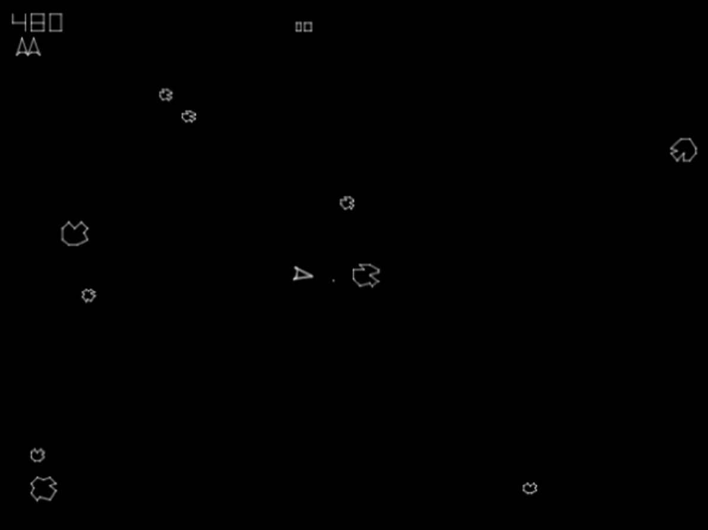

# Objects that move!

<!--

shell game

Is it just another paradigm for studying attention? No - hemisphere independence, where but not what.

How do we do this and what does that tell us about how the mind works?-->

Attention was one of the earliest topics of scientific psychology. By "scientific psychology", I mean the tradition of laboratory studies that arguably began in the late 19th century. In 1890, William James famously provided a definition of attention that began with "It is the taking possession by the mind, in clear and vivid form, of one out of what seem several simultaneously possible objects or trains of thought." At this time, plenty of experiments were being done, using custom apparatus such as devices that measured response time and presented auditory and visual stimuli.

```{r complication, echo=FALSE, out.width="100%", fig.cap="A 'complication apparatus' from the Harvard laboratory of Hugo Munsterberg. This instrument was used to measure the effect of attention to one stimulus on responses to another.  A subject who focused on one of the numbers on the large dial would have a delayed reaction to the sound of the bell, and vice versa."}
knitr::include_graphics("imagesForRmd/historical/complicationApparatus.png")
```

Hugo Münsterberg, one of the first with a laboratory that studied attention, was highly interested in attention and moving stimuli. His 1916 book **The Photoplay: A Psychological Study** described his theory of the cinema, and included a twenty-page chapter on attention.

When psychology and the study of attention grew rapidly following World War II, the study of visual attention was dominated by static stimuli, often stimuli presented briefly with a tachistoscope. Very few researchers used moving objects, and this continued until the 1980s. This was, in part, a technology issue. Scientific laboratories, or psychology laboratories at least, lagged the technology being introduced to arcades and even of homes. In 1979, the first popular home game console, the Atari, introduced the game Asteroids. <!-- (https://youtube.com/embed/YJZ0hB0Vnyk) -->

```{r Asteroids, echo=FALSE, out.width="100%", fig.cap="Asteroids was released by Atari in 1979."}
#Work-around to make GIFs (but not .mov) work by avoiding including them in non-html outputs!
#https://stackoverflow.com/questions/64038037/can-i-conditionally-exclude-some-elements-code-blocks-from-rendering-to-the-pd
if(knitr::is_html_output()) knitr::include_url("movies/asteroids/asteroids_MichaelLibby_short.mp4") else 
#, height = "250px"
```

Paying the game meant shooting and dodging asteroids that came from all directions. Avoiding a collision seems to require monitoring more than one asteroid at a time. Nothing like this would be studied scientifically, however, until much later.

Psychologists were slow to take up the programming of computers to present stimuli, and even slower to use them to create moving stimuli. In the 1970s, Zenon Pylyshyn was pondering the possibility of a primitive visual mechanism capable of "indexing and tracking features or feature-clusters" (as he put it in @pylyshynTrackingMultipleIndependent1988; I haven't been able to get copies of the 1970s reports that he mentions) as they moved. By the mid 1980s he was programming an Apple II+ computer, when it also became an exciting addition to my own household. I rapidly accumulated a library of games on floppy disks.

@pylyshynTrackingMultipleIndependent1988 announced that they had programmed their Apple II+ to create a display with ten identical objects moving on random trajectories, connected to a telegraph key with a timer to record response times. They also used an early eyetracker, and a movement of the eyes away from fixation triggered termination of a trial. Thus they were able to investigate the ability to covertly, without eye movements, keep track of moving objects.

In the associated experiments, up to five of the ten moving objects were designated as targets by flashing at the beginning of the trial. The targets then became identical to the remaining moving objects, the distractors, and moved about randomly. It is immediately apparent that one can do this. While viewing the display, people report having the experience of being aware, seemingly continually, of which objects are the targets and how they are moving about. In [the movie](https://www.youtube.com/embed/lAQM4QJRYV8) embedded below, one is first asked to track a single target to become familiar with the task, and then subsequently four targets are indicated, at different speeds.

```{r MOTdemo, echo=FALSE, out.width="100%", fig.cap="A demonstration of the multiple object tracking (MOT) task, created by Jiri Lukavsky."}
#Work-around to make GIFs (but not .mov) work by avoiding including them in non-html outputs!
#mp4s don't work in R's html viewer that pops up when you build the book, but does work in a real web browser.
#https://stackoverflow.com/questions/64038037/can-i-conditionally-exclude-some-elements-code-blocks-from-rendering-to-the-pd
if(knitr::is_html_output()) knitr::include_url("movies/MOTmovies/MOTdemoLukavsky.mp4") else 
#, height = "250px"
# Jiri uploaded it to https://www.youtube.com/embed/lAQM4QJRYV8
```

Aside from the important demonstration that people could do the basic task, the main result of @pylyshynTrackingMultipleIndependent1988 was that the processes that underlie tracking are limited in how many targets they can faithfully track. In their experiments, @pylyshynTrackingMultipleIndependent1988 periodically flashed one of the moving objects, and if that object was a target, the participant was to press the telegraph key. On trials with more targets, errors were much more common, from just 2% of target flashes missed when only one of the ten objects was a target, to 14% of target flashes missed when five of the objects were targets. 

The notion of keeping track of moving objects is familiar to many of us from everyday life. If you've ever been responsible for more than one child while at the beach or at the park, you know the feeling of continuously monitoring the locations of multiple moving objects. If you've ever played a team sport, you may know the feeling of monitoring the positions of multiple opponents at the same time, perhaps including a player with the ball and a player they might pass the ball to. If you've ever been to a scientific conference, you may know the feeling of monitoring the position and posture of one researcher relative to a few others they are chatting with, in order to best time your approach.

<!-- On the road, drivers monitor the movements of others’ vehicles.  At the beach, parents keep watch as their children move in and out of the water.--> 
<!-- In basketball, the player needs to track the individual players of her/his own team, for example to know where the team’s excellent 3-point scorer is currently located. Similarly, a car driver approaching a busy intersection needs to track the whereabouts and movement trajectories of other vehicles and pedestrians in order to decide his/her own move  and in evolutionary history (e.g., keeping track of the weakest members in a herd of prey)-->.

<!--Cups and balls painting either here or in identity section, also with Saiki-->

In other books or chapters about visual attention, you won't find much about object tracking. The study of visual attention is still dominated by stimuli that don't move. Most cognitive psychology researchers have, however, heard a few things about object tracking. But much of what they probably heard is wrong. In this book, we'll bust a few myths about tracking and see that studying it has yielded some unique insights about our limited capacities. 

This book is far from a comprehensive review. I originally wrote a much longer book, but had to delete entire chapters to keep this below the word limit. In Chapter \@ref(recommendations) I list some of what's left out and where to learn more.

<!--
Keeping track of something that is moving implies that our mind is continually, or at least frequently, updating a representation of its position. Most researchers seem to conceive of this as keeping spatial attention on an object, a sort of spotlight or hill of neural activation that glides across retinotopic cortex. There is evidence for this from neuroimaging. In this article, for simplicity we will refer to the spatial index that changes along with a moving object as a spotlight of attention. This spotlight account is consistent with evidence that probes are more easily detected on targets than elsewhere [@pylyshynPuzzlingFindingsMultiple2006; @searsMultipleObjectTracking2000]. Keep in mind, however, that we do not mean that a hill of activation in spatiotopic or retinotopic cortex exhausts all the processes involved in tracking - there are certainly more.
-->

<!--Along the way we will bust myths such as the common notion that people can track four or five objects, 

Is object tracking just sustained attentional selection, when the objects happen to be moving? Well, a first question fundamentally is how do you keep your attention on the object? The literature on visual search is enormous but is almost exclusively about finding 

Without continuous attentional selection, you not only lose your children

And today, children frequently try to track rapidly moving objects in their own home - like many other things, tracking has come to screens. 
-->


<!--
**speed, and time.** The physical parameters that can limit tracking performance are space, speed, and time. Each plays a role in different circumstances, but the temporal limits are the most misunderstood, as I have discovered in reviewing journal manuscripts over the years, even though they may be the most fundamental. This section will explain spatial limits, speed limits, and temporal frequency limits on tracking (based in part on three papers from my lab), and how they illuminate other issues such as the relationship of tracking to basic motion and position perception.
-->

