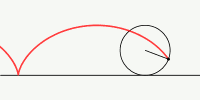

# Grouping {#grouping}

Carving the scene into objects is not the only segmenting that is done by the visual system. We also perceive groups, formed by a variety of cues, as chronicled by the Gestalt psychologists. It is quite possible, likely even, that tracking follows entire groups rather than individual elements of a group. @alzahabiEnsemblePerceptionMultipleobject2021 used clusters of several discs as targets and distractors. These clusters maintained a constant spatial arrangement as they wandered about the display. Participants seemed to do well at tracking these clusters. Unfortunately these researchers did not rule out the possibility that participants were tracking just one disc of each cluster, however, and I am not aware of any work that provided strong evidence that a tracking focus tracks an entire group.

@yantisMultielementVisualTracking1992 hypothesized that in MOT experiments, participants track an imaginary shape formed by the targets, specifically a polygon whose vertices are the target positions. Progress has been slow in understanding whether all participants do this or just a minority do, and in what circumstances.

@merkelSpatiotemporalPatternsBrain2014 found a result that they took as evidence that some participants track a shape defined by the targets while others do not. In their task, when the targets and distractors stopped moving at the end of the trial, four of them were highlighted again and the task was to press one button if all four were targets (match), and to press a different button otherwise (non-match). Error rates were lowest when none of the objects highlighted were targets, and errors were progressively more common as the number of highlighted objects that were targets increased. This was unsurprising. However, for trials where all four of the highlighted objects were the targets (match), error rates were much lower than when only three were targets. @merkelSpatiotemporalPatternsBrain2014 suggested that this reflected a "perceptual strategy of monitoring the global shape configuration of the tracked target items." They went on to split the participants based on whether they had a relatively low error rate in the match condition, investigated the neural correlates of that, and made various conclusions about the neural processing that underlies virtual shape tracking.

These inferences of @merkelSpatiotemporalPatternsBrain2014 are all based on the split of participants based on low error rate in the match condition compared to the condition where none of the highlighted objects match. The idea seems to be that if participants weren't using a shape tracking strategy, error rates would steadily increase from the trials where none of the highlighted objects were targets to the trials where all of the objects highlighted were targets. However, there are other possible reasons for this pattern of results.

One unusual aspect of the @merkelSpatiotemporalPatternsBrain2014 experiment is that one of the two response choices (non-match) was the correct answer in 80% of trials. Because participants were not told that, some of them surely expected that they should press the two buttons approximately equally often. By pressing the match button more often (close to 50% of trials) than the appropriate 20% of trials, they would artificially have the relatively low error rate for the full-match condition that was observed. @merkelSpatiotemporalPatternsBrain2014 mention the possibility of a response bias but suggest that this would result in the opposite (a high error rate) to what I have suggested. The problem seems to be that they didn't consider that the participants may have expected the match stimulus to occur more often than it did.

That sort of response bias is not the only alternative to the virtual grouping account of @merkelSpatiotemporalPatternsBrain2014. The  low error rate in the full-match condition might also occur for other reasons. Imagine that a participant tracked only one target and simply checked that target at the end of each trial for whether it was highlighted. If that one target is not highlighted, the participant presses the non-match button, otherwise they press the match button. For such a participant, the chance of getting the answer wrong when none of the probed objects are targets is zero. It is higher when one of the probed objects is a target (25% if the participant tracks one target perfectly on every trial and makes no finger errors), and still higher when two or three probed objects is a target. When three probed objects are targets, in three out of four cases, one of them is the target the participant tracked, so the participant frequently gets it wrong. But when all four of the probed objects are targets, the participant will always respond correctly. Thus, a low error rate in this all-targets-probed condition that is very close to the error rate in the no-targets-probed condition can be a sign of a participant who only monitors one target. But @merkelSpatiotemporalPatternsBrain2014 interpreted this result as instead meaning that the participant was tracking a virtual shape formed by all four of the targets.

<!--This doesn't address their correlation argument. Correlation predictions. Simplest version of my account is that only lapse rate differs between participants. High lapse rate contributes most to M0 and M4 variance, so if lapse rate is driving individual differences, correlation between M4 and M0 should be higher than M4 with other conditions, which it is. But for M1 and M2 I'm not sure why correlations so high.

Does Pearson correlations not affected by base rate for an error rate variable? I think not, so if there is a floor effect for M4, it should have a smaller correlation with everything else. But actually M0- has the lowest error rate and it has higher correlations.

What if you track three targets? Decision rule: if all three match, say yes, otherwise no. Then in M4 you will get 0% error rate again. With M3, 25%? error rate, then smaller for M2, M1, M0.  

Why would you ever say 'no' in M4? It would have to be because you ended up tracking the wrong target(s). But if you know you sometimes end up tracking a wrong target(s), if 3 of your 4 targets match 3 of those highlighted, then maybe your decision rule is to say 'yes'. So then sometimes you get M4 wrong. And in M3, you could get even more wrong, because you are happy with just 3 being the same. In M2, you might get less wrong.

Participants could differ in A) lapse rate; B) number tracked; C) decision rule.
They claim that half of participants have a big difference . But these might be the non-holistic participants. If I track holistically, with some noise in my virtual polygon representation I get M4 most correct? I get M3 most wrong, M2 less wrong, M1 even less, and M0 all correct.

-->


<!--Imagine you just check one target on every trial for whether it is highlighted. Chance of getting it wrong is zero at M0 ,progressively higher for M1, M2, and M3. But then at M4, should go back to zero. So this effect is unsurprising. And if you select people with low error rates for M4, you might be grabbing people who only tracked one target. But Merkel probably think they're grabbing people who tracked holistically.

They correlated M4 with everything else, and those correlations were lower than M1 with M2, M2 with M3, etc. Whereas all participants responded rapidly and with a low error rate on the match-0 trials, about half of the participants also responded rapidly and with a low error rate on the full-match trials. These latter participants also tended to make more errors on match-3 trials than did the other half of the participants.
-->


## Hierarchical relations 

In the real world, the movement across our retinas are rarely as independent as the moving objects in a typical multiple object tracking experiment. Often there is a strong motion element throughout the visual field created by the movement of the observer, and recovering true object movement may involve detecting deviations from that. Even when the observer is completely still, hierarchical motion relationships are common. When one views a tree on a windy day, the largest branches sway slowly, while the smaller limbs attached to the larger branches move with the larger branches but also, being lighter, have their own, more rapid motion.

Our visual systems are tuned to relative motion [@tadinWhatConstitutesEfficient2002; @maruyaRapidEncodingRelationships2013]. When we see a wheel roll by, we experience any features on the wheel as moving forward, reflecting the global frame of the entire wheel, but also as moving in a circle, reflecting the motion relative to the center of the wheel.

This decomposition of the rim's movement is so strong that people systematically mis-report the trajectory of the points on the wheel [@proffittUnderstandingWheelDynamics1990]. The red curve in the animation below reveals that a point on a rolling wheel traces out a curve that involves up, down, and forward motion, but no backward motion. The trajectory reported by participants is very different and tends to include a period of backward motion.

```{r, echo=FALSE, out.width="30%", fig.cap="The red curve is that traced out by a point on a rolling wheel, by Zorgit https://commons.wikimedia.org/wiki/File:Cycloid_f.gif"}
if(knitr::is_html_output()) knitr::include_graphics("movies/cycloid/Cycloid_f.gif") else 
```

Our visual system seems to represent complex motion hierarchically. @billHierarchicalStructureEmployed2020 varied the structured motion pattern of the moving discs of an MOT task to show that hierarchical relations are extracted and used to facilitate tracking.
The attentional demands, if any, of such hierarchical motion decomposition has not been explored much.

<!-- Mention the bendy-pencil illusion https://jov.arvojournals.org/article.aspx?articleid=2193187 maybe.  "the illusory bending motion may be due to an inability of observers to accurately track the motions of features whose image displacements undergo rapid simultaneous changes in both space and time" -->


Investigations of this question have been informed by the long history of findings, dating back to the Gestalt psychologists, regarding how the visual system segments a scene into the objects or groups that we perceive.

## Eyes to the center

The human visual system represents scenes as more than just a collection of objects. A rapid global analysis of visual scenes is performed, giving us summary information that is sometimes referred to as ensemble statistics [@alvarezSpatialEnsembleStatistics2009]. The location of the center or centroid of the objects in a scene is useful for eye movement planning, among other things. To monitor a group of objects, it is helpful to look at the center of the group, as that can minimize how far into peripheral vision they are situated. 

In 2008, @zelinskyEyeMovementAnalysis2008 and @fehdEyeMovementsMultiple2008 independently reported that during multiple object tracking, in addition to gazing directly at targets, the eyes of many participants frequently are directed at blank locations near the center of the array of targets. This basic finding has been replicated by a substantial amount of subsequent work [@hyonaEyeBehaviorMultiple2019]. The nature of the central point is not entirely clear, however. Researchers have suggested that it may be the average of the current locations of the targets, or the average location of all the moving objects (both targets and distractors). Another possibility that has been investigated is that participants tend to look at the centroid of the shape formed by the targets, which recalls the @yantisMultielementVisualTracking1992 hypothesis that what is tracked is the shape defined by the targets. Finally, @lukavskyEyeMovementsRepeated2013 introduced the idea of the "anti-crowding point", which is the point that minimizes the ratio between each target's distance from the gaze point and distance from every distractor. The idea was that participants move their gaze closer to a target when it is near a distractor to avoid confusing targets with distractors.

In a comparison of all these metrics against eyetracking data, @lukavskyEyeMovementsRepeated2013 found that the anti-crowding point best predicted participants' gaze in his experiment, followed by the average of the target locations. These points both matched the data better than the centroid of the targets. This undermines somewhat the @yantisMultielementVisualTracking1992 hypothesis that a virtual polygon is tracked, and the finding of best performance by the anti-crowding point is consistent with other results that participants tend to look closer to targets that are near other objects 
[@vaterDisentanglingVisionAttention2017; @zelinskyRoleRescueSaccades2010].

More work must be done to understand the possible role of an anti-crowding eye movement strategy. Because spatial interference in displays does not seem to extend further than half an object's eccentricity, in both static identification tasks [@pelliUncrowdedWindowObject2008' @gurnseyCrowdingSizeEccentricity2011] and multiple object tracking [@holcombeObjectTrackingAbsence2014], the anti-crowding point devised by @lukavskyEyeMovementsRepeated2013 ought to be pitted against a measure incorporating the finding that distractors further than about half an object's eccentricity do not cause spatial interference and thus can perhaps be excluded from the calculation.

