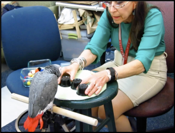

# Knowing where but not what {#identity}

Consider what someone means when they say they are keeping track of something, for example their family. That likely would mean knowing where each of their siblings is, where their mother is, and where their father is. But the multiple object tracking task does not test peoples' knowledge of the different identities of targets. Rather, the targets are typically all identical to each other (and to the distractors) and people need only report where the targets are.

This section is about what you know about the objects you are tracking. The answer is: surprisingly little. We can break the question down into two parts. The first part is the extent to which the processes that mediate tracking use the targets' features to keep track of them, and the second is how much we are able to report about the targets' features.

Computer algorithms have been developed for object tracking to facilitate detection of intrusions and safety threats in industrial settings. They are also used for analyzing the movements of players of an opposing team's previous games as well as the movements of animals in lab experiments. When developing tracking algorithms, engineers do not confine themselves to using only the locations and motions of objects - they also use the appearance of those objects, for example their shapes and colors. This helps the algorithm match objects across video frames (the correspondence problem, sometimes known as the "data association problem" in engineering)  [@yilmazObjectTrackingSurvey2006a]. This allows successful tracking in situations where location and motion alone would result in losing a target.  

Whether the human visual system uses feature similarity to facilitate motion correspondence is an empirical question. Beginning more than a century ago, Gestalt psychologists such as Max Wertheimer found that apparent motion was equally strong whether the objects in successive frames were identical or different [@wertheimerExperimentelleStudienUber1912]. Later studies found some effect of similarity, but it was weak [@kolersFiguralChangeApparent1971; @burtTimeDistanceFeature1981]. However, when the successive presented frames of an object touch or overlap with each other rather than being presented in non-contiguous locations, the results can be different. The study of such displays, with a different object appearance (usually, shape) in two successive frames, is known as line motion or transformational apparent motion. These studies have found that feature similarity, especially contour continuity, but also color, can decide which tokens are matched [@faubertInfluenceTwoSpatially1995; @tseRoleParsingHighlevel1998]. Thus, feature similarity is involved in motion processing, even though in many situations motion correspondence is determined by spatiotemporal luminance relationships. An important characteristic of this process that does does not seem to have been studied, however, is whether these cues are processed in parallel. Short-range spatiotemporal luminance relationships ("motion energy") are known to be processed by local detectors, such that visual search happens in parallel for a target moving in an odd direction defined by small-displacement apparent motion [@horowitzAttentionApparentMotion1994]. I am not aware of any studies that have investigated this for transformational apparent motion, in a situation where the perceived motion direction is determined by feature similarity. Thus, the possibility remains that feature similarity has its influence through what I have called a C~1 process.

Whether features are used by processes involved in motion correspondence is a different question than whether they are available to conscious awareness. We are of course aware of object features when the only task we are engaged in is tracking a single target. In that situation, our limited-capacity processes can all be applied to that target. However, when we are tracking multiple targets, the evidence indicates that we have little ability to report the objects' features, other than their locations.

A common view of perception is that lack of awareness of the features of objects one is attending to could not happen. Indeed, many people seem to believe that we are simultaneously aware of the identities of all the objects in the central portion of our visual field, so unless an object actually disappears or hides behind something or someone, we should know where everything in the scene is at all times, and we should immediately detect any changes to these objects. For many, change blindness demonstrations are the first experience that disrupts this belief.

Experiments suggest that during change blindness, although people cannot monitor a large number of objects at once, they are able to monitor several, perhaps four or five [@rensinkVisualSearchChange2000]. They appear to do this by loading the objects into working memory and then, in the second frame, checking whether any are different than what is held in memory. A vast literature on visual working memory has confirmed that people can store several objects and rapidly compare these stored representations to the visual scene. However, loading into memory the features of objects for storage and subsequent comparison is not the same as maintaining awareness of the changing features of such objects. For one thing, it appears that hundreds of milliseconds are needed to encode several objects [@vogelTimeCourseConsolidation2006 @ngiamVisualWorkingMemory2019]. Second, it appears that when objects are in motion, updating of their features is particularly poor, as we will see in the next section.

When Zenon Pylyshyn published the first theory of multiple object tracking, he had already devised the concept of FINSTs (Fingers of Instantiation), a small set of discrete pointers allocated to tracked targets. The idea was that each discrete pointer allows other mental processes to individuate and link up with an object representation, with the continued assignment of a pointer to a target facilitating its representation an object's representation as the same persisting individual [@pylyshynRoleLocationIndexes1989].

Pylyshyn's theory implied that when tracking multiple targets, people should know which target is which. To his credit, Pylyshyn tested this and other predictions of his theory, and when the results turned out differently than he expected, he published his results, in two papers, the first of which was entitled "Some puzzling findings in multiple object tracking: I. Tracking without keeping track of object identities". In one study reported in that paper, targets were assigned identities either by giving them names or by giving them distinct and recognizable starting positions: the four corners of the screen [@pylyshynPuzzlingFindingsMultiple2004]. At the end of a trial, participants had the usual task of indicating which objects were targets, but also were asked about the identity of the target - which one it was. Accuracy at identifying the targets was very low, even when accuracy reporting their positions was high. <!-- target-target confusions could explain this -->

More evidence for a disconnect between knowledge of what one is tracking and success at the basic MOT task was found by @horowitzTrackingUniqueObjects2007, who had participants track targets with unique appearances - in one set of experiments, they were cartoon animals. At the end of a trial, all the targets moved behind occluders so that their identities were no longer visible. Participants were asked where a particular target (say, the rabbit) had gone - that is, which occluder it was hiding behind. This type of task was dubbed "multiple identity tracking" by @oksamaMultipleObjectTracking2004. Performance was better than chance, but was much worse than performance for reporting the target locations irrespective of which target it was. The effective number of objects tracked, as reflected in a standard MOT question, was about four, but when asked to indicate the final location of a particular animal, capacity was estimated as closer to two objects.

These results of MIT experiments suggest that our ability to update the location of objects of interest is much better than our ability to maintain knowledge of what those objects are. This harkens back to Pylyshyn's original idea that tracking is mediated by pointers that in and of themselves, only point to locations and don't contain other featural information. Pylyshyn thought that these pointers, being unique and distinct, did provide us with knowledge of which target location at the end of a trial corresponded to a particular target at the beginning of a trial. However, his own experiments ruled against that - the tracking process seems to deploy something to the moving targets that carries absolutely no information about those targets other than their positions.

Given enough time, we certainly can update our representation of not only the locations of targets but of their features. For example, in visual short-term memory experiments, on successive trials people memorize different location-feature mappings for several objects. Thus, if moving objects were simply to move very, very slowly, we should be able to update our awareness of what is where before any target travels more than a trivial distance. However, a quite recent study yielded some results that further showcase the limitations of our identity updating abilities.

## Beaten by a bird brain

<!--For instance, @schollRelationshipPropertyencodingObjectbased2001 found that when items stopped moving, observers were able to accurately report the previous direction and speed of targets but not of nontargets. However, when the shape or color of the items was masked, observers were unable to accurately report the premask features of either targets or nontargets.-->

@pailianAgeSpeciesComparisons2020 conducted a test that at an abstract level, was similar to Pylyshyn's experiments, with identical objects assigned unique identities. @pailianAgeSpeciesComparisons2020, however, used a format much like the "shell game" utilised by magicians and hustlers for hundreds of years. The engaging nature of the shell game format made it suitable for testing children and an African grey parrot as well as human adults. This led to a few surprises.

For stimuli, @pailianAgeSpeciesComparisons2020 used colored balls of wool. Between one and four of the balls were shown to a participant. The experimenter covered the balls with inverted opaque plastic cups, and then began to move them, swapping the positions of one pair at a time. After a variable number of pairs were swapped, the experimenter presented another ball with one of the target colors, and the participant's task was to point to (or peck on!), the cup containing the probed color. 

{width=40%} 

At any one time, only two objects were in motion, and that the participants were responsible for knowing the final location of all the colors - there were no distractors. One might anticipate that at least the adults would be able to perform this task with high accuracy, especially given that at any one time, only two objects were in motion and the experimenter paused for a full second between swaps, which ought to give people enough time to update their memory of the locations of those two colors.

When only two balls were used, over 95% accuracy was seen even for four swaps, the highest number tested. This was true of all three participant types: the children, the parrot, and the human adults. In the three-ball condition, for the children, who were 6 to 8 years old, performance was still near ceiling for the zero-swap (no movement) condition, but fell to close to 80% correct  in the one-swap condition, and fell to around 70% correct for two and three swaps. The adults did better, but still their performance fell with number of swaps, to about 80% correct for four swaps. Remarkably, the parrot actually outperformed not only the children, but also the human adults. Importantly, the parrot had not been trained extensively on the task, learning it primarily by simply viewing the experimenter and a confederate perform three example trials (the parrot was experienced with a simpler version of the task involving only one object presented under one of the three cups).

The biggest surprise here is that an African gray parrot had the ability to remember and update small sets of moving hidden objects to a level of accuracy similar to humans, despite having a much smaller brain than ours, less than one-fiftieth the size of our own in fact. Because large parts of the parrot brain evolved after they split from our lineage [@iwaniukInterspecificAllometryBrain2005], the existence of this ability in its brain looks to be an example of convergent evolution.

A second surprise was that the adult humans (in this case, Harvard undergraduates, who surely had high intelligence on average) displayed levels of accuracy that was not very high for the conditions that involved more than a few swaps. Remember that in these experiments, only two balls were moved at a time, and there was a one-second pause between swaps. Prior to the publication of this study, I had assumed that the reason for poor performance in multiple identity tracking was the difficulty of updating the identity of three or four targets while they moved. I would have predicted that changing positions exclusively by swapping the positions of two objects, and providing a one-second pause between swaps, would lead to very high performance. The @pailianAgeSpeciesComparisons2020 results suggest that updating the memory of object locations is very demanding. 

This finding was also surprising based on the long-accepted concept of "object files" developed by @kahnemanReviewingObjectFiles1992. The idea was that all the features of an object are associated with a representation in memory, the object file, that is maintained even as the object moves. @kahnemanReviewingObjectFiles1992 showed a preview display with two rectangles, with a feature (in most experiments, a letter) presented in each. The featural information disappears, and then the rectangles would move to a new location. The observer's representation of the display is then probed, for example by presenting a letter again in one of the rectangles and asking participants to identify it. @kahnemanReviewingObjectFiles1992 
found that if the letter was the same as the one presented in that rectangle at the beginning of the display, observers were faster to respond than if it had appeared in another rectangle in the beginning of the display, indicating that that aspect of the rectangle's initial properties was maintained, with its location updated. The focus in these studies was on simply demonstrating that this response time priming occurred at all, not in assessing what proportion of time it occurred.

Many researchers may have made the same mistake that I did of assuming that several object files could easily be maintained and updated. However, even in the original experiments of @kahnemanReviewingObjectFiles1992, they found that the amount of priming was greatly diminished when four letters were initially presented in different rectangles, indicating that fewer objects than that had letter information maintained and updated. They concluded that there may be a severe capacity limit on object files. This was also supported by a pioneering study by @saikiMultipleobjectPermanenceTracking2002, who had participants view a circular array of colored discs that rotated about the center of the screen. Occasionally discs swapped color when they briefly went behind occluders, and the participants' task was to detect these color switches. Performance decreased dramatically with speed and number of discs, even though the motion was completely predictable, and @saikiMultipleobjectPermanenceTracking2002 concluded that "even completely predictable motion severely reduces our capacity of object representations, from four to only one or two." Bcause we now understand that simple MOT does not work well across occluders, however, interpretation of this study is not so simple without an MOT-type control. Nevertheless, the evidence from the studies in this chapter overall suggests that identity updating is very poor in a range of circumstances.

## Some dissociations between identity and location processing reflect poor visibility in the periphery

If it is the case that participants cannot update the identities of the moving objects that they are tracking nearly as well as they can update their positions, why is that? The results of an eye tracking study by the Finnish researchers Lauri Oksama and Jukka Hyönä led them to conclude that identities are updated by a serial one-by-one process. Eye movements during MOT were contrasted with those during MIT, in which the targets and distractors were line drawings. During MIT, participants looked directly at targets frequently, totalling around 50% of the trial duration, and frequently moved their eyes from one target to another. In contrast, during MOT, the participants moved their eyes infrequently, and their gaze wasn't usually at any of the moving objects, rather they were usually looking somewhere close to the center of the screen. @oksamaPositionTrackingIdentity2016 took these results to mean that the targets' identity-location bindings that must be updated during MIT are updated by a serial one-by-one process, whereas target positions during MOT are updated by a parallel process.

What @oksamaPositionTrackingIdentity2016 did not address is that limitations on human peripheral vision mean that participants may have had to update target identity information one-by-one. That is, the targets, line drawings of different objects, likely were difficult to identify when in the periphery. Thus, participants had to move their eyes to each object to refresh their representation of which was which. Indeed, in a subsequent study  @liModelMultipleIdentity2019 tested discriminability of the objects in the periphery and found that accuracy was poor. <!-- The conclusion by @oksamaPositionTrackingIdentity2016 that identities are updated by a serial one-by-one process that determines the movement of the eyes may well be correct.-->
 When they instead used colored discs as stimuli, accuracy was higher in the periphery and participants did not move their eyes as often to individual targets. This suggested at least some degree of parallel processing, leaving the amount of serial processing, if any, in doubt.

<!--@oksamaPositionTrackingIdentity2016 did not assess how far in the periphery the target objects were identifiable - the only study I know of that did this is a later paper by the Finnish team, specifically @liModelMultipleIdentity2019. They tested discriminability of line drawings from the same database as those used by @oksamaPositionTrackingIdentity2016, while also testing the discriminability of faces and colored discs. More specifically, they first presented a sample stimulus at fixation (either a face, a line drawing, or a colored disc, depending upon the block of trials) and subsequently in the periphery they presented either the same stimulus or another stimulus from the same category. The task of participants was to judge whether this peripherally-presented stimulus was the same or different. For the faces and the line drawings, percent correct decreased a substantial amount with distance from the fovea. However, for the color task, percent correct was the same at all three eccentricities tested (2.5, 5, and 7.5 deg).    Forget a bit about what it looks like. don't have to classify among all the options-->

In summary, many findings of differences between MIT and MOT performance may be explained by poor recognition of the targets in the periphery. Because most studies of MIT do not include an assessment of how recognizable their stimuli are in the periphery (@liModelMultipleIdentity2019 is the only study I know of that did this), it is hard to say how much of the difference between MIT and MOT can be attributed to this. I am not sure how one would equate object localization with object identifiability; the old apples and oranges problem. One could blur the objects to impair localization but it is not clear what degree of spatial uncertainty is comparable to a particular level of object identifiability.

One dissociation between identity and location tracking performance seems to remain valid regardless of the difficulty of perceiving object identities in the periphery. This is the original finding by @pylyshynRoleLocationIndexes1989, which was replicated by @cohenWhatwhereTradeoffMultipleidentity2011 that if targets are actually identical but are assigned different nominal identities, participants are very poor at knowing which is which at the end of the trial. Because in this paradigm, there is no visible identity information and participants knew this, the resolution of the periphery was not an issue.

## Evidence from two techniques suggests parallel updating of identities

<!-- To some extent, however, we're comparing apples and oranges. This study should be replicated with another sample of participants, however, and using a method that directly compares MIT (knowledge of target identities) to MOT (knowledge of targets' locations) by including distractors, not just targets. Without that, there is some concern that the presence of the experimenter was distracting or that some other idiosyncrasy of the paradigm led to poor identity performance.--> 

<!--These claims of a process that is serial and one-by-one are not based on rigorous tests of serial processing like those progressively elaborated by Jim Townsend and colleagues since the 1980s [@algomFeaturesResponseTimes2015; @townsendSerialVsParallel1990]. Rather, it is based on more indirect evidence such as the visual search results that originally led Anne Treisman to propose a serial feature binding process.-->

@howeIdentityLocationBindingProblem2015a used two techniques to investigate the possibility that serial processes are involved in multiple identity tracking. First, Howe et al. applied the simultaneous-sequential presentation technique that they previously applied to MOT,
as discussed in \@ref(serialOrParallel). For the MIT task, four targets of different colors moved among four distractors. Each of the four distractors was the same color as one of the targets, so that the targets could not be distinguished from the distractors by color. In the simultaneous condition, all the objects moved for 500 ms and then paused for 500 ms, with this cycle repeating throughout the length of the trial (which varied randomly between 8 and 16 s). In the sequential condition, half the targets moved for 500 ms while the other half were stationary, and subsequently the other half of targets moved for 500 ms while the others remained stationary. This cycle repeated throughout the length of the trial. In two different versions of the experiment, performance was similar in the simultaneous and sequential conditions, supporting the conclusion that there was no serial process involved in multiple identity tracking. However, the @howeIdentityLocationBindingProblem2015a conclusion is limited by its assumption that any serial process could respond efficiently to the pause in half the targets by shifting its resources to the moving targets, while not causing any forgetting of the locations and identities of the temporarily-stationary targets. To support this assumption, @howeIdentityLocationBindingProblem2015a pointed out that @hogendoornTimeCourseAttentive2007 had shown that attention could move at much faster rates than 500 ms per shift. However, the @hogendoornTimeCourseAttentive2007 did not assess the attention shifting time between unrelated targets, rather their shifts were for attention stepping along with a single target disc as it moved about a circular array. Thus, it is unclear to what extent the results of @howeIdentityLocationBindingProblem2015a undermine the serial, one-by-one identity updating idea embedded in the theories of Oksama & Hyönä and @lovettSelectionEnablesEnhancement2019.

@howeIdentityLocationBindingProblem2015a further investigated serial versus parallel processing in MIT by using a completely different technique: the systems factorial technology of Jim Townsend and colleagues [@townsendSerialVsParallel1990]. Two targets were designated for tracking and presented in the same hemifield, to avoid independence by virtue of the hemispheres' independence [@alvarezIndependentResourcesAttentional2005]. The participants were told to monitor both targets as they moved and that if either of them darkened, to press the response button as quickly as possible, after which all the disks stopped moving and the participant was asked to identify the location of a particular target, for example the green one (the objects were identical during the movement phase of the trial but initially each was shown in a particular color). To ensure that participants performed the identity tracking task as well, only trials in which the participant reported the target identity correctly were included in the subsequent analysis. Performance detecting the darkening events was very high, at 95% correct. On different trials, either both targets darkened, one of them darkened, or neither of them darkened, and each could darken either by a small amount or by a large amount. <!--Because it's a response time analysis, it's measuring parallel or serial processing, which may be different somehow from possibly serial processing for individuating a target or solving the correspondence problem for it. In that case, the actual processing time is time-limited by the stimulus, whereas you can let a slow parallel accumulator eventually do its thing when the stimulus information isn't time-curtailed. In other words, attention might focus on one because it absolutely has to get done, but that would mean switching its strategy adaptively based on difficulty--> The pattern of the distributions of response time for the various conditions ruled out serial processing (under certain assumptions) and implicated limited-capacity parallel processing. This suggests that participants can process luminance changes of two moving targets in parallel while also maintaining knowledge of the identity of the moving targets. One reservation is that it is unclear how often the participants needed to update the target locations and refresh their identities, because the rate at which they needed to be sampled to solve the correspondence problem is unclear for the particular trajectories used. <!--The fact that identity tracking accuracy was over 95% suggests that the task was easy, but still--> . 
<!--PARTIALLY IN RESPONSE TO THIS, MOMIT 2.0 UPDATED -->

## Eye movements contribute a serial process to tracking tasks

Partially in response to the evidence of @howeIdentityLocationBindingProblem2015a against serial processing in tracking, Oksama and Hyona, with their Chinese colleague Jie Li, revised their Model of Multiple Identity Tracking (MOMIT) to involve more parallel processing. Specifically, MOMIT 2.0 proposes that the "outputs of parallel processing are not non-indexed locations but proto-objects that contain both location and basic featural information, which can be sufficient for tracking in case no detailed information is required" [@liModelMultipleIdentity2019]. This is a reasonable response to the evidence, even if it unfortunately means the theory doesn't make as strong predictions, as the role of serial processing is now more vague. In MOMIT 2.0, serial processing is tied to eye movements and is used to acquire detailed visual information for refreshing working memory representations. This "prevents the resolution of the active representations from declining. This is vital for tracking targets that require high-resolution information to be identified and kept distinguishable from other targets." The theory seems to be mute on whether serial processing would be involved if both fixation were enforced and the stimuli were easily identifiable in the periphery.

Here it is sensible to step back and consider the overall role of eye movements in ecological task behavior. People move their eyes on average three times a second, in part because like many other animals, our retina has a specialized part (the fovea) that is adaptive to direct at whatever object we are most interested in at the moment. In natural tasks, it may be rarely the case that all the visual signals of interest are clustered together enough that they can be processed adequately without eye movements. Moreover, animals such as ourselves have strong drives for exploration and vigilance because we evolved in changing environments about which we had only partial knowledge.

Eye movements normally contribute a serial, one-by-one component to processing, because as @liModelMultipleIdentity2019 highlighted, very high-quality information comes from only a single region on the screen - the region currently falling on the fovea. Near-continual scanning of the visual scene is a deeply ingrained habit, and extends to artificial tasks like reading. Not only are saccades  frequent during reading, but one influential theory of reading proposes that an internal rhythm drives saccades from one word to the next rather than them being triggered by the completion of a process such as word recognition [@engbertDynamicalModelSaccade2002]. Perhaps, then, one should expect frequent eye movements to occur and contribute a serial component of processing to a range of tasks even when such eye movements are not necessary. People are also cognitively "lazy" in that they seem to structure eye movements and other actions in tasks so as to minimize short term memory requirements [@hayhoeTaskConstraintsVisual1998]. Thus, even if saccading to different targets were inefficient, people may do it anyway.

To move forward in the perennial debate regarding the role of serial and parallel processing, we must recognize that the serial processing associated with eye movements is likely to occur in many tracking tasks, while people may perform the same task in a parallel fashion when eye movements are constrained. Based on this perspective, the most interesting evidence for serial processing is that which is found with tasks in which eye movements are prohibited. This again highlights the possibly-linear decrease in apparent sampling frequency discovered by @holcombeSplittingAttentionReduces2013 and reviewed in \@ref(#serialOrParallel).

<!--The Finnish team of Lauri Oksama and Jukka Hyönä may have done the most studies of the task they dubbed multiple identity tracking (MIT) in 2004 [@oksamaMultipleObjectTracking2004], introduced above in the version used by @horowitzTrackingUniqueObjects2007. Based on results includning those I have reviewed here, since 2008 Oksama and Hyönä have been advocating a model that tracks the locations of moving objects with a parallel process, but updates other featural information with a serial, one-by-one process [@liModelMultipleIdentity2019]. -->

<!--They say Holcombe & Chen 2013 found big evidence for serial because "when objects move along the same trajectories (e.g., Holcombe & Chen, 2013) and/or are close to each other, high resolution information is required for discriminating the objects. Thus, tracking becomes more serial" but they don't seem to say anything about how different trajectories benefits performance-->.

## Feature differences, but not feature conjunction differences, benefit tracking

<!--Unfortunately, it is difficult to test participants on whether they know during tracking the characteristics of an object when, as soon as the question is asked, they can focus their attention on the probed object and encode its features for report. But some insight into this issue can be gained by considering the studies conducted by @makovskiFeatureBindingAttentive2009.-->

A further difference between MOT and MIT is that when objects have different appearances, these differences can actually be used to benefit position tracking (the MOT component of MIT). 

A further complication for understanding the differences between identity updating and 

In their experiments, @makovskiFeatureBindingAttentive2009 presented eight moving objects. Tracking performance was better than when the eight objects were different in color or shape than when they were identical. However, in another condition the eight objects were not all distinguishable based on a single feature and instead were distinguished only by their pairing of features, or a "feature conjunction", as @treismanFeatureIntegrationTheory1980 called this situation. That is, in this condition, each object has a unique pair of features, but shared its individual features with at least one other object. <!--create illustration maybe from diagrammeR--> The results now were quite different. Performance was no better than if the objects were all identical. This finding is consistent with Anne Treisman's perspicacious thesis of over forty years ago that focused attention is needed for many sorts of binding. When tracking multiple targets, then, the pairing of the features cannot be used to distinguish targets from distractors. Only in the conditions where feature binding was not necessary did featural differences benefit tracking performance.

Simple feature differences between targets and distractors (as opposed to conjunctions) mean that feature attention can go some way toward distinguishing targets from distractors and thus result in higher accuracy than if targets were identical to distractors. This was part of the conclusion that @makovskiFeatureBindingAttentive2009 came to, and fits with a large set of literature on feature attention, showing that one can, for example, enhance the selection of all red objects in the visual field.

I'd like to see the Howe techniques applied to feature conjunctions

and 
During the tracking task, participants were told to monitor the 

two of the targets coul

However, this  

by, during an MIT task, periodically pausing all of the moving targets or some of them. An assumption is that any parallel processes are distributed equally among both moving and any temporarily-stationary target, whereas a serial process is reallocated away from the stationary targets during the interval that they are stationary. Such a serial process would then result in higher performance in the condition where targets occasionally pause relative to an "all pause" condition where all targets are temporarily-stationary at the same time.

if the parallel proces
out of this conundrum is to 

Complicating a simple story of parallel location

Because of results like those reviewed above, 

@hudsonHemifieldEffectsMultiple2012 multiple identity tracking , found a hemifield advantage: " Contrary to expectations, a bilateral advantage was still observed, though it was not as strong as when observers were not required to remember the identities of the targets. This finding is inconsistent with the only model of multiple identity tracking (Oksama & Hyönä, 2008, Cognitive Psychology, 56, 237-283), so we present an alternative account."
<!-- E4 standard MOT design. Calculate hemifield independence = 
A weird thing is that there were no distractors in the same quadrant ,but E3 used the standard design and found the same result.
E1: colors of the targets continuously visible. Found substantial bilateral advantage.
E2: colors of targets only presented at beginning. Substantial bilateral advantage again.
-->

Multiple lines of evidence present problems for the story of parallel location processing and serial updating of identities and object features. In section \@ref(serialOrParallel), we saw that the temporal resolution of object tracking declines with the number of targets in a manner that is difficult to explain without resort to a serial account of location updating. To address this, @liModelMultipleIdentity2019 wrote that "when objects move along the same trajectories (e.g., Holcombe & Chen, 2013) and/or are close to each other, high resolution information is required for discriminating the objects. Thus, tracking becomes more serial,". However, I have found nothing in the description of their model that should be hindered by objects sharing a trajectory, and also the objects in Holcombe & Chen (2013) were not close to each other. The parallel location updating element of their theory can be saved, however, by positing that trajectory information is available to a parallel process thanks to motion traces in sensory memory, as we will see in section \@ref(beyondLocation). That process would indeed be hampered by objects sharing a trajectory, on the assumption that trajectories are used not for extrapolation, but for solving the correspondence problem.

In the early 1990s, it gradually became clear that the mind maintained fewer visual representations than researchers had assumed. Failures of trans-saccadic visual fusion and inability to detect changes that occurred during eye movements [@mcconkieRoleControlEye1979] led @oreganSolvingRealMysteries1992a to suggest that "the world is an outside memory" and to discover change blindness [@rensinkSeeNotSee1997]. The idea was that the impression that one has a rich representation of all the objects in the visual field is an illusion, and instead that one has only a more limited knowledge, but that this is quickly supplemented by attentional processing when one becomes interested in a particular location or object.

It appears that O'Regan's big idea goes further than he anticipated. While O'Regan suggested that only when objects  were attended would they be fully processed, he did not suggest that one might be able to track the changing locations of multiple targets without knowing what they are. 

<!--Tracking is important for representing objects still in view @tsubomiNeuralLimitsRepresenting2013-->

<!--
A second factor is that even when objects remain close enough to central vision to resolve their identities, a limited resource is required to bind their features together, including binding individual features with their location... 

A third factor is, of course, the limitations that result in imperfect performance even on tracking identical objects, reviewed in the previous sections..

You can track four objects without being able to identify stuff on the four objects. This could either be explained by attention needing to switch between locations, or alternatively that you just need less resource to track than to identify.

Because binding seems to require sustained attention, it’s unlikely it’s bound when serial attention isn’t there. But you might have a memory index of what is there - I need help on this from VWM people!-->

<!-- ## Configurations and 

Most models of tracking have assumed that people track only the targets, and track them without reference to the positions of any other objects. We know from other areas of research, however, that people rapidly extract that spatial layout or configuration of the objects in a scene. Some research has indicated that configural information is also used for tracking.

Because binding seems to require sustained attention, it’s unlikely it’s bound when serial attention isn’t there. But you might have a memory index of what is there - I need help on this from VWM people!

Linares et al. ()

Let's return to the classic shell game. In a shell game, an item is placed beneath one of three identical shells, making that shell the target. The viewer tries to keep track of which shell has the item underneath it. -->
 <!-- insert Conversation article text-->

@nummenmaaCorticalCircuitBinding2017 found temporal lobe activation

"erhaps most famously, these sorts of processes seem to be localized in anatomically distinct corti- cal streams (e.g., Livingstone and Hubel 1988), with the ventral pathway corresponding to identification, and the dorsal pathway corresponding to individuation. In addition, a variety of behavioral evidence supports this distinction. The surface features of objects (e.g., their colors and shapes), while obviously critical for many visual processes including object recogni- tion, seem to be largely discounted by many other processes (for a review, see Flombaum, Scholl, and Santos, in press). For example, surface features play little or no role in determining apparent motion correspondence (Burt and Sperling 1981), identity over time in the tunnel effect (Flombaum et al., 2004; Flombaum and Scholl 2006; Michotte, Thinès, and Crabbé 1964/1991), or object-specific priming (Mitroff and Alvarez 2007)." [@schollWhatHaveWe2008]

In sport, however, sometimes we are suprised to discover an opponent in the right place at the right time. "Where did he come from?" is a common complaint. This phenomenon can be partially understood in terms of the limit on the number of objects that can be tracked in MOT. It turns out, however, that this is only part of the story. The limitations on tracking are more profound than those we have reviewed so far.

The tracking research we have discussed so far has used targets and distractors that are all identical to each other (after the initial phase where the targets are indicated). In the real world, however, this is uncommon.

Visual short-term memory tasks typically find that people can perform reasonably well at storing at least four objects, allowing participants to detect whether an object changes during a short interval. This, together with the misconception discussed in section \@ref(bottlenecks) that tracking has a limit of four targets has led many researchers to suggest that a common limitation underlies both visual short-term memory and object tracking. This may be true in some sense, but certain possibilities have been ruled out by a dramatic finding.

Putting objects in motion can dissociate tracking and short-term memory capacities. @saikiMultipleobjectPermanenceTracking2002 asked participants to track four colored discs that periodically moved behind occluders and then re-appeared on the other side. There were no distractors. The task of participants was to detect whether any discs changed color. Contrary to what would be expected from object files theory [@kahnemanReviewingObjectFiles1992], for all but very slow speeds, performance was very low. However, because distractors were not included, there was no direct comparison to performance tracking solely the objects' locations (without knowing their colors). 

