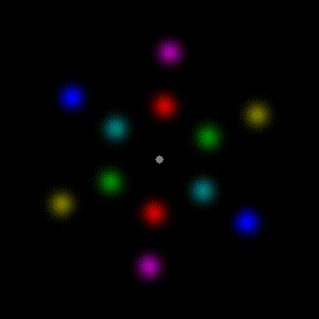

# Mobile computation 

We live in a world of constantly moving objects. The receptive fields in our early visual cortices that analyze the properties of objects are largely stationary. In the case of moving objects, these individual analyzers get only a glimpse of moving objects before they move on. These glimpses will sometimes be too brief to fully process the object. What makes things even worse is that in our world of moving objects, another object may quickly move onto the retinal location previously occupied by the old object, such that extended analysis by our stationary receptive fields may combine the two objects, yielding a mish-mash of features.

This phenomenon is demonstrated by the below movie (if it doesn't play, you should be able to view it [here](https://media.giphy.com/media/g4FWsHsyYwnphuEyh5/source.gif)). Keep your gaze fixed on the circle in the center, and try to judge for one of the flip-flopping objects whether the light green color is paired with leftward tilt or rightward tilt.
You may find this difficult or impossible to judge. 

```{r, echo=FALSE, out.width="100%", fig.cap="Task: fixate the circle and judge whether the red color is paired with leftward tilt or rightward tilt."}
#Work-around to make GIFs work by avoiding including them in non-html outputs!
#https://stackoverflow.com/questions/64038037/can-i-conditionally-exclude-some-elements-code-blocks-from-rendering-to-the-pd
if(knitr::is_html_output()) knitr::include_url("movies/OC4HzNoGuide.gif") else knitr::include_graphics("movies/OC4HzNoGuide_static.gif")
#, height = "250px"
```

As a result, our brains need to combine the outputs of individual analyzers along a moving object's trajectory [@nishidaMotionbasedAnalysisSpatial2004a; @nishidaHumanVisualSystem2007a]. You may be able to experience this in action by viewing the below movie (if it doesn't play below, you should be able to view it [here](movies/OC4HzGuide_static.gif)). This time, while keeping your gaze fixed on the circle in the center, try to track the white circle with your attention as it steps about the circle. This may allow you to judge whether the light green is paired with leftward or rightward tilt [@cavanaghMobileComputationSpatiotemporal2008].

```{r, echo=FALSE, out.width="100%", fig.cap="Task: fixate the circle and judge whether the light green is paired with leftward tilt or rightward title."}
#Work-around to make GIFs work by avoiding including them in non-html outputs!
#https://stackoverflow.com/questions/64038037/can-i-conditionally-exclude-some-elements-code-blocks-from-rendering-to-the-pd
if(knitr::is_html_output()) knitr::include_url("movies/OC4HzGuide.gif") else knitr::include_graphics("movies/OC4HzGuide_static.gif")
#, height = "250px"
``` 

This second movie is identical to the first except for the addition of the stepping white ring. Tracking the ring with attention feels almost automatic thanks to it being the only moving object. The continuous selection enabled by tracking here evidently provides later stages of visual processing with an extended view of the object, allowing it to deliver the feature pairing [@cavanaghMobileComputationSpatiotemporal2008]. This interpretation is consistent with ideas about feature pairing introduced by Treisman. The "spotlight" of selection gates later processing by later stages, which is what is required for feature pairing.

As we saw in a previous section (\@ref{bottlenecks}), tracking is capacity-limited; in many circumstances one can only track a few objects. Here we highlighted that tracking, like other instances of attentional selection, serves to gate what information is used by subsequent processing. So, what do we know about the limits of subsequent processing, and how those interact with attentional tracking?

@holcombePerceivingSpatialRelations2011 investigated the relationship of attentional tracking to various judgments that can be made about two arrays of concentric colored circles. 
INSERT PICTURE

With these arrays, one can perceive the individual colors that are present as well as their spatial arrangement. When the array is put into motion, rotating about the central fixation point, attentional tracking can come into play. At high speeds over 1.4 revolutions per second or so, however, tracking fails - @holcombePerceivingSpatialRelations2011 found that people could only guess at which object was originally cued at the beginning of the trial (such limits are discussed further in section BLAH). Nevertheless, people are still able to judge which colors are present in the display, indicating that tracking is not necessary for that. This was revealed by using different colors for the array on different trials and asking participants to report which colors were present. When it came to judging the spatial arrangement of the colors, however, the result was very different.

In one spatial arrangement task, participants were asked to report any three colors in sequence from around a ring, in the direction of motion. In the PICTURE, then, correct answers would have included "red, purple, blue" and "blue, red, purple", but not "red, blue, purple". In a second spatial arrangement task, participants were asked to report any two colors that were aligned with each other between the two rings. For the display shown in PICTURE, for example, they would be correct if they reported "purple and blue", "green and red", or "greenish-blue and yellow". The speed limit of both of these spatial arrangment tasks, as quantified by 75% threshold, was statistically indistinguishable from that of the tracking limit; much slower than the speed limit for the color identification task. 

The finding that the spatial arrangement could not be apprehended when tracking was disabled is not itself surprising. A need for focused attention to apprehend spatial arrangements had already been strongly suggested by evidence from visual search and dual task paradigms [@liRapidNaturalScene2002; @leeAttentionalCapacityUndifferentiated1999a; @loganSpatialAttentionApprehension1994; @wolfeWhatCan0001998]. Dual task paradigms had also already found that the colors presented could be identified even in the presence of a very demanding secondary task [@leeAttentionalCapacityUndifferentiated1999a; @braunWithdrawingAttentionLittle1998a]. Here, then, our tracking experiments converged with those results, indicating that the same kind of attentional resource whose allocation to a target is reduced by increasing the set size in visual search and by a demanding secondary task is also reduced or eliminated by moving objects faster than they can be tracked.

It now seems safe to conclude that a very limited attentional resource, one that is deployed by tracking, is needed to judge certain spatial relationships. I say "certain" spatial relationships because one particular spatial relationship, alignment of the inner and outer rings, could be judged even at object speeds far above the tracking speed limit. For the alignment task, the two concentric rings comprised the same colors in the same sequence. On some trials, these colors were aligned, so that neighboring colors in the radial direction were identical. Participants had to discriminate between that and when neighboring colors in the radial direction were different. While the participants' mean tracking speed threshold was 1.4 rps, their speed threshold for the alignment task was 2.4 rps. The underlying enabling processes are not clear, but likely are those pre-attentive mechanisms that integrate information over space and time regarding spatial differences, for example to extract texture boundaries and global shape [@motoyoshiTemporalResolutionOrientationbased2001; @ramachandranPhantomContoursNew1991a].

Boundary and global shape processing seem to integrate across multiple features, but do not pass on information about the constituent features (here, colors) whose arrangement created the boundary or shape [@wilsonDetectionGlobalStructure1998; @cliffordRapidGlobalForm2004]. It seems that only focused attention can do that. But how does it do it? One idea that probably goes way back is that to apprehend a spatial relationship, attention must identify the colors in the colors' locations one by one pe.g., @huangCharacterizingLimitsHuman2007].

A particular pattern of errors made by participants in the experiments of @holcombePerceivingSpatialRelations2011 strongly supports the serial processing theory. Recall the spatial arrangement task in which participants were required to report two of the colors aligned with each other in the inner and outer rings. In a variation of that task, each trial began with a central color cue. That color could be in either the inner ring or the outer ring. Participants were told to report which color in the other ring was aligned with that color. The speed of the rings were set to slightly below the tracking speed limit. Thanks to feature-based attention, finding the cued color was not difficult [@shihThereFeaturebasedAttentional1996]. Often the participants reported correctly the color that was aligned with the cued color. On those trials where participants made an error, they typically reported a color that was adjacent to the correct one, located either leading it (relative to the directon of motion) or trailing it. Critically, trailing errors were much more likely than leading errors. After a few control conditions were run, the best explanation of this was that participants made a shift of attention from the cued ring to the other ring, but because the ring kept moving during that shift, they sometimes missed and landed on the trailing disc, resulting in a mistaken report of its color.

```{r, echo=FALSE, out.width="100%", fig.cap="Task: fixate the circle and judge whether the red color is paired with leftward tilt or rightward tilt."}
#Work-around to make GIFs (but not .mov) work by avoiding including them in non-html outputs!
#https://stackoverflow.com/questions/64038037/can-i-conditionally-exclude-some-elements-code-blocks-from-rendering-to-the-pd
if(knitr::is_html_output()) knitr::include_url("movies/LinaresVaziriPashkamHolcombe/pairingOneStimulusCycleSoRotatesPerenially.gif") else 
#, height = "250px"
```


```{r, echo=FALSE, out.width="100%", fig.cap="Task: fixate the circle and judge whether the red color is paired with leftward tilt or rightward tilt."}
#Work-around to make GIFs (but not .mov) work by avoiding including them in non-html outputs!
#https://stackoverflow.com/questions/64038037/can-i-conditionally-exclude-some-elements-code-blocks-from-rendering-to-the-pd
if(knitr::is_html_output()) knitr::include_url("movies/LinaresVaziriPashkamHolcombe/pairing_3timesFasterOneStimulusCycleSoRotatesPerenially.gif") else 
#, height = "250px"
```

movies/MOTmovies/holcombeLinaresVaziriPashkam/pairing_3timesfaster.mov

 That is, first attention must visit 
 
we don't know how colors are identified above the speed limit
 
In one experiment requiring participants to judge which colors were aligned with each other in the inner and outer rings, 

When participants were asked to report
One possibility is that judging 

However, this work went further and revealed another aspect to how spatial relationships are apprehended.

The tracking display also went beyond


manipulated by visual search set size and dual-task demands is 


Franconeri spatial relationships @franconeriFlexibleVisualProcessing2011

It is consistent with the more indirect evidence of the need for focused attention from visual search that 

Because these spatial arrangement tasks presumably would rely on the same processes as those required for the pairing task showcased by the earlier movies in this section, the finding that 

Previous work had been unable to separate tracking from just the act of trying to attend.

are likely is essentially the same task as the pairing task showcased by the movies above, 

This tight link between the tracking speed limit and the ability

(about 1.4 rps with this diap)


The results of @holcombePerceivingSpatialRelations2011 provided additional insights into the relationship of tracking to the ability to perceive various things.

processes that likely are even more high level than tracking itself.

But what about the processes after tracking?

When we discussed the capacity limits on tracking, 


We brought up bottlenecks before to make the point that 

What visual processes can sit after tracking, 


movies/MOTmovies/holcombeLinaresVaziriPashkam/pairing.mov

movies/MOTmovies/holcombeLinaresVaziriPashkam/pairing_3timesfaster.mov

Animated-horse-race-jockey.gif
