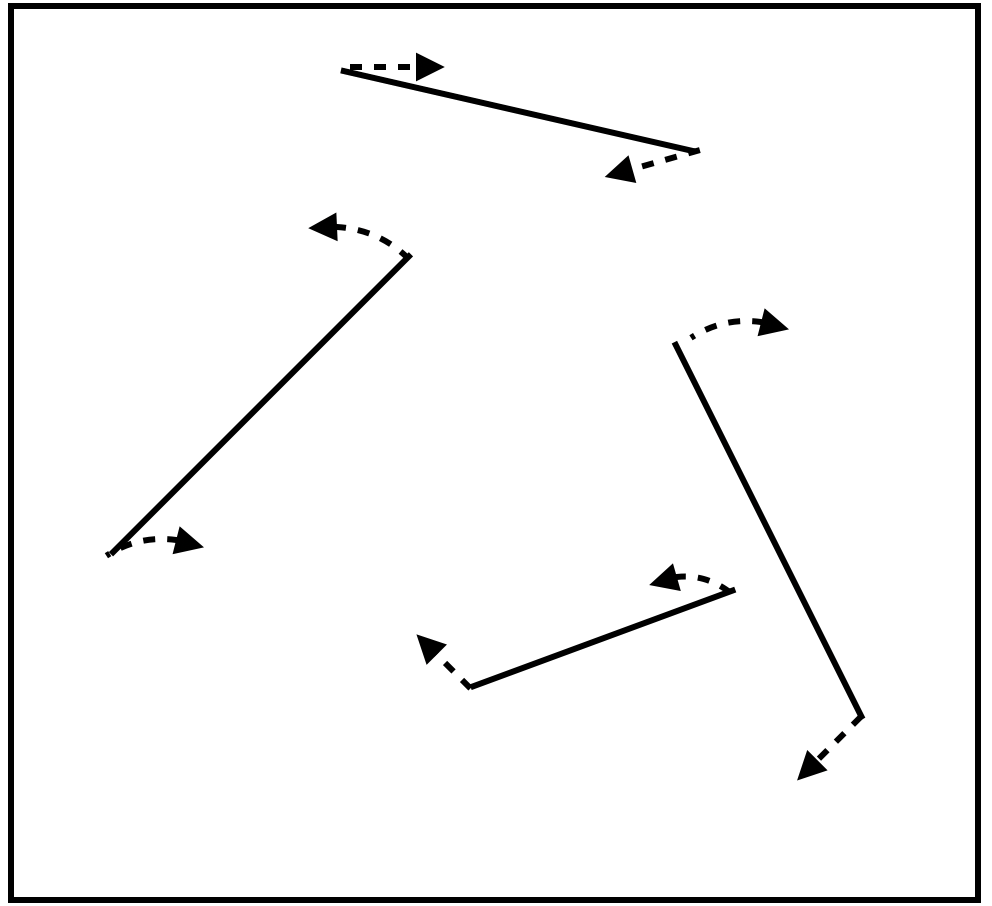

# Objects

Keeping track of something that is moving implies that our mind is continually, or at least frequently, updating a representation of its position. Most researchers seem to conceive of this as keeping spatial attention on an object, a sort of spotlight or hill of neural activation that glides across retinotopic cortex. There is evidence for this from neuroimaging. In this article, for simplicity we will refer to the spatial index that changes along with a moving object as a spotlight of attention. This spotlight account is consistent with evidence that probes are more easily detected on targets than elsewhere [@pylyshynPuzzlingFindingsMultiple2006; @searsMultipleObjectTracking2000]. Keep in mind, however, that we do not mean that a hill of activation in spatiotopic or retinotopic cortex exhausts all the processes involved in tracking - there are certainly more.

How does the brain manage to shift attention along with an object? As an object moves, what causes the spotlight of attention to move along with it, rather than staying in place? Several decades of work on attention have robustly documented the existence of spatial selection and feature selection. That is, when people are instructed to think about a particular location in the visual field, this results very rapidly in facilitation of perceptual performance for that location, and neural activation in the associated parts of retinotopic cortices. There does not seem to be any "search" needed, instead spatial location seems to provide a direct conduit for attentional activation. Similarly, for certain features such as motion and color, an instruction to attend to a particular direction, or a particular color, triggers rapid activation across the visual field at all the locations of that particular color or motion [@saenzGlobalFeaturebasedAttention2003; @whiteFeaturebasedAttentionInvoluntarily2011]. 

What role do spatial and feature attention play in object tracking? If a moving target differs from distractors in certain ways, then feature attention can be relied on to keep attention on the target. For example, if the targets are the only yellow objects in the scene, and all the distractors are blue or green, then one might be able to think "yellow" and that would be enough to keep attention on target. However, when the targets are identical to the distractors, some other process is needed. One possibility is "object-based attention". Now, no one seems to think that object *selection* is a thing. That is, one cannot think "chair" and expect all the locations of chairs in the scene to rapidly be attended. No, selection of chairs seems to require a search first, based on locations and simpler features.

## Attentional spread 

However, what might be the case is that once one *is* attending to an object, some process causes one to attend to the entire object, rather than just one or a few individual locations on it. This does seem to happen, and shows up in experiments where one end of a (static) object is cued, which results in facilitation not only for probes at that end of the object, but also at its other end [@eglyShiftingVisualAttention1994a]. This pattern is not always observed, so this is not fully understood [@davisReversalObjectBased2005; @shomsteinObjectbasedAttentionStrength2008; @shomsteinObjectbasedAttentionSensory2002], but perhaps the best explanation is that attention often does tend to spread to an entire object.

A "spread" of attention, or gradual growth of the area of attentional activation to encompass an entire object, is not the only conceivable process that might yield object-based attention benefits, but such spreading has been observed neurophysiologically in certain tasks [e.g., @wannigAutomaticSpreadAttentional2011]. Such a spreading process might explain the ability to keep attention on multiple moving objects.

When an object moves, if it moves smoothly, then its leading edge will occupy new territory while its trailing edge continues to occupy an old location. If spreading of attention up to object boundaries is continually occurring, then attention should spread to the new locations near the trailing edge. In such a fashion, attention could, by continually expanding to the new location of a leading edge and contracting with a trailing edge, stay on a moving object. Some problems with this account, discussed in SECTION X <!-- Point objects, stepping objects (works for 1 target and probably for multiple ones if they are stepping a short distance), and the finding that attention tends to be ahead of an object? I don't recall whether that's been done -->, suggest that spreading of attention is not sufficient to explain tracking, but it may play a role.

Not all aspects of our attention automatically spread throughout an object. Imagine viewing a distant tree on the horizon, silhouetted by a setting sun. One can choose to attend to the top of the tree, a part of its trunk, or perhaps an individual branch. One seems to be able to focus attention on an arbitrary spatial region, even if it is only an undifferentiated portion of a larger object. But experiments find that the processes that mediate tracking do not have the capability to do that. This was demonstrated in striking fashion in experiments reported by [@schollWhatVisualObject2001].

@schollWhatVisualObject2001 asked participants to track, among other things, ends of lines. That is, they presented participants with four lines and designated one end of each as a target. The participants' task was to keep track of those four ends and at the end of the trial indicate which line ends were targets by clicking on them with the mouse. During a trial, each line grew, shrank, and rotated as each of its ends wandered about the screen randomly.

{width=40%}

Performance on this task was abysmal relative to a control condition in which the two ends of the line were not connected.  When viewing an example trial, many people can quickly feel how difficult the task is.

INSERT MOVIE

Follow-up work by @howeCanAttentionBe2012 showed that the changing length of the lines is not the reason for the difficulty, which supports the interpretation that one cannot confine one's tracking processes to one bit of an undifferentiated object. 

## Are object creation processes distinct from tracking processes?

In the literature, commonly the word "attention" is used to refer both to the processing that determines how many things one can track and for the processes that determine what kinds of things can be tracked. However, a popular notion is that these processes are quite distinct, with processes prior to tracking determining what counts as an "object" (a thing one can track), with subsequent stage(s) limiting how many such objects one can track. This is often how the processing for other tasks such as visual search has been conceptualized (e.g. @wolfePreattentiveObjectFiles1997), and appears to be the position assumed by [@schollObjectsAttentionState2001] in his review of objects and tracking. <!-- No interaction between number of objects to track and what kinds of objects can be tracked.-->

USE diagrammeR OR POWERPOINT TO MAKE A BOX DIAGRAM OF THIS, WITH OBJECT FORMATION PRIOR TO TRACKING

It would be convenient if this view were correct, because studying a system comprising distinct stages is more straightforward than understanding a more interactive system @simonSciencesArtificialReissue1969 pp. 99-103?, but I do not know of any good tests of this conjecture.  One complication for exploring the issue is that one is *not* always unable to track an undifferentiated part of an object. In particular, the limitation is somewhat restricted to when one is attempting to track *multiple* objects.

Watch the above movie again, this time concerning yourself with keeping track of the end of only *one* object. You are likely to succeed. Indeed, @schollObjectsAttentionState2001 found that if participants are asked to track four line ends, their performance is very poor (athough still somewhat better than chance). Specifically, their performance was approximately that predicted if they could track one line end, but not more. This suggests there are tracking-relevant abilities that we have that can be brought to bear on one thing, but not multiple things. Perhaps covert multiple object tracking (MOT) is qualitatively different, then, from covertly tracking a single object.

Another possibility is that the same underlying resource is involved in both the ability to track one undifferentiated part of one object and the ability to track multiple objects. On this account, rather than a different *kind* of resource allowing tracking a part of an object when there is only one to track, instead there are simply *more* resources needed to track an undifferentiated part of an object. We will return to this possibility in \@ref(twoBrains).
<!-- to give the cross-reference a name:   [two brains](#twoBrains) section.  -->

## Objects and object-hood

The study of how the visual system segments a scene into objects or groups has a long history. The Gestalt psychologists sought to discover what cues cause separated visual elements to appear to be grouped together. Developmental psychologists took 

The near-impossibility of tracking the ends of multiple lines invites the question of what else 

It could be that what determines what objects are is a separate set of processes than those that actually do the tracking. This is what is advocated by Scholl.

What is a moving object? People, animals, cars, leaves, and balls are all objects that change position smoothly and that we can keep track of in a crowd. But how do our brains 

The water of a river, a creeping shadow, a slinking Slinky, an oozing

TRANSITION TO NEXT SECTION: 

## FINISH

 <!-- Also use Zenon Pylyshyn's examples of objects not represented well as objects, so PylyshynAttention_Lecture_class -->
 
This proposition, that there are actually two resources that can assist tracking, one with much more limited capacity (perhaps for just one object) and the other with fewer capabilities but higher capacity, is an intriguing one but not

A word of caution, however - because tracking performance decreases

Those abilties of ours that have a capacity of just one remain somewhat obscure. There is an extensive literature on two-object costs. words Alex White However, 
However, as we will see in velocityAndExtrapolation, there is evidence that some aspects of motion processing

Some mental processes seem to have a capacity of just one. That is, there are abilities we have that can be

Mention the bendy-pencil illusion https://jov.arvojournals.org/article.aspx?articleid=2193187 and Gershman's hierarchical paper 
From the bendy-pencil illusion paper: "One of the basic discoveries of Gestalt psychology is that the perceived trajectory of a moving object is not always determined by its relative motion with respect to the retina or the ground but may instead be based on its motion relative to other moving objects. The perceived motion of a rolling wheel provides an excellent example (see Duncker, 1929; Johansson, 1950; Rubin, 1927, for more examples). The trajectory of a single point on the wheel has the form of a cycloid, but its perceived trajectory is a simple rotary motion about the center of the wheel. Indeed, it is not possible to perceive the cycloidal trajectory, even if one tries, unless the point is presented in isolation."
