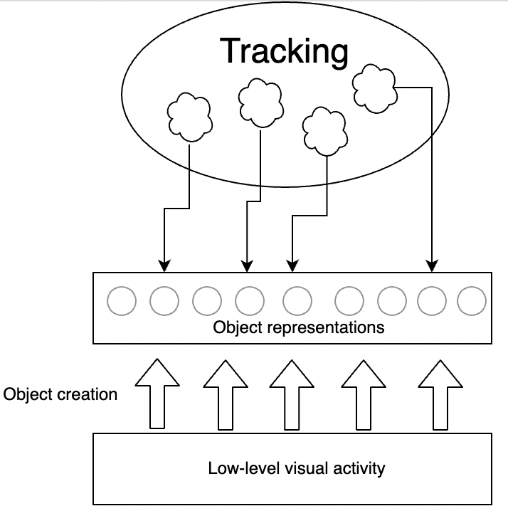

# Objects and attentional spread {#objects}

In my rather cluttered living room, sunlight streaming through the window illuminates dozens of objects. Hugo, our family dog,  had been napping, but now stands up and ambles into the kitchen. As he moves, I track him with my attention. To do so, something in my brain has to identify as a single object a changing set of neurons, representing Hugo's different parts as they shuffle across my retina. How is this done?

It starts in the retina, but the processing that occurs there is far from enough to segment a dog, or almost any object, from my living room background. Processing in the thalamus and early visual cortex, at the very least, continues the job. Much, or perhaps all, of this early cortical processing occurs regardless of where one is attending — in other words, it is pre-attentive. Exactly how extensive this preattentive processing is, and what sorts of representations it results in, has been studied for years, but much is still not understood [@neisserDecisionTimeReactionTimeExperiments1963; @treismanVerbalCuesLanguage1964; @kimchiFiguregroundSegmentationCan2008].

Attentive tracking is typically conceptualized as a process wherein a limited resource simply selects one or more of the preattentively-created representations. It is unclear, however, whether processing is so neatly divided, with preattentive representations simply selected rather than attention participating in modifying or even creating the representation that is tracked. A popular view is that attending to a location results in binding some of the features there, such as color and orientation, but attention likely also contributes to figure-ground segregation, which is fundamental to defining an object [@petersonLowlevelHighlevelContributions2014]. As another intriguing possibility for the effect of attention, to explain the twinkle-goes illusion @nakayamaDynamicNoiseBackground2021 suggested that attentional tracking could cause the representation of a moving object to persist after the object has disappeared.

<!-- This selection process than allows for continuous monitoring of that entity's changing position as well as other sorts of events, such as detection of probes flashed on the associated stimulus. -->

Studying the relationship of tracking to preattentive processing can be difficult, but a relevant and straightforward issue is which sorts of stimuli can be tracked and which cannot. However, the initial deployment of attention likely occurs more via a spatial or featural index than through some sort of index of the objects in the scene. We cannot think "car" or "tree" to ourselves and expect our attention to immediately deploy to any cars or trees in the scene. In contrast, our ability to deploy attention to the cued, static *location* is well-established, which very rapidly facilitates perceptual performance for that location and neural activation in the associated parts of retinotopic cortices. We also have the ability to deploy attention directly to certain other features, such as color or motion direction  [@saenzGlobalFeaturebasedAttention2003; @whiteFeaturebasedAttentionInvoluntarily2011].

As a result of our featural selection capability, if a moving target differs from distractors in certain ways, then featural selection can be relied on to keep attention on the moving target. For example, if the targets are the only yellow objects in the scene, and all the distractors are blue or green, then one can think "yellow" and that is enough to keep attention on the targets and off the distractors (see also Chapter \@ref(identity)). It is when the targets are identical to the distractors, or not distinguishable from the distractors by one of the features that feature selection acts on, that a different process is needed to keep attention on a moving target.

When the targets and distractors are identical, spatial location selection may initiate the selection of a target, but if it were the only process operating, when an object moved, attention would be left behind. A striking characteristic of the experience of tracking is that the movement of attention along with an object often seems to take no more effort than attending to a static object. Indeed, one might say that attention seems to be positively pulled along - when the targets in an MOT trial begin to move, I have never had the experience of my attention staying behind, remaining at one of the original target locations. It feels unnatural to un-latch attention from a target and fix it to the target's current location while the target moves on. This is likely related to the ability of visual transients to attract attention - a moving object is essentially a rapid sequence of transients along a continuous array of locations.

The term "object-based attention" is sometimes bandied about as an explanation of why attention seems to automatically move along with a selected object, the idea being that the units of attentional selection are objects rather than locations [@pylyshynSeeingVisualizingIt2006; @clarkLocationLocationLocation2009]. But no one seems to think that direct selection of objects is a thing, in the way that color selection is. That is, one cannot think "chair" and have all the locations of chairs in the scene become rapidly attended. Selection of chairs, or another object type, seems to require a search first, based on locations and simpler features. And even color selection may work via location, with thinking of a color resulting in availability of its locations, and attention then being deployed to those locations [@shihThereFeaturebasedAttentional1996].

## Stationary object selection

One notion that fits with these considerations is that attention is deployed first to a location or locations, but any object present can cause spatial attention to spread throughout that object. This "attentional spread" theory seems to be a popular one, in part due to the evidence from the paradigm I will describe next.

Dozens, possibly hundreds, of published papers have investigated the relationship of objects to attention using a cuing paradigm developed by @eglyShiftingVisualAttention1994.  @eglyShiftingVisualAttention1994 presented two static objects (rectangles) and presented a cue on one end of an object or another. They found that the cue resulted in a performance enhancement not only for probes at the location of the cue, but also at the cued object's other end. The comparison condition was performance at locations equidistant from the cue but not on the cued object. The findings reported in most of the many follow-up papers similarly find that participants are fastest and most accurate when the stimulus is presented in the same location as the cue, or on the same object but on a different part of that object. I used the qualifier "most" when referring to the follow-up papers because some papers did not find this [@davisReversalObjectBased2005; @shomsteinObjectbasedAttentionStrength2008; @shomsteinObjectbasedAttentionSensory2002; @louIndividualDifferencesTemporal2020], and a major concern is that there may be many more such null findings that ended up in the proverbial file drawer. Indeed, the effect sizes in the literature are often quite small and the studies not highly powered, which can be a red flag that publication bias may have created the illusion of a real effect [@buttonPowerFailureWhy2013].

Based on the pattern of sample sizes, effect sizes, and p-values in three dozen published object-based attention studies, @francisExcessSuccessArticles2022 argued that publication bias and/or p-hacking in the literature is rife. This is plausible in part because substantial proportions of researchers in psychology and other fields admit to such practices [@johnMeasuringPrevalenceQuestionable2012; @rabeloQuestionableResearchPractices2020; @chinQuestionableResearchPractices2021]. @francisExcessSuccessArticles2022 further point out that the only previously-published study with a large sample (120 participants) found a non-significant effect, of only a 6.5 ms response time advantage [@pilzHowPrevalentObjectBased2012], and in Francis et al.'s own study with 264 participants, the effect was also quite small, at 14 ms. For an effect of this size, Francis et al. calculated that the sample sizes typically used in the published literature were unlikely to yield statistical significance without some help from p-hacking or another questionable research practice. As a result, many papers in the literature make conclusions about objects and attention based on results that unfortunately cannot be trusted.

Publication bias and p-hacking are less of an issue when the effects being studied are large, because in those cases studies are more likely to be adequately powered, resulting in fewer false positives and false negatives. Some effects are so large that spending a period of seconds looking at a display is enough to convince oneself that an effect is real. Fortunately, those large effects include some that relate to how variation in objects affects tracking, as we will see in the next section.

## The end of the line

Many objects, such as the letter 'T', have salient parts. While normally we think of 'T' as a single object, we can also see that it is made up of a horizontal segment and a vertical segment. In conscious awareness, then, we have access to both the whole object level and to an individual parts level. You are able to focus attention on individual bits of the vertical segment, even though there are no visual characteristics that differentiate it. But what kind of representation(s) does our object tracking processes operate on?

In early visual cortex, different populations of neurons respond to the the horizontal and to the vertical stroke of a 'T'. But having neurons that respond to a thing does not suffice to be able to track that thing, as tracking operates on only some sorts of representations. @schollWhatVisualObject2001 shed light on this by asking participants to try to track the ends of lines. The notion that one end of an undifferentiated shape (such as a line) is an object is somewhat unnatural, but it can be useful. When paying attention to someone holding a rifle, for example, it may be important to continuously monitor the location of the front of its barrel.

Four moving lines were presented in the @schollWhatVisualObject2001 study, with one end of each line designated as a target. At the end of the trial, the lines stopped moving and participants were to click with a mouse on the line ends that were targets. During a trial, each line grew, shrank, and rotated as each of its ends wandered about the screen randomly.

{width=40%}

The results were striking. Performance on the task was abysmal relative to a control condition in which the two ends of the line were not connected. Simply by viewing an example trial, one very quickly gets a sense of how difficult the task is - the effect is very large.


```{r lines, echo=FALSE, out.width="100%", fig.cap="Using this display, Scholl et al. (2001) asked participants to track the end of each of several lines."}
#Work-around to make GIFs (but not .mov) work by avoiding including them in non-html outputs!
#https://stackoverflow.com/questions/64038037/can-i-conditionally-exclude-some-elements-code-blocks-from-rendering-to-the-pd
if(knitr::is_html_output()) knitr::include_url("movies/MOTmovies/connectedTargets/MOTtrackingEndOfLinesVeryDifficultScholl.mov") else knitr::include_graphics("movies/MOTmovies/connectedTargets/MOTtrackingEndOfLinesOneFrame.png")
#, height = "250px"
```

The task of tracking line ends in the @schollWhatVisualObject2001 experiment was complicated by the fact that the objects frequently crossed over each other, and also their length changed over time. But @howeCanAttentionBe2012 showed that these complications were not the main reason for the poor performance. It simply is the case, it seems, that one cannot confine one's tracking processes to one bit of an undifferentiated object. This inability to track the ends of lines fits in with the view this chapter opened with, that preattentive processes define objects that become what tracking operates on.

Maintaining attention on a part of the visual scene in the absence of anything in the image to delineate that part *feels like* it requires concentration, as if we must continually think about what we are supposed to be attending to. If lots of cognitive resources are needed to maintain the "object" representation when it is not provided by preattentive processes, then for such objects may only be able to track one. This idea of C = 1 (capacity of one) processes being involved or required for some forms of tracking was introduced in Chapter \@ref(whichAspects). 

## Object creation and object tracking: Distinct processes?

Researchers usually make a strong distinction between the processing that determines *how many* objects one can track and those that determine *what kinds* of objects can be tracked. An assumption of separate processing stages is popular in the study of visual cognition generally. Visual search, for example, is usually conceptualized this way [@wolfePreattentiveObjectFiles1997; @nakayamaVisualSurfaceRepresentation1995], and appears to be an implicit assumption in two reviews of objects and tracking  [@schollObjectsAttentionState2001; @pylyshynSeeingVisualizingIt2006]. <!-- No interaction between number of objects to track and what kinds of objects can be tracked.--> It would be convenient if object creation and object tracking occurred at distinct processing stages, as that is more straightforward to study than an interactive system [@simonSciencesArtificialReissue1969; @sternbergDiscoveryProcessingStages1969].

```{r simpleArchitecture, echo=FALSE, out.width="55%", fig.cap="A schematic of the idea that objects are created prior to the action of tracking processes, which then point to the already-formed object representations but do not change them."}

```

In accord with the above diagram, there certainly is evidence that tracking is high-level, for example @maechlerAttentionalTrackingTakes2021 found evidence that tracking operates on perceived object position rather than more low-level representation of position. Nevertheless, attention and object creation may be interactive. For example, the way stimulus elements are organized by attention can determine what illusory contours are created and perceived, as well as the lightness and depth that is perceived [@harrisonVoluntaryControlIllusory2019; @harrisonAttentionalSelectionIllusory2019; @peterVoluntaryAttentionModulates2005].  Our ability to perceive the complex motion of a human body from only several points of light highlights that object perception can involve hierarchical motion segmentation that reflects an interaction between Gestalt grouping and top-down knowledge of the overall shape of objects and the relative motion pattern of their parts [@johanssonVisualPerceptionBiological1973; @wangSearchingLifeMotion2010] (see the grouping Chapter (\@ref(grouping))).

Using a paradigm based on the attentional spread literature reviewed above, @ongchocoHowCreateObjects2019 asked participants to practice "imagining" a shape in a uniform grid of lines until they felt they could actually see the shape, which happened fairly readily. The detection of flashed probes was enhanced for those presented on the same imagined object, compared with equidistant ones presented on different objects. In summary, a variety of evidence suggests a role for neural feedback in object segmentation, with some role for attention, but the extent of its importance remains unclear [@papaleInfluenceObjecthoodRepresentation2021; @wyatteEarlyRecurrentFeedback2014; @harrisonVoluntaryControlIllusory2019]. 
 
Potentially, the same attentional resources that mediate tracking may also contribute to the creation of object representations. One consequence would be a trade-off between the involvement of attention in constructing object representations and the number of objects that can be tracked. Informal experience with tracking the line ends in the @schollObjectsAttentionState2001 display seems to support this. If when you watch the movie of \@ref(fig:lines), you concern yourself with keeping track of the end of only *one* object, you are likely to succeed. But recall that it is difficult or impossible to accurately track *four* object ends - indeed, @schollObjectsAttentionState2001 found that participants' performance was approximately that predicted if they could track one line end, but not more.

Possibly the ability to track only one line end is a result of consuming all of one's tracking resources to *create* a representation of the end of the line as like a single object. An important alternative, however, is that tracking the end of a line has uses a C=1 process rather than the tracking processes that allow us to track more objects in most circumstances. This would mean that covert tracking of multiple objects is qualitatively different from covert tracking of a single object. Because the participants in the @ongchocoHowCreateObjects2019 study imagined only a single object, it is possible that their results reflect a C=1 process rather than the processes we use to track multiple objects, like the mental rotation study of @xuCapacityVisualFeatures2015.
 
## What tracking sticks to

Even when all of our cognitive resources are brought to bear on a single entity, some kinds of entities still can't be tracked. @anstisEyesPursueMoving2010 asked participants to track the intersection of two shapes moving in a configuration that elicits the "chopsticks illusion" @anstisImperceptibleIntersectionsChopstick1990. A horizontal and vertical line slide over each other in the chopsticks illusion, with each line following a clockwise circular trajectory. Viewers perceive the intersection of the two lines to also be moving clockwise (demo [here](http://anstislab.ucsd.edu/illusions/chopsticks-illusion/)), but in fact the intersection moves counterclockwise only. This error may be, in part, a failure of object tracking because if participants had been able to attentionally track the intersection, they should have been able to judge its trajectory.  @anstisImperceptibleIntersectionsChopstick1990 also found that participants could not accurately pursue the intersection with their eyes.

The true counterclockwise trajectory of the intersection becomes obvious perceptually if one views the display through a window so that the ends of the lines are occluded rather than visible, and in that condition participants were able to smooth pursue the intersection accurately, in a clockwise direction. So the problem is a likely pre-attentive interpretation of the motion that we cannot overcome. @anstisImperceptibleIntersectionsChopstick1990 suggested that the reason that the intersection is  perceived to move in the wrong direction ordinarily is because the clockwise motion of the ends of the lines is mistakenly assigned to the intersection, similar to how the motion of the ends of lines can veto the barber-pole illusion. The illusion is an example of a failure to track a rather simply-defined point. Evidently, tracking cannot operate on that point, possibly because before the operation of tracking, a particular interpretation of motion and form is created. As schematized by the figure above, some processing of motion and form appears to occur prior to the operation of tracking. <!--As we will see, however, there is also reason to believe that attention can mold some object representations.-->

```{r, echo=FALSE, out.width="100%", fig.cap="Some stimuli used by Howe et al. (2012). CC-BY"}
knitr::include_graphics("imagesForRmd/PiersHowe/PiersHoweStimuli.png")
```

As we saw in the "The ends of the line" section above, maintaining the representation of an undifferentiated part of an object is not something that our multiple object tracking resources are capable of. What sort of differentiation is needed? @schollWhatVisualObject2001 varied how distinct the end of an object was. In a "dumbbell" condition, the object used were  two squares connected by a line. In that condition, participants' accuracy was lower than a standard separated squares condition, but not statistically significantly so - any detriment to tracking appeared to be small, suggesting that participants are able to track a dumbbell end. However, @howeCanAttentionBe2012 tested a dumbbell condition that was rather similar to that of @schollWhatVisualObject2001, but they found performance was substantially lower than when the objects (discs in their case) were not connected. The reason for the discrepancy is not clear, and it appears it could reflect the noisiness of the data of the two studies. @howeCanAttentionBe2012 also tested a "luminance" condition, pictured above, and found that performance (80% correct) was substantially lower than their baseline condition (96% correct), although not as low as for undifferentiated bar ends (72% correct). They were surprised that the clear difference in luminance between the targets and the connector in the luminance condition was not enough to keep tracking from being so adversely affected by the connectors.

These results suggest that multiple object tracking uses a different segmentation of objects than what is available to us when we focus our attention on a single object. The findings have some similarity to those found in conjunction visual search studies. @wolfePreattentiveObjectFiles1997 asked participants to search for conjunctions of features, such as red and vertical. If the vertical red part of an object were physically connected to a horizontal and green part, then participants were much slower to find the red vertical target segment in the display, among the green vertical and red horizontal distractors. In other words, it seemed that physically connecting one feature to another lumped it together as an undifferentiated collection of features from the perspective of search processes, what @wolfePreattentiveObjectFiles1997 termed a "preattentive object file". No researcher seems to have tested displays of this nature for both tracking and search <!--FUTURE-->, but for now the parsimonious account has to be that multiple object tracking and search operate on the same object representations.

## Growth, shrinkage, and tracking

Some objects and substances change shape.  When one opens a faucet in a kitchen, for example, a jet of water shoots into the sink, and flattens on the sink's bottom as it expandings into a puddle. As one pours beer into a glass, a froth forms, which gradually thickens as the top of the liquid rises. These are examples of non-rigid motion, specifically substances that change shape as they move.

To investigate tracking of non-rigid substances, @vanmarleAttentiveTrackingObjects2003 devised an object that moved a bit like an inchworm or a slinky. In a condition I'll refer to as the "slinky" condition, each object began as a square. It would then move by extending its leading edge until it had the shape of a long and thin rectangle. Subsequently, the trailing edge of the slinky, which was still at its original location, would move forward until the slinky was a square again, now entirely at a new location. @vanmarleAttentiveTrackingObjects2003 found that slinky tracking performance was very poor. <!--the substances condition difficulty seems to be accounted for by this problem-->

What is it about tracking that causes such difficulty with slinkys? @howeVisuallyTrackingLocalizing2013 tested a number of conditions that seemed to rule out possibilities such as the faster speed of the slinky's edges relative to the control conditions. @schollWhatHaveWe2008 suggested that the reason the slinky was difficult to track was, as they put it, "there was no unambiguous location for attention to select on this shrinking and growing extended object" because "each object’s location could no longer be characterized by a single point" (p.63). There may be something to this, but it is not entirely clear what is meant by an object's location not being characterizable by a single point. The objects typically used for MOT, discs with no internal features, also have no unambiguous internal locations, because their insides are a completely undifferentiated mass. If one wishes to refer to a single point for their location, their centroid could be used, but this seems just as true for an object changing in size and shape. Additionally, in the chopsticks illusion reviewed above, the target was defined by a single point (the intersection of two lines), yet it could not be tracked.

While the reason or reasons that tracking a slinky is difficult remains obscure, it seems that object expansion and contraction disrupt both tracking and localization. After @howeVisuallyTrackingLocalizing2013 replicated the tracking findings of @schollWhatHaveWe2008, they probed the effect of size changes on localization. Participants were presented with a rectangle for 200 ms at a random location on the screen, and were asked to click on the location of the center of the rectangle. In a baseline condition, the rectangle did not change in size, shape, or location during its 200 ms presentation. In the size-change condition, the length of the object increased due to expansion for half of the interval and shrank due to contraction during the other half. Participants' localization errors were about 14% larger in this changing-size condition. This appeared to be driven by errors along the axis of the object's expansion and contraction, as errors in the orthogonal direction were not significantly different from the baseline condition. <!--FUTURE: Do a continuous mouse-tracking study of this to assess the lag and sources of noise with richer data. -->

The substantial localization impairment documented by @howeVisuallyTrackingLocalizing2013 may possibly be the cause of the poor  performance during MOT. However, that is still not clear. An important next step is to measure localization errors when the task is to monitor multiple objects changing in size rather than just one. If the localization deficit caused by change in size worsens with object load, this would help implicate the processes underlying tracking <!--FUTURE. Could do a continuous mouse-tracking version-->.

## Could tracking work by attentional spreading?

The relationship between object representations and tracking schematized in Figure \@ref(fig:simpleArchitecture) suggests that attention selects *entire* object representations. It has been suggested, however, that the process instead begins with selection of a particular location, which then spreads up to the edges of the object. A gradual growth of the area of attentional activation to encompass an entire object has been observed neurophysiologically in certain tasks [e.g., @wannigAutomaticSpreadAttentional2011].

Although I have not seen anyone discuss this possibility, the spreading of attention may actually contribute to the ability to track moving objects. When an object moves, its leading edge will occupy new territory while its trailing edge continues to occupy an old location. If spreading of attention up to object boundaries continually occurs, then attention should spread to the new locations near the leading edge. In such a fashion, attention could, by continually expanding to the new location of a leading edge and contracting with a trailing edge, stay on a moving object. Spreading of activation has been documented neurophysiologically in V1 of rhesus macaques given the task of evaluating whether two points are on the same curved line segment [@roelfsemaObjectbasedAttentionPrimary1998].

Presenting probes during a task of tracking multiple lines, @alvarezHowDoesAttention2005 found that probes presented at the center of objects were detected much more accurately than end probes, suggesting that attentional resources were concentrated on the centers of the lines. The spreading account seems to instead predict that accuracy would be highest near the trailing end of an object. It appears, however, that the researchers did not analyze the data to check whether of the two object ends, accuracy was higher for probes at the trailing end. Clearly, much more work <!--FUTURE--> is needed to reveal the nature of attentional spread while an object moves and any role that has in facilitating tracking.
<!-- Point objects, stepping objects (works for 1 target and probably for multiple ones if they are stepping a short distance, but I know of NO studies of MOT with apparent motion FUTURE), and the finding that attention tends to be ahead of an object? I don't recall whether that's been done --> 
<!-- Reminescent of how rapid eye movements (saccades) tend to go to the centroids of objects.-->

<!--Out the kitchen window, in the dense foliage of a tree, two birds squabble on the wing. As they plummet from one branch to another, you see only parts of each at any one time. An outstretched wing partially obscured by leaves and a branch, which folds in on itself as the bird alights on a branch and parts of its body comes into view. In addition to occlusion, camouflage can also cause the visible portions of animals to change in shape as they move from one background to another.-->

 <!-- Also use Zenon Pylyshyn's examples of objects not represented well as objects, so PylyshynAttention_Lecture_class -->


<!--Many questions remain regarding what sorts of objects attention gloms onto.


This proposition, that there are actually two resources that can assist tracking, one with much more limited capacity (perhaps for just one object) and the other with fewer capabilities but higher capacity, is an intriguing one but not-->

