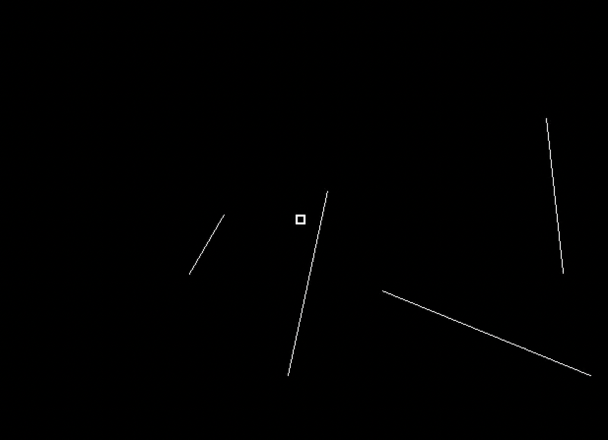

# Objects and attentional spread {#objects}

Sunlight streams through the window of my living room, illuminating dozens of objects, including Hugo, our dog, who is lying on his bed in the corner. When Hugo gets up and ambles toward the kitchen, his movement attracts my attention, and I find that I am tracking him, out of the corner of my eye. To accomplish this, something in my brain grouped together a changing set of neurons as a single object as Hugo's image slid across my retinas.

Processing starts in the retina, but further processing in the thalamus and visual cortex is needed to segment an object from the cluttered background presented by my living room. Some of this processing occurs regardless of where one is attending — in other words, it is pre-attentive. Exactly how extensive this pre-attentive processing is, and what sorts of representations it results in, is not fully understood [@neisserDecisionTimeReactionTimeExperiments1963; @treismanVerbalCuesLanguage1964; @kimchiFiguregroundSegmentationCan2008]. These preattentive representations are not the same as what we cognitively think of as objects, so one can instead refer to them as proto-objects or use Pylyshyn's term "FING", a play on "thing" and FINST [@pylyshynVisualIndexesPreconceptual2001].

It is frequently assumed that pre-attentive processing creates FINGs and attentive tracking simply selects them. This is difficult to investigate directly. What can be studied is which sorts of stimuli can be tracked and which cannot.<!-- A complication is that the initial deployment of attention likely occurs more via a spatial or featural index than through some sort of index of the objects in the scene. We cannot think "car" or "tree" to ourselves and expect our attention to immediately deploy to any cars or trees in the scene. In contrast, our ability to deploy attention to a cued, static *location* is well-established, which very rapidly facilitates perceptual performance for that location and neural activation in the associated parts of retinotopic cortices. We can also deploy attention directly to certain other features, such as color or motion direction  [@saenzGlobalFeaturebasedAttention2003; @whiteFeaturebasedAttentionInvoluntarily2011].-->

<!--As a result of our featural selection capability, if a moving target differs from distractors in certain ways, then featural selection can be relied on to keep attention on the moving target. For example, if the targets are the only yellow objects in the scene, and all the distractors are blue or green, then one can think "yellow" and that will keep attention on the targets and off the distractors (see also Chapter \@ref(identity)). It is only when the targets are identical to the distractors, or not distinguishable from the distractors by one of the features that feature selection acts on, that a different process is needed to keep attention on a moving target.-->


<!--"Object-based attention" has been invoked as an explanation of why attention seems to automatically move along with a selected object, the idea being that the units of attentional selection are objects rather than locations [@pylyshynSeeingVisualizingIt2006; @clarkLocationLocationLocation2009].-->  

## Stationary object selection

To access an object, attention may be deployed first to a location or locations, via spatial or featural cuing -  while researchers often speak about "object-based attention", no one seems to think that objects can be directly selected in the way one can select colors. That is, one cannot think "chair" and expect all the locations of chairs in the scene to rapidly become attended. Selection of chairs and other objects typically requires a search first, using simpler features.<!-- And even color selection may work via location, with thinking of a color resulting in availability of its locations, and attention then being deployed to those locations [@shihThereFeaturebasedAttentional1996].-->

<!--In many cases selection may begin with a location, one specified by an external cue, or by a memory.--> After a search yields the location of a target, location selection is possible, but typically we are more interested in an object, an object part, or a surface [@pylyshynThingsPlacesHow2007]. So while selection may begin with a location, the presence of something in that location may result in spatial attention spreading throughout it. That likely helps sets the stage for tracking that object. Indeed, if location selection were the only process operating, when an object moved, attention would be left behind. But to me it feels unnatural to un-latch attention from a target and fix it to the target's former location while the target moves on. Moving attention with an object seems, in my experience, to take no more effort than attending to a static object. Indeed, attention seems to be positively pulled along - when the targets in an MOT trial begin to move, I have never had the experience of my attention staying behind, remaining at one of the original target locations. 

Selection of visual objects has been studied primarily with the paradigm of @eglyShiftingVisualAttention1994, in which two static objects (rectangles) are presented, and then a cue is added to one end of an object. The cue can result in performance enhancement not only for probes at the location of the cue, but also at the cued object's other end. The control or baseline condition is typically performance for locations equidistant from the cue but not on the cued object. Most such papers found that participants are fastest and most accurate when the stimulus is presented in the same location as the cue, or on the same object but on a different part of that object. Some papers did not find this [@davisReversalObjectBased2005; @shomsteinObjectbasedAttentionStrength2008; @shomsteinObjectbasedAttentionSensory2002; @louIndividualDifferencesTemporal2020], however, and a major concern is that there may be many more such null findings, unpublished and in the file drawer. The effect sizes in the literature are often quite small and the studies not highly powered, which is a red flag that publication bias may have created the illusion of a real effect [@buttonPowerFailureWhy2013].

Based on the pattern of sample sizes, effect sizes, and p-values in three dozen published object-based attention studies, @francisExcessSuccessArticles2022 argued that publication bias and/or p-hacking in the literature is rife. Substantial proportions of researchers in psychology and other fields admit to such practices [@johnMeasuringPrevalenceQuestionable2012; @rabeloQuestionableResearchPractices2020; @chinQuestionableResearchPractices2021], and @francisExcessSuccessArticles2022 pointed out that the only published study with a large sample (120 participants) found a non-significant effect, of only a 6 ms response time advantage [@pilzHowPrevalentObjectBased2012], and in Francis et al.'s own study with 264 participants, the effect was also quite small, at 14 ms. For an effect of this size, Francis et al. calculated that the sample sizes typically used in the published literature were unlikely to yield statistical significance without some help from p-hacking or another questionable research practice. As a result, many papers in the literature make conclusions about objects and attention that unfortunately cannot be trusted.

Publication bias and p-hacking are less of a problem when the effects being studied are large, because in those cases studies are more likely to be adequately powered, resulting in fewer false positives and fewer false negatives. Some effects related to tracking are so large that just seconds of looking at a display is enough to convince oneself that an effect is real. Fortunately, those large effects include some that relate to how variation in objects affects tracking.

## The end of the line

Many objects have salient parts. For example, the letter 'T' is ordinarily considered a single object, but it is made up of a horizontal segment and a vertical segment, which we can easily see. In conscious awareness, then, we have access to both the whole object level and to an individual parts level. You are able to focus attention on individual bits of the vertical segment, even though there are no visual characteristics that differentiate it. But what kind of representation(s) does our object tracking processes operate on?

In early visual cortex, different populations of neurons respond to the the horizontal and to the vertical stroke of a 'T', as well as the different ends of each stroke. But having neurons that respond to a thing is not sufficient for tracking that thing, as tracking operates on only some sorts of representations. @schollWhatVisualObject2001 asked participants to track the ends of lines. While this may seem to be a weird task, it is not entirely artificial. When someone is holding something pointy at close range, for example, it may be important to continuously monitor the location of its front end. @schollWhatVisualObject2001 presented four moving lines in their study (Figure \@ref(fig:SchollEtAl2001schematic)), with one end of each line designated as a target. The lines grew, shrank, and rotated as each of its ends wandered about the screen randomly. At the end of the trial, participants were to click with a mouse on the line ends that were targets. 

```{r SchollEtAl2001schematic, echo=FALSE, out.width="40%", fig.cap="The lines display of Scholl et al. (2001)"}
knitr::include_graphics("imagesForRmd/linesSchollPylyshynFeldman_madeByHolcombe.png")
```

Performance on the task was very poor, including relative to a control condition in which the two ends of the line were not connected. By viewing an example trial (Movie \@ref(fig:linesMovie)), one can very quickly get a sense of how difficult the task is.

```{r linesMovie, echo=FALSE, out.width="100%", fig.cap="Using this display, Scholl et al. (2001) asked participants to track the end of each of several lines."}
#Work-around to make GIFs (but not .mov) work by avoiding including them in non-html outputs!
#https://stackoverflow.com/questions/64038037/can-i-conditionally-exclude-some-elements-code-blocks-from-rendering-to-the-pd
if(knitr::is_html_output()) knitr::include_url("movies/MOTmovies/connectedTargets/MOTtrackingEndOfLinesVeryDifficultScholl.mp4") else 
#, height = "250px"
```

@howeCanAttentionBe2012 showed that various complications in the @schollWhatVisualObject2001 displays, such as that the lines frequency crossed over each other, were not the main reason for the poor performance in tracking the lines' ends. This supported the conclusion that one cannot confine one's tracking processes to one bit of an undifferentiated object. This inability to track line ends fits in with one possibility already mentioned, that preattentive processes define objects, or at least proto-objects (they may not always correspond to what we consciously think of as objects), and this is what tracking operates on. Consistent with this, maintaining attention on a part of the visual scene in the absence of anything in the image to delineate that part  feels like it requires concentration, as if we must continually think about what we are supposed to be attending to. If cognitive "System B" is indeed needed to maintain the "object" representation when it is not provided by preattentive processes, then for such objects we may only be able to track one (this idea that processes with a capacity of 1 are involved or required for some forms of tracking was introduced in Section \@ref(Cequals1)). 

## Object creation and object tracking: Distinct processes?

Researchers typically make a strong distinction between the processing that determines *how many* objects one can track and those that determine *what kinds* of objects can be tracked. Such an assumption of separate processing stages is popular in the study of visual cognition quite generally. Visual search, for example, is usually conceptualized this way [@wolfePreattentiveObjectFiles1997; @nakayamaVisualSurfaceRepresentation1995], and a two-stage theory appears to be implicitly assumed in two previous reviews of objects and tracking  [@schollObjectsAttentionState2001; @pylyshynSeeingVisualizingIt2006]. <!-- No interaction between number of objects to track and what kinds of objects can be tracked.--> It would be quite convenient if the assumption that object creation and object tracking occur at distinct processing stages were true, as that is more straightforward to study than an interactive system [@simonSciencesArtificialReissue1969; @sternbergDiscoveryProcessingStages1969].

```{r simpleArchitecture, echo=FALSE, out.width="55%", fig.cap="A schematic of the idea that objects are created prior to the action of tracking processes, which then point to the already-formed object representations but do not change them."}
knitr::include_graphics("imagesForRmd/flowDiagrams/objectCreationTrackingSeparateDiagram.png")
```

It is unclear whether processing is actually neatly divided, with preattentive representations simply selected. Instead, attention may modify or even create the representation that is tracked (see Figure \@ref(fig:simpleArchitecture)). It is possible that the feature binding role of attention does not affect tracking, but attention may contribute more directly to figure-ground segregation, which is fundamental to objecthood [@petersonLowlevelHighlevelContributions2014]. <!--As another intriguing possibility for the effect of attention, to explain the twinkle-goes illusion @nakayamaDynamicNoiseBackground2021 suggested that attentional tracking could cause the representation of a moving object to persist after the object has disappeared.-->

<!-- This selection process than allows for continuous monitoring of that entity's changing position as well as other sorts of events, such as detection of probes flashed on the associated stimulus. -->

@maechlerAttentionalTrackingTakes2021 found evidence that tracking operates on perceived (illusory) object positions, which suggests that tracking operates on high-level representations. Nevertheless, attention and object creation may be interactive. The way stimuli are organized by attention can determine what illusory contours, lightness, and depth are perceived [@harrisonVoluntaryControlIllusory2019; @harrisonAttentionalSelectionIllusory2019; @peterVoluntaryAttentionModulates2005].  Our ability to perceive the complex motion of a human body from sparse points of light highlights that object perception can involve an interaction between Gestalt grouping and top-down knowledge of the relative motion pattern of their parts [@johanssonVisualPerceptionBiological1973; @wangSearchingLifeMotion2010] (see Section \@ref(grouping)). Further evidence for a role for neural feedback in object segmentation comes from @ongchocoHowCreateObjects2019, who asked participants to practice "imagining" a shape in a uniform grid of lines until they felt they could actually see the shape. Participants were able to do this fairly readily, and the detection of flashed probes was higher for probes presented on the same imagined object compared with equidistant ones presented on different objects. <!--In summary, a variety of , with some role for attention, but the extent of its importance remains unclear [@papaleInfluenceObjecthoodRepresentation2021; @wyatteEarlyRecurrentFeedback2014;-->
 
The same attentional resources that mediate tracking may also contribute to the creation of object representations. One consequence would be a trade-off between the involvement of attention in constructing object representations and the number of objects that can be tracked. Informal experience with tracking the line ends in the @schollObjectsAttentionState2001 display seems to support this. If when you watch Movie \@ref(fig:linesMovie), you concern yourself with keeping track of the end of only *one* object, you are likely to succeed. But recall that it is difficult or impossible to accurately track *four* object ends - indeed, @schollObjectsAttentionState2001 found that participants' performance was approximately that predicted if they could track one line end, but not more. It is unclear whether the ability to track one line end is due to the use of multiple-object tracking resources to create objects, or rather reflects System B processing that has a capacity of only one object.

Involvement by System B could mean that covert tracking of a single object is qualitatively different from covert tracking of multiple objects. Because the participants in the @ongchocoHowCreateObjects2019 study imagined only a single object, it is possible that their results reflect a capacity-one process rather than the processes we use to track multiple objects.
 
## What tracking sticks to

Even when all our attentional resources, System B included, are brought to bear on a single entity, some entities still can't be tracked. In the ["chopsticks illusion"](http://anstislab.ucsd.edu/illusions/chopsticks-illusion/), a horizontal and vertical line slide over each other, with each line following a clockwise circular trajectory. Viewers perceive the intersection of the two lines to also be moving clockwise, but in fact the intersection moves counterclockwise only, and participants cannot track the intersection accurately with their eyes [@anstisImperceptibleIntersectionsChopstick1990]. Covert object tracking also seems to be impossible, because if one was able to attentionally track the intersection, presumably one would know whether it was moving clockwise or counter-clockwise.

The true counterclockwise trajectory of the chopsticks' intersection becomes obvious perceptually if one views the display through a window so that the ends of the lines are occluded rather than visible. In that condition, participants were able to follow the intersection accurately with their eyes. These results suggest that the illusion-evoking configuration is interpreted in a way we cannot overcome, and that interpretation occurs prior to the operation of tracking, even though what is to be tracked is a rather simply-defined point - an intersection. @anstisImperceptibleIntersectionsChopstick1990 suggested that the reason that the intersection is perceived to move in the wrong direction is because the clockwise motion of the ends of the lines is mistakenly assigned to the intersection, similar to how visibility of the ends of lines can veto the barber-pole illusion [@wuergerVisuallyPerceivedDirection1996]. This is consistent with Figure \@ref(fig:simpleArchitecture), which portrays motion and form processing occurring prior to the operation of tracking. <!--As we will see, however, there is also reason to believe that attention can mold some object representations.-->

```{r HoweLines, echo=FALSE, out.width="100%", fig.cap="Some stimuli from Howe et al. (2012), CC-BY."}
knitr::include_graphics("imagesForRmd/PiersHowe/PiersHoweStimuli.png")
```

As discussed previously, maintaining and using a representation of an undifferentiated part of an object is not something that our multiple object tracking processes are capable of. So, what differentiation of object parts is needed in order to track? This is not yet clear. @schollWhatVisualObject2001 and @howeCanAttentionBe2012 found seemingly-contradictory evidence for how distinct the ends of a dumbbell figure had to be from its center to allow tracking of the dubmbbell end. That may reflect the noisiness of the data of the two studies. @howeCanAttentionBe2012 also tested a "luminance" condition (Figure \@ref(fig:HoweLines)); performance (80% correct) was substantially lower than their baseline condition (96% correct), although not as low as for undifferentiated bar ends (72% correct). The clear difference in luminance between the targets and the connector in the luminance condition was somehow not enough to keep tracking from being so adversely affected by the connectors. This reinforces the notion that multiple object tracking uses a different representation of objects than what is available when we focus our attention on a single object.

What we consciously experience also seems to differ from the object representation operated on by visual search processes. @wolfePreattentiveObjectFiles1997 asked participants to search for conjunctions of features, such as red and vertical. When the vertical red part of an object was physically connected to a horizontal and green part, participants were much slower to find the red vertical target segment in the display, among the green vertical and red horizontal distractors. Physically connecting one feature to another evidently lumped them together as an undifferentiated collection of features, what @wolfePreattentiveObjectFiles1997 termed a "preattentive object file". Unfortunately, no researcher seems to have tested displays of this nature for both tracking and search <!--FUTURE-->, . For now, the parsimonious account is that multiple object tracking and search operate on the same object representations.

## Growth, shrinkage, and tracking

Some objects and substances change their shape as they move. A bathroom faucet, for example, will shoot a jet of water down into the sink, whereupon the water flattens on the sink's bottom as it expands into a puddle. When beer is poured by a bartender, a froth forms, which gradually thickens as the top of the liquid rises. The froth and beer as they fill the glass, as well as the water emanating from the faucet, is an example of non-rigid, shape-shifting motion.

@vanmarleAttentiveTrackingObjects2003 concocted a stimulus that moved a bit like an inchworm. In what I will refer to as their "slinky" condition, each of the target and distractor objects began as a square. The object (a slinky) moved by extending its leading edge until it had the shape of a long and thin rectangle. Subsequently, the trailing edge of the slinky, which was still at its original location, would move forward until the slinky was a square again, now entirely at a new location. Performance was very poor in this task.
 <!--the substances condition difficulty seems to be accounted for by this problem-->

What causes the difficulty of tracking slinkys? Knowing that should tell us something about how tracking works. @howeVisuallyTrackingLocalizing2013 tested a number of conditions that help rule out various possibilities, such as the faster speed of the slinky's edges relative to the non-slinky objects. @schollWhatHaveWe2009 purport to provide one explanation, writing that "there was no unambiguous location for attention to select on this shrinking and growing extended object" because "each object’s location could no longer be characterized by a single point" (p.63). There may be something to this, but it is not entirely clear what @schollWhatHaveWe2009 mean by an object's location not being characterizable by a single point. The objects typically used for MOT, uniform discs, also have no unambiguous internal locations — their insides are a completely undifferentiated mass. As a single point to represent their locations, the objects' centroid could be used, but this seems just as true for an object changing in size and shape like the slinky. A further problem is that in the chopsticks illusion discussed above, the target was defined by a single point (the intersection of two lines), yet it could not be tracked.

One clue to the mystery is that both tracking and simple localization are disrupted by object expansion and contraction, which is one characteristic of slinky motion. After @howeVisuallyTrackingLocalizing2013 replicated the tracking findings of @schollWhatHaveWe2009, they went on and probed the effect of size changes on localization. Participants were presented with a rectangle for 200 ms at a random location on the screen, and were asked to click on the location of the center of the rectangle. In a baseline condition, the rectangle did not change in size, shape, or location during its 200 ms presentation. In the size-change condition, the length of the object increased due to expansion for half of the interval and shrank due to contraction during the other half. Participants' localization errors were about 14% larger in this changing-size condition. This appeared to be driven by errors along the axis of the object's expansion and contraction, as errors in the orthogonal direction were not significantly different from the baseline condition. <!--FUTURE: Do a continuous mouse-tracking study of this to assess the lag and sources of noise with richer data. -->

The substantial localization impairment documented by @howeVisuallyTrackingLocalizing2013 may be the cause of the poor performance during MOT. An important next step is to measure localization errors when the task is to monitor multiple objects changing in size rather than just one. If the localization deficit caused by change in size worsens with object load, this would help implicate the processes underlying tracking <!--FUTURE. Could do a continuous mouse-tracking version-->. This would not by itself answer, however, why exactly object localization is impaired by size changes.

## Could tracking work by attentional spreading?

I don't recall anyone suggesting that the manner in which attention selects object representations might also facilitate tracking an object as it moves. However, this seems quite possible.<!--FUTURE--> Object selection may begin with selection of a particular location on that object, with attention subsequently spreading up to the edges of the object. Neurophysiological evidence for this has been observed in some tasks [e.g., @wannigAutomaticSpreadAttentional2011]. This spreading of attention may contribute to the ability to track — when the object moves, its leading edge will occupy new territory while its trailing edge continues to occupy an old location. If attentional spread up to object boundaries continues to occur as the object moves, then attention should spread to the newly-occupied locations at the leading edge. Thus attention could follow a moving object. One should also not overlook the possible contribution of the fact that visual transients attract attention - a moving object is essentially a rapid sequence of transients that appear along a path.

The spreading account seems to predict that tracking resources would be most concentrated near the trailing end of an object. In a task involving tracking multiple lines, however, @alvarezHowDoesAttention2005 found that probes presented at the center of objects were detected much more accurately than end probes, suggesting that attentional resources were concentrated near the centers of the lines. It appears, however, that @alvarezHowDoesAttention2005 did not analyze the data to check whether of the two object ends, accuracy was higher for probes at the trailing end. Clearly, more work <!--FUTURE apparent motion might also be a problem for this account, assuming you can track more than one object in apparent motion. Point objects, stepping objects (works for 1 target and probably for multiple ones if they are stepping a short distance, but I know of NO studies of MOT with apparent motion FUTURE), and the finding that attention tends to be ahead of an object? I don't recall whether that's been done --> is needed to reveal the nature of attentional spread while an object moves and any role that may have in facilitating tracking.
<!-- Reminescent of how rapid eye movements (saccades) tend to go to the centroids of objects.-->

<!--Out the kitchen window, in the dense foliage of a tree, two birds squabble on the wing. As they plummet from one branch to another, you see only parts of each at any one time. An outstretched wing partially obscured by leaves and a branch, which folds in on itself as the bird alights on a branch and parts of its body comes into view. In addition to occlusion, camouflage can also cause the visible portions of animals to change in shape as they move from one background to another.-->

 <!-- Also use Zenon Pylyshyn's examples of objects not represented well as objects, so PylyshynAttention_Lecture_class -->

<!--Many questions remain regarding what sorts of objects attention gloms onto.


