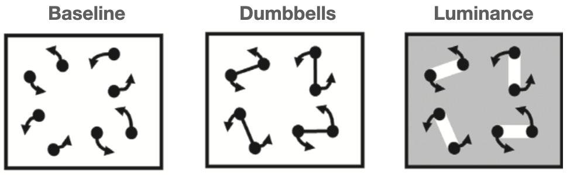

# Objects and attentional spread

As I sit in my cluttered living room, sunlight streaming through the window illuminates dozens of objects that reflect light into my retinas. The family dog, which had been napping, gets up and ambles into the kitchen. As he moved, I tracked him with my attention. To do so, something in my brain had to identify a changing set of neurons, responding to different parts of the moving dog, as constituting one object. What sort of processing is involved?

It starts in the retina, but the processing that occurs there is far from enough to segment a dog, or practically any other object, from my living room background. Processing in the thalamus and early visual cortex, at the very least, continues the job. Much, or perhaps all, of this early cortical processing occurs regardless of where one is attending. Exactly how extensive this "preattentive" processing is, and what sorts of representations it results in, has been studied for a while, but much is still not understood [@neisserDecisionTimeReactionTimeExperiments1963; @treismanVerbalCuesLanguage1964; @kimchiFiguregroundSegmentationCan2008].

Attentive tracking is often conceptualized as a process wherein a limited resource simply selects one or more of the preattentively-created representations. In fact, it is unclear whether processing is so neatly divided, with preattentive representations merely selected rather than attention participating in modifying or even creating the representation that is tracked. For example, a popular view is that attending to a location results in binding some of the features there, such as color and orientation, but attention likely also contributes to figure-ground segregation, a more fundamental aspect to defining an object [@petersonLowlevelHighlevelContributions2014]. @nakayamaDynamicNoiseBackground2021 even suggested, in order to explain the twinkle-goes illusion, that attentional tracking could cause the representation of a moving object to persist after the object has disappeared.

<!-- This selection process than allows for continuous monitoring of that entity's changing position as well as other sorts of events, such as detection of probes flashed on the associated stimulus. -->

With behavioral tasks, perhaps the most straightforward assessment that can be done is to investigate which sorts of stimuli can be tracked and which cannot. The first deployment of attention to a stimulus likely occurs more via a spatial or featural index than through an index of the objects in the scene. We cannot think "car" or "tree" to ourselves and expect our attention to deploy directly to any cars or trees in the scene. In contrast, our ability to deploy attention to a cued, static *location* is well-established, as is our ability to deploy attention directly to certain other features, such as color or motion direction. When people are instructed to think about a particular location in the visual field, this results very rapidly in facilitation of perceptual performance for that location, and neural activation in the associated parts of retinotopic cortices. No "search process seemss to be needed, instead spatial location seems to provide a direct conduit for attentional activation. Similarly, for certain features such as motion or color, an instruction to attend to a particular direction, or a particular color, triggers rapid activation across the visual field at all the locations of that color or motion [@saenzGlobalFeaturebasedAttention2003; @whiteFeaturebasedAttentionInvoluntarily2011].

As a result of this featural selection capability, if a moving target differs from distractors in certain ways, then featural selection can be relied on to keep attention on the target. For example, if the targets are the only yellow objects in the scene, and all the distractors are blue or green, then one can think "yellow" and that is enough to keep attention on the targets and off the distractors (this will come up again in Chapter \@ref(identity)). It is when the targets are identical to the distractors, or not distinguishable from the distractors by one of the features that feature selection acts on, that a different process is needed to keep attention on a moving target.

When the targets and distractors are identical, spatial location selectio may initiate the selection of a target, but if it were the only process operating, when an object moved, attention would be left behind. And a striking characteristic of the experience of tracking is that the movement of attention along with an object feels like it takes no more effort than selecting a static object. Indeed, one might say that attention seems to be positively pulled along - when the targets in an MOT trial begin to move, I have never had the experience of my attention staying behind, remaining at one of the original target locations. It feels unnatural to un-latch my attention from a target and fix it to the target's current location while the target moves on.

The term "object-based attention" is sometimes bandied about as an explanation of why attention seems to automatically move along with a selected object, the idea being that the units of selection are objects rather than locations [@pylyshynSeeingVisualizingIt2006; @clarkLocationLocationLocation2009]. But no one seems to think that direct selection of objects is a thing, in the way that color selection is. That is, one cannot think "chair" and have all the locations of chairs in the scene become rapidly attended. Selection of chairs, or another object type, seems to require a search first, based on locations and simpler features. And even color selection may work via location, with thinking of a color resulting in availability of its locations, and attention then being deployed to those locations [@shihThereFeaturebasedAttentional1996a].

One notion that fits in with these considerations is that attention is deployed first to a location or locations, but any object present can cause spatial attention to spread throughout that object. Although researchers who study the relationship between attention and objects often are not explicit about their theory, this "attentional spread" theory seems to be a popular one. 

## Stationary objects and attentional spread

Dozens, possibly hundreds, of published papers have investigated the relationship of objects to attention, using a particular kind of cuing paradigm. It all started with @eglyShiftingVisualAttention1994a, who presented two static objects (rectangles) and presented a cue on one end of an object or another. They found that the cue could result in a performance enhancement not only for probes at the location of the cue, but also at the cued object's other end (measured relative to equidistant locations on the second object). The findings reported in most of the many follow-up papers similarly find that participants are fastest and most accurate when the stimulus is presented in the same location as the cue, or on the same object but on a different part of that object. I used the qualifier "most" when referring to the follow-up papers because some papers did not find this [@davisReversalObjectBased2005; @shomsteinObjectbasedAttentionStrength2008; @shomsteinObjectbasedAttentionSensory2002; @louIndividualDifferencesTemporal2020], and a major concern is that studies that did not find an advantage were more likely to end up in the proverbial file drawer. In particular, the effect sizes in the literature are often quite small and the studies not highly powered, which can be a red flag that publication bias may have created the illusion of a real effect [@buttonPowerFailureWhy2013].

@francisExcessSuccessArticles2021 assessed the pattern of sample sizes, effect sizes, and p-values in three dozen published object-based attention studies and argue that it suggests that publication bias and/or p-hacking in the literature is rife. This is plausible, because substantial proportions of researchers in psychology and other fields admit to such practices [@johnMeasuringPrevalenceQuestionable2012; @rabeloQuestionableResearchPractices2020; @chinQuestionableResearchPractices2021]. @francisExcessSuccessArticles2021 further point out that the only previously-published study with a large sample (120 participants) found a non-significant effect of only a 6.5 ms difference in response time [@pilzHowPrevalentObjectBased2012], and in their own study with 264 participants, the effect was also quite small, at 14 ms. For an effect of this size, the sample sizes typically used in the published literature were unlikely to yield statistical significance without some help from p-hacking or another questionable research practice. As a result, many papers in the literature make conclusions about objects and attention based on results that unfortunately cannot be trusted.

Publication bias and p-hacking plague many areas of the psychological literature. They are less of an issue when the effects being studied are large, because in those cases studies are more likely to be adequately powered, resulting in fewer false positives and false negatives. The study of object tracking is fortunate that its subject matter has yielded several large and robust effects. Some are so large that spending a period of seconds looking at a display is enough to convince oneself that an effect is real. Those very large effects include some that relate to how variation in objects affects tracking.

## The end of the line

Many objects, such as the letter 'T', are comprised of salient parts. Normally we think of 'T' as a single object, but we can also see that it is made up of a horizontal segment as well as a vertical segment. In conscious awareness, then, we have access to both the whole object level and to an individual parts level. You are able to focus attention on individual bits of the vertical segment, even though there are no visual characteristics that differentiate it. But which level(s) does our object tracking processes operate on?

In early visual cortex, different populations of neurons respond to the the horizontal and to the vertical stroke of a 'T'. But having neurons that respond to a thing does not suffice to be able to track that thing. Only particular kinds of neural representations enable tracking.

@schollWhatVisualObject2001 shed light on this by asking participants to try to track the ends of lines. Participants were presented with four lines, with one end of each line designated as a target. After the movement phase, at the end of the trial participants were to click with a mouse on the line ends that were targets. During a trial, each line grew, shrank, and rotated as each of its ends wandered about the screen randomly.

The notion that one end of an undifferentiated shape is an object is somewhat unnatural. It can be useful, however. When paying attention to someone holding a rifle, for example, it may be important to continuously monitor the direction that the front of the gun is pointing.

{width=40%}

The results were striking. Performance on the task was abysmal relative to a control condition in which the two ends of the line were not connected. Simply by viewing an example trial, one very quickly gets a sense of how difficult the task is - the effect is very large.

(ASK SCHOLL FOR THE MOVIE RIGHTS)

The task of tracking line ends in the experiment of @schollWhatVisualObject2001 experiment was complicated by the fact that the objects frequently crossed over each other and also their length changed over time, raising the question of whether these factors were the reason why tracking was difficult. Follow-up work by @howeCanAttentionBe2012, however, showed that these were not the main reason for the poor performance. It simply is the case, it seems, that one cannot confine one's tracking processes to one bit of an undifferentiated object. 

Our inability to track the ends of lines fits in with the view this chapter opened with, that preattentive processes define objects that become what tracking operates on. This relates to an aspect of experience with static images. Maintaining attention on a part of the visual scene in the absence of anything in the image to delineate that part *feels like* it requires concentration, as if we must continually think about what we are supposed to be attending to. If lots of cognitive resources are needed to maintain the "object" representation when it is not provided by preattentive processes, it is possible that one can track a single target but not more. This idea of C = 1 (capacity of one) processes being involved or required for some forms of tracking is discussed more in \@ref(whichAspects). 

## Object creation and object tracking: Distinct processes?

Conceptually, researchers distinguish between the processing that determines *how many* objects one can track and those that determine *what kinds* of objects can be tracked. But do these things happen in different processing stages, or do they interact? An assumption of separate processing stages is popular in the study of visual cognition generally. Visual search, for example, is usually conceptualized this way [@wolfePreattentiveObjectFiles1997; @nakayamaVisualSurfaceRepresentation1995], and appears to be an implicit assumption in two reviews of objects and tracking  [@schollObjectsAttentionState2001; @pylyshynSeeingVisualizingIt2006]. <!-- No interaction between number of objects to track and what kinds of objects can be tracked.--> 


It would be convenient if object creation and object tracking occurred at distinct processing stages, as that is straightforward relative to an interactive system [@simonSciencesArtificialReissue1969; @sternbergDiscoveryProcessingStages1969]. And there certainly is evidence that tracking is  high-level, for example @maechlerAttentionalTrackingTakes2021 found evidence that tracking operates on perceived object position rather than more low-level representation of position.

There is evidence, however, that attention and object creation are interactive. For example, the way stimulus elements are organized by attention can determine what illusory contours are created and perceived, as well as the lightness and depth that is perceived [@harrisonVoluntaryControlIllusory2019; @harrisonAttentionalSelectionIllusory2019; @peterVoluntaryAttentionModulates2005].  Our ability to perceive the complex motion of a human body from only several points of light highlights that object perception can involve hierarchical motion segmentation that reflects an interaction between Gestalt grouping and top-down knowledge of the overall shape of objects and the relative motion pattern of their parts [@johanssonJohanssonVisualPerception1973; @wangSearchingLifeMotion2010] (see the section on grouping \@ref(grouping)). Using a paradigm based on that of the attentional spread literature reviewed briefly above, @ongchocoHowCreateObjects2019 asked participants to practice "seeing" certain shapes in a uniform grid of lines. The detection of flashed probes was enhanced for those presented on the same (purely imagined) object, compared with equidistant ones presented on different objects. In summary, a variety of evidence suggests a role for neural feedback in object segmentation, with some role for attention, but the extent of its importance remains unclear [@papaleInfluenceObjecthoodRepresentation2021; @wyatteEarlyRecurrentFeedback2014; @harrisonVoluntaryControlIllusory2019].
 
Potentially, the same attentional resources that mediate tracking may also contribute to the creation of object representations. One consequence would be a trade-off between the involvement of attention in constructing object representations and the number of objects that can be tracked. Informal experience with tracking the line ends in the @schollObjectsAttentionState2001 display seems to support this. If when you watch the SCHOLL MOVIE, you concern yourself with keeping track of the end of only *one* object, you are likely to succeed. But recall that it is difficult or impossible to accurately track *four* object ends - indeed, @schollObjectsAttentionState2001 found that participants' performance was approximately that predicted if they could track one line end, but not more. This finding is consistent with the notion that some aspects of object creation tap the same attentional resource as tracking does.

An important alternative, however, is that our minds harbor a tracking resource that can be brought to bear on one object, but not multiple objects. This would mean that covert tracking of multiple objects is qualitatively different from covert tracking of a single object. It may seem unparsimonious to posit this, but in fact there seems there is both a hemifield-specific tracking resource and a more global resource. This is discussed further in \@ref(twoBrains).

## What tracking sticks to

Even when all of our cognitive resources are brought to bear on a single entity, some sorts of entities still can't be tracked. @anstisEyesPursueMoving2010 asked participants to track the intersection of two shapes, a configuration that causes the "chopsticks illusion" @anstisImperceptibleIntersectionsChopstick1990. In the "chopsticks illusion", a horizontal and vertical line slide over each other, each following a clockwise circular trajectory. Viewers perceive the intersection of the two lines to also be moving clockwise (demo [here](http://anstislab.ucsd.edu/illusions/chopsticks-illusion/)), but in fact the intersection moves only counterclockwise. This seems to be, in part, a failure of object tracking because if participants had been able to attentionally track the intersection, they should have been able to judge its trajectory. Moreover, @anstisImperceptibleIntersectionsChopstick1990 found that participants could not accurately pursue the intersection with their eyes. The true counterclockwise trajectory of the intersection becomes obvious perceptually if one views the display through a window so that the ends of the lines are occluded rather than visible, and in that condition participants could smooth pursue the intersection accurately. @anstisImperceptibleIntersectionsChopstick1990 believe the reason that the intersection is ordinarily perceived to move in the wrong direction is because the clockwise motion of the ends of the lines is mistakenly assigned to the intersection, similar to how the motion of the ends of lines causes the barber-pole illusion. Regardless of the cause of the illusion, it constitutes a failure to track a rather simply-defined point. Evidently, a particular interpretation of motion and form was created and tracking could not effective operate on the simpler intersection of the lines. As schematized by the figure above, certain processing of motion and form appears to occur prior to the operation of tracking. <!--As we will see, however, there is also reason to believe that attention can mold some object representations.-->

```{r, echo=FALSE, out.width="100%", fig.cap="Some stimuli used by Howe et al. (2012). CC-BY"}

```

"The ends of the line" section above described the finding that people can't track the ends of multiple objects. Evidently, maintaining the representation of an undifferentiated part of an object is not something that our multiple object tracking resources are capable of. What sort of differentiation is needed? @schollWhatVisualObject2001 varied how distinct the end of an object was. In a "dumbbell" condition, each object was simply two squares connected by a line. In that condition, participants' accuracy was lower than the original separate squares condition, but not statistically significantly so - any detriment to tracking appeared to be small, suggesting that participants could track a dumbbell end. However,  @howeCanAttentionBe2012 also used a dumbbell condition that was rather similar to that of @schollWhatVisualObject2001, but they found performance was substantially lower than when the objects (which were discs in their case) were not connected. The reason for the discrepancy is not clear, and it appears it could reflect the noisiness of the data of the two studies. @howeCanAttentionBe2012 also tested a "luminance" condition, pictured above, and found that performance (80% correct) was substantially lower than their baseline condition (96% correct), although not as low as for undifferentiated bar ends (72% correct). They were surprised that the clear difference in luminance between the targets and the connector in the luminance condition was not enough to keep tracking from being so adversely affected by the connectors.

These results suggest that multiple object tracking uses a more "primitive" segmentation of objects than what is available to us when we focus our attention on a single object. These findings have some similarity to those found in conjunction visual search studies. @wolfePreattentiveObjectFiles1997, for example, asked participants to search for conjunctions of features, such as red and vertical. If the vertical red part of an object were physically connected to a horizontal and green part, then participants were much slower to find the red vertical target segment in the display, among the green vertical and red horizontal distractors. In other words, it seemed that physically connecting one feature to another lumped it together as an undifferentiated collection of features from the perspective of search processes, what @wolfePreattentiveObjectFiles1997 termed a "preattentive object file". Although to my knowledge, no researcher has tested displays of this nature for both tracking and search <!--FUTURE-->, the parsimonious account has to be that multiple object tracking and search operate on the same object representations.

## Growth, shrinkage, and tracking

In the real world, some objects and substances change shape.  When one opens a faucet in a kitchen, for example, a jet of water will shoot into the sink, and flatten on the sink's bottom, rapidly expanding into a puddle. As one pours beer into a glass, a froth forms, which gradually thickens as the top of the liquid rises. These are examples of non-rigid motion, in these cases substances that change shape as they move.

To investigate tracking of non-rigid substances, @vanmarleAttentiveTrackingObjects2003 devised an object that resembled an inchworm or slinky. In a condition I will refer to as the "slinky" condition, each object began as a square. It would then move by extending its leading edge until it had the shape of a long and thin rectangle. Subsequently, the trailing edge of the slinky, which was still at its original location, would retract until the slinky was a square again, now entirely at a new location. In this condition, tracking performance was very poor. <!--the substances condition difficulty seems to be accounted for by this problem--> What is it about tracking that causes such difficulty with slinkys? @howeVisuallyTrackingLocalizing2013 tested a number of conditions that ruled out issues such as the faster speed of the slinky's edges relative to the control conditions.

@schollWhatHaveWe2008 suggested that the reason the slinky was difficult to track was that "there was no unambiguous location for attention to select on this shrinking and growing extended object" because "each object’s location could no longer be characterized by a single point" (p.63). There may be something to this, but it is not entirely clear what is meant by an object's location not being characterizable by a single point. Consider the canonical objects used in this literature - discs with no internal features. They also have no unambiguous internal locations, because their insides are a completely undifferentiated mass. If one wishes to refer to a single point for their location, their centroid could be used, but this seems just as true for an object changing in size and shape. Additionally, in the chopsticks illusion reviewed above, the target was defined by a single point (the intersection of two lines), but it also could not be tracked.

Although the reason remains obscure, it seems that object expansion and contraction disrupt not only tracking, but also localization. @howeVisuallyTrackingLocalizing2013 replicated the tracking results of @schollWhatHaveWe2008. They also investigated further, presenting a rectangle for 200 ms at a random location on the screen, and asking participants to click on the location of the center of the rectangle. In a baseline condition, the rectangle did not change in size, shape, or location during its 200 ms presentation. In the size-change condition, the length of the object increased due to expansion for half of the interval and shrank due to contraction during the other half. Participants' localization errors were about 14% larger in this changing-size condition. This appeared to be driven by errors along the axis of the object's expansion and contraction, as errors in the orthogonal direction were not significantly different from the baseline condition.

The localization impairment documented by @howeVisuallyTrackingLocalizing2013 was substantial, and thus may yield the very low performance when participants attempt to track multiple slinkys. However, it still is not clear whether the localization impairment is large enough to account for the very low tracking performance. An important next step is to measure localization errors when the task is to monitor multiple objects changing in size rather than just one. If the localization deficit caused by change in size worsens with object load, this would help implicate the processes underlying tracking <!--FUTURE-->.

## Could tracking objects work by spreading?

The difficulty in tracking the ends of lines 

The spatial locations of attention relative to the regions occupied by moving targets can be assessed with probe detection experiments.

By probes at various locations inside and outside of moving targets

"Center probes were detected far more accurately than end probes, suggesting that more attentional resources were concentrated on the centers of the lines than near their ends. " @alvarezHowDoesAttention2005 Reminescent of how rapid eye movements (saccades) tend to go to the centroids of objects.

Our capabilities in this regard remain understudied, but 


A "spread" of attention, or gradual growth of the area of attentional activation to encompass an entire object, is not the only conceivable process that might yield object-based attention benefits, but such spreading has been observed neurophysiologically in certain tasks [e.g., @wannigAutomaticSpreadAttentional2011]. Such a spreading process might explain the ability to keep attention on multiple moving objects.

When an object moves, if it moves smoothly, then its leading edge will occupy new territory while its trailing edge continues to occupy an old location. If spreading of attention up to object boundaries is continually occurring, then attention should spread to the new locations near the trailing edge. In such a fashion, attention could, by continually expanding to the new location of a leading edge and contracting with a trailing edge, stay on a moving object. Some problems with this account, discussed in SECTION X <!-- Point objects, stepping objects (works for 1 target and probably for multiple ones if they are stepping a short distance), and the finding that attention tends to be ahead of an object? I don't recall whether that's been done -->, suggest that spreading of attention is not sufficient to explain tracking, but it may play a role.

Out the kitchen window, in the dense foliage of a tree, two birds squabble on the wing. As they plummet from one branch to another, you see only parts of each at any one time. An outstretched wing partially obscured by leaves and a branch, which folds in on itself as the bird alights on a branch and parts of its body comes into view. In addition to occlusion, camouflage can also cause the visible portions of animals to change in shape as they move from one background to another.

 <!-- Also use Zenon Pylyshyn's examples of objects not represented well as objects, so PylyshynAttention_Lecture_class -->

## Summing up


Many questions remain regarding what sorts of objects attention gloms onto.


TRANSITION TO NEXT SECTION on CAPACITY-1 PROCESSES: (ALSO see above on tracking part of an object)
 
This proposition, that there are actually two resources that can assist tracking, one with much more limited capacity (perhaps for just one object) and the other with fewer capabilities but higher capacity, is an intriguing one but not
Those abilties of ours that have a capacity of just one remain somewhat obscure. There is an extensive literature on two-object costs. words Alex White However, 


