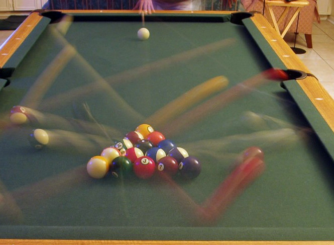

# Serial streak sampling {#resolution}

On the one hand, most theorists have included parallel position updating in their models. This seems to fit the data from MOT experiments with relatively-unconstrained object trajectories quite well - although few have compared the performance of their model with a serial model, so it is hard to know how diagnostic the modeled data are. On the other hand, the data from circular trajectories is hard to explain without positing that serial updating of position dominates. The accounts offered of this dichotomy seem unsatisfactory. However, there is an additional source of information that could assist tracking, one that would disabled by non-circular trajectories.

<!--Accounting for tracking entirely with serial sampling has not been successful with low-overlap trajectories [@liModelMultipleIdentity2019], although early efforts were based on the likely-false assumption that attention shift times increase with shift distance [@pylyshynTrackingMultipleIndependent1988; @yantisMultielementVisualTracking1992], so more attempts should be made.-->

Long after most researchers considered the idea of serial updating of position to be disproven, Srimant Tripathy and his collaborators made a new case for the idea in a book chapter in 2011 [@tripathyMultipleObjectTrackingSerial2011]. Previous researchers had concluded that serial switching of attention would have to occur implausibly rapidly to account for tracking performance [@pylyshynTrackingMultipleIndependent1988; @yantisMultielementVisualTracking1992; @oksamaMultipleObjectTracking2004]. @tripathyMultipleObjectTrackingSerial2011, however, pointed out that the demands on attention switching would be much less if the tracking process had the benefit of sensory memory traces left by the moving objects, also known as "motion streaks". Motion streaks may be familiar from turning on a fan and watching it spin faster and faster until its blades blur perceptually into a complete circle - and in the photograph below, one sees the motion streaks created by a London bus, when photographed with a 200 ms exposure, which is likely comparable to the interval of motion streaks in our visual system.

(ref:Bus) [CC BY-SA 2.0](https://creativecommons.org/licenses/by-sa/2.0/deed.en)  <!--This is how you create figure caption with hyperlink-->

```{r busMotionBlur, echo=FALSE, out.width="80%", fig.cap="A London bus, photographed with a 200 ms exposure, by EO1. (ref:Bus)"}

```

At speeds like those used in MOT experiments, the moving objects leave trails of persisting activation in the visual cortex [e.g. @apthorpDirectEvidenceEncoding2013]. Consider how the correspondence problem could be solved if the tracking process has access to these motion streaks, c. Rather than having access to only the most recently-registered position of each object, it would also "see" a short trail behind each object. If the rate of position sampling were frequent relative to the duration of visual persistence, then the motion streak would actually connect the last-registered position of an object with the current position sample. In most conditions, this should allow the tracker to avoid many of the confusions between targets and distractors that would otherwise occur. Recall from our explanation of the correspondence problem (\@ref(beyondLocation)) that when only discrete positions are sampled, a distractor will be the closest object in the current sample to a target in the previous sample, causing the distractor to be mistakenly taken to be the target.

When motion streaks can be used, either the streak will literally connect the new sample to the old sample, or if the sampling happens less frequently relative to the targets' speed, if the object hasn't changed direction than the streaks will typically be collinear, whereas the distractors' streaks will be positioned and oriented differently. The major exception to this would be when the target shared its trajectory with distractors, such as in the experiments of @holcombeSplittingAttentionReduces2013. 

(ref:Billiards) The motion streaks created by billiard balls in a long exposure of the ball break. [Public domain](https://commons.wikimedia.org/wiki/File:8_ball_break_time_lapse.jpg)  <!--This is how you create figure caption with hyperlink-->

```{r billiardsBlur, echo=FALSE, out.width="80%", fig.cap="(ref:Billiards)"}

```

Step by step, here's how the motion streaks serial sampler could work, in an MOT experiment where the targets and distractors occupy different trajectories. When the sampler visits the last-known position of a target, that position may now be the site of the trailing end of the motion streak, which connects this last-known position of the target to its present position. The tracker can thus follow the streak to arrive at the new target position. The most up-to-date end of the streak is the one with the highest contrast (because it has had the least time to decay).  If it has been so long since the sampler visited this target that there is no longer any activation at the last-visited location, there will typically be only a small gap between that location and the trailing end of the target's current streak. The size of that gap will be the distance traveled by the object in the time between samples minus the duration of sensory persistence.

When, as in the @holcombeSplittingAttentionReduces2013 experiments, the target moves about a trajectory that is shared by several distractors, the streaks will be much less helpful. When the serial sampler returns to the last known location of a target, if it does not return before the trailing distractor reaches that location, a new streak will be there, that of the distractor. Thus, this account predicts that in the trajectory-sharing displays, tracking will only succeed if the time between object visits to a location is longer than the time between samples. That is, success at tracking is now limited by serial switching time. This nicely converges with theorists' predilection for proposing a different mechanism for trajectory-sharing displays, even if they have had the wrong idea for why such displays bear the signature of serial switching.

One might be skeptical that motion streaks are available to visual processes such as tracking - after all, we don't usually perceive motion streaks when objects are moving at reasonable speeds. But there is good evidence that motion streaks do affect visual processing. Psychophysical studies have found evidence for perceptual adaptation to the streaks left by moving objects, and also that these streaks mask the visibility of static objects. It has been estimated that these streaks span about 100 ms of a moving object's trajectory, and there is also plenty of physiological evidence for them - see @apthorpSpatialTuningMotion2011 for references. Moreover, recent evidence suggests that the elongated motion streaks created by saccades are used to solve the across-saccade object correspondence problem [@schweitzerIntrasaccadicMotionStreaks2020; @schweitzerIntrasaccadicMotionStreaks2021]. As for why we don't see motion streaks in many viewing conditions, this is not fully understood, but nearby objects appear to actively suppress their visibility [for a review, see @bedellPerceptionMotionSmear2010]. 

Tripathy's group conducted a number of studies to investigate the possibility that motion streak information is available. This largely took the form of varying delays between stimulus presentation and cues, showing that participants could report motion direction and detect trajectory changes fairly precisely immediately after objects offset, but that this ability decayed very quickly with time [@narasimhanLossPositionalInformation2009; @shoonerHighcapacityTransientRetention2010]. The rapid decay was consistent with the time-course  of the dissipation of sensory activation, as evident in studies of iconic memory.

In the previous chapter (\@ref(serialOrParallel)), when we inferred what the interval between samples needed to successfully track with the circular trajectory displays, we were not considering streaks, so we used the conventional nearest-neighbor interpretation of motion ambiguity, which implies that sampling must occur more frequently than the time it takes for a distractor to move halfway to a former target location [@holcombeIllusoryMotionReversal2005]. But motion streaks connect the last-sampled target position to its new position, up until the distractor moves so far that it actually touches the former target location. This is simply the temporal frequency of the stimulus. For example, for the case of three targets where a temporal limit of less than 3 Hz is observed [@holcombeSplittingAttentionReduces2013; @roudaiaDifferentEffectsAging2017], we had estimated that samples must occur at least every 167 ms, but motion streaks mean that in principle, the samples need only occur every 332 milliseconds. However, a sizeable gap may be needed to resolve the difference between the front of the motion streak created by the distractor and the trailing end of the motion streak created by the target, so sampling more frequently may be necessary.

## Taking stock

When Srimant Tripathy suggested the serial sampling of motion streaks idea, we had not yet discovered the decline with load of tracking's temporal limit. At the time, I did not fully understand Srimant's account, and did not appreciate that the account both predicts this sort of result and also predicts that a quite different result should be found with trajectories that do not highly overlap. It was only when grappling with the suggestion of  @lovettSelectionEnablesEnhancement2019 that when distractors and target share trajectories, tracking becomes more serial, that the connection to motion streaks became clear to me. The notion of serial position sampling in tracking converges with the ascendance of evidence for serial sampling in other behavioral and neuroscientific paradigms, and presents a strong prospect for resolving the serial-parallel debate.

The use of motion streaks provides a similar benefit as the use of velocity as a feature for correspondence matching, and studies that investigated the possible use of velocity do not seem to have been designed to discriminate between the use of velocity and the use of motion streaks (e.g., @wangRoleKinematicProperties2021). One difference is that streaks might provide information only about the orientation of an object's trajectory but not which of the two directions along that orientation the object is moving in. <!-- i bet Geisler or somebody checked this --> If so, one result should be that participants should more frequently err in the opposite direction that a target is moving than in other directions. It does not appear that studies that collected participants' awareness of direction information checked for this [e.g. @shoonerHighcapacityTransientRetention2010; @horowitzDirectionInformationMultiple2010].
<!--FUTURE -->
<!--FUTURE Motion streaks might also be erased by dynamic noise - if so, the advantage of non-overlapping trajectories, if there is one, could be eliminated by dynamic noise TELL JIRI -->

<!--
The circular trajectories that were used to reveal the temporal limits on tracking and the less-constrained trajectories of typical MOT experiments differ in one way that we have not yet discussed. This arises from the fact that the objects in typical MOT experiments do not share their trajectory with other objects. Srimant Tripathy and his collaborators have suggested that a moving object leaves an extended trace that lingers in sensory memory and that tracking processes operate on that representation rather than objects' instantaneous positions  [@tripathyMultipleObjectTrackingSerial2011; @howardMultipleTrajectoryTracking2012]. If so, targets and distractors can be disambiguated as a result of their differing motion directions (which manifests as different orientations of the sensory memories) in addition to their positions. This could mean that temporal interference is less of a factor in typical MOT displays. However, the evidence is that motion direction information is not used much when there are more than two targets, as reviewed in the next section ( \@ref(beyondLocation)), which casts some doubt on Tripathy's suggestion.-->

<!--The parallel location updating element of their theory can be saved, however, by positing that trajectory information is available to a parallel process thanks to motion traces in sensory memory, as we will see in section \@ref(beyondLocation). That process would indeed be hampered by objects sharing a trajectory, on the assumption that trajectories are used not for extrapolation, but for solving the correspondence problem.-->

