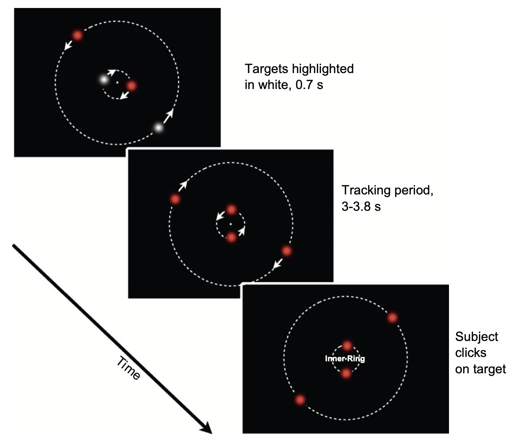

# Which aspect(s) of tracking determine performance?

Why do people perform more poorly with more targets? The processes involved must be, by definition, capacity-limited in that they do worse with more targets. But what aspect of the tracking task does lack of capacity cause them to suffer from more?

Below is a list of candidate reasons for the factors that impair performance more when there are more targets:
In a typical MOT task, any of the below are candidates for being one of the reasons, or the main reason, that performance declines with number of targets:

1. General cognition
1. Duration that one can sustain attention
1. Spatial selection of multiple locations, even static ones
1. Spatial interference
1. Temporal interference
1. Speed limit of attention-following

## C=1 processes

In introducing the concept of a bottleneck or capacity limit in the previous section, I used the example of math problems. Using our capacity for reasoning and symbol manipulation, we can perform a wide array of arbitrary tasks. We therefore should not be surprised by our ability to track a *single* target. We know that we have a visual system that makes the position and direction of motion of objects on our retina available to cognition, and that using our ability to think about where an object is going and deliberately move our attention to a future anticipated location, we might muddle through tracking a single object. For purposes of illustration, let us call the processes involved "C=1 processes" to reflect the possibility that some cognitive processes involved have a capacity of only one object.

What makes MOT interesting to many is that we can track more than one target. This implicates the involvement of another, higher-capacity sort of processing. The contribution to MOT of two kinds of processing, with different capacity limits, complicates the interpretation of MOT results. Even when participants are asked to track several targets, one can expect that C=1 processes are contributing to overall performance, even if they are only involved in the processing of one of the targets.

Thus, when researchers contrast tracking performance with different numbers of targets, one reason for the decline in performance may be that C=1 processes are, in each condition, processing only a single target, so performance declines in inverse proportion to the number of targets.

<!-- Unfortunately, researchers frequently neglect the fact that two sorts of mental abilities likely contribute to MOT performance: one or some limited in capacity to just a single target, and others with a greater processing capacity.  -->

## Duration that one can sustain attention

Tracking may be, in part, a test of how long one can sustain attention. There also is some possibility that additional demands on attention (more targets) reducing the average amount of time one can sustain attention without a lapse. The results of @wolfeMultipleObjectJuggling2007, suggest that this need not be the case. In their Experiment 3, participants were required to track four targets for a period of ten minutes. Every 9 seconds or so, one object was highlighted and participants had to indicate whether it was one of the targets. In a no-feedback condition, participants were not told whether their individual responses were correct. In that situation, performance was substantially worse in the last few minutes of the trial than in the first few minutes (78% correct vs. 65% correct). However, in the feedback condition wherein participants were told immediately after each judgment whether they were correct, performance did not appear to decline over time. These results suggest that if participants are adequately motivated by feedback, they have considerable ability to track for several minutes with no appreciable loss. The comparison between the feedback and no-feedback conditions is not perfect as the feedback does provide a cue that can increase performance (when participants get the probe wrong, they can increase subsequent performance somewhat by switching to another target), but this confound does not seem to be able to explain the lack of almost any performance loss in the feedback condition.

The circumstances used by @wolfeMultipleObjectJuggling2007 were quite different from a prototypical MOT task, not least because of the extended durations of the trials. Most researchers use trial durations of less than 10 seconds, and it is not clear whether the @wolfeMultipleObjectJuggling2007 results would generalize. It seems likely that participants can attend for several seconds without losing much motivation, but @oksamaMultipleObjectTracking2004 found a substantial decrease in performance for trials of 13 s compared to trials of 5 s. With four targets, for example, performance fell from 91% correct to 74% correct, and this decrease was somewhat greater for larger numbers of targets than for fewer targets. Byrne & Holcombe (unpublished data) did not find any significant decrease over a comparable interval, and the explanation for these discrepancies is uncertain, although it may again be related to participants' motivation.

The reason for the reduction in performance with greater time observed by @oksamaMultipleObjectTracking2004 may easily be due to another factor rather than an increase in lapses of attention. In the MOT tasks used by all of these researchers, with longer trials there is likely to be more instances of potential spatial interference, temporal interference, and running afoul of any attentional speed limit. Thus, if any of those factors matter, they could explain the decrease in performance with time. However, the @wolfeMultipleObjectJuggling2007 does seem to provide a kind of existence proof that lapses of attention need not be the limiting factor. Granting that that may be the case, an additional question is why, if other factors are in operation, there was *no* evidence of a performance decrease over time in @wolfeMultipleObjectJuggling2007? Well, @wolfeMultipleObjectJuggling2007 averaged performance over approximately the first third of the ten-minute interval and compared it to the last third. In the feedback condition, it is possible that all the worst possible events (such as close approaches, causing greater spatial interference) had already occurred by the end of the first third, so whatever level of performance participants were left with at that point already reflected their capacity to track through the most difficult events, which they were then able to continue to do until the end of the trial. Over a shorter time range such as that used by @oksamaMultipleObjectTracking2004, this may not have been the case.
 
## Spatial selection of multiple locations

At the beginning of an MOT task, featural attention is typically used to select the target objects, as they are typically highlighted with a different color or by flicker. Both @drewNeuralMeasuresIndividual2008 and @franconeriHowManyLocations2007 found evidence that this was not as demanding as the motion phase of the tracking task. However, the selection phase may still be demanding enough to result in incorrect responses on many trials, and thus affect overall performance, and do so to a greater extent when there are more targets. 
In the experiments by @franconeriHowManyLocations2007, participants two concentric circular arrays of dots centered on fixation. Between one and eight of these dots were briefly highlighted, and then each dot was replaced by either a small horizontal or a small vertical bar. The participants' task was to search for a vertical bar, but to confine their search to only the previously-cued locations. They pressed one key if a vertical bar was present among the cued locations, and another key if none of those locations contained a vertical bar.

In a relatively easy condition (a sparse condition with only 12 locations), average performance dropped from 98% for two cued locations to 91% for six locations. Such a small decrease suggests that if this result were to generalize to typical MOT displays, the selection phase would contribute only a small portion of the performance decrease with greater set sizes. MOT displays typically do only have 12 or fewer objects. However, they frequently are much closer to each other than the spacing that @franconeriHowManyLocations2007 used in their sparse condition. In the denser conditions tested by @franconeriHowManyLocations2007, performance again started at a very high level for two cued locations, but dropped much more, to 74% correct or less for six cued locations.

The initial selection demands in a typical MOT task are likely less taxing than in these experiments, because participants need only maintain their attention on the objects, not search through them. However, it is not clear how much less demanding maintained attention is, so we still do not know how much of the target-number effect in typical MOT displays is due to failures at the very beginning of a trial. The density effect observed by @franconeriHowManyLocations2007 suggests a role for spatial interference in typical MOT experiment, which is the factor we turn to next. 

## Spatial interference

Long before @franconeriHowManyLocations2007 conducted experiments on the selection of multiple locations with different densities, researchers had recognized the existence of spatial interference in dense displays [@wolfordPerturbationModelLetter1975; @korteUberGestaltauffassungIm1923; @strasburgerDancingLettersTicks2014].

```{r, echo=FALSE, fig.cap = ""}
DiagrammeR::grViz("digraph {

graph [layout = dot, rankdir = LR]

# define the global styles of the nodes. We can override these in box if we wish
node [shape = rectangle, style = filled, color=White, fillcolor = White, fontsize = 40]

a [label = 'O']
fixation [label =  '', shape=circle, fillcolor=Black, width=.2, height=.2]
b [label = ' ']
c [label = ' ']
d [label = 'J']
e [label = ' ']
e2 [label = ' ']
e3 [label = 'S']

f [label = 'O']
g [label = 'R']
h [label = 'L']
i [label = 'H']
j [label = 'Y']
k [label = 'M']
l [label = 'S']

# edge definitions with the node IDs
edge [label='', penwidth=0, arrowsize=0]
a  -> b;
edge [label='', penwidth=0, arrowsize=0]
b -> c
edge [label='', penwidth=0, arrowsize=0]
c -> d
edge [label='', penwidth=0, arrowsize=0]
d -> e
edge [label='', penwidth=0, arrowsize=0]
e -> e2
edge [label='', penwidth=0, arrowsize=0]
e2 -> e3
edge [label='', penwidth=0, arrowsize=0]
e3 -> fixation

edge [label='', penwidth=0, arrowsize=0]
fixation -> f
edge [label='', penwidth=0, arrowsize=0]
f -> g
edge [label='', penwidth=0, arrowsize=0]
g -> h
edge [label='', penwidth=0, arrowsize=0]
h -> i
edge [label='', penwidth=0, arrowsize=0]
i -> j
edge [label='', penwidth=0, arrowsize=0]
j -> k
edge [label='', penwidth=0, arrowsize=0]
k -> l
}")
```

If you gaze at the central dot in the above display, you likely will be able to perceive the middle letter to the left fairly easily (it is a 'J'). However, if you again keep your eyes fixed on the central dot, but this time try to perceive the central letter to the right, it should be much more difficult. This is called "crowding".

Crowding refers to the spatial impairment of visual processing caused by stimuli that are near a target stimulus. It has been studied extensively in experiments that typically ask a participant to identify a single, motionless, briefly-presented stimulus such as a letter. Those studies have shown that crowding can be avoided if the flanking stimuli are presented sufficiently far away from a target. That distance varies depending on the display spatial arrangement and on the person, but on average extends to about half the eccentricity of the target, with the interference diminishing rapidly as separation increases beyond that [@boumaInteractionEffectsParafoveal1970a; @gurnseyCrowdingSizeEccentricity2011]. For example, in the display above, the letters on the same side as the 'J' are separated from it by more than half the 'J's distance from the fixation point, so they have little to no effect on its identification.

The psychophysical literature on crowding uses almost exclusively 
In  However, crowding also can prevent attentional selection from individuating a target. [@intriligatorSpatialResolutionVisual2001]


The overwhelming majority of MOT papers use trajectories for which targets frequently come within the crowding distance of another target or distractor. As a result, crowding likely contributes to tracking performance. In addition, crowding appears to be subject to substantial individual differences [@petrovAsymmetriesIdiosyncraticHot2011], including larger crowding zones in a subpopulation of persons with dyslexia @jooOptimizingTextIndividual2018, so it likely also explains some of the variation in tracking performance between people.

@franconeriTrackingMultipleObjects2010a claimed that spatial interference is the *only* reason why performance is worse when more targets are to be tracked, denying any role for speed, time, or any non-spatial form of processing capacity. Moreover, @franconeriTrackingMultipleObjects2010a implied that this interference extends over a much greater distance than the crowding range documented in the psychophysics literature. HOWEVER, @franconeriTrackingMultipleObjects2010a did not succeed in isolating the distance between objects, and careful parametric variation of separation has found evidence for tracking interference only within the crowding range [@holcombeObjectTrackingAbsence2014; @holcombeExhaustingAttentionalTracking2012].

However, what remains under-studied is whether, or by how much, the crowding range increases with the number of objects that should be monitored. @holcombeObjectTrackingAbsence2014 compared one targets to two but 

## Temporal interference

Temporal interference is analogous to spatial interference, just in time rather than in space. Spatial interference refers to a processing impairment when one object comes closer than a certain spatial distance to a second object, at one time. In contrast, temporal interference refers to when an object comes closer than a certain temporal distance of another, at one point in space.

The objects in typical MOT displays often travel over locations formerly occupied by another moving object. That is, after one object passes over a location, another will pass over the same location, some amount of time later. If temporal interference is a factor in object tracking, then if the amount of time that separates the two objects occupying a location is short enough, tracking will be impaired.

If objects are moving fast enough, they are perceived to blur together, because some parts of the visual system integrate over several dozen milliseconds [e.g., @hogbenPerceptualIntegrationPerceptual1974]. A more interesting question is whether temporal interference occurs on a longer timescale, more relevant to the speeds and spacings typically used in MOT tasks.

## Speed limit of attention-following


## Resources?


However, this sort of interference may be closer to the answer for why we are limited in the number of objects we can keep in mind. Hundreds of studies over the past few decades have had people briefly view an array of stationary objects, and then try to recall them a few seconds later. The data may be best explained by the limited number of neurons available to represent the objects [@schneegansStochasticSamplingProvides2020]. The early cortical areas that encode the sensory signals from visual objects may play a key role in short-term memory for visual features [@christophelDistributedNatureWorking2017]. Recent models of short-term memory, then, assume that the features of each object are represented by populations of neurons that are tuned to that feature. For example, if the array comprises a red object, a green object, and a  blue object...

Recent results by Strong & Alvarez (2019) have further validated the resource theory


Why is it that we are so limited in how many objects we can track and how many locations or objects we can keep in mind? That is, what is it that makes tracking hard? It seems to be something about the movement of the objects, because people have little difficulty remembering the locations of X objects or more in a static array [@franconeriHowManyLocations2007].

A central bottleneck needn't be the only issue, or even the main one. An important factor is the way the visual cortex is organized. Much of visual processing is done by neurons devoted to individual regions of the visual field, arranged like a map, with neighboring regions represented by neurons that are next to each other. In at least some circumstances, neighboring clusters of neurons inhibit each other. We will refer to the interference triggered by neighboring objects as spatial interference.

Steven Franconeri and colleagues made the bold proposal that spatial interference is essentially the *only* thing keeping us from the ability to track an unlimited nunber of targets [@franconeriTrackingMultipleObjects2010; @franconeriFlexibleCognitiveResources2013].


Crowding is quite noticeable in the following display. 

As the demonstration illustrates, crowding seems to affect perception of the qualities of an object much more than the ability to simply see that it is there. But in typical laboratory object tracking tasks, one doesn't need to perceive anything in particular about a target, just that it's _there_. According to Pelli's 

Thus in tracking, the part played by the spatial interference evident in crowding displays was not obvious. Moreover, crowding has a definite spatial range - beyond a certain distance, interference does not occur.

But @franconeriTrackingMultipleObjects2010 suggested that a wider spatilal range form of interference afflicted people when tracking multiple objects. My PhD student Wei-Ying Chen and I set up a controlled experiment to investigate whether people were limited in tracking [@holcombeExhaustingAttentionalTracking2012]. Previous tracking experiments had all involved objects that were not very far apart from each other, making it plausible that objects did not stay farther from each other than the putative critical distance. The theory, then, was that if targets were placed far enough from each other, people could track two targets just as well as they could track one. Wei-Ying Chen and I tested this by asking participants to track targets placed as far apart as we could place them. One target moved along an outer ring, and the other moved along a small inner ring.

{width=50%}

Each was accompanied by a distractor moving along the same trajectory but placed as far as possible from the target...


Interference among neighboring neural populations in spatiotopic maps does not seem to be the answer, then, to why we can track only a few fast-moving objects. But the nature of the tracking bottleneck is still far from clear.

In the area of visual working memory, recent work has had success with the proposition that processing capacity reflects the flexible use of a limited population of neurons...

Abilities, dual-task interference, and individual differences are discussed in a later chapter 
