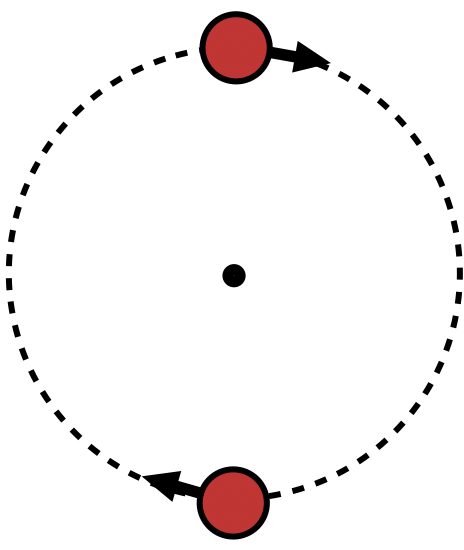

# Serial processing, parallel processing, or both? {#serialOrParallel}

Brains are massively parallel. This should encourage skepticism that a given mental ability involves processing in series, one-by-one. We have established that tracking is highly capacity-limited, in that in certain conditions, performance drops steeply with target load.

This need not imply serial processing, a capacity of one. Of the processes that underlie tracking, even those with the smallest capacity might still process the objects in small sets, but sets of greater than one.

<!--One can certainly walk and chew gum at the same time, and even simultaneously use one hand to rub one's belly and the other to tap one's head, although it may take a bit of practice for some of us. However, when it comes to making a keypress based on the identity of a visual stimulus with one hand and based on the identity of a sound with the other hand, the evidence suggests that one particular component of these two tasks simply cannot be done simultaneously @pashlerDualtaskInterferenceSimple1994. Specifically, the pattern of response times indicates that while a choice is being made in response to the visual stimulus, choice processing for the auditory stimulus cannot commence.-->

Whether the processes that underlie MOT occur entirely in parallel has been one of the chief concerns of researchers since the very first paper on the topic [@pylyshynTrackingMultipleIndependent1988] .

A serial account of tracking is that a process must switch from target to target to update targets' positions, one-by-one. With very simple assumptions, this account makes a specific prediction for the temporal limits on tracking.

After one object is sampled, it continues moving and if its position is not re-sampled before another object takes its place, it will be lost. This assumes that its motion direction and speed are not reliable guides to its future positions, or that motion direction and speed will not be used. The evidence on this is discussed in section \@ref(beyondLocation), but for now note that this would ameliorate the effect, reducing the size of the effects predicted by the serial account.
 
For the circular trajectories used by @holcombeSplittingAttentionReduces2013, the product of the speed and number of objects determines how often sampling must be done to avoid losing a target. In an MOT trial with two targets, after one target is sampled, the serial process switches to the other target. If the distractor trailing the target arrives near the first target's former location before the serial process switches back, then we can expect tracking to fail.

This account predicts a linear relationship between the number of targets and the temporal limit on tracking.

<!--
If one object is sampled every 100 ms, then if it is replaced every 200ms, you have 100% ambiguity in the correspondence problem. So to get sampling time from temporal limit, divide by 2. HolcombeChen & RoudaiaFaubert observed about 140 ms for young men, meaning 70 ms.
-->

```{r, echo=FALSE, fig.cap="The results of the two experiments of Holcombe & Chen (2013) plotted with the comparable sample (young people) of Roudaia & Faubert (2017)."}
library(ggplot2)
library(dplyr)
library(tidyr)
library(purrr)
library(forcats) #for fct_relevel

E1HolcombeChen13 <- tibble(experiment="Holcombe & Chen E1", targets=seq(1,2),   temporalLimit= c(1000/6.93, 1000/4.45) )
E2HolcombeChen13 <- tibble(experiment="Holcombe & Chen E2", targets=seq(2,3),   temporalLimit= c(1000/4.05, 1000/2.7) )
RoudaiaFaubert<- tibble(experiment="Roudaia & Faubert young men", targets=seq(1,3), temporalLimit=c(1000/6.4,1000/4,1000/2.8))
RoudaiaFaubert2<- tibble(experiment="Roudaia & Faubert young women", targets=seq(1,3), temporalLimit=c(1000/4.9,1000/3,1000/1.8))

temporalLimitsData<- rbind(E1HolcombeChen13,E2HolcombeChen13,RoudaiaFaubert,RoudaiaFaubert2)
temporalLimitsData$experiment <- as.factor(temporalLimitsData$experiment)

#criticalIntervalsObserved <- tibble( targets=seq(1,3), temporalLimit= c(1000/7, 1000/4.2, 1000/2.6) )

critInterval <- function(targets, samplingInterval) {
 samplingInterval*targets*2
}

valuesForComputing<- expand_grid(
  targets = c(1, 2, 2.4, 3, 4), # including 2.4 because that's where I want to put the text labels
  samplingInterval = c(50, 70, 90),
  experiment = "zpredicted" #when it starts with z, it will be at end in legend when ggplot creates factor ordering on fly
)
tibl <- valuesForComputing  %>% mutate(temporalLimit = critInterval(targets,samplingInterval))

predictions <- tibl %>% filter(targets != 2.4) #to plot lines


# angle = c(30,50,60),

#male/female samples https://github.com/kmiddleton/rexamples/blob/master/ggplot2%20male-female%20symbols.R
#unicode character list (look at ) https://www.ssec.wisc.edu/~tomw/java/unicode.html
gg<-ggplot(temporalLimitsData, aes(x=targets,y=temporalLimit, shape=experiment)) +
    geom_point(position=position_dodge(width=.2), size=5) +
    geom_line(data=predictions, aes(color=factor(samplingInterval)) ) + #model predictions
    #geom_point( size=4) +
    #geom_line() +
    scale_shape_manual(values = c("\u25A1", "\u25CB", "\u2642", "\u2640",   "\u1111")) +
    scale_x_continuous(breaks=1:3, limits=c(1,4)) + #so that model lines extend all the way to symbols
    ylim(0,NA) +
    ylab('temporal limit (ms)') + labs(color='sampling interval (ms)', shape='study') + 
    theme_bw() +
   theme( panel.grid.major = element_blank(), panel.grid.minor = element_blank(),
          panel.background = element_blank())

ylims<- layer_scales(gg)$y$get_limits()
xlims<- layer_scales(gg)$x$get_limits()
graphAspectRatio <- diff(ylims)/diff(xlims)
  
lineLabels <-  tibl %>% filter(targets == 2.4)
lineLabels$label <- paste0(lineLabels$samplingInterval," ms")
lineLabels<- lineLabels %>% mutate(slop = samplingInterval * 2)
lineLabels<- lineLabels %>% mutate(slope = slop / graphAspectRatio)
lineLabels<- lineLabels %>% mutate(angleIfAxesSameScale = atan(slope)*180/pi)
lineLabels<- lineLabels %>% mutate(angle = angleIfAxesSameScale)

gg +  geom_text(data=lineLabels, aes(label = label, angle=angle), vjust="bottom")

```

Cite Carlson vanRullen

. After one object is sampled, it continues moving and if it 

something needs to process targets individually, most likey to update their positions. Tracking, then, involves a process that switches between all the targets to update their positions one-by-one.

The serial processing account makes a quantitative prediction specifically

<!--whether any constituent process is limited to one-by-one processing...-->

As described in the temporal limits section (\ref(speedAndTime)), the temporal limit on tracking declines precipitously with target load. The serial processing account makes a quantitative prediction specifically

Little and Howe

Unitary focus of attention in VWM, according to Oberauer, which would help explain the inter-individual correlation with WM performance. 

Hybrid serial-parallel Bello model.
It's possible that tracking greater than the subitizing range requires significant VWM. Franconeri showed you often are wrong about how many targets.

<!-- If there's 2 targets and attention is  samplimg one every 50 ms, then each is sampled every 100 ms, so to solve the correspondence problem they need to go at 5 Hz (200 ms) or slower, so that they only move halfway to the next location. For 3 targets, each is sampled every 150 ms so they need to not get to the next one's location for 300 ms (3.33) hertz.
criticalTemporalInterval = samplingTime*targets*2
385 = samplingTime*3*2; samplingTime = 64
64*2*2= 256 against 238.
blinking spotlight means 64*1*2 = 128 against 143.
-->


At very low speeds/temporal frequencies, participants have no problem tracking two or even three targets, consistently achieving performance levels above 95% (as seen in Figure 3). This implies that the performance versus resource function is different (shallower) for low speeds. Going from 100% resource (one target) to 50% (two targets) or 33% (three targets) yields little impairment. The reason may be that in this regime of low speeds, even if participants fail to move their tracking focus with the targets for an extended interval (a few hundred milliseconds), they can still recover the targets by finding the objects closest to the positions they last registered. Only at limiting temporal frequen- cies or speeds is there a consequence to having noisy (parallel tracking models, see General discussion) or intermittent (serial tracking models) position updating.

Circular trajectories - explain that it’s the only way to get up to those speeds

What makes a tracking task hard for a person, or even impossible? 

 tracking task that resembles the shell games used by conjurers to confound audiences. A magician might cover an object with one of three identical shells and shuffle the shells back and forth while the audience tries to keep their attention on the critical shell.
 
Let's return to the classic shell game. In a shell game, an item is placed beneath one of three identical shells, making that shell the target. The viewer tries to keep track of which shell has the item underneath it. 

{width=50%} 

A crucial aspect of the game is that the shells exchange locations with distractors. Thus, remembering the original location of the item is not sufficient. Neither is it sufficient to extrapolate a new position for the target based on the item's first direction of motion. Remembering its relative location in the array (e.g., the "middle one") is also not enough. One really must update one's representation of the target's position, rather than relying on any of the above.

The simple reduced laboratory version of the shell game is illustrated by the following schematic.

{width=10%}

The updating of target position could fail for any of a few different reasons. A target might move too quickly for attention to move with it. That is, there may be a speed limit beyond which object position is not appropriately updated. Under serial switching accounts, this speed limit might occur if between successive samples, the object moved further than a critical distance between samples. Under parallel theories, the tracking process may simply have a speed limit. If the speed of the tracking process is resource-intensive, this speed limit may be slower when more targets are to be tracked.
-->

The limits on tracking are not as simple as a speed limit like we have on the highway. To understand why, we need to start from first principles. In particular we need to consider when attentional tracking is actually needed to do well in a task. If one's target for attention moves only a little bit, tracking probably won't be needed.

When is attentional tracking actually needed to perform well in a tracking task? Motion of the target may not be enough. If  targets do not come close to other objects, then one may only need to remember their original location and direction of motion to quickly find them again.
