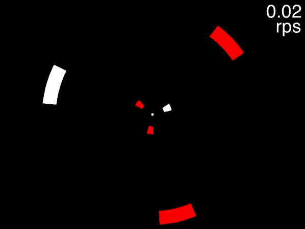
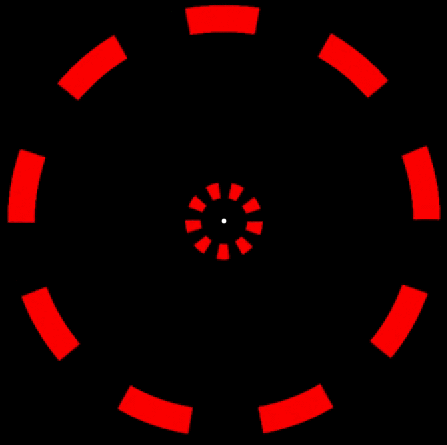

# Speed and time

If the objects of an MOT display are moved faster and faster, eventually one can no longer track the targets. At very high speeds this is not surprising, as then one will run afoul of basic perceptual limits. As we will see, however, tracking falters at far lower speeds than expected from studies of motion perception. In addition, the maximum speed at which one can track is lower when there are more targets CITATION. Apparently, the more resource one can allocate to a target, the faster one can track it.

What does this imply for how our brains manage to covertly track moving targets? To get to some possible answers, the full consequences of increasing the speed of the objects in an MOT display must first be understood.

In a standard MOT display, the targets and distractors travel all over the screen, occasionally coming very close to each other or even, in some experiments, touching each other or passing through each other. As discussed in section \@ref(spatialInterference), close encounters sometimes result in the loss of a target. That is relevant here because typically when MOT researchers test at multiple object speeds, they keep trial duration constant, so that the objects travel farther during the higher-speed trials. As a result, the objects have more close encounters, so the reason for poorer performance could simply be due to that.

A first step to understanding the effect of speed, then, was to investigate it without the contaminating effect of an increase in close passes. The results showed that even with the objects kept far apart from each other, speed thresholds were still far below the limits on motion perception. Additionally, speed thresholds continued to be resource-intensive<!--resource-limited-->: the more targets that were tracked, the slower the speed thresholds. Does this show that speed is really what reduces tracking performance? Unfortunately, in the above-reviewed experiments, there is another variable that is affected by speed that wasn't controlled for.

## Temporal limits

Close encounters in space aren't the only things that increase with speed in a typical MOT trial. Close encounters in *time* do as well. This concept of temporal proximity, as applied to moving objects, is, however, not something that most attention researchers are terribly familiar with.

Temporal proximity is more commonly invoked in the context of un-moving, yet still changing, stimuli. If one flickers a light off and on at a very rapid rate (over about 60 times a second, depending upon display characteristics), the flicker will not be perceived; instead, one perceives the average of the dark and light phases. That is, the individual on-phases of the light cannot be perceived due to their temporal proximity with the off-phases.

The same phenomenon occurs with moving objects, as Ptolemy observed nearly two thousand years ago in his book *Optics*. After observing a rapidly rotating potter's wheel, he noted that "If spots of a color different from that of the disc are marked on it, they will appear to form circles of the same color [as the given spot] when the disc is rapidly spun." [@smithPtolemyTheoryVisual1996]. 

### High-level temporal limits

The processing that limits flicker perception, and simple aspects of motion perception, has higher temporal limits than those that limit visual cognition.

```{r, echo=FALSE, out.width="30%", fig.cap="Task: judge whether the red color is paired with leftward tilt or rightward title."}
if(knitr::is_html_output()) knitr::include_graphics("movies/binding/colorgrdnt2_9fps.gif") else knitr::include_graphics("movies/binding/colorgrdnt2_2fpsStatic.png")
```

In the above display, one can easily perceive that the color is alternating between green and red, and that the contour on the left is alternating rapidly between leftward tilt and rightward tilt. What is very difficult or impossible, however, is judging what color, red or green, is presented at the same time as the leftward tilt [@holcombeEarlyBindingFeature2001]. When the animation is slowed to a rate much slower than about 200 ms per stimulus presentation however, the task becomes quite easy.  

```{r, echo=FALSE, out.width="30%", fig.cap="Task: judge whether the red color is paired with leftward tilt or rightward title."}
if(knitr::is_html_output()) knitr::include_graphics("movies/binding/colorgrdnt2_2fpsCONVERTED.gif") else knitr::include_graphics("movies/binding/colorgrdnt2_2fpsStatic.png")
```

Thus, while early visual processing can deliver motion and color features even from stimuli that are temporally very close to each other, the processing required to judge which features are at the same time requires processing that fails when temporal proximity is very high [@holcombeSeeingSlowSeeing2009; @fujisakiCommonPerceptualTemporal2010b].

In an MOT display, as an object moves on from a particular location, that location will sometimes be occupied soon after by another of the moving objects. Unfortunately the processing of the first object at that location may not be completed before the second object replaces it.

The inter-object intervals at a location will be long at slow object speeds and with wide spacing among objects. At high object speeds, however, these intervals can be short even if objects are widely spaced. @verstratenLimitsAttentiveTracking2000 found evidence that people then become unable to covertly track even a single target. @verstratenLimitsAttentiveTracking2000 used a circular sine-wave grating presented in an annulus. Participants fixated in the center and attempted to covertly track one light bar of the grating that was cued at the beginning of the trial. The experiment found evidence that the participants could not track accurately when the time between successive light bars of the grating was shorter than about 150 milliseconds (for the three participants tested, this figure varied from about 150 ms to about 238 ms).

@holcombeSplittingAttentionReduces2013 found a similar result (for 6 participants, a mean of 150 ms) using a circular array of discs rather than a grating. But how did they (and @verstratenLimitsAttentiveTracking2000) establish that this was caused by temporal interference rather than spatial interference or a speed limit? They capitalized on the contrasting predictions by these three phenomena when object spacing and speed are both manipulated. @holcombeSplittingAttentionReduces2013, for example, used four different inter-object spacings and many different speeds (speeds were adjusted by a staircase) to assess the speed threshold for each object spacing. If temporal interference affects performance, then a particular pattern of speed thresholds were predicted to emerge.

With the circular array of equally-spaced objects used by @holcombeSplittingAttentionReduces2013, the amount of time between objects traveling over any one location is the inverse of the product of the speed and the number of objects in the array. For example, if there are four objects in the array moving at 1.75 revolutions per second, then an object will cross any given location in the circular trajectory every 140 milliseconds. Therefore, if temporal interference occurs when objects are in a location within 140 milliseconds of each other, the speed threshold for eight objects in an array should be much slower - 0.875 revolutions per second. This is indeed what was found by @holcombeSplittingAttentionReduces2013, for three different objects-per-array conditions.

You can get a taste of this by attempting to first track two targets in the below movie.

```{r, echo=FALSE, out.width="100%", fig.cap="Task: fixate the circle and judge whether the red color is paired with leftward tilt or rightward tilt."}
#Work-around to make GIFs work by avoiding including them in non-html outputs!
#https://stackoverflow.com/questions/64038037/can-i-conditionally-exclude-some-elements-code-blocks-from-rendering-to-the-pd
if(knitr::is_html_output()) knitr::include_url("movies/MOTmovies/temporalLimits/2targets3objectsPerArray.gif") else 
#, height = "250px"
```

When the movie above is at its beginning (when the speed readout at top right indicates 0.02 rps), one object in each of the two rings is drawn in white. These are the targets for you to track while you keep your gaze fixed on the dot in the center. As the speed gradually increases, try to keep tracking and see how fast it goes before you lose the targets.

Many people can track the targets even at the movie's fastest speed of approximately 0.6 rps (the precise speed depends on your computer). This is to be expected, because at 0.6 rps, 3 objects corresponds to a an inter-object interval of 556 milliseconds, far higher than the temporal limit documented by @holcombeSplittingAttentionReduces2013. The situation is quite different, however, for the below movie.

```{r, echo=FALSE, out.width="100%", fig.cap="Task: fixate the circle and judge whether the red color is paired with leftward tilt or rightward tilt."}
#Work-around to make GIFs work by avoiding including them in non-html outputs!
#https://stackoverflow.com/questions/64038037/can-i-conditionally-exclude-some-elements-code-blocks-from-rendering-to-the-pd
if(knitr::is_html_output()) knitr::include_url("movies/MOTmovies/temporalLimits/2targets9objectsPerArray.gif") else 
#, height = "250px"
```

This movie uses the same speeds as the previous one. The only difference is that eight distractors are presented in each array instead of two. In this case people find that as the objects accelerate, very quickly they feel that they can no longer track the objects. Note that this is not due to spatial interference - only when the number of equidistant objects in an array exceeds 13 will spatial interference become significant [@holcombeSplittingAttentionReduces2013, p.11; @toetTwodimensionalShapeSpatial1992; @pelliUncrowdedWindowObject2008].

The figure below summarises what we know about the limits on covertly tracking a single target. 

```{r, echo=FALSE, out.width="100%", fig.cap="Spatial and temporal limits on covertly tracking one object. UPDATE THIS IMAGE WITH BETTER NUMBERS IF REVIEWERS/EDITOR APPROVE OF IT, including starting crowding at 13"}
knitr::include_graphics("imagesForRmd/trackingLimitsMotionLimitSchematic.png")
```

Direction of motion can be perceived to at least 25 Hz [@burrContrastSensitivityHigh1982], which corresponds to much faster speeds, of course, than the ~7 Hz limit on attentive tracking. As we will describe in the "Speed limits" section below, a separate speed limit also constrains tracking, limiting trackable stimuli to those with the characteristics of the pink shaded region. The spatial acuity limit would be far to the right of the crowding limit, so together with the other limits this means that of the spatiotemporal window of visible stimuli, only a small proportion can be tracked.

## Temporal interference is resource-intensive

In adding to the evidence for a temporal limit on tracking, @holcombeSplittingAttentionReduces2013 also found that the temporal limit was markedly worse for higher target loads. The less attentional resource available per target, the lower the temporal limit was. Specifically, the limit was `r round(1000/7)` ms for one target, about `r round(1000/4.2)` ms for two targets, and `r round(1000/2.6)` ms for three targets, and this dramatic effect of target load on temporal limit was replicated by @roudaiaDifferentEffectsAging2017.

```{r, echo=FALSE, fig.cap="The results of the two experiments of Holcombe & Chen (2013) plotted with the comparable sample (young people) of Roudaia & Faubert (2017)."}
library(ggplot2)
library(dplyr)
library(tidyr)
library(purrr)

E1HolcombeChen13 <- tibble(experiment="Holcombe & Chen E1", targets=seq(1,2),   temporalLimit= c(1000/6.93, 1000/4.45) )
E2HolcombeChen13 <- tibble(experiment="Holcombe & Chen E2", targets=seq(2,3),   temporalLimit= c(1000/4.05, 1000/2.7) )
RoudaiaFaubert<- tibble(experiment="Roudaia & Faubert young men", targets=seq(1,3), temporalLimit=c(1000/6.4,1000/4,1000/2.8))
RoudaiaFaubert2<- tibble(experiment="Roudaia & Faubert young women", targets=seq(1,3), temporalLimit=c(1000/4.9,1000/3,1000/1.8))

temporalLimitsData<- rbind(E1HolcombeChen13,E2HolcombeChen13,RoudaiaFaubert,RoudaiaFaubert2)
temporalLimitsData$experiment <- as.factor(temporalLimitsData$experiment)

#criticalIntervalsObserved <- tibble( targets=seq(1,3), temporalLimit= c(1000/7, 1000/4.2, 1000/2.6) )

critInterval <- function(targets, samplingInterval) {
 samplingInterval*targets*2
}

valuesForComputing<- expand_grid(
  targets = 1:4,
  samplingInterval = c(50, 70, 90),
  experiment = "predicted"
)

tibl <- valuesForComputing  %>% mutate(temporalLimit = critInterval(targets,samplingInterval))

#male/female samples https://github.com/kmiddleton/rexamples/blob/master/ggplot2%20male-female%20symbols.R
#unicode character list (look at ) https://www.ssec.wisc.edu/~tomw/java/unicode.html
ggplot(temporalLimitsData, aes(x=targets,y=temporalLimit, shape=experiment)) +
    #geom_line( aes(color=factor(samplingInterval)) ) +
    geom_point(position=position_dodge(width=.2), size=5) +
    #geom_point( size=4) +
    #geom_line() +
    scale_shape_manual(values = c("\u25A1", "\u25CB", "\u2642", "\u2640")) +
   scale_x_continuous(breaks=1:3) +
    ylab('temporal limit (ms)') + labs(color= 'sampling interval (ms)') + theme_bw() +
   theme( panel.grid.major = element_blank(), panel.grid.minor = element_blank(),
          panel.background = element_blank())
```

The effect of target load on temporal limit observed by @roudaiaDifferentEffectsAging2017 was comparable in size to that found by @holcombeSplittingAttentionReduces2013. @roudaiaDifferentEffectsAging2017 also reported a statistically significant gender difference, but they only tested nine young men and nine young women, which would constitute very low statistical power, and thus the difference may be a false positive. The data are plotted separately here because that is how they reported them and because it provides an internal replication of the large effect of target load. @roudaiaDifferentEffectsAging2017 also tested older (>60 years) men and women, but there were many outliers with very low performance.

In section \@ref(whichAspects), we made the point that attentional tracking is a complex task - six factors were listed there that are likely to affect tracking performance. From the pattern of performance with typical MOT displays, we could not know which constraining factor(s) might have the narrowest bottlenecks and thus be most affected by target load.

Some had suggested that spatial interference was the primary determinant of the effect of tracking load [@franconeriTrackingMultipleObjects2010a], the evidence of [@holcombeObjectTrackingAbsence2014; @holcombeCommentCapacityLimits2019] is that spatial interference does not worsen much with target load. But for temporal interference, the evidence is strong that it is greatly affected by target load. This leads to two important questions.

The first question is: what does this effect tell us about how tracking works? This will be deferred to the \@ref(#serialOrParallel) section, but as a preview, it supports serial switching theories of tracking.

The second question is: what role does temporal interference play in typical MOT displays that use more linear trajectories? Unfortunately, while multiple studies have attempted to analyze the role of spatial interference in such displays, none appear to have done so for temporal interference. Some of the evidence from studies that investigated the role of spatial proximity might alternatively be explained by temporal proximity [e.g., @baeCloseEncountersDistracting2012]- in typical MOT displays, spatial proximity is likely to be high correlated with temporal proximity. 

## Speed limits

The temporal limit on tracking was established by the observation that covert tracking is limited by the product of object speed and number of objects, not by object speed or number of objects alone. This was not true, however, for all combinations of object number and object speed. Both @holcombeSplittingAttentionReduces2013 and @verstratenLimitsAttentiveTracking2000 found that when the number of objects (or grating cycles in the case of @verstratenLimitsAttentiveTracking2000) was below four, the speed threshold was slower than predicted by the temporal limit implied by the other conditions.

These findings suggest a speed limit on tracking. In the one-target, two objects (grating cycles) condition tested by @verstratenLimitsAttentiveTracking2000, the mean speed threshold was about 1.5 revolutions per second (rps), while @holcombeSplittingAttentionReduces2013 tested with three objects and in the one-target condition found a 1.7 rps speed threshold, whereas the speed threshold expected from the temporal limit was about 2.4 rps. 


@verstratenLimitsAttentiveTracking2000 mentioned in passing that they informally tested annular gratings of different sizes. For larger gratings, the distance traveled by each bar per revolution is longer. Although this means that 1.5 rps corresponds to faster speed in dva per sec, Verstraten et al. (1998) reported that the speed threshold remained at 1.5 rps. 

@holcombeSpeedLimitAttentional found a speed limit of 2.2 rps with two objects and 1.8 rps with three objects.


@holcombeSplittingAttentionReduces2013 confirmed that the speed threshold was robust to the increases in length of the trajectory associated with larger radii, coming in at near 1.7 rps, even though for the larger radii tested, the speed was then much higher when expressed in Euclidean distance travelled rather than revolutions. Establishing such invariances is fundamental to scientific explanation (e.g. @woodwardExplanationInvarianceSpecial2000), and this particular near-invariance rules against naïve expectations of how speed exerts its effect.

We will tentatively refer to this as an angular speed limit, to reflect the finding that it reflects revolutions rather than linear distance. The reason that tracking is limited in this way remains obscure. @holcombeSpeedLimitAttentional compared circular to linear trajectories, by having the objects travel along a diamond-shaped trajectory rather than a circle. Nine participants were tested. The mean speed threshold was 1.2 rps for both conditions. 

Most tracking researchers are yet to grapple with the angular speed limit. Despite the numerous MOT papers that manipulate speed and discuss its role, I know of no published papers (other than those co-authored by Holcombe or Verstraten) that mention this discovery. Admittedly, the speed limit may have little effect in conventional MOT displays with linear trajectories, because for the speeds tested in all or practically all such experiments, objects probably take longer than a second to ever move a full revolution around a point in the display. However, many recent papers use circular trajectories, where the angular speed limit may come into play, although again they tend to use speeds slower than 1 rps [e.g. @maechlerAttentionalTrackingTakes2021, @carlsonQuadranticDeficitReveals2007].

Does the angular speed limit reflect a low-capacity process, or a more structural limitation on the speed of tracking? If the speed limit reflects a capacity limit, then we would expect lower speed limits when more targets are tracked, so that less capacity is available per target. @holcombeSplittingAttentionReduces2013 did document a decline in speed thresholds, 1.7 rps with one target to 1.2 rps with two targets and 0.8 rps with three targets. However, the temporal limits are so low for two and three targets that they may mask the speed limits. That is, the temporal limit with two targets corresponds to a speed, with three objects in a trajectory, below that of the one-target speed limit, so it is difficult to know whether the speed threshold reflects a decline in both the temporal limit and the speed limit or just the temporal limit.


SHOW BEAUTIFUL DIAGRAM


One of the unknowns about the speed limit is 

Temporal and speed limits converge with target load.

because for the speeds and trajectories tested in all or practically all published experiments, an object would take longer than a second to 

for all but very small-radius circles, the linear speed that corresponds to 1.2 rps is much faster than the 

is unclear whether the limit should have


It's something the literature needs to grapple with. 
In terms of linear trajectories,

Comparing circular and linear trajectories

with linear trajectories and unconstrained 

why does target load have such a large effect on the temporal limit? 

what the large effect of target load on temporal limit tells us about the nature of the processing that causes the temporal limit. A second question is what 

The temporal interference findings appear to have isolated 

responsible for the effect of target load. Now, with these findings, we see that temporal interference 


typical MOT displays used, it was difficult to disentangle

While it has long been known that tracking performance can decrease dramatically with target load, tracking is a complex task, and making progress on what is affected dramatically by target load was difficult. Now, however, we have something specific about tracking that becomes markedly worse with load - its temporal limit. So, what explains the large size of this effect of number of targets on the temporal limit?

This effect 

This dramatic effect on temporal interference of target load appears to be quite different from its effect on spatial interference. @holcombeObjectTrackingAbsence2014 found a trend for greater spatial interference with two targets compared to one, but the effect was statistically insignificant and in any case small relative to the performance cost of a second target (see section \@ref(spatialInterference)). 

While it has long been known that tracking performance can decrease dramatically with target load, tracking is a complex task, and making progress on what is affected dramatically by target load was difficult. Now, however, we have something specific about tracking that becomes markedly worse with load - its temporal limit. So, what explains the large size of this effect of number of targets on the temporal limit?


<!-- If there's 2 targets and attention is  samplimg one every 50 ms, then each is sampled every 100 ms, so to solve the correspondence problem they need to go at 5 Hz (200 ms) or slower, so that they only move halfway to the next location. For 3 targets, each is sampled every 150 ms so they need to not get to the next one's location for 300 ms (3.33) hertz.
criticalTemporalInterval = samplingTime*targets*2
385 = samplingTime*3*2; samplingTime = 64
64*2*2= 256 against 238.
blinking spotlight means 64*1*2 = 128 against 143.
-->

## The brain

Tracking is 
Later stages of the brain have slower temporal limits [@mckeeffTemporalLimitationsObject2007a]. This may have consequences for a high-level process such as those involved in tracking.

The . This will be discussed more in section 

For the lowest number of objects used 

amount of resource allocated per target seems quite different from  


wapping errors presumably come about be- cause a target and a distractor approach within the width of the attentional window.


Attentional tracking involves the enhancement of activation of some of the neurons in retinotopic cortex that represent the target locations. Thus, higher speeds likely mean that the movement of that enhancement in cortex has to travel faster. Perhaps the processes that move this enhancement along simply cannot go as fast when there are more targets. It would be premature to conclude this, unfortunately, because of another factor that is exacerbated by an increase in speed.


Another possibility is that tracking has a temporal limit, much like it has a spatial limit. Recall that in section X we described evidence that if a target comes too close to another object, the two objects can get confused. They won't always be confused, because predictable trajectories and target velocity can be used to recover a target even after it completely overlaps with another (@howeMotionInformationSometimes2012; Vul under review at JoV).

So, spatial confusions contribute to tracking. Might this also be the case for temporal confusions?  There is already reason to think that 
SHOW TICS-TYPE DEMO
Clearly there are some visual processes that are disrupted if other stimuli soon occupy the former location of an object. Perception of the object's color itself is still ok (Nishida ; @cavanaghMobileComputationSpatiotemporal2008). But 


One might lose the target because it simply moves too fast to track. Or one could lose it because it came so close to a distractor in peripheral vision that they could not be spatially discriminated. These possibilities of a speed limit and of spatial interference have been well-appreciated by researchers. A third possibility has been less appreciated: a temporal limit.

While temporal limits are less familiar, they are the chief limitation on the perception of motion. The easiest way to understand them is with flicker...
<!-- sEe speedLimitsAndTargetLoad/manuscriptAndTheory 
 -->
 


It turns out that the ability to track is limited by all three kinds of limits: speed limits, spatial limits, and temporal frequency limits.


Because with more targets, these limits overlap a lot, it's still an open question whether speed limits go down just as temporal limits do..

Bello et al. predict we won’t observe temporal frequency limits if we don’t use predictable circular trajectories. My oscillating spiral display might disprove that very quickly.


Perhaps this movement of the enhancement cannot go as fast when there are more targets (in other words, its speed is resource-limited).


This conclusion would be premature because increasing the speed of objects in MOT displays has an additional deleterious effect.


At very low speeds/temporal frequencies, participants have no problem tracking two or even three targets, consistently achieving performance levels above 95% (as seen in Figure 3). This implies that the performance versus resource function is different (shallower) for low speeds. Going from 100% resource (one target) to 50% (two targets) or 33% (three targets) yields little impairment. The reason may be that in this regime of low speeds, even if participants fail to move their tracking focus with the targets for an extended interval (a few hundred milliseconds), they can still recover the targets by finding the objects closest to the positions they last registered. Only at limiting temporal frequen- cies or speeds is there a consequence to having noisy (parallel tracking models, see General discussion) or intermittent (serial tracking models) position updating.

perceived speed is what matters? @marinovicAttentionaltrackingAcuityModulated2013

Circular trajectories - explain that it’s the only way to get up to those speeds

What makes a tracking task hard for a person, or even impossible? 

 tracking task that resembles the shell games used by conjurers to confound audiences. A magician might cover an object with one of three identical shells and shuffle the shells back and forth while the audience tries to keep their attention on the critical shell.
 
Let's return to the classic shell game. In a shell game, an item is placed beneath one of three identical shells, making that shell the target. The viewer tries to keep track of which shell has the item underneath it. 

{width=50%} 

A crucial aspect of the game is that the shells exchange locations with distractors. Thus, remembering the original location of the item is not sufficient. Neither is it sufficient to extrapolate a new position for the target based on the item's first direction of motion. Remembering its relative location in the array (e.g., the "middle one") is also not enough. One really must update one's representation of the target's position, rather than relying on any of the above.

The simple reduced laboratory version of the shell game is illustrated by the following schematic.

{width=10%}

The updating of target position could fail for any of a few different reasons. A target might move too quickly for attention to move with it. That is, there may be a speed limit beyond which object position is not appropriately updated. Under serial switching accounts, this speed limit might occur if between successive samples, the object moved further than a critical distance between samples. Under parallel theories, the tracking process may simply have a speed limit. If the speed of the tracking process is resource-intensive, this speed limit may be slower when more targets are to be tracked.
-->


## Discarded 

But what about the role of distractor suppression?

A little bit of motion by


A particular pattern of motion may be key.

The direction of motion of the object changes from time to time, and one must continually update the item's position to know in which of the three locations it ends up.

The limits on tracking are not as simple as a speed limit like we have on the highway. To understand why, we need to start from first principles. In particular we need to consider when attentional tracking is actually needed to do well in a task. If one's target for attention moves only a little bit, tracking probably won't be needed.

When is attentional tracking actually needed to perform well in a tracking task? Motion of the target may not be enough. If  targets do not come close to other objects, then one may only need to remember their original location and direction of motion to quickly find them again.
