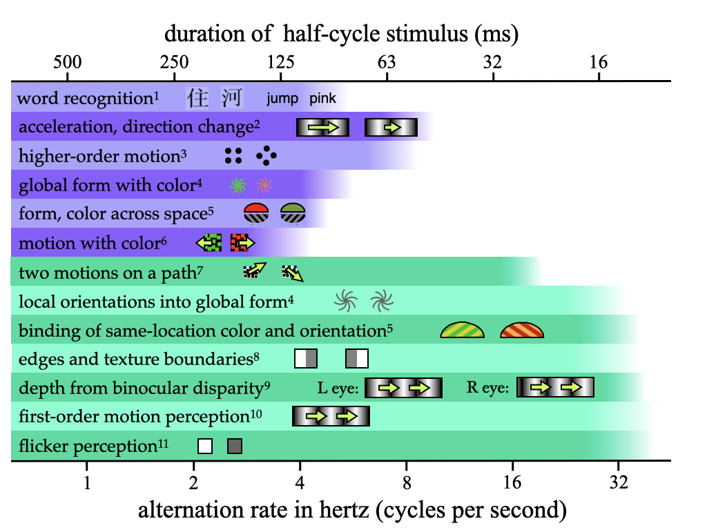
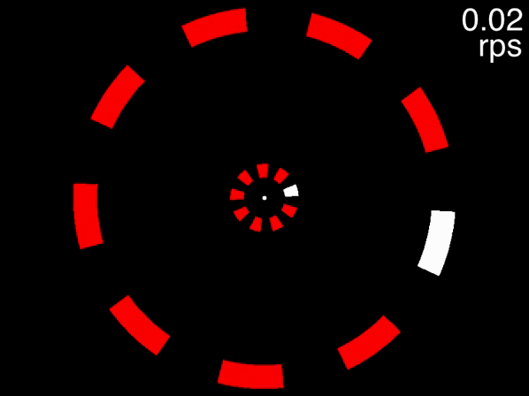
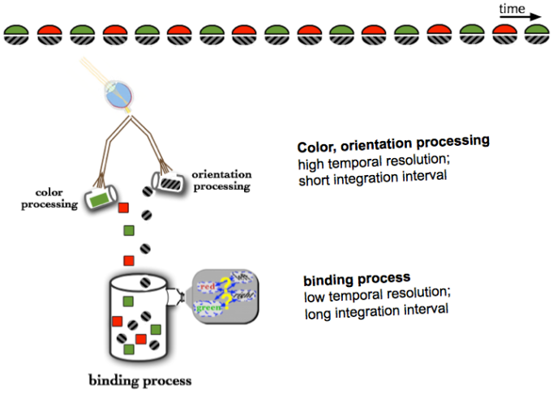

# Speed limits and temporal limits {#speedAndTime}

Naturally there are speeds at which moving objects cannot be tracked. If we had a particular sort of brain, we'd be able to track any object whose motion we could perceive. But animal brains like ours provide for the perception of motion with a system that is quite independent of the processes that allow for tracking.

Motion direction is sensed by direction-selective cells that are arrayed in retinotopic cortex such that there are cells that respond fairly independently to motion in each part of the visual field. The responses of these cells, as they feed into higher motion-processing areas such as MT/MST, eventually give rise to the experience of motion, even though this does not seem to involve tracking. That is, these cells do not know where the object they are responding to has been previously, they are basically motion sensors that respond when there is motion of a particular direction in their receptive field.

Tracking implies the existence of some index or pointer that represents that a particular object is the same as one of the set of objects designated as targets at the beginning of the trial. Even when there is only one target, this process falters at far lower speeds than perception of the target's motion [@verstratenLimitsAttentiveTracking2000]. Moreover, the maximum speed at which one can track is lower when there are more targets [@holcombeExhaustingAttentionalTracking2012]. What is it about the tracking process that gives it these properties?

An increase in object speed will have multiple consequences in a typical MOT experiment. In a standard MOT display, as the targets and distractors wander around the screen, they occasionally come very close to each other (in some experiments, they touch each other or even pass through each other). As discussed in section \@ref(spatialInterference), very close encounters can result in the loss of a target. That is relevant to the issue of speed because when MOT researchers vary object speed, they typically keep trial duration constant, so that the objects travel farther during the higher-speed trials. As a result, the objects have more close encounters, so the reason for poorer performance could simply be due to that.

A first step to revealing the effect of speed, then, is to assess it without the contaminating effect of an increase in close passes. @holcombeExhaustingAttentionalTracking2012 did this by by keeping the objects very far from each other as well as 
using shorter trials for fast speeds, so that objects traveled the same total distance for different speeds, just in case there were any long-distance spatial interactions. The speed thresholds that resulted were still far below those for motion perception, suggesting that speed has a deleterious effect on tracking even without any concomitant close encounters, and in a range where the simple perception of motion is yet to be affected. Moreover, participants' speed thresholds were much lower when two targets had to be tracked compared to when just one target was tracked. One way to refer to this is to say that speed consumes the tracking resource.

It is tempting to conclude that devoting more tracking resource to a target results in the associated internal pointer being able to move faster across the retina. This conclusion would be premature. There remains another possible reason that tracking falters at high speeds.

## A temporal limit on perception

When two objects appear in a common location very close in time, they will be combined by the visual system. If one flickers a light off and on at a very rapid rate (about 60 times a second, depending upon display characteristics), the flicker will not be perceived; instead, one perceives the average of the dark and light phases. That is, the individual on-phases of the light cannot be perceived due to their temporal proximity with the off-phases. This is the basis of projection in the cinema, and is the reason that you can't perceive the flicker of the long tube-style fluorescent lights that fill the ceilings of old office buildings.

The same phenomenon occurs with moving objects, as Ptolemy noted in his *Optics*, a book written almost two thousand years ago. Viewing a rapidly rotating potter's wheel inspired Ptolemy to write, "If spots of a color different from that of the disc are marked on it, they will appear to form circles of the same color [as the given spot] when the disc is rapidly spun."  He also noted that "This also happens in the case of shooting stars, whose light seems distended on account of their speed of motion, all according to the amount of perceptible distance it passes along with the sensible impression that arises in the visual faculty" [@smithPtolemyTheoryVisual1996]. Ptolemy was correct to suggest that these phenomena are caused by our "visual faculty" rather than the physics of light. Our visual systems combine photoreceptor activations that occur in a single location within a certain amount of time, resulting in the perception of trails behind shooting stars.

While the temporal blurring that fuses together the flickering phases of a fluorescent light, the different colors on a potter's wheel, and the successive locations of a shooting star reflects the temporal resolution of early stages of our visual system, later stages of visual processing also have temporal limits.

## Temporal limits on visual cognition

```{r redRightGreenLeft, echo=FALSE, out.width="30%", fig.cap="Task: judge whether the red color is paired with leftward tilt or rightward title."}
if(knitr::is_html_output()) knitr::include_graphics("movies/binding/colorgrdnt2_9fps.gif") else knitr::include_graphics("movies/binding/colorgrdnt2_2fpsStatic.png")
```

In the above display, one can easily perceive that the color is alternating between green and red, and that the contour on the left is alternating rapidly between leftward tilt and rightward tilt. This means that the alternation rate does not exceed the temporal resolution of the early visual system - if it did, you would perceive just one color (yellow or brown).

Nevertheless, it is very difficult or impossible to judge which color, red or green, is presented at the same time as the leftward tilt [@holcombeEarlyBindingFeature2001]. When the animation is slowed to a rate much slower than about 200 ms per stimulus presentation however, the task becomes quite easy, as you can see below.

```{r, echo=FALSE, out.width="30%", fig.cap="Task: judge whether the red color is paired with leftward tilt or rightward title."}
if(knitr::is_html_output()) knitr::include_graphics("movies/binding/colorgrdnt2_2fpsCONVERTED.gif") else knitr::include_graphics("movies/binding/colorgrdnt2_2fpsStatic.png")
```

In the first movie, the temporal resolution of one's ability to pair the features was exceeded. The temporal dissociation here, and in other circumstances, between perceiving individual features and perceiving their pairing suggests that feature binding requires processes that take longer (have coarser temporal resolution) than those that provide perception of the individual features [@holcombeSeeingSlowSeeing2009; @fujisakiCommonPerceptualTemporal2010b].

In the above example, it is tempting to suggest that the dissociation results from a need to make a spatial shift of attention from one of the features' locations to the other in order to identify both before the other features are presented. <!--However, evidence from rapid serial visual presentation indicates that--> However, the phenomenon can also occur with spatially superposed features, such as in the case of color and motion below:

  ```{r, echo=FALSE, out.width="30%", fig.cap="Task: For each row, judge whether the dots, when white, are moving to the left or to the right."}
if(knitr::is_html_output()) knitr::include_graphics("movies/binding/Movie2_Binding3speeds40fpsCONVERTED.gif")
```

While at the slow rate of the top row, it is easy to judge the pairing of motion direction and white/black color, it is very difficult in the middle row, where the speed is slightly faster.

The first to suggest this sort of thing reflected a general limit on temporal individuaation was Dutch guy


attend to the location of one feature first to identify it and
the colors and then of the

This phenomenon can also occur for features that are superposed.

not something specific to features

Thus, while early visual processing can deliver motion and color features even from stimuli that are temporally very close to each other, the processing required to judge which features are at the same time requires processing that fails when temporal proximity is very high

## Low-level and high-level temporal limits {#loHighLevelLims}

In the previous two sections I pointed out that while we can perceive the flicker in a rapidly changing light at rates as high as 60 Hz, some feature binding judgments begin to fail at 3 Hz. @holcombeSeeingSlowSeeing2009 reviewed all the known temporal limits on human visual judgments, from flicker to binocular depth and motion as well as the binding of various features. These limits clustered into two groups, with one set of tasks limited to 8 Hz or below and another set with limits substantially greater than 8 Hz. The summary figure below, based on one in @holcombeSeeingSlowSeeing2009 but with the addition of more recent evidence, highlights these two groups.

```{r temporalLims, echo=FALSE, out.width="100%", fig.cap="Temporal limits on perception"}

```

<sup>1</sup>@holcombeVisualBindingEnglish2007;
<sup>2</sup>@werkhovenVisualProcessingOptic1992;
<sup>3</sup>@verstratenLimitsAttentiveTracking2000;
<sup>4</sup>@cliffordRapidGlobalForm2004;
<sup>5</sup>@holcombeEarlyBindingFeature2001;
<sup>6</sup>@arnoldPerceptualPairingColour2005;
<sup>7</sup>@maruyaRapidEncodingRelationships2013;
<sup>8</sup>@rogers-ramachandranPsychophysicalEvidenceBoundary1998;
<sup>9</sup>@morganStereoscopicDepthPerception1995a;
<sup>10</sup>@burrContrastSensitivityHigh1982;
<sup>11</sup>@vonsegnerRaritaeLuminis1740

The percepts limited to slow rates are likely to be computed by specialized perceptual mechanisms, whereas those limited to slow rates may require attentional selection and possibly parietal or temporal cortex to bind together two of the constituent features. This idea is schematized in Figure \@ref(fig:slowFastBoxesArrows).

```{r slowFastBoxesArrows, echo=FALSE, out.width="100%", fig.cap="Fast temporal limits on visual perception may reflect early and mid-level stages in the cortical processing hierarchy, while the slow limits seem to reflect later processing stages, often involving attentional selection."}
knitr::include_graphics("imagesForRmd/temporalLimitsPerception/lowLevelFastHighLevelSlowBoxesArrows.png")
# Improve figure by decreasing color-motion limit to below 3 Hz
```

## Temporal limits on tracking

Where does object tracking fit into the above-reviewed temporal limits on visual judgments? A good starting point is the ambiguous apparent motion depicted in the "higher-order motion" part of Figure \@ref(fig:slowFastBoxesArrows). If those two frames are alternated, one can see apparent motion clockwise or counter-clockwise as both interpretations are equally viable. One can actually choose to see the figure to rotate clockwise or to rotate counter-clockwise, even while keeping the eyes fixed [@wertheimerExperimentelleStudienUber1912]. @verstratenLimitsAttentiveTracking2000 found that the maximum alternation rate at which this could be done was between 4 and 8 Hz, depending on the participant. These alternation rates, 4 to 8 Hz, are also the rate at which a dot is presented at any given location. In a further experiment, @verstratenLimitsAttentiveTracking2000 inserted frames between the two original frames to make the apparent motion unambiguously clockwise or counter-clockwise. They then used a tracking task, where participants had to follow with their attention one target disc as it stepped about the circular trajectory. None of their participants were able to do this when the flicker rate at an individual location exceeded 8 Hz. This truly seemed to be a temporal limit rather than a speed limit, because by varying the number of concurrently-presented discs  and the number of intervening steps, the speed about the circle was varied, but what mattered most was the rate at which a disc appeared - the temporal frequency.

Importantly, these findings are not specific to jumpy apparent motion displays. @verstratenLimitsAttentiveTracking2000 found a similar result with continuous motion of a grating, where temporal frequency is how often a bright (or dark) bar of the grating traverses any one location. Specifically, they used a circular sine-wave grating presented in an annulus. Participants fixated in the center, attempted to covertly track one light bar of the grating that was cued at the beginning of the trial, and performance fell to 75% correct when the time between successive light bars of the grating was shorter than about 150 milliseconds (6.7 Hz) for the best of the three participants and about 238 ms (4 Hz) for the worst of the three.

<!--That is, *spatial* close encounters aren't the only thing that happen more frequently with higher object speeds. *Temporal* close encounters also happen more frequently. By temporal close encounter, I mean a situation where both an object and a distractor visit the same spatial region in a short span of time.

While the concept of temporal close encounters, or temporal proximity, is not something that attention researchers are familiar with in the context of moving objects,

In an MOT display, as an object moves on from a particular location, that location will sometimes be occupied soon after by another of the moving objects. Unfortunately the processing of the first object at that location may not be completed before the second object replaces it.

The inter-object intervals at a location will be long at slow object speeds and with wide spacing among objects. At high object speeds, however, these intervals can be short even if objects are widely spaced. .-->

  @holcombeSplittingAttentionReduces2013 found a similar result using discs rather than a grating - with 6 participants, once the discs were moving fast enough that two visited a location within 150 ms (6.6 Hz), tracking performance fell to a similar criterion (halfway to chance) as that used by @verstratenLimitsAttentiveTracking2000.

You can get a taste of this, first view the below movie, fixating on the dot in the center, and try to track the two targets that are initially white. If the movie isn't displayed properly, view it [here](movies/MOTmovies/temporalLimits/2targets3objectsPerArray.gif).
When the movie is at its beginning (when the speed readout at top right indicates 0.02 rps), one object in each of the two rings is drawn in white. These are the targets for you to track while you keep your gaze fixed on the dot in the center. As the speed gradually increases, try to keep tracking and see how fast it goes before you lose the targets.

```{r, echo=FALSE, out.width="90%", fig.cap="Task: fixate the white dot, track the initially-white targets, and note how fast you can track, using the speed in the upper right corner."}
#Work-around to make GIFs work by avoiding including them in non-html outputs!
#https://stackoverflow.com/questions/64038037/can-i-conditionally-exclude-some-elements-code-blocks-from-rendering-to-the-pd
if(knitr::is_html_output()) knitr::include_graphics("movies/MOTmovies/temporalLimits/2targets3objectsPerArray.gif") else knitr::include_graphics("movies/MOTmovies/temporalLimits/static_2targets3objectsPerArray.png")
#, height = "250px"
```

Many people can track the targets even at the movie's fastest speed of approximately 0.6 rps (the exact speed it reached depends on your computer). This is to be expected, because at 0.6 rps, 3 objects corresponds to a an inter-object interval of 556 milliseconds, far higher than the temporal limit. The situation is quite different, however, for the below movie. If the movie isn't displayed properly, view it [here](movies/MOTmovies/temporalLimits/2targets9objectsPerArray.gif).

```{r twoTargetsTemporalLimit, echo=FALSE, out.width="90%", fig.cap="Fixate on the dot in the center, track the two targets that are initially white, and note the speed at which you are no longer able to track."}
#Work-around to make GIFs work by avoiding including them in non-html outputs!
#https://stackoverflow.com/questions/64038037/can-i-conditionally-exclude-some-elements-code-blocks-from-rendering-to-the-pd
if(knitr::is_html_output())  else knitr::include_graphics("movies/MOTmovies/temporalLimits/static_2targets9objectsPerArray.png")
#, height = "250px"
```

This movie uses the same speeds as the previous one. The only difference is that eight distractors are presented in each array instead of two. In this case people find that as the objects accelerate, very quickly they feel that they can no longer track the objects. Note that this is not due to spatial interference - only when the number of equidistant objects in an array exceeds 13 will spatial interference become significant [@holcombeSplittingAttentionReduces2013, p.11; @toetTwodimensionalShapeSpatial1992; @pelliUncrowdedWindowObject2008].

Another way to think about temporal frequency limits such as this is that they reflect when temporal interference becomes strong due to close encounters in time. That is, just as increasing the spatial density of a display high enough will impair tracking due to spatial interference (crowding), a more dense display will also mean a higher temporal frequency, with an object and a distractor visiting the same spatial region in a short span of time.

This brings me to how @verstratenLimitsAttentiveTracking2000 and @holcombeSplittingAttentionReduces2013 established that the limit is a temporal one rather than a speed limit. They relied on the fact that a particular temporal frequency corresponds to different combinations of speed and spatial density, rather than a single speed as one would expect from a speed limit. The space-time diagrams in Figure \@ref(fig:temporalResltnSushi) schematizes this, using the height of a pink rectangle to represent the temporal resolution of the tracking processes. At low stimulus speed and density the time between stimuli occupying any one spatial location is long, so tracking succeeds (top panel). When one increases either speed (middle panel) or density (lower panel), the interval between visits to each location decreases.

```{r temporalResltnSushi, echo=FALSE, out.width="80%", fig.cap="The purple rectangle represents the spatial resolution (width) and temporal resolution (height) of tracking. Top panel: The space-time diagram schematizes a sushi train where one piece of sushi is designated as the target. Both density (number of sushi pieces) and speed is low. Tracking is possible because tracking is able to select a single piece of sushi. Middle panel: At medium speed, despite low density, tracking fails because temporal resolution is exceeded.  Bottom panel: At low speed but medium density, tracking fails because temporal resolution is exceeded."}
knitr::include_graphics("imagesForRmd/spatialTempResltnSushi/temporalResltnSushi.jpeg")
```

Quantitatively, the rate of stimulation of each location is the product of speed and density. For a circular array, then, temporal frequency equals speed (in revolutions per second) times the number of discs in the circular array. This means that a temporal limit provides a quantitative prediction for the speed and density combinations that will correspond to participants' thresholds. This prediction was confirmed by the aforementioned studies. @holcombeSplittingAttentionReduces2013, for example, used four different inter-object spacings and many different speeds (speeds were adjusted by a staircase) to assess the speed threshold for each object spacing. The thresholds across the different spacings were close to that predicted by a 6.6 Hz limit. In a study discussed in more detail later, @roudaiaDifferentEffectsAging2017 replicated this finding that thresholds were more consistent with a temporal frequency limit than with a speed limit - they tested two different spacings and found that the corresponding thresholds were more similar when expressed as temporal frequency than as speed.

<!--But how did they (and @verstratenLimitsAttentiveTracking2000) establish that this was caused by temporal interference rather than spatial interference or a speed limit? They capitalized on the contrasting predictions by these three phenomena when object spacing and speed are both manipulated.

With the circular array of equally-spaced objects used by @holcombeSplittingAttentionReduces2013, the amount of time between objects traveling over any one location is the inverse of the product of the speed and the number of objects in the array. For example, if there are four objects in the array moving at 1.75 revolutions per second, then an object will cross any given location in the circular trajectory every 140 milliseconds. Therefore, if temporal interference occurs when objects are in a location within 140 milliseconds of each other, the speed threshold for eight objects in an array should be much slower - 0.875 revolutions per second. This is indeed what was found by @holcombeSplittingAttentionReduces2013, for three different objects-per-array conditions.-->

  The figure below summarises what we know about the limits on covertly tracking a single target.

```{r singleTargetLimits, echo=FALSE, out.width="100%", fig.cap="Spatial and temporal limits on covertly tracking one object."}
knitr::include_graphics("imagesForRmd/trackingLimitsMotionLimitSchematic.png")
# Maybe uPDATE THIS IMAGE WITH BETTER NUMBERS IF REVIEWERS/EDITOR APPROVE OF THE FIGURE, including starting crowding at 13
```

Based on the studies to date, the temporal frequency limit seems to vary substantially between different participants, but 7 Hz is near the top of the range and is used for Figure \@ref(fig:singleTargetLimits). For a circular array, 7 Hz corresponds to lower and lower speeds when more and more distractors are in the array. Note that these speeds are far, far below those that correspond to the limit on motion perception documented for drifting gratings - 25 Hz [@burrContrastSensitivityHigh1982]. Spatial crowding likely imposes another limit on tracking [@holcombeObjectTrackingAbsence2014; @intriligatorSpatialResolutionVisual2001], at a point far lower than the spatial acuity limit (not shown). Finally, as we will describe in the "Speed limits" section below, an actual speed limit (as opposed to a temporal limit) also seems to constrain tracking. The combination of these limits yields the combinations of speeds and number of distractors in a circular array indicated by the pink region.

These findings suggest an individuation limit wherein if a stimulus repeats at a particular location within a certain amount of time, about 120 ms if the limit is 8 Hz, the processes responsible for tracking fail. While they never studied tracking, @vandegrindTemporalTransferProperties1973 anticipated this phenomenon to some extent. They coined the term "Gestalt fusion" to refer to how they saw the two phases of a flickering light as being perceived as a single thing when the flicker rate was above approximately 7 Hz. If this is an individuation limit, it might possibly have broader consequences than simply limiting tracking. It might be the reason for some or all of the other slow temporal limits reviewed in \@ref(loHighLevelLims) above. Before considering  that in detail, however, an important property that we have not discussed is how resource-intensive the temporal limit on tracking is.

## Temporal interference is highly resource-intensive

In addition to replicating the finding of @verstratenLimitsAttentiveTracking2000 of an approximately 7 Hz limit on attentional tracking, @holcombeSplittingAttentionReduces2013 also investigated the limits on tracking with two targets and with three targets. They found that the temporal limit was markedly worse for higher target loads. Specifically, while when tracking one target, `r round(1000/7)` ms had to elapse between when a target and a distractor visited a location (7 Hz), for two targets the threshold was about `r round(1000/4.2)` ms, and for three targets it was about `r round(1000/2.6)` ms. This dramatic effect of target load on temporal limit was replicated by @roudaiaDifferentEffectsAging2017, who also replicated the finding that these thresholds were more consistent with a temporal frequency limit than with a speed limit.

The effect of target load on temporal limit observed by @roudaiaDifferentEffectsAging2017 was remarkably similar in size to the large effect found by @holcombeSplittingAttentionReduces2013. The eight participants tested by @holcombeSplittingAttentionReduces2013 were all relatively young men, apart from two young women. @roudaiaDifferentEffectsAging2017 tested both old and young participants, and reported a statistically significant difference. Among their young group, however, they tested only nine young men and nine young women, which for most known gender differences would be provide low statistical power, so the finding of a gender difference should be considered provisional. <!--I do not discuss or show the results they found for their old (greater than 60 years) group because that group included many outliers with very low performance.  ACTUALLY NO BAD OUTLIERS AMONG OLD FOR 1 AND 2 TARGETS SO MAYBE INCLUDE THAT-->

  ```{r trackingLimitsReview, echo=F, message=F, fig.cap="The results of the two experiments of Holcombe & Chen (2013) plotted with the comparable sample (young people) of Roudaia & Faubert (2017). The data symbols are horizontally offset to avoid overlap."}
library(ggplot2)
library(dplyr)
library(tidyr)
library(purrr)

E1HolcombeChen13 <- tibble(experiment="Holcombe & Chen E1", targets=seq(1,2),   temporalLimit= c(1000/6.93, 1000/4.45) )
E2HolcombeChen13 <- tibble(experiment="Holcombe & Chen E2", targets=seq(2,3),   temporalLimit= c(1000/4.05, 1000/2.7) )
RoudaiaFaubert<- tibble(experiment="Roudaia & Faubert young men", targets=seq(1,3), temporalLimit=c(1000/6.4,1000/4,1000/2.8))
RoudaiaFaubert2<- tibble(experiment="Roudaia & Faubert young women", targets=seq(1,3), temporalLimit=c(1000/4.9,1000/3,1000/1.8))
#ADD MARINOVIC finding of 7.2 Hz for one target, and Verstraten

temporalLimitsData<- rbind(E1HolcombeChen13,E2HolcombeChen13,RoudaiaFaubert,RoudaiaFaubert2)
temporalLimitsData$experiment <- as.factor(temporalLimitsData$experiment)

#criticalIntervalsObserved <- tibble( targets=seq(1,3), temporalLimit= c(1000/7, 1000/4.2, 1000/2.6) )

critInterval <- function(targets, samplingInterval) {
  samplingInterval*targets*2
}

valuesForComputing<- expand_grid(
  targets = 1:4,
  samplingInterval = c(50, 70, 90),
  experiment = "predicted"
)

tibl <- valuesForComputing  %>% mutate(temporalLimit = critInterval(targets,samplingInterval))

#male/female samples https://github.com/kmiddleton/rexamples/blob/master/ggplot2%20male-female%20symbols.R
#unicode character list (look at ) https://www.ssec.wisc.edu/~tomw/java/unicode.html
ggplot(temporalLimitsData, aes(x=targets,y=temporalLimit, shape=experiment)) +
  #geom_line( aes(color=factor(samplingInterval)) ) +
  geom_line(position=position_dodge(width=.3), size=.5, color="grey60") +
  geom_point(position=position_dodge(width=.3), size=4.7) +
  scale_shape_manual(values = c("\u25A1", "\u25CB", "\u2642", "\u2640")) +
  scale_x_continuous(breaks=1:3) +
  #ylab('temporal limit (ms)') +
  labs(color='sampling interval (ms)', shape='study') +
  scale_y_continuous("temporal limit (ms)",
                     sec.axis = sec_axis(~ .^-1 * 1000, name="Hz", breaks=c(2,3,4,5,6,7)) ) +
  theme_bw() +
  theme( panel.grid.major = element_blank(), panel.grid.minor = element_blank(),
         panel.background = element_blank() )
```

In each of the four datasets plotted (and also in the data from the old participants excluded because of outliers), the temporal limit decreases dramatically with increasing target load. Of all the effects of increasing target load that we have discussed, this one may be the largest.

<!--Adding to the evidence from @holcombeSplittingAttentionReduces2013 that the less attentional resource available per target

The less attentional resource available per target, the lower the temporal limit was.

Confirming the suggestion that the less

One aspect of the findings of @roudaiaDifferentEffectsAging2017 were strikingly similar to @holcombeSplittingAttentionReduces2013. @holcombeSplittingAttentionReduces2013 tested five men and

@roudaiaDifferentEffectsAging2017 replicated the @holcombeSplittingAttentionReduces2013 and @verstratenLimitsAttentiveTracking2000 findings that the observed speed thresholds varied in the way predicted if the underlying limit was actually a temporal frequency limit.-->

  Attentional tracking is a complex task - in section \@ref(whichAspects), six factors likely to affect tracking performance were listed. However, some of these factors might affect practically any task; it is those that are most resource-intensive, and thus most limit our capacity, that should be most illuminating for understanding tracking processes.

From the rather unconstrained trajectories used in most MOT studies, researchers were unable to make strong inferences about how target load was adversely affecting performance. For example, it was necessary to carefully control the distances between objects to disconfirm the suggestion that spatial interference even beyond the crowding range was the primary determinant of the effect of tracking load [@holcombeObjectTrackingAbsence2014; @holcombeCommentCapacityLimits2019]. <!--In displays where objects come very close to each other, spatial interference may yet be a big reason for the performance decrease with target load-->

  For temporal interference, the evidence is strong that it is dramatically increased by target load. This leads to two important questions. The first is: what does this effect tell us about how tracking works? Discussion of this is deferred to the \@ref(serialOrParallel) section, but in short, it supports serial switching theories of tracking.

The second question is: what role does temporal interference play in typical MOT displays that use more linear trajectories? Unfortunately, none appear to have done so for temporal interference. And some of the evidence from studies that set out to investigate the role of spatial proximity might alternatively be explained by temporal proximity [e.g., @baeCloseEncountersDistracting2012]- in typical MOT displays, spatial proximity is likely to be highly correlated with temporal proximity.

<!--MENTION THAT THIS IS AN INSTANCE WHERE ATTENTION DOES FEEL LIKE IT CAN BE LEFT BEHIND AS AN OBJECT MOVES ON (IN THE OBJECTS CHAPTER I SAID THAT ATTENTION FEELS PULLED ALONG BY A MOVING OBJECT)-->

## Relation to other temporal limits

  A plausible interpretation of the temporal limit on tracking is that it is an attentional selection individuation limit. Above the limit, stimuli cannot be individually selected by attention for processing by higher-level, limited-capacity processes such as cognition. This could prevent successful performance of many, or all, of the tasks in the slow group of Figure \@ref(fig:temporalLims). For example, to correctly identify that red is paired with leftward-tilted in \@ref(fig:redRightGreenLeft), both the color and the orientation have to be identified. If attention is unable to select an individual color and orientation and instead has access only to two or more successive frames, then from the perspective of higher-level processes, both colors and both shapes were essentially presented simultaneously. This is illustrated in Figure \@ref(fig:temporalresolutionwaterworks).

```{r temporalresolutionwaterworks, echo=FALSE, out.width="80%", fig.cap="A rapidly alternating color-orientation pairing stimulus (top) is processed first by high temporal resolution feature processors, which independently determine the color and orientation. Subsequently the pairing of the two features is determined by a process that, because it is low temporal resolution, unfortunately 'sees' multiple colors and orientations simultaneously."}

```

While the temporal limit on binding for this and related tasks is less than 3 Hz [@holcombeEarlyBindingFeature2001; @arnoldPerceptualPairingColour2005], the tracking limit for one target is significantly higher, close to 7 Hz \@ref(fig:trackingLimitsReview). The reason for this may be that while both tasks require individuation, the binding tasks require additional processing such as labeling of the features [@holcombeEarlyBindingFeature2001; @fujisakiCommonPerceptualTemporal2010]. This theory is consistent with the evidence reviewed in  \@ref(identity) that encoding of features (such as color or orientation) does not occur in basic tracking. The successive locations of a tracked object must be paired, but this may be faster than other forms of binding, both because feature encoding is not required and possibly because it may piggy-back on motion perception.

@marinovicAttentionaltrackingAcuityModulated2013 investigated the role of motion mechanisms with an adaptation experiment in which participants were exposed to a prolonged period of either slow or fast motion. Exposure to slow motion decreased the participants' maximum tracking speed, while exposure to fast motion actually increased it. Note that this is opposite in direction to what one might expect from other instances of sensory adaptation, wherein adaptation to high spatial frequency, for example, *reduces* the maximum spatial frequency one can perceive, which is thought to be because the underlying mechanism becomes less responsive.

@marinovicAttentionaltrackingAcuityModulated2013 theorized that this surprising effect reflected changes in the relative contribution of the two types of spatiotemporal filters thought to mediate speed perception. Specifically, @marinovicAttentionaltrackingAcuityModulated2013 suggested that the low-pass filters are needed to individuate a target from the distractors, because, they said, only the low-pass filters have small enough receptive fields. On that basis, adaptation to slow motion reduces the temporal limit on tracking. They further proposed that adapting to fast motion adapts the band-pass temporal frequency filters that, being large, tend to group the target with the distractors, and thus reducing their responsiveness is a good thing. This account seems plausible for the stimulus they used, as the moving discs were quite close to each other, as there were twelve of them sharing the circular trajectory. I am not sure whether the same can be said if there were only six discs in the trajectory. Unfortunately @marinovicAttentionaltrackingAcuityModulated2013 did not test this. They also did not test whether the speed limit, as opposed to the temporal limit, was changed by adaptation; this could be investigated by using two or three discs in the circular trajectory. The finding of @marinovicAttentionaltrackingAcuityModulated2013 is an important one as further investigation seems likely to provide additional insights.

<!--An increase in close encounters isn't the only consequence of higher speeds in a standard MOT trial. At least, close encounters in *space* isn't the only consequence. There's another sort of close encounter, one that most people aren't familiar with, the *temporal* close encounter.

Spatial resolution is fine, as you can see from blah blah blah.
-->

  <!--OUTSTANDING QUESTION: Is it the distractor replacing the target that's worse or the target invading the former distractor location? -->

## Speed limits

We have seen that the apparent speed limits on tracking in dense displays may actually be caused by temporal limits. This is because when there are a lot of objects in a display, at high object speeds both targets and distractors may occupy a particular location within three or four hundred milliseconds, which can impair or prevent tracking. Temporal interference is less of an issue when the targets and distractors are kept very far apart from each other.

When using a circular trajectory with just one target and one distractor on opposite sides, such that the distractor did not replace the target very quickly, @verstratenLimitsAttentiveTracking2000 found evidence that tracking was truly limited by speed rather than by temporal interference. What this was that the maximum speed at which participants could track was much lower than what was predicted by the 7 Hz limit found when several distractors shared the circular trajectory with the target. With one target and one distractor, the 7 Hz limit should result in a speed threshold of  3.5 revolutions per second. Instead, participants' thresholds were on average less than 2 revolutions per second. My lab found a very similar result [@holcombeSplittingAttentionReduces2013]. When we tested with 5, 8, or 12 distractors, the speed limit was close to that predicted by a 7 Hz temporal limit. But when there were only 2 distractors in the array, the average speed limit was only 1.7 rps, rather than 3.5 rps predicted by a 7 Hz limit.

It seems, then that tracking of a single object is limited both by a speed limit of about 2 revolutions per second and by a temporal limit of about 7 Hz. The computer screens that were used for testing had refresh rates of 160 Hz, and when the speed of an object is very fast, one can see gaps between the successive frames, which conceivably could be contributing to the speed limit. However, when Wei-Ying Chen and I used a mechanical device rather than an intermittent computer display, we found a speed limit that was only slightly faster, about 2.3 rps [@holcombeSpeedLimitAttentional2020].

Changing the radius of the circular trajectory in experiments like these yielded a truly remarkable finding. Well, @verstratenLimitsAttentiveTracking2000 mentioned that for their experiments where participants had to track one bar of a circular 2-cycle grating, they also informally tested annular gratings of different sizes. When the grating was larger, the length of the path traveled by the bar when making one revolution was, of course, longer. One would therefore expect that the speed threshold, when expressed in revolutions per second, should decrease in proportion to the radius of the grating. Consider that a grating of radius 2 deg has twice the circumference as that of a 1 deg radius grating, so the revolutions per second should be halved in order for a bar to travel the same distance in the same amount of time. However, @verstratenLimitsAttentiveTracking2000 said that they saw no change in the speed limit in terms of rps. That is, participants could track an object moving twice as fast when the trajectory had a larger radius.

Wei-Ying Chen and I also found that the speed threshold, when expressed in revolutions per second, was robust to the increases in length of the trajectory associated with larger radii [@holcombeSplittingAttentionReduces2013; @holcombeExhaustingAttentionalTracking2012], despite the substantial increase in speed in terms of linear distance traveled. <!--Establishing such invariances is fundamental to scientific explanation (e.g. @woodwardExplanationInvarianceSpecial2000), and this particular near-invariance rules against naïve expectations of how speed exerts its effect.--> We will therefore refer to the speed limit as an angular speed limit.

What does this mean for the processes that underlie tracking? Conceivably, the limit could be imposed by the *cortical* distance traveled, as the amount of retinotopic cortex per deg of visual angle may diminish linearly with eccentricity. However, for the limit to stay close to constant would require that the scaling constant be equal to one, but empirically this does not seem to be the case, based both on psychophysical and physiological measures [@strasburgerPeripheralVisionPattern2011]. Another possibility is we might call the costly hemifield-crossing theory. Doubling the revolutions per second doubles the rate of crossing the vertical meridian, and crossing that meridian is known to impair tracking [@strongHemifieldspecificControlSpatial2020]. If so, a faster limit should be found for trajectories that do not cross the vertical meridian, but in an unpublished experiment [@holcombeSpeedLimitAttentional2020], this was not found. Finally, @verstratenLimitsAttentiveTracking2000 suggested that the limit may coincide with that found for mental rotation of objects [@cooperMentalTransformationsVisual1976], so possibly the same processes limit both. <!--@holcombeSpeedLimitAttentional compared circular to linear trajectories, by having the objects travel along a diamond-shaped trajectory rather than a circle. Nine participants were tested. The mean speed threshold was 1.2 rps for both conditions. -->

  Other than @verstratenLimitsAttentiveTracking2000 and myself and Chen, no tracking researchers appear to have grappled with the angular speed limit, or mentioned it in any published papers. Instead, MOT researchers continue to write as if tracking is limited by linear distance traveled per unit time, not by revolutions per second or by temporal interference. Admittedly, the speed limit may have little effect in conventional MOT displays with linear trajectories, because for the speeds tested in all or practically all such experiments, objects probably take longer than a second to ever move a full revolution around a point in the display. However, many recent papers use circular trajectories, where the angular speed limit may come into play, although again they tend to use speeds slower than 1 rps [e.g. @maechlerAttentionalTrackingTakes2021, @carlsonQuadranticDeficitReveals2007].

Is the angular speed limit caused by a more structural limitation, what @normanDatalimitedResourcelimitedProcesses1975 called data-limited, or is it resource intensive like the temporal frequency limit? If it is resource intensive, the speed limit should be lower when more targets are tracked, as that would result in less resource available per target. @holcombeSplittingAttentionReduces2013 did document an associated decline in speed thresholds, from 1.7 rps with one target to 1.2 rps with two targets and 0.8 rps with three targets. Unfortunately, however, it is difficult to discern whether this reduction is due to a reduction in the actual speed limit, or instead was caused by the previously-documented decline in temporal frequency limit. The problem is that the temporal frequency limit with two targets (approximately 4 Hz) corresponds to a speed, with three objects in a trajectory, below that of the one-target speed limit, so it is difficult to know whether the speed threshold reflects a decline in both the temporal limit and the speed limit or just the temporal limit.

Using fMRI, @shimNumberAttentionalFoci2010 investigated the brain areas associated with multiple object tracking, and varied objects' speeds. If higher speeds consumed more of the tracking resource, one might expect that higher speeds would increase the activation in the same areas that increase in activation with more targets. @shimNumberAttentionalFoci2010 identified a parietal region that increased in activation with the number of targets. However, there was no increase in activation of any parietal area with target speed. In a whole-brain analysis, however, @shimNumberAttentionalFoci2010 did find some scattered voxels whose activity increased with speed, including the frontal eye field, which is often associated with attentional tasks. @howeUsingFMRIDistinguish2009 also found strong FEF activation in MOT. They did not vary speed, but did compare tracking moving targets to monitoring targets that were stationary, and found that that comparison also yielded strong FEF activation. They suggested that given the FEF's involvement in eye movements, the activation might reflect suppression of eye movements. Although they did not cite any evidence that suppression of eye movements is more demanding for tracked moving targets than for monitored stationary targets, that seems highly plausible.

<!--@holcombeSpeedLimitAttentional found a speed limit of 2.2 rps with one distractors and 1.8 rps with two distractors-->

  <!--Some of the studies that documented hemifield independence used a target moving on a small circular trajectory together shared by a single distractor [@holcombeExhaustingAttentionalTracking2012; @chenResourceDemandsObject2013]. If these trajectories had been centered on the fixation point, we know that the speed thresholds would be determined  by the speed limit. But they're always looking at 2 versus 1 target so it could be caused by temporal frequency limit anyway

. First, they showed that objects' speeds could be increased until a tracking "speed limit" (68% threshold) where performance tracking two targets was approximately that predicted if participants could only track one of the two targets and had to guess about the other. They then examined the effect of adding a target to the other hemifield rather than the same hemifield. Performance in that condition was very close to that predicted i

. at high speeds (at the 68% threshold), a high degree of hemifield independence was found - a mean of 75% independence but with enough uncertainty to make it compatible with 100% independence. Experiment 1 and Experiment 2 of @chenResourceDemandsObject2013 used the same approach, but compared tracking two targets unilaterally and bilaterally to tracking four targets. Across E1 and E2 the average of the speed thresholds the numbers suggest approximately 100% hemifield independence (with a lot of uncertainty in the estimate).-->

## Putting it all together

The temporal interference and associated temporal limits on tracking are clearly highly resource-intensive. Tracking three targets rather than one almost triples the severity of the temporal limit.  We will discuss the theoretical implications in a subsequent section. Tracking is also constrained by a speed limit, but we do not yet know whether the speed limit decreases with more targets or is instead a fixed limit. We also do not understand the nature of the speed limit - whether it is truly a rotational limit and how it relates to other mental processes.

```{r, echo=FALSE, out.width="100%", fig.cap="Spatial and temporal limits on covertly tracking one, two, and three targets. "}
                  knitr::include_graphics("imagesForRmd/temporalAndSpeedLimits.png")
                  #UPDATE THIS IMAGE WITH 2 rps SPEED LIMIT IF REVIEWERS/EDITOR APPROVE OF IT
```
