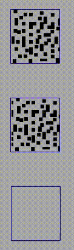

# Speed and time {#speedAndTime}

Our perceptual systems are limited, so naturally there are speeds at which moving objects cannot be tracked. Importantly, however, tracking even of a single target falters at far lower speeds than perception of its motion. Moreover, the maximum speed at which one can track is lower when there are more targets [@holcombeExhaustingAttentionalTracking2012]. Why is tracking this way and what does it suggest about the underlying processes?

To get to some answers, the consequences of increasing the speed of the objects in an MOT display must first be understood. In a standard MOT display, as the targets and distractors wander around the screen, they occasionally come very close to each other (in some experiments, they touch each other or even pass through each other). As discussed in section \@ref(spatialInterference), the close encounters can result in the loss of a target. That is relevant to the issue of speed because when MOT researchers vary object speed, they typically keep trial duration constant, so that the objects travel farther during the higher-speed trials. As a result, the objects have more close encounters, so the reason for poorer performance could simply be due to that.

A first step to understanding the effect of speed, then, is to assess it without the contaminating effect of an increase in close passes. @holcombeExhaustingAttentionalTracking2012 did this by using shorter trials for fast speeds, so that objects traveled the same total distance for different speeds, and by keeping the objects very far from each other. The speed thresholds that resulted were still far below the limits on motion perception, and were much lower when two targets had to be tracked compared to when just one target was tracked. continued to be resource-intensive<!--resource-limited-->: the more targets that were tracked, the slower the speed thresholds.

Even when objects are kept widely spaced, there are at least two reasons why speed could hurt performance. One is that tracking may truly be limited by speed. Another possibility, however, is that tracking has a temporal limit.

## Temporal limits

Close encounters aren't the only things that increase with speed in a typical MOT trial. That is, *spatial* close encounters aren't the only thing that happen more frequently with higher object speeds. *Temporal* close encounters also happen more frequently. By temporal close encounter, I mean a situation where both an object and a distractor visit the same spatial region in a short span of time.

While the concept of temporal close encounters, or temporal proximity, is not something that attention researchers are familiar with in the context of moving objects, it should be familiar in the context of stimuli that don't move but do change. If one flickers a light off and on at a very rapid rate (about 60 times a second, depending upon display characteristics), the flicker will not be perceived; instead, one perceives the average of the dark and light phases. That is, the individual on-phases of the light cannot be perceived due to their temporal proximity with the off-phases. This is the basis of projection in the cinema, and is the reason that you can't perceive the flicker of the long tube-style fluorescent lights that fill the ceilings of old office buildings.

The same phenomenon occurs with moving objects, as Ptolemy noted in *Optics*, a book written almost two thousand years ago. Viewing a rapidly rotating potter's wheel inspired Ptolemy to write, "If spots of a color different from that of the disc are marked on it, they will appear to form circles of the same color [as the given spot] when the disc is rapidly spun."  He also noted that "This also happens in the case of shooting stars, whose light seems distended on account of their speed of motion, all according to the amount of perceptible distance it passes along with the sensible impression that arises in the visual faculty" [@smithPtolemyTheoryVisual1996]. Ptolemy was write to ascribe these phenomena to the "visual faculty" rather than to the physics of light. The early visual system continually combines or blurs together photoreceptor activations that occur in a single location within a certain amount of time.

While the temporal blurring that fuses together the flickering phases of a fluorescent light, the different colors on a potter's wheel, and the successive locations of a shooting star reflects the temporal resolution of early stages of our visual system, later stages of visual processing also have temporal limits.

### High-level temporal limits

```{r, echo=FALSE, out.width="30%", fig.cap="Task: judge whether the red color is paired with leftward tilt or rightward title."}
if(knitr::is_html_output()) knitr::include_graphics("movies/binding/colorgrdnt2_9fps.gif") else knitr::include_graphics("movies/binding/colorgrdnt2_2fpsStatic.png")
```

In the above display, one can easily perceive that the color is alternating between green and red, and that the contour on the left is alternating rapidly between leftward tilt and rightward tilt. This means that the alternation rate does not exceed the temporal resolution of the early visual system - if it did, you would perceive just one color (yellow or brown).

Nevertheless, it is very difficult or impossible to judge which color, red or green, is presented at the same time as the leftward tilt [@holcombeEarlyBindingFeature2001]. When the animation is slowed to a rate much slower than about 200 ms per stimulus presentation however, the task becomes quite easy, as you can see below. 

```{r, echo=FALSE, out.width="30%", fig.cap="Task: judge whether the red color is paired with leftward tilt or rightward title."}
if(knitr::is_html_output()) knitr::include_graphics("movies/binding/colorgrdnt2_2fpsCONVERTED.gif") else knitr::include_graphics("movies/binding/colorgrdnt2_2fpsStatic.png")
```

In the first movie, the temporal resolution of one's ability to pair the features was exceeded. The temporal dissociation here, and in other circumstances, between perceiving individual features and perceiving their pairing suggests that feature binding requires processes that take longer (have coarser temporal resolution) than those that provide perception of the individual features [@holcombeSeeingSlowSeeing2009; @fujisakiCommonPerceptualTemporal2010b].

In the above example, it is tempting to suggest that the dissociation results from a need to make a spatial shift of attention from one of the features' locations to the other in order to identify both before the other features are presented. <!--However, evidence from rapid serial visual presentation indicates that--> However, the phenomenon can also occur with spatially superposed features, such as in the case of color and motion below:

```{r, echo=FALSE, out.width="30%", fig.cap="Task: For each row, judge whether the dots, when white, are moving to the left or to the right."}
if(knitr::is_html_output()) 
```

While at the slow rate of the top row, it is easy to judge the pairing of motion direction and white/black color, it is very difficult in the middle row, where the speed is slightly faster. 

The first to suggest this sort of thing reflected a general limit on temporal individuaation was Dutch guy


attend to the location of one feature first to identify it and 
the colors and then of the 

This phenomenon can also occur for features that are superposed.

not something specific to features

Thus, while early visual processing can deliver motion and color features even from stimuli that are temporally very close to each other, the processing required to judge which features are at the same time requires processing that fails when temporal proximity is very high 

In an MOT display, as an object moves on from a particular location, that location will sometimes be occupied soon after by another of the moving objects. Unfortunately the processing of the first object at that location may not be completed before the second object replaces it.

The inter-object intervals at a location will be long at slow object speeds and with wide spacing among objects. At high object speeds, however, these intervals can be short even if objects are widely spaced. @verstratenLimitsAttentiveTracking2000 found evidence that people then become unable to covertly track even a single target. @verstratenLimitsAttentiveTracking2000 used a circular sine-wave grating presented in an annulus. Participants fixated in the center and attempted to covertly track one light bar of the grating that was cued at the beginning of the trial. The experiment found evidence that the participants could not track accurately when the time between successive light bars of the grating was shorter than about 150 milliseconds (for the three participants tested, this figure varied from about 150 ms to about 238 ms).

@holcombeSplittingAttentionReduces2013 found a similar result (for 6 participants, a mean of 150 ms) using a circular array of discs rather than a grating. But how did they (and @verstratenLimitsAttentiveTracking2000) establish that this was caused by temporal interference rather than spatial interference or a speed limit? They capitalized on the contrasting predictions by these three phenomena when object spacing and speed are both manipulated. @holcombeSplittingAttentionReduces2013, for example, used four different inter-object spacings and many different speeds (speeds were adjusted by a staircase) to assess the speed threshold for each object spacing. If temporal interference affects performance, then a particular pattern of speed thresholds were predicted to emerge.

With the circular array of equally-spaced objects used by @holcombeSplittingAttentionReduces2013, the amount of time between objects traveling over any one location is the inverse of the product of the speed and the number of objects in the array. For example, if there are four objects in the array moving at 1.75 revolutions per second, then an object will cross any given location in the circular trajectory every 140 milliseconds. Therefore, if temporal interference occurs when objects are in a location within 140 milliseconds of each other, the speed threshold for eight objects in an array should be much slower - 0.875 revolutions per second. This is indeed what was found by @holcombeSplittingAttentionReduces2013, for three different objects-per-array conditions.

You can get a taste of this by attempting to first track two targets in the below movie.

```{r, echo=FALSE, out.width="100%", fig.cap="Task: fixate the circle and judge whether the red color is paired with leftward tilt or rightward tilt."}
#Work-around to make GIFs work by avoiding including them in non-html outputs!
#https://stackoverflow.com/questions/64038037/can-i-conditionally-exclude-some-elements-code-blocks-from-rendering-to-the-pd
if(knitr::is_html_output()) knitr::include_url("movies/MOTmovies/temporalLimits/2targets3objectsPerArray.gif") else 
#, height = "250px"
```

When the movie above is at its beginning (when the speed readout at top right indicates 0.02 rps), one object in each of the two rings is drawn in white. These are the targets for you to track while you keep your gaze fixed on the dot in the center. As the speed gradually increases, try to keep tracking and see how fast it goes before you lose the targets.

Many people can track the targets even at the movie's fastest speed of approximately 0.6 rps (the precise speed depends on your computer). This is to be expected, because at 0.6 rps, 3 objects corresponds to a an inter-object interval of 556 milliseconds, far higher than the temporal limit documented by @holcombeSplittingAttentionReduces2013. The situation is quite different, however, for the below movie.

```{r, echo=FALSE, out.width="100%", fig.cap="Task: fixate the circle and judge whether the red color is paired with leftward tilt or rightward tilt."}
#Work-around to make GIFs work by avoiding including them in non-html outputs!
#https://stackoverflow.com/questions/64038037/can-i-conditionally-exclude-some-elements-code-blocks-from-rendering-to-the-pd
if(knitr::is_html_output()) knitr::include_url("movies/MOTmovies/temporalLimits/2targets9objectsPerArray.gif") else knitr::include_graphics("movies/MOTmovies/temporalLimits/static_2targets9objectsPerArray.gif")
#, height = "250px"
```

This movie uses the same speeds as the previous one. The only difference is that eight distractors are presented in each array instead of two. In this case people find that as the objects accelerate, very quickly they feel that they can no longer track the objects. Note that this is not due to spatial interference - only when the number of equidistant objects in an array exceeds 13 will spatial interference become significant [@holcombeSplittingAttentionReduces2013, p.11; @toetTwodimensionalShapeSpatial1992; @pelliUncrowdedWindowObject2008].

The figure below summarises what we know about the limits on covertly tracking a single target. 

```{r, echo=FALSE, out.width="100%", fig.cap="Spatial and temporal limits on covertly tracking one object. UPDATE THIS IMAGE WITH BETTER NUMBERS IF REVIEWERS/EDITOR APPROVE OF IT, including starting crowding at 13"}
knitr::include_graphics("imagesForRmd/trackingLimitsMotionLimitSchematic.png")
```

Direction of motion can be perceived to at least 25 Hz [@burrContrastSensitivityHigh1982], which corresponds to much faster speeds, of course, than the ~7 Hz limit on attentive tracking. As we will describe in the "Speed limits" section below, a separate speed limit also constrains tracking, limiting trackable stimuli to those with the characteristics of the pink shaded region. The spatial acuity limit would be far to the right of the crowding limit, so together with the other limits this means that of the spatiotemporal window of visible stimuli, only a small proportion can be tracked.

## Temporal interference is resource-intensive

In adding to the evidence for a temporal limit on tracking, @holcombeSplittingAttentionReduces2013 also found that the temporal limit was markedly worse for higher target loads. The less attentional resource available per target, the lower the temporal limit was. Specifically, the limit was `r round(1000/7)` ms for one target, about `r round(1000/4.2)` ms for two targets, and `r round(1000/2.6)` ms for three targets, and this dramatic effect of target load on temporal limit was replicated by @roudaiaDifferentEffectsAging2017.

```{r, echo=F, message=F, fig.cap="The results of the two experiments of Holcombe & Chen (2013) plotted with the comparable sample (young people) of Roudaia & Faubert (2017). The data symbols are horizontally offset to avoid overlap."}
library(ggplot2)
library(dplyr)
library(tidyr)
library(purrr)

E1HolcombeChen13 <- tibble(experiment="Holcombe & Chen E1", targets=seq(1,2),   temporalLimit= c(1000/6.93, 1000/4.45) )
E2HolcombeChen13 <- tibble(experiment="Holcombe & Chen E2", targets=seq(2,3),   temporalLimit= c(1000/4.05, 1000/2.7) )
RoudaiaFaubert<- tibble(experiment="Roudaia & Faubert young men", targets=seq(1,3), temporalLimit=c(1000/6.4,1000/4,1000/2.8))
RoudaiaFaubert2<- tibble(experiment="Roudaia & Faubert young women", targets=seq(1,3), temporalLimit=c(1000/4.9,1000/3,1000/1.8))

temporalLimitsData<- rbind(E1HolcombeChen13,E2HolcombeChen13,RoudaiaFaubert,RoudaiaFaubert2)
temporalLimitsData$experiment <- as.factor(temporalLimitsData$experiment)

#criticalIntervalsObserved <- tibble( targets=seq(1,3), temporalLimit= c(1000/7, 1000/4.2, 1000/2.6) )

critInterval <- function(targets, samplingInterval) {
 samplingInterval*targets*2
}

valuesForComputing<- expand_grid(
  targets = 1:4,
  samplingInterval = c(50, 70, 90),
  experiment = "predicted"
)

tibl <- valuesForComputing  %>% mutate(temporalLimit = critInterval(targets,samplingInterval))

#male/female samples https://github.com/kmiddleton/rexamples/blob/master/ggplot2%20male-female%20symbols.R
#unicode character list (look at ) https://www.ssec.wisc.edu/~tomw/java/unicode.html
ggplot(temporalLimitsData, aes(x=targets,y=temporalLimit, shape=experiment)) +
    #geom_line( aes(color=factor(samplingInterval)) ) +
    geom_point(position=position_dodge(width=.2), size=5) +
    #geom_point( size=4) +
    #geom_line() +
    scale_shape_manual(values = c("\u25A1", "\u25CB", "\u2642", "\u2640")) +
   scale_x_continuous(breaks=1:3) +
    ylab('temporal limit (ms)') + labs(color='sampling interval (ms)', shape='study') + 
    theme_bw() +
   theme( panel.grid.major = element_blank(), panel.grid.minor = element_blank(),
          panel.background = element_blank())
```

The effect of target load on temporal limit observed by @roudaiaDifferentEffectsAging2017 was comparable in size to that found by @holcombeSplittingAttentionReduces2013. @roudaiaDifferentEffectsAging2017 also reported a statistically significant gender difference, but they only tested nine young men and nine young women, which would constitute very low statistical power, and thus the difference may be a false positive. The data are plotted separately here because that is how they reported them and because it provides an internal replication of the large effect of target load. @roudaiaDifferentEffectsAging2017 also tested older (>60 years) men and women, but there were many outliers with very low performance. The eight participants tested by @holcombeSplittingAttentionReduces2013 were all relatively young men, apart from two young women.

In section \@ref(whichAspects), we made the point that attentional tracking is a complex task - six factors were listed there that are likely to affect tracking performance. From the pattern of performance with typical MOT displays, we could not know which constraining factor(s) might have the narrowest bottlenecks and thus be most affected by target load.

Some had suggested that spatial interference was the primary determinant of the effect of tracking load [@franconeriTrackingMultipleObjects2010a], the evidence of [@holcombeObjectTrackingAbsence2014; @holcombeCommentCapacityLimits2019] is that spatial interference does not worsen much with target load. But for temporal interference, the evidence is strong that it is greatly affected by target load. This leads to two important questions.

The first question is: what does this effect tell us about how tracking works? This will be deferred to the \@ref(#serialOrParallel) section, but as a preview, it supports serial switching theories of tracking.

The second question is: what role does temporal interference play in typical MOT displays that use more linear trajectories? Unfortunately, while multiple studies have attempted to analyze the role of spatial interference in such displays, none appear to have done so for temporal interference. Some of the evidence from studies that investigated the role of spatial proximity might alternatively be explained by temporal proximity [e.g., @baeCloseEncountersDistracting2012]- in typical MOT displays, spatial proximity is likely to be high correlated with temporal proximity. 

MENTION THAT THIS IS AN INSTANCE WHERE ATTENTION DOES FEEL LIKE IT CAN BE LEFT BEHIND AS AN OBJECT MOVES ON (IN THE OBJECTS CHAPTER I SAID THAT ATTENTION FEELS PULLED ALONG BY A MOVING OBJECT)

The processing that limits flicker perception, and simple aspects of motion perception, has higher temporal limits than those that limit visual cognition.

## Speed limits

@holcombeExhaustingAttentionalTracking2012 measured performance at a wide range of speeds and quantified the speed "limit" as the speed at which performance fell to 57% correct. The objects moved along circular trajectories were used and the 57% speed threshold

For this 57% threshold for speed, the mean for the participants was 1.6 revolutions per target.

Specifically, while the 57% speed threshold for one target was 1.6 revolutions per second


does motion perception. 
 Apparently, the more resource one can allocate to a target, the faster one can track it.

mechanical device instead of CRT (Holcombe & Chen, unpublished manuscript)

. First, they showed that objects' speeds could be increased until a tracking "speed limit" (68% threshold) where performance tracking two targets was approximately that predicted if participants could only track one of the two targets and had to guess about the other. They then examined the effect of adding a target to the other hemifield rather than the same hemifield. Performance in that condition was very close to that predicted i

. at high speeds (at the 68% threshold), a high degree of hemifield independence was found - a mean of 75% independence but with enough uncertainty to make it compatible with 100% independence. Experiment 1 and Experiment 2 of @chenResourceDemandsObject2013 used the same approach, but compared tracking two targets unilaterally and bilaterally to tracking four targets. Across E1 and E2 the average of the speed thresholds the numbers suggest approximately 100% hemifield independence (with a lot of uncertainty in the estimate).
surprisingly,  @shimNumberAttentionalFoci2010 found no increase in posterior parietal cortex with pinwheel speed, only with pinwheel number


The temporal limit on tracking was established by the observation that covert tracking is limited by the product of object speed and number of objects, not by object speed or number of objects alone. This was not true, however, for all combinations of object number and object speed. Both @holcombeSplittingAttentionReduces2013 and @verstratenLimitsAttentiveTracking2000 found that when the number of objects (or grating cycles in the case of @verstratenLimitsAttentiveTracking2000) was below four, the speed threshold was slower than predicted by the temporal limit implied by the other conditions.

These findings suggest a speed limit on tracking. In the one-target, two objects (grating cycles) condition tested by @verstratenLimitsAttentiveTracking2000, the mean speed threshold was about 1.5 revolutions per second (rps), while @holcombeSplittingAttentionReduces2013 tested with three objects and in the one-target condition found a 1.7 rps speed threshold, whereas the speed threshold expected from the temporal limit was about 2.4 rps. 


@verstratenLimitsAttentiveTracking2000 mentioned in passing that they informally tested annular gratings of different sizes. For larger gratings, the distance traveled by each bar per revolution is longer. Although this means that 1.5 rps corresponds to faster speed in dva per sec, Verstraten et al. (1998) reported that the speed threshold remained at 1.5 rps. 

@holcombeSpeedLimitAttentional found a speed limit of 2.2 rps with two objects and 1.8 rps with three objects.


@holcombeSplittingAttentionReduces2013 confirmed that the speed threshold was robust to the increases in length of the trajectory associated with larger radii, coming in at near 1.7 rps, even though for the larger radii tested, the speed was then much higher when expressed in Euclidean distance travelled rather than revolutions. Establishing such invariances is fundamental to scientific explanation (e.g. @woodwardExplanationInvarianceSpecial2000), and this particular near-invariance rules against naïve expectations of how speed exerts its effect.

We will tentatively refer to this as an angular speed limit, to reflect the finding that it reflects revolutions rather than linear distance. The reason that tracking is limited in this way remains obscure. @holcombeSpeedLimitAttentional compared circular to linear trajectories, by having the objects travel along a diamond-shaped trajectory rather than a circle. Nine participants were tested. The mean speed threshold was 1.2 rps for both conditions. 

Most tracking researchers are yet to grapple with the angular speed limit. Despite the numerous MOT papers that manipulate speed and discuss its role, I know of no published papers (other than those co-authored by Holcombe or Verstraten) that mention this discovery. Admittedly, the speed limit may have little effect in conventional MOT displays with linear trajectories, because for the speeds tested in all or practically all such experiments, objects probably take longer than a second to ever move a full revolution around a point in the display. However, many recent papers use circular trajectories, where the angular speed limit may come into play, although again they tend to use speeds slower than 1 rps [e.g. @maechlerAttentionalTrackingTakes2021, @carlsonQuadranticDeficitReveals2007].

Does the angular speed limit reflect a low-capacity process, or a more structural limitation on the speed of tracking? If the speed limit reflects a capacity limit, then we would expect lower speed limits when more targets are tracked, so that less capacity is available per target. @holcombeSplittingAttentionReduces2013 did document a decline in speed thresholds, 1.7 rps with one target to 1.2 rps with two targets and 0.8 rps with three targets. However, the temporal limits are so low for two and three targets that they may mask the speed limits. That is, the temporal limit with two targets corresponds to a speed, with three objects in a trajectory, below that of the one-target speed limit, so it is difficult to know whether the speed threshold reflects a decline in both the temporal limit and the speed limit or just the temporal limit.

```{r, echo=FALSE, out.width="100%", fig.cap="Spatial and temporal limits on covertly tracking one, two, and three targets. UPDATE THIS IMAGE WITH BETTER NUMBERS IF REVIEWERS/EDITOR APPROVE OF IT"}
knitr::include_graphics("imagesForRmd/temporalAndSpeedLimits.png")
```

