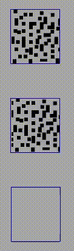
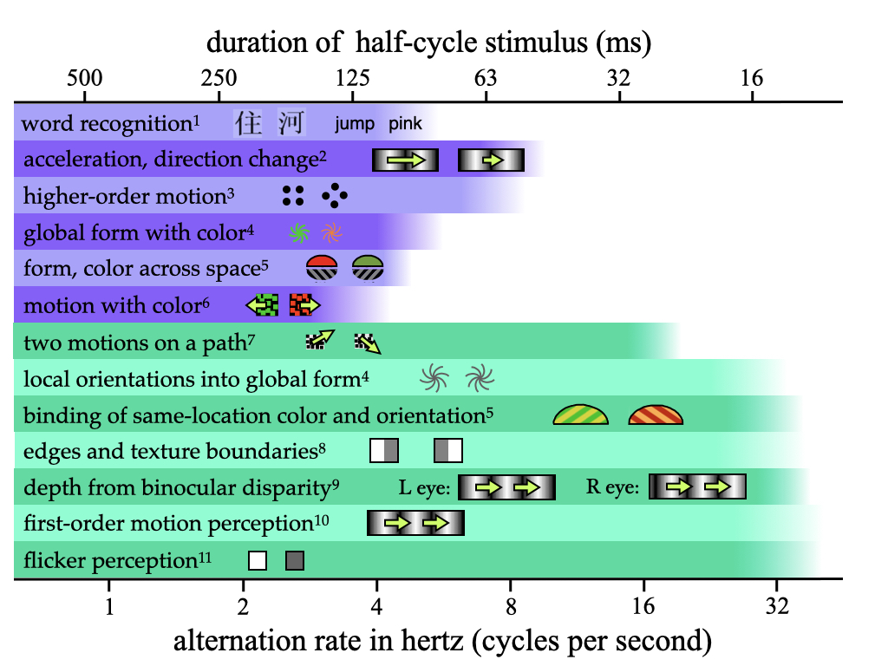
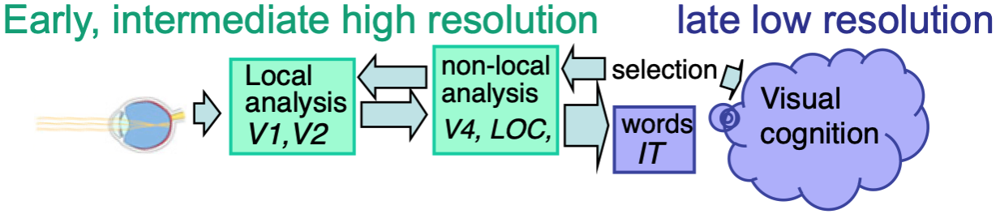
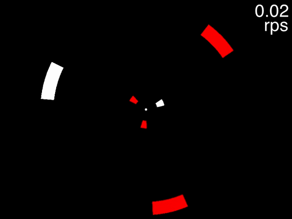
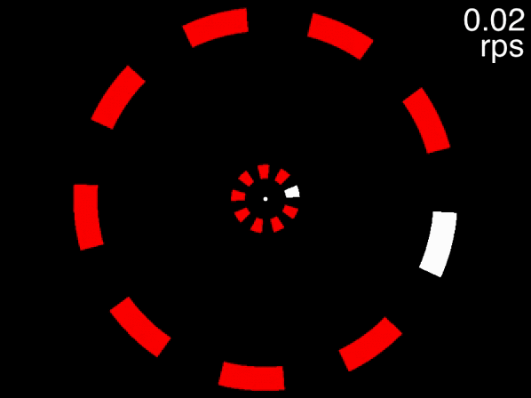
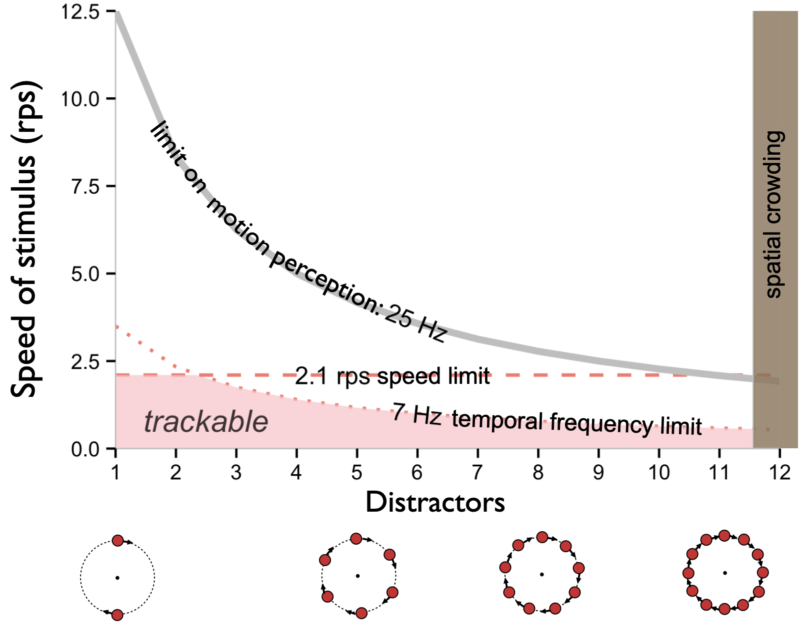
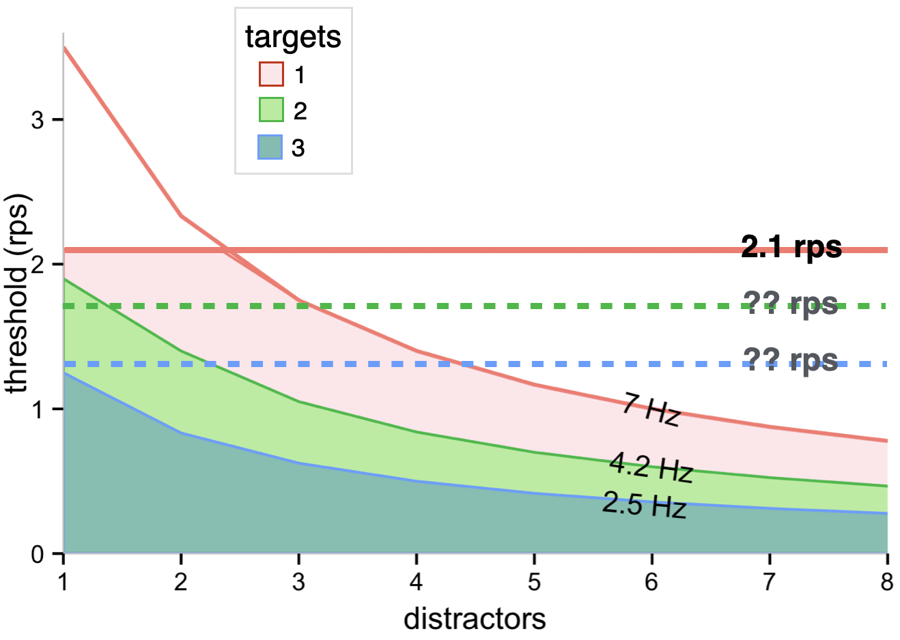
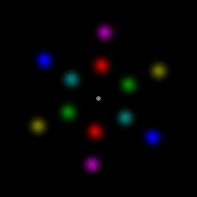
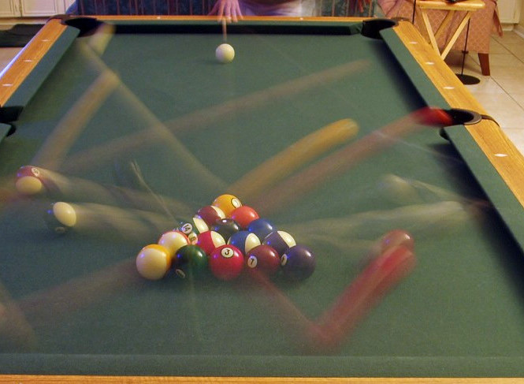

--- 
title: "Attending to moving objects"
author: "Alex O. Holcombe"
date: "`r paste0('Updated on ',Sys.Date())`"
site: bookdown::bookdown_site
# The weird thing is that including only the gitbook command below is enough to create the PDF and ePub as well as the html 
output: 
  #gitbook renders html
  bookdown::gitbook:
      lib_dir: assets
  #pdfbook includes images but not DiagrammeR output, like for peripheral vision demos
  bookdown::pdf_book:
    includes:
      in_header: preamble.tex
    latex_engine: xelatex
    citation_package: natbib
    number_sections: FALSE
    keep_tex: yes
    toc_depth: 1
  bookdown::epub_book: default
  # bookdown::word_document2
documentclass: book
lof: yes
always_allow_html: true
bibliography: [bibliography/CambridgeElement.bib, bibliography/CambridgeElementNewestAdditions.bib, bibliography/packages.bib]  
biblio-style: "apalike"
#csl: apa7-single-spaced.csl
link-citations: yes
url: 'https\://tracking.whatanimalssee.com/'
github-repo: alexholcombe/tracking-review
twitter-handle: ceptional
#For the order of chapters, see _bookdown.yml, where they are manually specified
description: "This is an opinionated book that reviews what we know about multiple object tracking by humans."
#cover-image: "imagesForRmd/threeWiseMonkeys/Three_Wise_Monkeys_640px.jpeg"
---
<!--other titles: Tracking moving objects, How humans track objects, Attending to a moving world -->

# Preface {-}

Cite this as:

Holcombe, A.O. (to appear). Attending to moving objects. Cambridge University Press.

This book reviews what we know about multiple object tracking by humans. It is expected to be published by Cambridge University Press in their [Cambridge Element series](https://www.cambridge.org/core/what-we-publish/elements/elements-in-perception).

<!--You can read this [here on the web](https://tracking.whatanimalssee.com/index.html), as a [PDF file](bookdown-demo.pdf), or as an [e-book](bookdown-demo.epub), which you can import into your Kindle or other e-book reader.--> 

Contact me (he/him) with any comments via [twitter](https://twitter.com/ceptional) or email - alex.holcombe@sydney.edu.au

```{r AlexPhoto, echo=FALSE, out.width="25%"}
knitr::include_graphics("imagesForRmd/corellaOnShoulder2020croppedBlurredByAdobeOnline.jpg")
```

I thank Hrag Pailian and Lorella Battelli for helpful comments, and also thank Hrag Pailian for providing high-resolution figures of his work.

© Alex O. Holcombe 2022

<!--Reviewers: Hyona/Pailian/Saiki for identity chapter; Piers Howe / John Palmer/Daniel Little for serial/parallel; Srimant Tripathy for sensory memory ; Scott Brown at Newcastle for drift diffusion models
-->

<!-- To launch CANVAS VIDEOS, I tried looking at the private hyperlink within the Canvas page and used
https://www.url-encode-decode.com to unescape the characters, but that yields failed launch:

[canvas video](https://sydney.instructuremedia.com/lti/launch?custom_arc_display_download=true&custom_arc_launch_type=embed&custom_arc_media_id=83d5fa8f-2601-4cde-8500-16b22da451f4-79254)

This doesn't work either:
[Canvas video](https://sydney.instructuremedia.com/embed/83d5fa8f-2601-4cde-8500-16b22da451f4-79254)
-->
<!-- CANVAS quizzes - I can't see any way to make external links work, even for a Canvas Commons quiz, it takes you to a bizarro Canvas login https://lor.instructure.com/resources/76da8b14c91a40d885c6fe0452bf33f4?shared -->

<!--Wordcount
From R environment, execute the following after eliminating the references, although it will also count code perhaps?
wordcountaddin::word_count('tracking-review.Rmd')
-->

<!--Exporting to Word: Looked less fucked-up if I first imported the PDF into Google Docs and then clicked Open in->Microsoft Word.app-->

<!--
```{theorem, name="Pythagorean"}
For a right triangle, if $c$ denotes the length of the hypotenuse
```
-->

<!--chapter:end:index.Rmd-->

# Objects that move!

<!--

shell game

Is it just another paradigm for studying attention? No - hemisphere independence, where but not what.

How do we do this and what does that tell us about how the mind works?-->

Attention was one of the earliest topics of scientific psychology. By "scientific psychology", I mean the tradition of laboratory studies that arguably began in the late 19th century. In 1890, William James famously provided a definition of attention that began with "It is the taking possession by the mind, in clear and vivid form, of one out of what seem several simultaneously possible objects or trains of thought." At this time, plenty of experiments were being done, using custom apparatus such as devices that measured response time and presented auditory and visual stimuli.

```{r complication, echo=FALSE, out.width="100%", fig.cap="A 'complication apparatus' from the Harvard laboratory of Hugo Munsterberg. This instrument was used to measure the effect of attention to one stimulus on responses to another.  A subject who focused on one of the numbers on the large dial would have a delayed reaction to the sound of the bell, and vice versa."}
knitr::include_graphics("imagesForRmd/historical/complicationApparatus.png")
```

Hugo Münsterberg, one of the first with a laboratory that studied attention, was highly interested in attention and moving stimuli. His 1916 book **The Photoplay: A Psychological Study** described his theory of the cinema, and included a twenty-page chapter on attention.

When psychology and the study of attention grew rapidly following World War II, the study of visual attention was dominated by static stimuli, often stimuli presented briefly with a tachistoscope. Very few researchers used moving objects, and this continued until the 1980s. This was, in part, a technology issue. Scientific laboratories, or psychology laboratories at least, lagged the technology being introduced to arcades and even of homes. In 1979, the first popular home game console, the Atari, introduced the game Asteroids. <!-- (https://youtube.com/embed/YJZ0hB0Vnyk) -->

```{r Asteroids, echo=FALSE, out.width="100%", fig.cap="Asteroids was released by Atari in 1979."}
#Work-around to make GIFs (but not .mov) work by avoiding including them in non-html outputs!
#https://stackoverflow.com/questions/64038037/can-i-conditionally-exclude-some-elements-code-blocks-from-rendering-to-the-pd
if(knitr::is_html_output()) knitr::include_url("movies/asteroids/asteroids_MichaelLibby_short.mp4") else knitr::include_graphics("movies/asteroids/asteroidsScreenshot.png")
#, height = "250px"
```

The point of the game was to shoot and dodge the asteroids that traveled across the screen from all directions. It paid to monitor multiple moving asteroids simultaneously, to determine which way one should move, or shoot, to prevent a collision. Psychologists, however, were slow to take up the programming of computers to present stimuli, and even slower to use them to create moving stimuli.

Psychologists were slow to use the associated technology to study how people attended to multiple moving objects. In the 1970s, however, Zenon Pylyshyn was pondering the possibility of a primitive visual mechanism capable of "indexing and tracking features or feature-clusters" (as he put it in @pylyshynTrackingMultipleIndependent1988; I haven't been able to get copies of his 1970s reports) as they moved. In 1988,  @pylyshynTrackingMultipleIndependent1988 programmed an Apple II+ computer to create a display with ten identical objects moving on random trajectories,  and connected a telegraph key with a timer to record response times. Finally, he connected an early eyetracker to detect eye movements away from fixation and trigger termination of a trial. Thus he was able to investigate the ability to covertly, without eye movements, keep track of moving objects.

In the experiments of @pylyshynTrackingMultipleIndependent1988, up to five of the ten moving objects were designated as targets by flashing at the beginning of the trial. The targets then became identical to the remaining moving objects, the distractors, and moved about randomly. It was immediately apparent that people could do this. While viewing the display, one has the experience of being aware, seemingly continually, of which objects are the targets and how they are moving about. In [the movie](https://www.youtube.com/embed/lAQM4QJRYV8) embedded below, one is first asked to track a single target to become familiar with the task, and then subsequently four targets are indicated, at different speeds.

```{r MOTdemo, echo=FALSE, out.width="100%", fig.cap="A demonstration of the multiple object tracking (MOT) task, created by Jiri Lukavsky."}
#Work-around to make GIFs (but not .mov) work by avoiding including them in non-html outputs!
#mp4s don't work in R's html viewer that pops up when you build the book, but does work in a real web browser.
#https://stackoverflow.com/questions/64038037/can-i-conditionally-exclude-some-elements-code-blocks-from-rendering-to-the-pd
if(knitr::is_html_output()) knitr::include_url("movies/MOTmovies/MOTdemoLukavsky.mp4") else knitr::include_graphics("movies/MOTmovies/MOTdemoLukavsky.png")
#, height = "250px"
# Jiri uploaded it to https://www.youtube.com/embed/lAQM4QJRYV8
```

But @pylyshynTrackingMultipleIndependent1988 also showed that the processes that underlie tracking are limited in the number of targets that they can faithfully track. Periodically, one of the moving objects flashed, and if the flashed object was a target, the participant was to press the telegraph key. Errors increased fairly rapidly as the number of targets was increased, from 2% of target flashes missed when only one of the objects was a target, to 14% of target flashes missed when five of the objects were targets. 

Long before Zenon Pylyshyn and Ron Storm devised an experiment to formally document this phenomenon, the notion of keeping track of moving objects was already familiar from everyday life. Any adult who has ever been responsible for more than one child while at the beach or at the park has attempted to continuously monitor the locations of those children. Probably every parent has experienced the sudden panic when, perhaps while chatting with some friends, one realizes that one has lost track of a child. On the sports field, players often concentrate on keeping track of the locations of multiple team-mates, the locations of opponents, and their spatial relationships to the ball. In conference halls, scientists monitor the position and posture of other researchers relative to the ones they are chatting to, in order to best time their approach.

<!-- On the road, drivers monitor the movements of others’ vehicles.  At the beach, parents keep watch as their children move in and out of the water.--> 
<!-- In basketball, the player needs to track the individual players of her/his own team, for example to know where the team’s excellent 3-point scorer is currently located. Similarly, a car driver approaching a busy intersection needs to track the whereabouts and movement trajectories of other vehicles and pedestrians in order to decide his/her own move  and in evolutionary history (e.g., keeping track of the weakest members in a herd of prey)-->.

<!--Cups and balls painting either here or in identity section, also with Saiki-->

You won't find much about tracking in chapters about visual attention. The study of visual attention is still dominated by stimuli that don't move. At the same time, what little most psychology researchers think they know about object tracking is wrong. In this book, we'll bust a few myths about tracking and see that studying it has yielded some unique insights about our limited capacities. To start, we'll lay out a bit about what attention is and why it's interesting.

<!--
Keeping track of something that is moving implies that our mind is continually, or at least frequently, updating a representation of its position. Most researchers seem to conceive of this as keeping spatial attention on an object, a sort of spotlight or hill of neural activation that glides across retinotopic cortex. There is evidence for this from neuroimaging. In this article, for simplicity we will refer to the spatial index that changes along with a moving object as a spotlight of attention. This spotlight account is consistent with evidence that probes are more easily detected on targets than elsewhere [@pylyshynPuzzlingFindingsMultiple2006; @searsMultipleObjectTracking2000]. Keep in mind, however, that we do not mean that a hill of activation in spatiotopic or retinotopic cortex exhausts all the processes involved in tracking - there are certainly more.
-->

<!--Along the way we will bust myths such as the common notion that people can track four or five objects, 

Is object tracking just sustained attentional selection, when the objects happen to be moving? Well, a first question fundamentally is how do you keep your attention on the object? The literature on visual search is enormous but is almost exclusively about finding 

Without continuous attentional selection, you not only lose your children

And today, children frequently try to track rapidly moving objects in their own home - like many other things, tracking has come to screens. 
-->


<!--
**speed, and time.** The physical parameters that can limit tracking performance are space, speed, and time. Each plays a role in different circumstances, but the temporal limits are the most misunderstood, as I have discovered in reviewing journal manuscripts over the years, even though they may be the most fundamental. This section will explain spatial limits, speed limits, and temporal frequency limits on tracking (based in part on three papers from my lab), and how they illuminate other issues such as the relationship of tracking to basic motion and position perception.
-->


<!--chapter:end:01-outline.Rmd-->

# Bottlenecks and capacity {#bottlenecks}

What is fourteen times eleven? You may be able to calculate that in your head, but it would likely take you at least a few seconds to do so. And if I set you two problems rather than just one, for example I asked you to also divide sixty-eight by seventeen, you would do the two problems one at a time. Indeed, our minds may be completely incapable of doing two such problems simultaneously [@oberauerAccessInformationWorking2002; @zylberbergBrainRouterCortical2010a].

Such limitations are remarkable given that each of our brains contains more than 80 billion neurons. Simple limitations like these speak to the importance of the architecture of the mind, in particular its bottlenecks, to understanding our abilities.

Multiplying and dividing two-digit numbers are not something that most of us do every day - if we did, perhaps we could do them much faster. A task we do have daily practice with, however, is reading. Yet despite years of daily practice for many of us, a large body of evidence suggests that humans can read at most only a few words at a time, and much research further indicates that we can only read *one* word at a time [@whiteEvidenceSerialProcessing2018; @reichleEncodingMultipleWords2009]. It seems, then, that at least some of the bottlenecks of human information processing are a fixed property of our processing architecture.

To flesh out the way the word 'bottleneck' is used in this context, imagine a standard soft drink bottle. Most of the volume of the soft drink is in the bottom, wide part of the bottle. If one holds the bottle upside-down, most of the contents of the bottle will press down on the narrow neck, and this neck restricts the rate at which the contents can exit the bottle. As a metaphor for the mind, a large volume of signals from across the visual field press up against more limited-capacity brain areas. The large volume of visual signals is crated by the large array of neurons that we have in the retina and a few subsequent areas that process signals in parallel.

The parallel processing prior to the bottlenecks is sufficient to get certain tasks done. In the below display, for example, you should be able to find the blue objects very quickly.

```{r findBlue, echo=FALSE, fig.cap = "Thanks to featural attention, you should be able to find the blue circles very quickly.", fig.height = 2.0, fig.width=2.5}
#bookdown-demo_files/figure-html/unnamed-chunk-9-1.png ?
library(ggplot2)
library(tibble)
pts<- expand.grid(x = seq(2,16,2), y = seq(2,16,2), type = c("distractor"))
jittr<-.4
pts$x <- pts$x + runif(length(pts$x))*jittr-jittr/2
pts$y <- pts$y + runif(length(pts$y))*jittr-jittr/2
pts$type <- as.character(pts$type)
pts$type[c(1,4,6,8,11,12,13,16,20,25,26,30,33,37,41,44,47,48,52,55,59,60)] <- "distractor2"
pts$type[c(13,26,46)] <- "target"

ymin<-600; ymax<-2000
ggplot(pts,aes(x=x,y=y, color=type)) + geom_point(size=6)  +  theme_void() + theme(legend.position = "none")
#+ ylim(ymin,ymax)
```

Our visual system processes each of the shapes simultaneously, which can make the locations of the blue objects available very rapidly when you choose to attend to blue. Some brain areas, however, do not have neurons that can recognize objects dedicated to each bit of the visual field. Instead, their simultaneous processing capacity is limited. The processes required to recognize words are one example.

For a limited capacity process such as word recognition to do its job, something is needed to pick out, from a crowded scene, just one or a few objects for these processes to recognize. This something is often referred to as *selective attention*. <!--Different visual abilities seem to have different capacities, and it is not at all clear that a common selective attention process is responsible for gating all of their inputs.-->

Limited-capacity processes impose some of the most severe constraints on human performance. By studying them, we can gain insights into what it is to be human, a conscious create capable of thinking about only a very few things at any one time.

Among visual judgments, word recognition seems to be an extreme case, having a capacity of only about one object [@whiteVisualWordRecognition2020]. As demonstrated above, some visual searches reflect processing that can be described as massively parallel, but much other processing falls somewhere in between. That is, the processes underlying some of our abilities are limited in capacity, but not as limited as word recognition seems to be. As we will see, object tracking seems to be one such ability.

That our tracking processes are capable of tracking more than one moving object simultaneously is very useful, because by being aware of the current location of objects of interest, we are able to rapidly deploy all our attentional resources to any one of those locations, allowing more limited-capacity processes to deliver rapid results. When focused attention is applied to an object, that allows even our most limited-capacity processes to operate on the object, which seems to be necessary to, for example, make fine shape discriminations or recognize a word.

A major misconception about object tracking has become widespread, and it relates to the nature of tracking's capacity limit. <!--See the next section.-->

<!--CROSS-CHECK WITH PSYC2016 TEXT
@duncanSelectiveAttentionOrganization1984 was interested in how many objects we can process at a time. He found that accuracy for making a simple visual judgment about an object was much worse when one needed to simultaneously make a judgment about another. For example, participants were asked to judge whether a briefly-presented rectangle was small or large and also judge whether a simultaneously presented line was dotted or dashed. Performance was worse FOR the two-object condition even in comparison to a single-object condition where two judgments also needed to be made. The participants had to make either two judgments about a single object or one judgment about one object and the second judgment about a different object. To Duncan, his finding that performance was substantially worse in the two-object condition indicated the existence of a bottleneck at a stage that processes objects. He wrote that 

> Findings support a view in which parallel, preattentive processes serve to segment the field into separate objects, followed by a process of focal attention that deals with only one object at a time.

This conclusion was an over-reach. Performance was better than one would expect if only one object were processed, unlike what has been found for word processing. Duncan could explain that by saying that the presentation time was adequate for focal attention to, on *some* trials, process more than one object. Alternatively, however, it may be that the relevant processes *can* handle two objects at a time, but they do so more poorly than for one object. Work that credibly claims that a visual ability is truly limited to one object at a time is hard to find; the reading of words may be an exception.-->


<!--chapter:end:bottlenecks.Rmd-->

# The biggest myth of object tracking {#biggestMyth}

In 2010, @doranRoleVisualAttention2010 wrote that "the main finding" from the object tracking literature "is that observers can accurately track approximately four objects and that once this limit is exceeded, accuracy declines precipitously." Similarly, writing about the "object tracking system", @piazzaNeurocognitiveStartupTools2010 wrote that "One of the defining properties of this system is that it is limited in capacity to three to four individuals at a time". This is a myth.

Two claims are often involved, but some papers only refer to one of the claims. The first claim is that there is a constant limit of around four objects. The second is that accuracy declines precipitously when the limit is reached. Typically authors make a vague statement that might be taken to refer to either or to both claims. Here are some examples: "People’s ability to attentively track a number of randomly moving objects among like distractors is limited to four or five items"  <!--cites Pylyshyn Storm 1989--> [@fougnieDistinctCapacityLimits2006],  <!-- which cites Scholl's objects paper which makes the claim of 4 FINSTs but backs it up only with STM etc. type studies --> "researchers have consistently found that approximately 4 objects can be tracked"  @alvarezHowManyObjects2007, "people typically can track four or five items" @chesneyEvidenceSharedMechanism2011 <!--cites Pylyshyn 1989-->, "participants can track about four objects simultaneously" @vanderburgChangesNotDifferences2019 <!-- (see Cavanagh & Alvarez, 2005, for a review; Pylyshyn & Storm, 1988)-->. In each of these cases, I have checked the evidence provided, and the papers cited, as well as the papers those cited papers cite. Each paper provides no evidence supporting the claim that performance decreases very rapidly once the number of targets is increased above some value. Those with relevant evidence find only a gradual decrease in performance as number of targets is increased, with no discontinuity; not even a conspicuous inflection point. For example, @oksamaMultipleObjectTracking2004, which is sometimes cited in this context, designated between two and six objects as targets, among twelve identical objects in total. After the objects moved around randomly for five seconds, one object was flashed repeatedly and participants hit a key to indicate whether they thought it was one of the targets. The proportion of trials in which participants were wrong increased steadily with target size, from 3% incorrect with two targets, to 16% incorrect with six targets. Note that even with six targets, participants were performing substantially better than would be expected if they could only track one or two and had to guess on the others.

@pylyshynTrackingMultipleIndependent1988 seems to be the paper most frequently invoked when a limit of four objects is claimed. But @pylyshynTrackingMultipleIndependent1988 found a quite gradual decrease in performance (their Figure 1) as the number of targets was increased from one to five, and five was the most targets that they tested. In their discussion as well, they did not state that there is a hard or precipitous limit. In 1994 however, Pylyshyn and others did write that it is "possible to track about four randomly moving objects", even though earlier in that paper they contradict this somewhat by writing "at least four"  [@pylyshynMultipleParallelAccess1994]. I suspect that some cases of this sort of slide toward backing a hard limit reflects a desire for a simple story. It may also stem from an unconscious oversimplification of one's own data, as well as the theoretical commitment of Pylyshyn to the idea that tracking is limited by a set of discrete mental pointers.

Recall that the myth is associated with two claims, not just that there is a "limit" after which performance decreases rapidly, but also that this limit is consistently found to be about four. Because the published evidence indicates that the first claim is incorrect, let's put that aside and consider a softer version of the second claim. Specifically, is it the case that tracking performance falls, even if not rapidly, to some particular level, such as 75% correct, at about four targets? Instead of a percent correct criterion, one might alternatively use a criterion like the halfway point from ceiling to chance performance, or the "effective number of items tracked", which is calculated by applying a formula to percent correct together with the number of targets and distractors [@schollWhatVisualObject2001]. Charitably, this may be what @alvarezHowManyObjects2007 meant when they wrote: "researchers have consistently found that approximately 4 objects can be tracked (Intriligator & Cavanagh, 2001; Pylyshyn & Storm, 1988; Yantis, 1992)." To be fair, the cited early studies are arguably compatible with this statement. <!-- Alvarez & Franconeri (2007)  "researchers have consistently found that approximately 4 objects can be tracked (Intriligator & Cavanagh, 2001; Pylyshyn & Storm, 1988; Yantis, 1992). The similarity of these estimates, combined with the frequency with which 4-item limits arise in other attention tasks, suggests the possibility that there is a “magical number 4” in visual attention (Cowan, 2001; Pylyshyn, 1989)."  neither said any such thing, it seems from my reading of those papers, e.g.  Pylyshyn & Storm 1988 only went up to 5 out of 10 and there was gradual decrease in performance all the way through. --> <!-- Papers I have checked for the 4-object claim: Cowan, 2001 claimed it for MOT, citing Pylyshyn et al. 1994, which does say "experiments showing that observers can simultaneously track some three to five identical target items" but then when he describes the studies he doesn't say they show that, even though in the discussion he says "One is that it is possible to track about four randomly moving objects" -->
<!-- In some cases the problem stems from Scholl Pylyshyn Feldman paper that devised the effective tracking capacity measure assuming 100% accuracy for one object and delivering a single number, often 4, for effective number tracked--> However, work published over the last fifteen years has revealed this to be an artifact of researchers using similar display and task characteristics. One of the most salient of these characteristics is object speed.

@alvarezHowManyObjects2007 tested participants with a display of sixteen discs wandering about the screen. They found that the fewer the number of discs they designated as targets, the faster the participants could track each target. In other words, with few targets, participants could track them even when they moved at high speeds. This trend continued as the discs' speed was increased, such that at very high speeds, participants could track only one object with reasonable accuracy. This indicated that the truth of the idea that participants can track four objects is entirely dependent on the speed of those objects. Supporting evidence for this was found by my lab [@holcombeExhaustingAttentionalTracking2012].

Soon, other display parameters that affect the number of objects that can be tracked were discovered, in particular object spacing [@franconeriEvidenceSpeedLimit2008; @holcombeObjectTrackingAbsence2014]. As we will be discussed extensively in section \@ref(twoBrains), one aspect of spacing is that tracking performance can depend greatly on whether the targets are distributed between the left and right hemifields or instead are confined to one hemifield.

In summary, it is incorrect to say that people can track about four moving objects, or even that once some number of targets is reached, performance declines very rapidly with additional targets. The number that can be tracked is quite specific to the display arrangement, object spacing, and object speeds. If a researcher is tempted to write that "people can track about four objects", the immediate context ought to stipulate that this refers to certain tasks, display characteristics, and performance measures, something that I have almost never seen in the literature.

Almost exactly this issue also arose in a different research area.  A diverse set of two dozen working memory researchers attended a workshop in 2013 with the express purpose of "developing benchmarks for models of working memory". They grappled with, among other issues, how to characterize the limit on how many items people can remember. In a paper that stemmed from the discussions at the workshop, the researchers pointed out that "observed item limits vary substantially between materials and testing procedures" [@oberauerBenchmarksModelsShortterm2018]. However, they suggested that much of this variability could be explained by humans' ability to store groups of items as "chunks" and thus the group endorsed a statement that there is a limit of "three to four chunks" [@cowanMagicalNumberShortterm2001a]. These researchers believed they could explain the observed variability in experiments' results by a common underlying limit of three to four chunks that manifests as different observed item limits depending on circumstances, in particular the opportunity for chunking.

In the case of MOT, it remains possible that researchers will be able to identify a set of circumstances that consistently yield a mean tracking limit of three or four targets (if "limit" is defined as performance falling to a particular level on some performance metric). Perhaps these circumstances will simply be certain spacings, speeds, object trajectories, and number of objects in a display. Ideally, however, some underlying construct (the counterpart of chunks for memory) would be identified to explain how performance changes when other circumstances are used. That would constitute real progress in theory development. However, I don't see anything like that in the literature currently.

<!-- At this point,  to defend the claim that people can track "about four objects" is to suggest that the studies that have found four targets to be the number that can be tracked . Is there something special about  these speeds. Nobodh justified them with ecological analysis-->

## Different tasks, same limit?

Even with the idea that there is a particular number of objects one can track discarded, there remains a related claim, one common in the literature, that conceivably could still be viable. This claim is frequently tangled up in the myth reviewed above, for example it may be stated as the idea that there is a "magical number four". After discarding the attachment to a particular number, the essential notion is that very different tasks have the same number-of-objects limit. For example, @bettencourtSharedFilteringProcesses2011 stated that "both processes [visual short-term memory and MOT] showing an equivalent four-object limit", and @piazzaNeurocognitiveStartupTools2010 similarly claimed that visuo-spatial short-term memory, ultra-rapid counting (subitizing), and multiple object tracking all share a limit of "three or four items".

For more than a hundred years, it has been claimed that there is a discrete limit on the number of objects that can be, at a glance, counted [@jevonsPowerNumericalDiscrimination1871]. This "subitizing" or numerosity perception ability has been extensively investigated, and some consider the idea of a sudden decrease in accuracy when the number of objects shown goes from less than four to more than four as well-supported [@revkinDoesSubitizingReflect2008]. Four objects and fewer is frequently referred to as the "subitizing range", with performance approximately as good for rapidly counting four objects as it is for two or one. Note that this is very different than in tracking, for which speed thresholds decline rapidly from one to two targets, as well as to three and four. For visual working memory, which as we mentioned several experts have characterized as being limited to three or four chunks, whether there is a discontinuity after four objects or at any point remains highly debated [e.g. @robinsonThereCapacityAssessing2020].

At the level of a common limit in terms of number, then, it remains unclear whether tasks such as object tracking, visual working memory, and subitizing can be said to have a common limit. Ideally this could be confirmed by measuring the limits for all three tasks using the same stimuli, but it is unclear how to equate the information available across tasks. Especially difficult is comparing performance with the briefly-presented static stimuli used in subitizing and working memory tasks to the extended exposures of moving stimuli needed to assess object tracking. A modeling approach could make progress on this issue, although it would require making assumptions that might need novel empirical support. Another approach is to determine which tasks' limits co-vary between individuals. This is reviewed in section \@ref(abilities).

<!-- https://psyc2016.whatanimalssee.com/bottlenecks.html#a-bottleneck-for-object-judgments -->

<!--Working off the dominant framing, that each person does have a specific number of targets they can track which determines percent correct for each level of number of targets, some MOT researchers report what @schollWhatVisualObject2001 called the "effective number of items tracked". The associated formula, refined by @hullemanMathematicsMultipleObject2005a allows researchers to calculate the effective number of items tracked based on accuracy in an individual condition, given the number of targets and distractors in that condition. This does provide a useful summary of the data, but researchers should take more care to avoid taking it literally.--> <!--Still, it does seem that the number four pops up more than would be expected if these abilities were unrelated. -->

To summarize this chapter, there are three common misconceptions about what has been shown about object tracking. The one that we have just discussed is that different tasks show the same limit. This may actually be true, but I know of no research that have used the same display and task settings to adequately back this up. In the previous section of this chapter, we saw that it is not justified to say that as the number of targets is increased to about four, performance falls to a certain criterion level. One must specify particular display and task characteristics in order to make that statement true. A final misconception is that performance falls very rapidly when one increases the number of targets past a particular number (the "limit").

Given that tracking performance does depend greatly on circumstances and falls gradually rather than displaying a discontinuity at a particular target number, what are the implications for how tracking works? Briefly, these characteristics of tracking are consistent with resource theories, which are discussed in Chapter \@ref(whichAspects).

<!--chapter:end:theBiggestMyth.Rmd-->

# Unitary cognition (C = 1 processes) {#Cequals1}

Perhaps tracking benefits from two resources. One can process multiple targets simultaneously, even if it processes them more poorly than it processes a lone target. This is what most researchers are interested in, and what they think their data directly speaks to. However, there may be a second recourse involved.

Some cognitive researchers think that aspects of cognitive processing are unitary and can only operate on one thing at a time [@oberauerAccessInformationWorking2002]. This may be what limits us to doing only one 2-digit mental multiplication problem at a time. When applied to tracking, it means you can apply your full intelligence and powers of reasoning to tracking that target, for example to use what you've learned about object trajectories to predict future positions. I will refer to this as a C=1 process because its processing capacity may be only object.

## An inconvenient possibility
 
<!---This reflects a unitary focus of attention that has an approximate capacity of only one.-->
The possibility that there are two resources that can benefit tracking makes interpreting the results of experiments complicated. It makes a lot of the results trumpeted by tracking papers uninteresting because they could be due to our cognitive abilities operating on a single target, rather than those results speaking to the tracking resource that we can distribute to multiple targets. Many papers that come out of the experimental psychology tradition content themselves with showing that that a factor matters for performance, p < 0.05. Never mind *how much* the factor matters. The p < 0.05 is the only goal. But if the effect is small, its existence could be explained by the unitary C=1 resource. This kind of thinking is a real problem across psychology, and in tracking as elsewhere, it frustrates me. 

As an example, a paper might say that people track multiple objects more accurately with predictable trajectories than with unpredictable trajectories. Well, unless you tell me a lot more, I have to think that may simply be due to our central thought processes operating on just one target. We will describe ways this might be assessed in chapter \@ref(beyondLocation); for now my point is just that this is something to watch out for.

<!--(as opposed to psychophysics, which is more quantitative) -->

If the point remains slightly obscure, another way to put it is that by using our capacity for reasoning and symbol manipulation, we can perform a wide array of arbitrary tasks. We therefore should not be surprised by our ability to track a *single* target. We know that we have a visual system that makes the position and direction of motion of objects on our retina available to cognition, and that using our ability to think about where an object is going and deliberately move our attention to a future anticipated location, we might muddle through tracking a single object.

Even when participants are asked to track several targets, then, one can expect that C=1 processes are contributing to overall performance, even if they are only involved in the processing of one of the targets. Thus, when researchers contrast tracking performance with different numbers of targets, one reason for the decline in performance may be that C=1 processes are, in each condition, processing only a single target, so performance declines in inverse proportion to the number of targets.

<!-- Unfortunately, researchers frequently neglect the fact that two sorts of mental abilities likely contribute to MOT performance: one or some limited in capacity to just a single target, and others with a greater processing capacity.  -->


<!--chapter:end:Cequals1.Rmd-->

# Which aspect(s) of tracking determine performance? {#whichAspects}

The bottleneck idea communicates that certain brain processes can only operate on a limited number of visual representations. We can therefore think of those brain processes as a limited resource. To understand why we can track several objects in some circumstances, but only a few in others, we must distinguish between display factors that impose data limitations on tracking, and display factors that impose resource limitations. <!--We've already covered C=1 processing, grouping, and the nature of the objects themselves, in Chapters \@ref(objects) and \@ref(grouping).-->

The "data" in data limitation refers to sensory data [@normanDatalimitedResourcelimitedProcesses1975]. If a target moving on an unpredictable trajectory moves outside the edge of our visual field, it is a lack of data that prevents it from being tracked. No amount of mental resources can overcome a dearth of data about an unpredictable stimulus. Data limitations may also occur when sensory signals are impoverished, even if not entirely absent. For example, an object traveling at a rate faster than our neurons can register cannot be tracked due to a data limitation. So, the data being referred to here are not the pattern of light falling on the retina, but rather that light after it has been processed by the retina and after additional preattentive sensory processing.

People with poor visual acuity may perform less well on a task than people with high visual acuity, again due to differences in the sensory data that they have to work with. Thus, some individual differences are almost certainly due to data limitations rather than variation in tracking processes between people. when performance is data-limited, bringing more mental resources to bear may provide little to no benefit. The classic way that this is investigated is by varying the number of stimuli one needs to process. @normanDatalimitedResourcelimitedProcesses1975 illustrate this with a visual search study. If the number of stimuli one must evaluate does not affect how well a person can perform a task, this suggests that the task is data-limited rather than resource-limited, because performance is the same regardless of the proportion of the putative resource can be devoted to it. <!-- More reflections on the relation of the resource concept to underlying mechanisms is in Chapter \@ref(spatialInterference). -->

When a process is resource-limited, that typically is more interesting for those interested in visual attention and the capacity limits on mental processing. When response time or error rate increases with the number of distractors presented in a visual search task, that was classically interpreted as meaning that a resource-limited process is required for success at the task. As they say, however, science is hard. An elevation in e.g. error rate will also occur even if there is no resource limitation, but each additional distractor has a non-zero probability of being mistaken for a distractor, then there will be more errors with more distractors even if the probability of successfully evaluating each individual stimulus remains unchanged [@palmerAttentionVisualSearch1995]. 

The particular number of objects that can be tracked with reasonable accuracy is thus highly dependent on stimulus conditions, and some of these conditions may reflect data limitations rather than a resource limitation. Still, even in ideal conditions it seems clear that the number of objects that can be tracked is much less than the number of objects that are simultaneously processed by early stages of the visual system. There is a resource limitation, and we'd like to know which factors consume the resource. Another way to think of this is with the term that I prefer, "resource-intensive". If a deleterious stimulus factor that worsens performance is resource-intensive, this means that increasing the amount of resource devoted the stimulus can compensate for that stimulus factor.

One example is object speed. An increase in object speed can hinder performance, but reducing the number of targets, which provides more resource to the remaining targets, can make up for that. Speed, then, is resource-intensive (although as we will see in chapter \@ref(speedAndTime), there is more going on with speed than most believe). Of course, speed also can result in a data-limitation, at very high speeds, but long before such speeds are reached, speed is resource-intensive.

<!--When we discover a stimulus factor that affects multiple object tracking performance, it is worthwhile to ask whether that factor is taxing a resource-limited process or a data-limited process. That is, will increasing the number of targets exacerbate the effect of that factor?-->

In summary, to say that tracking is capacity-limited is important but not very illuminating. We want to know more about why people perform more poorly with more targets. Tracking is a complex task, and we would like to know which aspect(s) of it exactly are most capacity-limited, or "resource-intensive".

## Which factors

A top priority among tracking reseachers is understanding the reasons that tracking performance falls with the number of targets to track. Several ideas have been advanced in the literature. Perhaps spreading the tracking resource among more targets results in

* Less frequent sampling of each target.
* More noise in the representation of the spatial location of each target.
* Poorer predictions of where the targets are going, which then hinders tracking.
<!-- * Fewer neurons devoted to solving the correspondence problem. (the correspondence problem will be explained later)-->

Progress on these issues has been slow. One approach in the literature has been computational modeling. Multiple researchers have proposed models, compared their performance on human data, and declared their model a success. Rarely, however, have they quantitatively compared their model to that of another group of researchers, making it difficult to know whose model is best or whether the data simply doesn't strongly favor one model over another.

An approach that I favor is to start with a task analysis with some conjectures regarding what aspects of MOT trajectories might lead to errors, based on what we know about visual processing, and then manipulate the incidence of those aspects to test those conjectures. Once an aspect seems to be isolated (or nearly isolated) by a particular manipulation, one can measure how resource-intensive that aspect's errors are.

Here I will list a few factors that studies suggest are important.

<!--1. Spatial selection of multiple locations (even static ones)-->
1. Spatial interference
1. Temporal interference
1. Object speed <!--limit of attention-following-->
1. Use of motion direction


<!-- Each of these processes could be resource-limited or not resource-limited. That is, some of these effects may be bigger when one is attending to more targets. This helps fractionate tracking into different kinds of constituent processes -->

<!-- 
## Spatial selection of multiple locations

## Spatial interference

## Temporal interference

Temporal interference is analogous to spatial interference, just in time rather than in space. Spatial interference refers to a processing impairment when one object comes closer than a certain spatial distance to a second object, at one time. In contrast, temporal interference refers to when an object comes closer than a certain temporal distance of another, at one point in space.

The objects in typical MOT displays often travel over locations formerly occupied by another moving object. That is, after one object passes over a location, another will pass over the same location, some amount of time later. If temporal interference is a factor in object tracking, then if the amount of time that separates the two objects occupying a location is short enough, tracking will be impaired.

If objects are moving fast enough, they are perceived to blur together, because some parts of the visual system integrate over several dozen milliseconds [e.g., @hogbenPerceptualIntegrationPerceptual1974]. A more interesting question is whether temporal interference occurs on a longer timescale, more relevant to the speeds and spacings typically used in MOT tasks.

## Speed limit of attention-following

-->

In the coming chapters I will explain at length what these factors are. Of particular interest is whether each factor is resource-intensive. The table below provides an oversimplified summary of what I think we know. The degree to which each factor is hemifield specific is also included in the table, because as we will see in Chapter \@ref(twoBrains), knowing that is very important. The literature has not done a good job at determining how resource-intensive some of these factors are, hence some question marks are included in the table. 


```{r table-limits, tidy=F, echo=F}
#Create a table with column indicating how resource-intensive each factor is thought to be and how much of the load effect is borne by a hemisphere-specific effect.
library('tibble')
tt<- tibble(factor=c("spatial interference","temporal interference","speed limit","use of motion direction"),
            `resource intensiveness` = c("low?","high","unknown","C=1 only?"),
            `hemifield specificity` = c("medium","high?","unknown","unknown"),
            `contribution to standard MOT` = c("medium to high","unknown","low?","low"),            
            )
  
knitr::kable(
  tt, booktabs = TRUE,
  caption = 'Factors that affect MOT performance'
)
# https://bookdown.org/yihui/bookdown/tables.html
```

By "contribution to standard MOT", the fourth column of the table, I mean the degree to which the factor determines performance in a task with the relatively unconstrained trajectories that most researchers use.

Before going on to address each of these factors, I would also like to address a factor that is somewhat different in kind.

## Duration that one can sustain attention

Tracking may be, in part, a test of how long one can sustain attention. If a participant gets distracted or starts day-dreaming, that participant might completely stop tracking and, when their attention returns, not know the last locations of the targets. Lapses of attention are a problem in most other laboratory tasks as well, of course, but they are often thought to be particularly important for tracking because tracking requires a longer continuous engagement with the stimuli than for other common laboratory tasks. This is because the trials last for several seconds, typically, and the stimuli are continuously moving, so shifting one's attention away from the display can mean losing the targets.

This greater vulnerability to attentional lapses means that tracking may be more affected by motivation than many other tasks involving visual judgments. Introspectively, it does feel that way to me, relative to many perceptual tasks where I feel I only need to attend for the split-second when the stimuli are presented, and the percept I need to report jumps out at me. The possibility that variability in motivation drives a lot of variability in tracking performance is unfortunate, because we don't study tracking because we're interested in motivation.

It is also possible that the ability to continuously sustain attention may be distinct from general motivation and may cause a lot of variation in tracking. Like motivation, this could hinder efforts to get at the mechanisms specific to tracking that are not simply sustained attention. On the other hand, sustained attention and the limited resource that allows one to track a certain number of targets may be linked. That is, having to track more targets may reduce the amount of time that one can sustain attention on the task. Fortunately, the results of @wolfeMultipleObjectJuggling2007 suggest that this may not be the case.

In Experiment 3 of @wolfeMultipleObjectJuggling2007, participants were required to track four targets for a period of ten minutes. Every ten seconds or so, one object was highlighted and participants had to indicate whether it was one of the targets. In a no-feedback condition, participants were not told whether their individual responses were correct. In that situation, performance was substantially worse in the last few minutes of the trial than in the first few minutes (78% correct vs. 65% correct). However, in the feedback condition wherein participants were told immediately after each judgment whether they were correct, performance did not appear to decline over time. These results suggest that if participants are adequately motivated by feedback, they have considerable ability to track for several minutes with no appreciable loss. The comparison between the feedback and no-feedback conditions is not perfect as the feedback does provide a cue that can increase performance (when participants get the probe wrong, they can increase subsequent performance somewhat by switching to another target), but this confound does not seem to be able to explain the lack of almost any performance loss in the feedback condition.

The circumstances used by @wolfeMultipleObjectJuggling2007 were quite different from a prototypical MOT task, not least because of the extended durations of the trials. Most researchers use trial durations of less than ten seconds, which likely means that a decrease in performance with time due to waning attentino is less of an issue. It seems likely that motivated participants can attend for several seconds before their attention wanes substantially. @oksamaMultipleObjectTracking2004 did find a substantial decrease in performance for trials of 13 s compared to trials of 5 s. With four targets, for example, performance fell from 91% correct to 74% correct, and this decrease was somewhat greater for larger numbers of targets than for fewer targets. Byrne & Holcombe (unpublished data) did not find any significant decrease over a comparable interval, and the explanation for these discrepancies is uncertain, although it may again be related to participants' motivation.

The reason for the reduction in performance with greater time observed by @oksamaMultipleObjectTracking2004 may easily be due to another factor rather than an increase in lapses of attention. In the MOT tasks used by all of these researchers, with longer trials there is likely to be more instances of potential spatial interference, temporal interference, and running afoul of any tracking speed limit. Thus, if any of those factors matter, they could explain the decrease in performance with time. However, the @wolfeMultipleObjectJuggling2007 does seem to provide a kind of existence proof that lapses of attention need not be the limiting factor. Granting that that may be the case, an additional question is why, if other factors are in operation, there was *no* evidence of a performance decrease over time in @wolfeMultipleObjectJuggling2007? Well, @wolfeMultipleObjectJuggling2007 averaged performance over approximately the first third of the ten-minute interval and compared it to the last third. In the feedback condition, it is possible that all the worst possible events (such as close approaches, causing greater spatial interference) had already occurred by the end of the first third, so whatever level of performance participants were left with at that point already reflected their capacity to track through the most difficult events, which they were then able to continue to do until the end of the trial. Over a shorter time range such as that used by @oksamaMultipleObjectTracking2004, this may not have been the case.

I know of no studies of what display characteristics make tracking performance more vulnerable to attentional lapses. It stands to reason that if objects are moving very slowly, a lapse may be less detrimental because if after the lapse, one still remembers the last-monitored locations, the targets may still be near them. @fencsikRoleLocationMotion2007 showed that people can reacquire targets after a 300 millisecond disappearance, and @alvarezMultielementVisualTracking2005 showed that people can do this after being interrupted by a second task, although these interruptions are obviously different than an attentional lapse, during which it's not clear how often people forget the target locations.

Vigilance tasks such as the gradual-onset continual performance task are expressly designed to assess sustained attention and lapses over an extended interval, and an individual-differences study by @trevinoBridgingCognitiveNeuropsychological2021 found that MOT performance had little correlation with a five-minute gradual-onset continual performance task. This is somewhat reassuring as it, like some of the other evidence I have mentioned, suggests that lapses are not a major determinant of MOT performance.

<!--chapter:end:whichAspects.Rmd-->

# Spatial interference {#spatialInterference}

Details of the world that are much smaller than ourselves, like the fibers of a piece of paper, or the individual blotches laid down on paper by a printer, are inaccessible to the naked eye, largely because our photoreceptors are too widely-spaced. This is a familiar limit on our visual abilities, one that is measured every time we go to the optometrist. Line segments or objects that are too close together are experienced is a single unit.

Critically, even when two objects are spaced far apart enough that they can easily be seen to be two objects rather than one, they are not processed entirely separately by the brain. Receptive fields grow larger and larger as visual signals ascend the visual hierarchy, and this can result in a degraded representation in the visual system for objects that are near each other. In other words, spatial interference ensues.

<!--Decades before @franconeriHowManyLocations2007 conducted experiments on the selection of multiple locations with different densities, researchers had recognized the existence of spatial interference in dense displays-->
A large body of psychophysical work has investigated the display densities that impair object perception. Common tasks in this literature include letter identification and grating orientation discrimination [e.g., @wolfordPerturbationModelLetter1975; @korteUberGestaltauffassungIm1923; @strasburgerDancingLettersTicks2014].

```{r, echo=FALSE, fig.cap = "When one gazes at the central dot, the central letter to the left is not crowded, but the central letter to the right is."}
DiagrammeR::grViz("digraph {

graph [layout = dot, rankdir = LR]

# define the global styles of the nodes. We can override these in box if we wish
node [shape = rectangle, style = filled, color=White, fillcolor = White, fontsize = 40]

a [label = 'O']
fixation [label =  '', shape=circle, fillcolor=Black, width=.2, height=.2]
b [label = ' ']
c [label = ' ']
d [label = 'J']
e [label = ' ']
e2 [label = ' ']
e3 [label = 'S']

f [label = 'O']
g [label = 'R']
h [label = 'L']
i [label = 'H']
j [label = 'Y']
k [label = 'M']
l [label = 'S']

# edge definitions with the node IDs
edge [label='', penwidth=0, arrowsize=0]
a  -> b;
edge [label='', penwidth=0, arrowsize=0]
b -> c
edge [label='', penwidth=0, arrowsize=0]
c -> d
edge [label='', penwidth=0, arrowsize=0]
d -> e
edge [label='', penwidth=0, arrowsize=0]
e -> e2
edge [label='', penwidth=0, arrowsize=0]
e2 -> e3
edge [label='', penwidth=0, arrowsize=0]
e3 -> fixation

edge [label='', penwidth=0, arrowsize=0]
fixation -> f
edge [label='', penwidth=0, arrowsize=0]
f -> g
edge [label='', penwidth=0, arrowsize=0]
g -> h
edge [label='', penwidth=0, arrowsize=0]
h -> i
edge [label='', penwidth=0, arrowsize=0]
i -> j
edge [label='', penwidth=0, arrowsize=0]
j -> k
edge [label='', penwidth=0, arrowsize=0]
k -> l
}")
```

In the above display, if you gaze at the central dot, you likely will be able to perceive the middle letter to the left fairly easily as a 'J'. However, if while keeping your eyes fixed on the central dot you instead try to perceive the central letter to the right, the task is much more difficult. This spatial interference phenomenon is called "crowding" in the perception literature.

Most studies of crowding ask participants to identify a target such as a letter when flanking stimuli are placed at various separations from the target. The separation needed to avoid crowding varies depending on the display spatial arrangement, but on average is about half the eccentricity of the target; the interference diminishes rapidly as separation increases beyond that [@boumaInteractionEffectsParafoveal1970a; @gurnseyCrowdingSizeEccentricity2011]. In the display above, for example, the letters on the same side as the 'J' are separated from it by more than half the 'J's distance from the fixation point, so they have little to no effect on its identification.

When flankers are presented close to a target, they not only prevent identification of the target, they can also prevent the target from being individually selected by attention, which likely spells trouble for multiple object tracking [@intriligatorSpatialResolutionVisual2001]. When a target and distractor are too close to be distinguished by tracking processes, the tracking process may inadvertently end up tracking a distractor rather than the target.

Crowding happens frequently in typical MOT displays, in that in most experiments, objects are not prevented from coming within half the eccentricity of each other. It is not surprising, then, that in typical MOT displays,
greater proximity of targets and distractors is associated with poor performance [@shimSpatialSeparationTargets2008; @tombuAttentionalCostsMultipleobject2008].

## Spatial interference does not explain why tracking many targets is more difficult than tracking only a few

<!-- MOVE TO PREFACE TO SPATIAL AND TEMPORAL INTERFERENCE The errors in MOT occur largely when a target and a distractor come close to each other, in space or in time. During a close encounter between a target and a distractor, one may end up tracking the distractor rather than the target.
 @baeCloseEncountersDistracting2012 @drewSwappingDroppingElectrophysiological2012 -->

@franconeriTrackingMultipleObjects2010a claimed that spatial interference is the *only* reason why performance is worse when more targets are to be tracked, denying any role for speed, time, or a resource that is depleted when more targets must be tracked. They posited that tracking errors, other than lapses of concentration, are caused entirely by the poor spatial resolution of tracking's selection process, together with inhibitory surrounds that can cause mutual interference among the selection of nearby targets. The most provocative tenet of their theory was that "there is no limit on the number of trackers, and no limit per se on tracking capacity" (p.920), implying that a very large number of targets could be tracked if they were kept far apart from each other.

In pursuing tests of this theory, @franconeriTrackingMultipleObjects2010a unfortunately did not isolate the separation between objects from other display variables. More generally in the literature, MOT studies rarely control the retinal separation among the objects in a display. For example, @franconeriTrackingMultipleObjects2010a kept object trajectories essentially constant in their experiments but varied the total distance traveled by the objects (by varying both speed and trial length), on the basis that if close encounters were the only cause of errors, they should be proportional to the total distance traveled. When they found that performance did decrease with distance traveled, but there was little effect of the different object speeds and trial durations that they used, they took this as strong support for their theory that only spatial proximity mattered.

As @franconeriTrackingMultipleObjects2010a wrote in their conclusion, their hypothesis that "barring object-spacing constraints, people could reliably track an unlimited number of objects as fast as they could track a single object" constituted a "simple and falsifiable hypothesis". I believed this hypothesis to be unlikely to be true, and on obvious test was to keep all the objects in an MOT display widely separated, vary the number of targets, and measure the speed threshold in each case.

In 2012, my student Wei-Ying Chen and I conducted several experiments in this vein. In one, we used an ordinary computer screen but had participants bring their noses quite close to it to create a wide-field display, which allowed us to keep targets and distractors dozens of degrees of visual angle from each other @holcombeExhaustingAttentionalTracking2012. The basic display configuration is shown in Figure \@ref(fig:HC2012BasicTrial).


```{r HC2012BasicTrial, echo=FALSE, out.width="100%", fig.cap="In experiments by Holcombe and Chen (2012), after the targets were highlighted in white, all the discs became red and revolved about the fixation point. During this interval, each pair of discs occasionally reversed their direction. After 3–3.8 s, the discs stop, one ring is indicated, and the participant clicks on one disc of that ring."}
knitr::include_graphics("imagesForRmd/HolcombeChen2012BasicTrial.png")
```

We found that even with objects extremely widely-spaced speed thresholds declined dramatically with the number of targets. To us, this appeared to falsify the theory of @franconeriTrackingMultipleObjects2010a. Indeed, for the 2011 Vision Sciences Society conference where we reported these findings, we entitled our poster entitled "The resource theory of tracking is right! - at high speeds one may only be able to track a single target (even if no crowding occurs". What we meant was that each target takes up some of a very limited processing capacity - a resource that was attentional in that it could be applied anywhere in the visual field, or at least anywhere within a hemifield (\@ref(twoBrains)). The amount of this resource applied to a target determines the fastest speed at which a target can be tracked.

Franconeri, together with his colleagues George Alvarez and Patrick Cavanagh (the latter was, incidentally, my PhD advisor) were not convinced by the findings of Wei-Ying Chen and I. Franconeri et al. continued to push their spatial interference theory of tracking, and moreover they took the idea of spatial interference much further, suggesting that the same basic idea could also explain capacity limits on object recognition, visual working memory, and motor control, writing that "competitive interactions are the roots of capacity limits for tasks such as object recognition and multiple object tracking” (p.2) and that capacity limits arise only because "items interact destructively when they are close enough for their activity profiles to overlap" (p.2) @franconeriFlexibleCognitiveResources2013. Yet to explain the @holcombeExhaustingAttentionalTracking2012 results, the spatial interference posited by Franconeri would have to extend over a very long distance, farther than anything that had been reported in behavioral studies. Furthermore, if there were such long-range spatial gradients of interference present, they should have shown up in the results of @holcombeExhaustingAttentionalTracking2012 as worse performance for the intermediate spatial separations we tested than for the largest separations we tested.

To address these issues with their theory, @franconeriResourceTheoryNot2013 appealed to data from recordings in the lateral intraparietal area (LIP) of rhesus macaque monkeys. In a study by @falknerSurroundSuppressionSharpens2010, the monkeys were presented with a saccade target, and the monkey was cued to execute a saccade to it by offset of the fixation point. In some trials, however, another stimulus was flashed 50 ms prior to the offset of the fixation point. That flashed stimulus was positioned in the receptive field of an LIP cell the researchers were recorded from, and it was found that its response was suppressed relative to trials when there was not a saccade target. This was true even when the saccade target was very far away, with statistically significant impairment at separations up to 40 deg for some cells. There was a spatial gradient, but the data suggested it could be quite shallow, allowing @franconeriResourceTheoryNot2013 to write that "levels of surround suppression are strong at both distances, and thus no difference in performance is expected" for the separations tested by Holcombe and Chen (2012). Note that @franconeriResourceTheoryNot2013 was published as an online comment at _Trends in Cognitive Sciences_, as a reply to my online comment pointing out some of the problems with their theory. Unfortunately, some time later, probably in 2018, both comments were lost by the publisher, Elsevier, when they migrated their system. In the case of my comment, however, I found an old version on my computer, updated it slightly and posted it at @holcombeCommentCapacityLimits2019.

One property of the neural suppression documented by @falknerSurroundSuppressionSharpens2010 strongly suggests it is not one of the processes that limit our ability to track multiple objects. Specifically, @falknerSurroundSuppressionSharpens2010 found that nearly as often as not, the location in the visual field that yielded the most suppression was not in the same hemifield as the receptive field center. But as we will see in \@ref(twoBrains) the cost of additional targets in attentional tracking is largely independent in the two hemifields, suggesting that LIP suppression is not the main factor yielding worse performance when there are more targets. Instead, as @falknerSurroundSuppressionSharpens2010 themselves concluded, these LIP cells may help mediate a global salience computation for prioritizing saccade or attentional targets wherever they are in the visual field.

In light of all the above, it seemed the evidence ruled against the idea that spatial interference was the sole reason that people perform worse with more targets.  By 2013, the spatial interference account advocated by Franconeri seemed to have been watered down until it was practically indistinguishable from a resource theory. That is, if spatial interference extended over an entire visual field (or hemifield) with no detectable diminution at large separations relative to small separations, then it no longer seemed appropriate to refer to it as "spatial" interference. Instead, finite processing capacity seems to be both a more parsimonious and straightforward description.

The word "resource" appropriately conveys that people can choose how to apply their finite processing capacity, as a resource is something that is available to someone and can be used in different ways. For example, it suggests that one can use half of one's processing capacity for one target while using the other half for a second target. The validity of this part of the metaphor is addressed by some experimental evidence reviewed in \@ref(twoBrains) and \@ref(serialOrParallel).

Having failed to find evidence for long-range spatial interference, I decided to investigate the form of spatial interference that I was confident actually existed: short-range interference. As mentioned in the first section of this chapter, we were already confident that short-range spatial interference existed, from some previous studies of tracking. However, these studies did not provide much evidence about how far that interference extended - either they did not control eccentricity (e.g. @feriaSpeedHasEffect2013) or they only tested a few separations (e.g. @tombuTrackingPlanetsMoons2011). 

In experiments published in 2014, we assessed tracking performance for two targets for various separations between the targets' trajectories [@holcombeObjectTrackingAbsence2014]. Performance improved with separation, but only up to a distance of about half the target's eccentricity, similar to what has typically been found in the crowding literature [@strasburgerDancingLettersTicks2014]. In a few experiments there was a trend for better performance even as separation increased beyond the crowding zone, but this effect was small and not statistically significant. In all experiments performance was substantially worse for large separations, even for the largest separation tested of 59 degrees of visual angle. These findings supported my suspicion that spatial interference is largely confined to the crowding range, and that the performance deficit when there are more targets to track is caused by a limited processing resource.

The experiments we reported in @holcombeObjectTrackingAbsence2014 did yield one surprise. In the one-target conditions, outside the crowding range we found that performance actually decreased with separation from the other pair of (untracked) objects. This unexpected  cost of separation was only statistically significant in one experiment, but the trend was present in all four experiments that varied separation outside the crowding range. This might potentially be explained by configural or group-based processing documented by @billHierarchicalStructureEmployed2020 and others, as grouping of distant elements tends to occur less often than for nearby elements [e.g., @kubovyLawfulnessGroupingProximity1998].

What is the nature of the short-range spatial interference that we and others have documented? As explained in the beginning of this chapter, one cause of spatial interference is simply lack of spatial resolution by the processes that mediate tracking. If a process cannot distinguish between two locations, either because of a noisy representation of those locations or because the two locations are treated as one, then a target may often be lost when it comes too close to a distractor. This would be true of any imperfect mechanism, regardless of whether it is biological or man-made.

While some form of spatial interference or confusion is well-nigh universal, the particular way that the human visual system is put together may result in forms of spatial interference that do not occur in, for example, computer algorithms engineered for object tracking. As described in \@ref(bottlenecks), our visual processing architecture has a pyramid-like structure, with processing at the retina being local and massively parallel, and then gradually converging such that neurons at higher stages have receptive fields responsive to large regions. At these higher stages processes critical to tasks like tracking or face recognition occur. Face-selective neurons, for example, are situated in temporal cortex and have very large receptive fields. For tracking, while the parietal cortex is thought to be more important than the temporal cortex, the neurons in these parietal areas again have large receptive fields.

A large receptive field presents a problem when the task is to recognize an object in clutter or to track a moving target in the presence of nearby moving distractors. In the case of object recognition, without a mechanism to prevent processing of the other objects that share the receptive field, object recognition would have access to only a mishmash of the objects' features. Indeed, this indiscriminate combining of features is thought to be one reason for perceptual illusory conjunctions. Similarly, for object tracking, isolating the target is necessary to keep it distinguished from the distractors.

In principle, our visual systems might include attentional processes that when selecting a target can completely exclude distractors' visual signals from reaching the larger receptive fields. Actually implementing such a system using realistic biological mechanisms with our pyramid architecture, however, looks to be difficult [@tsotsosModelingVisualAttention1995]. Neural recordings reveal that while the signals from stimuli irrelevant to the current task are suppressed somewhat, they still affect neural responses. The particular mechanism used by our visual system appears to include active suppression of a region around a target, which has long been championed by the computer scientist John Tsotsos as a practical way for high-level areas of the brain to isolate a stimulus in their large receptive fields. This suppression likely involves descending connections from high-level areas and possibly recurrent processing [@tsotsosDifferentStagesVisual2008].

Note that on this account, it is only targets, not distractors, that have a region of suppression surrounding them. One consequence of this is that when one tracks more than one target, there is the potential for the targets to suppress each other's selection process. Indeed, this was one basis of the contention of @franconeriTrackingMultipleObjects2010a that the limit on number of targets that can be tracked was caused entirely by spatial interference. While their attempt to attribute all of the cost of tracking additional targets to surround suppression may be misguided, in @holcombeObjectTrackingAbsence2014 we did find some tentative evidence supporting a greater range of interference in the two-target condition compared to the one-target condition. Again, the effect was small relative to the total additional-target performance cost. It appears that overlapping surround suppression associated with targets may impair tracking, but the spatial range of this does not extend much beyond the classic crowding range.

<!-- p.11:"the effect of separation was not significantly greater in the two- target condition than the one-target condition, but the difference did approach significance. Experiment 2: F(1, 7) 1⁄4 3.52, p=0.103. Experiment 3: F(1, 9) 1⁄4 3.89, p=0.054. Such an interaction would be consistent with the proposal that attending to an object results in an inhibitory surround, as attention to the two targets could then inhibit each other. This interaction is small, however, relative to the size of the additional-target cost (see Figure 7), suggesting that crowding is not responsible for much of the additional-target cost."
--> 

<!--While the @franconeriTrackingMultipleObjects2010a spatial interference theory is still frequently cited uncritically, the evidence against it seems to be strong.-->

Crowding, or the impairment of object identification by nearby objects, has generally been studied more extensively than the spatial interference associated with object tracking. Like for tracking, however, the possibility of suppression around targets remains understudied. Very few studies of crowding have varied the number of targets. I have found one study of the identification of briefly-presented stimuli which found that attending to additional gratings within the crowding range of a first grating resulted in greater impairment in the letter identification task [@mareschalAttentionalModulationCrowding2010]. This is consistent with the existence of surround suppression around each target. <!--Unfortunately, however, the study did not investigate how much further, if at all, spatial interference extended when there are more targets.--> 

<!--As reviewed by @holcombeObjectTrackingAbsence2014, while dozens of MOT papers have manipulated spatial proximity, few have both required fixation and scaled separation with eccentricity such that the relationship of target load and the range of spatial interference could be directly assessed.-->

<!--@maki-marttunenDistinctNeuralMechanisms2019:"In both cohorts, increased load and close encounters (i.e., close spatial proximity) led to reduced accuracy in an additive manner. Load was associated with pupil dilations, whereas close encounters were not. Activity in dorsal attentional areas and frequency of saccades were proportionally larger both with higher levels of load and close encounters. Close encounters recruited additionally ventral attentional areas that may reflect orienting mechanisms. The activity in two brainstem nuclei, ventral tegmental area/substantia nigra and locus coeruleus, showed clearly dissociated patterns. Our results constitute convergent evidence indicating that different mechanisms underlie processing challenges due to load and object spacing."-->

<!--Distractors that pass closer to targets can experience more inhibition (as measured by probes on objects; @doranRoleVisualAttention2010)-->

<!--MENTION THAT HOLCOMBECHEN FOUND NO EVIDENCE FOR SPATIAL INTERFERENCE WITH 12 OBJECTS SHARING A CIRCULAR TRAJECTORY-->

In summary, spatial interference likely contributes to many errors in tracking when targets and distractors come close to each other. This may be mediated partly by surround suppression around targets, as well as the inherent ambiguity regarding which is a target and which is a distractor during close encounters for a limited spatial resolution system. When objects are kept widely separated, it appears that spatial interference plays little to no role in tracking. Some other factor or factors, such as some sort of attentional resource, is needed to explain the dramatic decline in tracking performance that can be found with more targets even in widely-spaced displays [@holcombeObjectTrackingAbsence2014; @holcombeExhaustingAttentionalTracking2012; @holcombeSplittingAttentionReduces2013].
<!--As will become clear in the next section, however, in such conditions, temporal interference can determine tracking performance. -->

<!--
## Spatial selection of multiple locations

While multiple object tracking seems to require maintaining selection of moving objects, one can also ask about the capacity to maintain selection of stationary objects. If one cannot select the objects when they are stationary, perhaps one has no chance of tracking them when they are moving. Actually, the differing motion direction of moving objects may facilitate distinguishing among them, which will be discussed in section \@ref(beyondLocation), but nevertheless the processes that allow selection of multiple stationary objects are very likely part and parcel of those that support tracking.

Is selection of static objects resource-limited? @franconeriHowManyLocations2007 investigated this with two concentric circular arrays of stationary dots that were centered on fixation. Between one and eight of the dots were briefly highlighted, and then each dot was replaced by either a small horizontal or a small vertical bar. The participants' task was to search for a vertical bar, which was guaranteed to appear in the previously-cued locations. The participants were to press one key if a vertical bar was present among the cued locations, and another key if none of those locations contained a vertical bar.

In a sparse display with twelve locations, @franconeriHowManyLocations2007 found that average performance dropped from 98% when two locations were cued to 91% when six locations were cued. This decrease is fairly small, suggesting that if the result were to generalize to typical MOT displays, spatial selection processes would contribute only a small portion of the performance decrease with greater set sizes. However, MOT studies frequently allow objects to come much closer to each other than the spacing that @franconeriHowManyLocations2007 used in their sparse condition. In the denser conditions tested by @franconeriHowManyLocations2007, performance again started at a very high level for two cued locations, but dropped much more, to 74% correct or less for six cued locations.

It is difficult to know how these results can be translated into MOT tasks. The selection demands in a typical MOT task may be less taxing than in the @franconeriHowManyLocations2007 experiments, because participants need only maintain their attention on the objects, not search through them. However, it remains unclear how much less demanding that is, so we still do not know how much of the target-load effect in typical MOT displays can be attributed to failures of selection that would occur even were the objects to remain stationary.

In practice, people make many more errors in a tracking task if the targets move than if they do not move (CITATION NEEDED). This observation is not enough, however, to conclude that the limits on spatial selection are not the cause of most errors in moving-object tracking. One reason is that visual working memory can greatly benefit performance with static locations, but memory for locations likely does not update very well in the presence of motion, as will be discussed in section \@ref(identity).
-->

<!-- In some experiments, the targets are initially stationary, but nevertheless typically are easily selected as they flicker or are shown in a different color to make them highly salient [@drewNeuralMeasuresIndividual2008; @franconeriHowManyLocations2007].  -->


<!--chapter:end:spatialInterference.Rmd-->

# The role of motion {#beyondLocation} 

Motion is obviously part and parcel of multiple object tracking. The visual system of animals such as humans have specialized motion processors that are not driven by arbitrary signals of an object's displacement, rather they have particular signals associated with motion that they are especially responsive to [@nishidaAdvancementMotionPsychophysics2011]. These signals can be selectively disrupted, while preserving the physical displacment of the objects. @clairConflictingMotionInformation2010 did this in an MOT paradigm by having the texture elements that patterned the moving objects move in a different direction than the objects themselves. Tracking was still possible, but was disrupted quite a lot. This suggests that tracking is driven by the specialized motion detectors, which likely help carry along a selection focus of tracking as a target moves. This is further supported by studies involving large jumps between successive appearances of a moving target, also known as "apparent motion", which find lower temporal limits on tracking for these stimuli (the notion of temporal limits will be explained in chapter \@ref(speedAndTime)) [@kanayaContributionNonattentiveMotion2012; @verstratenLimitsAttentiveTracking2000].

<!--WHAT-->
It does not seem controversial that motion processing is somewhat distinct from the tracking resource, and that it is used by tracking. A more open question is whether motion signals are used in two particular ways. One is whether the direction and speed of a target is used to anticipate future positions of the objects, then performance should be better when objects maintain straight-line trajectories than when they frequently change their direction.

The evidence below suggests that the capacity limit on the use of motion information during tracking may be more severe than that on the use of position. That is, in conditions where participants can use position information to accurately track four or five targets, they may only use motion information for one or two of the targets. This may mean that the use of motion information can be identified with the extended cognitive processing of an object that likely can only occur for one or at most a few targets, which was referred to in Chapter \@ref(whichAspects) as C≈1 processes. 

@howeMotionInformationSometimes2012 compared a condition in which the objects moved in straight lines, only changing direction when they bounced off the arena's boundaries, to when the objects' trajectories were not predictable because they changed direction randomly about every half second. However, this advantage for tracking the predictable trajectories was found when there were two targets, but not when there were four targets. @vulExplainingHumanMultiple2010 asked participants to track three targets and varied how much and how often the objects changed their velocity. They found little to no detriment of the velocity changes on participants' estimates of difficulty. Unfortunately they did not assess whether velocity continuity became beneficial with fewer targets.

In the @howeMotionInformationSometimes2012 experiments, participants were allowed to move their eyes. They may have moved their eyes to follow one target, or alternatively something like the centroid of the targets (see @@lukavskyEyeMovementsRepeated2013), and as eye movements have some associated inertia, that tendency to continue moving the eyes in the same direction might have contributed to the predictable trajectory benefit, and it makes sense that this would boost conditions with fewer targets more given that the eyes only move in one direction at a time. @luuExtrapolationOccursMultiple2015 followed up on the @howeMotionInformationSometimes2012 results using similar experiment parameters but added a requirement that participants fixate at the center of the screen throughout a trial, and found a very similar pattern of results.

These results converge nicely with those of @fencsikRoleLocationMotion2007, who made targets invisible for a brief period (307 ms) during tracking. The targets continued moving, invisibly, during the disappearance interval, and participants were able to continue tracking afterward when there were one or two targets but not four targets, as evidenced by better performance compared to a control condition where prior motion information was not available.

@wangRoleKinematicProperties2021 devised displays that allowed them to compare the extent to which participants used position information, velocity, and acceleration during tracking. Consistent with previous investigations, velocity was used less than position, and was subject to a more severe capacity limit. Acceleration (extrapolation of change in motion direction) did not seem to be used at all.

## Velocity as a feature for correspondence matching?

For tracking, motion information could be used in two different ways. One is to solve what is referred to as the "correspondence problem". To understand this, imagine that the moving objects in an MOT display were sampled by a computer only once every three hundred milliseconds (something like this may be what the brain does when there are several targets, if attention samples objects serially - \@ref(serialOrParallel)). The correspondence problem is to determine the correspondence between the objects of the two frames. That is, solving the correspondence problem means knowing where an object in the first frame is in the second frame. The rise of CCTV a few decades ago sparked a rapid growth in the development of algorithms for tracking objects in low frame rate video [@kamkarMultipletargetTrackingHuman2020]. The correct answers for which objects in frames 1 and 2 correspond to each other can in many situations be obtained by nearest-neighbor matching. Nearest-neighbor here simply means matching each object in frame 1 to that closest to it in frame 2.

For some combinations of object trajectories and sampling frequencies, the nearest-neighbor match yields the wrong answer to the correspondence problem. For example, if in the interval between the two sampled frames, a distractor moving toward the target ends up very close to a target's location in frame 1, while the target has moved farther from its frame 1 location, then using nearest0neighbor will mistakenly match the target in frame 1 with a distractor in frame 2. This is called a "false correspondence".

Using nearest-velocity matching in conjunction can help avoid false correspondences. Velocity refers to both an object's direction and its speed. Because moving objects maintain their current velocity for a few hundred milliseconds or more, depending on the display, when two objects in frame 2 are both very close to the location a target occupied in frame 1, the target is likely to be the object whose velocity is most similar to the velocity of the target in frame 1. This topic will be discussed more in Chapter \@ref(resolution), because it relates to the motion streaks idea of that chapter..
<!-- has been suggested that a moving object leaves an extended trail that lingers in sensory memory and that tracking processes operate on that representation rather than objects' instantaneous positions  [@tripathyMultipleObjectTrackingSerial2011; @howardMultipleTrajectoryTracking2012].  -->

## Velocity for position estimation

The use of velocity matching to solve the correspondence problem must be distinguished from the topic of this section, using velocity to estimate position. A velocity signal can be used to predict or extrapolate the next position of a moving object. Consider a discrete sampling situation where one has a set of sensory signals of object locations on frames 1, 2, and 3. One can use the velocity signal for a target at frame 2 to extrapolate where it should be on frame 3. Then, when the sensory signals for frame 3 arrives, one can use the extrapolated target position as the input for solving the correspondence problem rather than the frame 2 position. I call this extrapolation of the present because if the brain uses this scheme, the idea is not that a person would perceive a moving object in a potential future position. Instead, the process is one of using the trajectory a target was on to help determine which new sensory signal corresponds to it.

The experiments reviewed in the first section of this chapter found evidence for the use of motion information, but that type of evidence could not distinguish between the use of motion for extrapolating the present and the use of motion for velocity matching. As we will see next, the results from two other paradigms find little to no evidence of extrapolation, which suggests that velocity matching is the way that motion information is used.

The first paradigm that was used to go looking for evidence of extrapolation, the "target recovery" paradigm, was developed by @keaneMotionExtrapolationEmployed2006. They had objects abruptly disappear during MOT and then reappear hundreds of milliseconds later. In their "move" conditions, they re-appeared further along the trajectory they would take had they continued with the same velocity, whereas in "non-move" conditions they would reappear in the same position they had disappeared in. Performance was uniformly worse in the move conditions than in the non-move conditions. A follow-up study by @franconeriSimpleProximityHeuristic2012 found the same result.

The possibility of extrapolation has also been explored by simply asking participants to report the last location of a target or targets after they disappear, by clicking with a mouse on the screen. If the brain extrapolates the present, that should result in participants reporting, on average, the correct last position of the target, although individual reports might be quite noisy. The brain might alternatively extrapolate the future, as has often been suggested (e.g. @nijhawanVisualPredictionPsychophysics2008), such that on average participants would click on a position ahead of a target's last position. Instead, studies have predominantly found that the locations participants report lag the final locations of the target, and this lag increases with the number of targets tracked [@howardTrackingChangingFeatures2008; @howardPositionRepresentationsLag2011]. One exception is from @iordanescuDemandbasedDynamicDistribution2009, who found that people clicked on average slightly ahead of the target's last position. However, @howardPositionRepresentationsLag2011 tried but failed to replicate this result, instead finding lags again. 

Further evidence that the visual system uses a lagged representation comes from an MOT eye-tracking study by @lukavskyGazePositionLagging2016. They were able to assess whether eye position either anticipated future positions of the objects or instead lagged their present position in an ingenious model-free way. They contrasted the eye movements in pairs of trials with object paths that were identical except that their trajectories were time-reversed. After reversing the timeline of the eye movement data from the backward trials, they time-shifted that data to find the time shift that maximized the correspondence of the eye movements for the two kinds of trials. In their first and second experiment, with four targets, the time-shifting technique of @lukavskyGazePositionLagging2016 revealed that eye movements lagged the targets in every participant, with a mean lag of 110 ms in the first experiment and 108 ms in the second experiment. 

Recall that a promising theory of tracking is that a process switches among the targets to update their positions - this would explain the dramatic worsening of temporal limits with additional targets reviewed in \@ref(speedAndTime). such a theory also entails that not only temporal limits, but also lags should worsen with additional targets. This is precisely what was found by @howardTrackingChangingFeatures2008 varied the number of targets from one to seven and found that the lag of the positions participants clicked on increased with the number of targets tracked. This supports a serial position sampling theory, as discussed in \@ref(serialOrParallel). A trend but *not* a statistically significant increase, however, was found by @howardPositionRepresentationsLag2011; they only varied the number of targets from one to three, and perhaps that was not enough. <!--@iordanescuDemandbasedDynamicDistribution2009 did not vary the number of targets to track. @corbettAttentionTwinkleGoes compared 1 vs. 4 and 1 vs. 2 targets and also didn't find sig. increase in lag, with either static or dynamic bg-->  @lukavskyGazePositionLagging2016 also investigated whether the lag changed with the number of targets, in their case the lag of eye position. In their second experiment numerically the mean lag was 15 ms less (93 ms) for two targets than for four, although again this was not a statistically significant difference - the 95% confidence interval spanned from 33 ms of lag to 2 ms of extrapolation. Thus while their results were compatible with the proposition that there is less lag with fewer targets, the data did not strongly support it. More work should be done in this area.

## Simulation evidence indicates that extrapolation has little value in MOT

The evidence of the preceding sections suggests that tracking processes do little in the way of extrapolation, or even velocity matching, except for when there are only a few targets, when more limited-capacity cognitive processes may play a larger role. The paucity of evidence for extrapolation is surprising in light of the popularity of predictive frameworks for conceptualizing what the brain does. Many researchers believe that prediction is a critical component of much of perception. So, is the brain leaving a lot of performance gains on the table by not using extrapolation when there are more than a few targets?

A computational investigation by @zhongWhyPeopleAppear2014 found that there is little to be gained by extrapolation in standard MOT tasks. @zhongWhyPeopleAppear2014 took an approach resembling what is often called an "ideal observer" approach. The idea is to build into a model the relevant properties of our sensory limitations and then assess how well an optimal algorithm for processing those signals would do, and investigate how it would be affected by task parameters. @zhongWhyPeopleAppear2014 did this by turning a Kalman filter loose on estimating object positions for use to solve the correspondence problem in MOT. In the term "Kalman filter", the word "filter" has a tendency to mislead people, as it is not a filter in the conventional sense. The Kalman filter is instead an algorithm that learns to estimate, in Bayesian fashion, the current position of the targets. Bayesian estimation is appropriate because the sensory estimates of the objects are not precise - the simulations of @zhongWhyPeopleAppear2014 assume that the sensory error is Gaussian-distributed, which is a reasonable approximation, although @zhongWhyPeopleAppear2014 also make various simplifying assumptions, such as that the Gaussian error has the same variance throughout the visual field.

The Kalman filter makes a prediction of the object's current position, based on its best estimate of the object's last position and its velocity. This prediction, based on previous sensory position signals and a velocity estimated from them, is combined with the current sensory position signal to yield the estimate of the object's current position. The relative weights assigned to the prediction and the sensory signal are determined by an updating process that arrives at the optimal weights under certain assumptions. 

@zhongWhyPeopleAppear2014 took the position estimates of the targets provided by the Kalman filter on each time step and used them to solve the correspondence problem. That is, rather than matching the sensory position data of the current frame to each sensory position datum from the previous frame believed to have been from a target, instead of this sensory data from the previous frame, they used the Kalman filter estimates of each target's position. @zhongWhyPeopleAppear2014 expected that simulated MOT task accuracy would be substantially higher when the Kalman filter was used, because the Kalman filter estimates of each target's position are substantially more accurate than the 'raw' sensory data.

To the surprise of the researchers, simulated MOT performance was not substantially higher for the Kalman filter than when the raw sensory data was used. This finding was robust to a range of parameter values for the simulation, so @zhongWhyPeopleAppear2014 concluded that extrapolation has very little benefit for the MOT tasks they investigated.

To understand this result, @zhongWhyPeopleAppear2014 suggested that one must first consider the situations that lead to errors in MOT. As we have suggested elsewhere in this book, most errors may arise during close encounters between targets and distractors. During the periods of an MOT trial when the targets and distractors are far from each other, there is no correspondence ambiguity and computational models such as that of @zhongWhyPeopleAppear2014 do not make mistakes, so extrapolation and velocity matching are certainly of no benefit there. During close encounters, by contrast, one might expect that extrapolation would reduce false correspondences. In their simulations, @zhongWhyPeopleAppear2014 found that extrapolation did reduce false correspondences, improving task performance but that this benefit was extremely small in size.

Why is there only a trivial benefit of extrapolation in the @zhongWhyPeopleAppear2014 simulations? False correspondences in the simulations are caused by noise in the incoming sensory position signals. The Kalman filter's representation is less noisy than the sensory signals, in part due to extrapolation, but the improvement in accuracy is dwarfed by the sensory noise, as far as resulting false correspondences. In other words, targets end up being swapped for distractors (false correspondence) largely due to the ambiguity in correspondence created by the sensory noise. This remained true for each of the different levels of sensory noise and intermittency of sampling that @zhongWhyPeopleAppear2014 simulated.

More work needs to be done with this sort of approach. @zhongWhyPeopleAppear2014 made some assumptions that are known to be false, such as that there is a uniform level of sensory noise across the visual field, and some that are implausible, such as that the brain can determine a global solution for the correspondence problem that minimizes the sum of the distances between the targets' position estimates provided by the Kalman filter and the new sensory observations. At least some of their results are probably robust to these assumptions, but possibly not all. 

## A C≈1 extrapolation effect?

Another behavioral paradigm in which participants report the last position of an object does frequently elicit evidence of extrapolation. In this "representational momentum" paradigm, participants are typically shown only a single moving object and asked to report the object's final position after it suddenly disappears. On average, participants usually indicate a position displaced in the object's final direction of motion. @hubbardRepresentationalMomentumRelated2005 provides an extensive review of a large literature on this. Participants were also found to displace the last position of a target in the direction of gravity. The phenomenon may reflect C=1 cognitive processes, but this remains uncertain because the number of objects is almost never varied in this literature. 

Another extrapolation phenomenon has been reported for frozen-action photographs that imply motion. For example, @freydMentalRepresentationMovement1983 presented a photograph such as of waves crashing on a beach, and participants judged whether a subsequently presented probe photograph was the same as the original photograph or different. The pattern of response time suggested that participants' memory of the photograph was closer to one from later in the series of photographs than the original.  @hafriMeltingIceYour2022 found that this form of extrapolation generalized to changes in state that could not easily be reduced to motion. For example, they found that an image of a burning log was remembered as being more burnt than it was in the original photograph.

In the literature, the term "representational momentum" is applied to both the extrapolations of the state of a stimulus like a burning log and the reported position of a moving object whose trajectory is abruptly terminated, although I don't know of strong evidence that these reflect the same phenomenon. However, it is plausible that these reflect a C≈1 process and thus would not show hallmarks of MOT such as hemifield independence. Because this sort of likely-cognitive or memorial process exists, researchers who are interested in the processes that underlie tracking should assess whether their findings can be explained by C≈1 processes before assuming that what they are studying is perceptual or attentional rather than cognitive. This issue is discussed further in the Recommendations section.

It is also possible that representational momentum is a memory effect, perhaps reflecting the same mechanisms that yield the boundary extension effect discovered by Helene Intraub [@intraubBoundaryExtensionFundamental1993]. However, @nakayamaDynamicNoiseBackground2021 recently discovered an extrapolation effect that appears to be perceptual, in that this "twinkle goes" illusion shows up with immediate report and is immediately perceived by many observers [in demonstrations](https://twitter.com/ceptional/status/1204116417429131264). The results from one experiment investigating this effect suggest that it is highly resource-intensive, however, because when attention was split across two targets the effect was greatly diminished. Possibly, then, the twinkle-goes illusion reflects a C≈1 effect, although more work is needed.

In summary then, there is little evidence for extrapolation playing a role in multiple object tracking, with the possible exception of a C≈1 effect for one of the targets, if it is particularly attended to.

<!-- When pursuing a single target with the eyes, @chenAttentionAllocatedClosely2017 used EEG evidence to show enhancement ahead of the target. But this could be due to eye movement planning -->


<!--I never realized that for short inter-target visits like with two targets, motion mechanisms may solve the correspondence problem, which. I never realized that the theory that predicts a linear increase in temporal limit assumes that the correspondence problem is solved like an ideal observer.
A new synthesis: the correspondence problem cannot be solved. But it could if we were extrapolating - circular trajectories would not be a problem, even if you used only the linear velocity rather than incorporating the curvature. Therefore we are not extrapolating. Are we solving the correspondence problem? If we weren't, then the motion should look degenerate, with wagon wheels happening and such. Which I think is exactly what MacDonald & vanRullen found with multiple wagon wheels? 
-->


<!--
has various benefits. In particular, top-down attentional selection, which is necessary for doing various mental operations on an object of interest, mainly uses location as the index for selecting objects (although color and a few other features may also be used).
together with color and a few other features used by "feature attention", is the main route by which top-down attentional selection occurs. But what benefits does attentional selection provide that are not already delivered by the selection associated with tracking?-->


<!--
How well are other features besides position tracked? 

howardTrackingChangingFeatures2008 investigated tracking of spatial frequency and of orientation as well as of position.
Tracking the orientation of an object might conceivably be accomplished by tracking one end of the object, but @scholl showed that we are very poor at doing that.

One concern with this conclusion was that the results might be explained by a bottleneck on the number of spatial locations that participants needed to process rather than the number of locations. However, subsequent work was more effective at spatially overlapping two objects, which diminished this concern [@blaserTrackingObjectFeaturespace2000]. 

-->


<!-- The role of motion signals . Seiffert -->


<!--Extrapolation theory predicts 

* attention will be right on the target.
* Linear effect of velocity
-->

<!--
Atsma, J., Koning, A., & van Lier, R. (2012). Multiple object tracking: Anticipatory attention doesn’t “bounce.” Journal of Vision, 12(13), 1–1. Found anticipatory attention in the direction of the object movement. Only tested 3 targets and 1 target. Didn’t test the backward direction I don’t think to see whether that was even better!!!
-->


<!--chapter:end:beyondLocation.Rmd-->

# Speed limits and temporal limits {#speedAndTime}

Naturally there are speeds at which moving objects cannot be tracked. If we had a particular sort of brain, we'd be able to track any object whose motion we could perceive. But animal brains like ours provide for the perception of motion with a system that is quite independent of the processes that allow for tracking.

Motion direction is sensed by direction-selective cells that are arrayed in retinotopic cortex such that there are cells that respond fairly independently to motion in each part of the visual field. The responses of these cells, as they feed into higher motion-processing areas such as MT/MST, eventually give rise to the experience of motion, even though this does not seem to involve tracking. That is, these cells do not know where the object they are responding to has been previously, they are basically motion sensors that respond when there is motion of a particular direction in their receptive field.

Tracking implies the existence of some index or pointer that represents that a particular object is the same as one of the set of objects designated as targets at the beginning of the trial. Even when there is only one target, this process falters at far lower speeds than perception of the target's motion [@verstratenLimitsAttentiveTracking2000]. Moreover, the maximum speed at which one can track is lower when there are more targets [@holcombeExhaustingAttentionalTracking2012]. What is it about the tracking process that gives it these properties?

An increase in object speed will have multiple consequences in a typical MOT experiment. In a standard MOT display, as the targets and distractors wander around the screen, they occasionally come very close to each other (in some experiments, they touch each other or even pass through each other). As discussed in section \@ref(spatialInterference), very close encounters can result in the loss of a target. That is relevant to the issue of speed because when MOT researchers vary object speed, they typically keep trial duration constant, so that the objects travel farther during the higher-speed trials. As a result, the objects have more close encounters, so the reason for poorer performance could simply be due to that.

A first step to revealing the effect of speed, then, is to assess it without the contaminating effect of an increase in close passes. @holcombeExhaustingAttentionalTracking2012 did this by by keeping the objects very far from each other as well as 
using shorter trials for fast speeds, so that objects traveled the same total distance for different speeds, just in case there were any long-distance spatial interactions. The speed thresholds that resulted were still far below those for motion perception, suggesting that speed has a deleterious effect on tracking even without any concomitant close encounters, and in a range where the simple perception of motion is yet to be affected. Moreover, participants' speed thresholds were much lower when two targets had to be tracked compared to when just one target was tracked. One way to refer to this is to say that speed consumes the tracking resource.

It is tempting to conclude that devoting more tracking resource to a target results in the associated internal pointer being able to move faster across the retina. This conclusion would be premature. There remains another possible reason that tracking falters at high speeds.

## A temporal limit on perception

When two objects appear in a common location very close in time, they will be combined by the visual system. If one flickers a light off and on at a very rapid rate (about 60 times a second, depending upon display characteristics), the flicker will not be perceived; instead, one perceives the average of the dark and light phases. That is, the individual on-phases of the light cannot be perceived due to their temporal proximity with the off-phases. This is the basis of projection in the cinema, and is the reason that you can't perceive the flicker of the long tube-style fluorescent lights that fill the ceilings of old office buildings.

The same phenomenon occurs with moving objects, as Ptolemy noted in his *Optics*, a book written almost two thousand years ago. Viewing a rapidly rotating potter's wheel inspired Ptolemy to write, "If spots of a color different from that of the disc are marked on it, they will appear to form circles of the same color [as the given spot] when the disc is rapidly spun."  He also noted that "This also happens in the case of shooting stars, whose light seems distended on account of their speed of motion, all according to the amount of perceptible distance it passes along with the sensible impression that arises in the visual faculty" [@smithPtolemyTheoryVisual1996]. Ptolemy was correct to suggest that these phenomena are caused by our "visual faculty" rather than the physics of light. Our visual systems combine photoreceptor activations that occur in a single location within a certain amount of time, resulting in the perception of trails behind shooting stars.

While the temporal blurring that fuses together the flickering phases of a fluorescent light, the different colors on a potter's wheel, and the successive locations of a shooting star reflects the temporal resolution of early stages of our visual system, later stages of visual processing also have temporal limits.

## Temporal limits on visual cognition

```{r redRightGreenLeft, echo=FALSE, out.width="30%", fig.cap="Task: judge whether the red color is paired with leftward tilt or rightward title."}
if(knitr::is_html_output())  else 
```

In the above display, one can easily perceive that the color is alternating between green and red, and that the contour on the left is alternating rapidly between leftward tilt and rightward tilt. This means that the alternation rate does not exceed the temporal resolution of the early visual system - if it did, you would perceive just one color (yellow or brown).

Nevertheless, it is very difficult or impossible to judge which color, red or green, is presented at the same time as the leftward tilt [@holcombeEarlyBindingFeature2001]. When the animation is slowed to a rate much slower than about 200 ms per stimulus presentation however, the task becomes quite easy, as you can see below.

```{r, echo=FALSE, out.width="30%", fig.cap="Task: judge whether the red color is paired with leftward tilt or rightward title."}
if(knitr::is_html_output())  else 
```

In the first movie, the temporal resolution of one's ability to pair the features was exceeded. The temporal dissociation here, and in other circumstances, between perceiving individual features and perceiving their pairing suggests that feature binding requires processes that take longer (have coarser temporal resolution) than those that provide perception of the individual features [@holcombeSeeingSlowSeeing2009; @fujisakiCommonPerceptualTemporal2010b].

In the above example, it is tempting to suggest that the dissociation results from a need to make a spatial shift of attention from one of the features' locations to the other in order to identify both before the other features are presented. <!--However, evidence from rapid serial visual presentation indicates that--> However, the phenomenon can also occur with spatially superposed features, such as in the case of color and motion below:

  ```{r, echo=FALSE, out.width="30%", fig.cap="Task: For each row, judge whether the dots, when white, are moving to the left or to the right."}
if(knitr::is_html_output()) 
```

While at the slow rate of the top row, it is easy to judge the pairing of motion direction and white/black color, it is very difficult in the middle row, where the speed is slightly faster.

The first to suggest this sort of thing reflected a general limit on temporal individuaation was Dutch guy


attend to the location of one feature first to identify it and
the colors and then of the

This phenomenon can also occur for features that are superposed.

not something specific to features

Thus, while early visual processing can deliver motion and color features even from stimuli that are temporally very close to each other, the processing required to judge which features are at the same time requires processing that fails when temporal proximity is very high

## Low-level and high-level temporal limits {#loHighLevelLims}

In the previous two sections I pointed out that while we can perceive the flicker in a rapidly changing light at rates as high as 60 Hz, some feature binding judgments begin to fail at 3 Hz. @holcombeSeeingSlowSeeing2009 reviewed all the known temporal limits on human visual judgments, from flicker to binocular depth and motion as well as the binding of various features. These limits clustered into two groups, with one set of tasks limited to 8 Hz or below and another set with limits substantially greater than 8 Hz. The summary figure below, based on one in @holcombeSeeingSlowSeeing2009 but with the addition of more recent evidence, highlights these two groups.

```{r temporalLims, echo=FALSE, out.width="80%", fig.cap="Temporal limits on perception"}

```

<sup>1</sup>@holcombeVisualBindingEnglish2007;
<sup>2</sup>@werkhovenVisualProcessingOptic1992;
<sup>3</sup>@verstratenLimitsAttentiveTracking2000;
<sup>4</sup>@cliffordRapidGlobalForm2004;
<sup>5</sup>@holcombeEarlyBindingFeature2001;
<sup>6</sup>@arnoldPerceptualPairingColour2005;
<sup>7</sup>@maruyaRapidEncodingRelationships2013;
<sup>8</sup>@rogers-ramachandranPsychophysicalEvidenceBoundary1998;
<sup>9</sup>@morganStereoscopicDepthPerception1995a;
<sup>10</sup>@burrContrastSensitivityHigh1982;
<sup>11</sup>@vonsegnerRaritaeLuminis1740

The percepts limited to slow rates are likely to be computed by specialized perceptual mechanisms, whereas those limited to slow rates may require attentional selection and possibly parietal or temporal cortex to bind together two of the constituent features. This idea is schematized in Figure \@ref(fig:slowFastBoxesArrows).

```{r slowFastBoxesArrows, echo=FALSE, out.width="100%", fig.cap="Fast temporal limits on visual perception may reflect early and mid-level stages in the cortical processing hierarchy, while the slow limits seem to reflect later processing stages, often involving attentional selection."}

# Improve figure by decreasing color-motion limit to below 3 Hz
```

## Temporal limits on tracking

Where does object tracking fit into the above-reviewed temporal limits on visual judgments? A good starting point is the ambiguous apparent motion depicted in the "higher-order motion" part of Figure \@ref(fig:slowFastBoxesArrows). If those two frames are alternated, one can see apparent motion clockwise or counter-clockwise as both interpretations are equally viable. One can actually choose to see the figure to rotate clockwise or to rotate counter-clockwise, even while keeping the eyes fixed [@wertheimerExperimentelleStudienUber1912]. @verstratenLimitsAttentiveTracking2000 found that the maximum alternation rate at which this could be done was between 4 and 8 Hz, depending on the participant. These alternation rates, 4 to 8 Hz, are also the rate at which a dot is presented at any given location. In a further experiment, @verstratenLimitsAttentiveTracking2000 inserted frames between the two original frames to make the apparent motion unambiguously clockwise or counter-clockwise. They then used a tracking task, where participants had to follow with their attention one target disc as it stepped about the circular trajectory. None of their participants were able to do this when the flicker rate at an individual location exceeded 8 Hz. This truly seemed to be a temporal limit rather than a speed limit, because by varying the number of concurrently-presented discs  and the number of intervening steps, the speed about the circle was varied, but what mattered most was the rate at which a disc appeared - the temporal frequency.

Importantly, these findings are not specific to jumpy apparent motion displays. @verstratenLimitsAttentiveTracking2000 found a similar result with continuous motion of a grating, where temporal frequency is how often a bright (or dark) bar of the grating traverses any one location. Specifically, they used a circular sine-wave grating presented in an annulus. Participants fixated in the center, attempted to covertly track one light bar of the grating that was cued at the beginning of the trial, and performance fell to 75% correct when the time between successive light bars of the grating was shorter than about 150 milliseconds (6.7 Hz) for the best of the three participants and about 238 ms (4 Hz) for the worst of the three.

<!--That is, *spatial* close encounters aren't the only thing that happen more frequently with higher object speeds. *Temporal* close encounters also happen more frequently. By temporal close encounter, I mean a situation where both an object and a distractor visit the same spatial region in a short span of time.

While the concept of temporal close encounters, or temporal proximity, is not something that attention researchers are familiar with in the context of moving objects,

In an MOT display, as an object moves on from a particular location, that location will sometimes be occupied soon after by another of the moving objects. Unfortunately the processing of the first object at that location may not be completed before the second object replaces it.

The inter-object intervals at a location will be long at slow object speeds and with wide spacing among objects. At high object speeds, however, these intervals can be short even if objects are widely spaced. .-->

  @holcombeSplittingAttentionReduces2013 found a similar result using discs rather than a grating - with 6 participants, once the discs were moving fast enough that two visited a location within 150 ms (6.6 Hz), tracking performance fell to a similar criterion (halfway to chance) as that used by @verstratenLimitsAttentiveTracking2000.

You can get a taste of this, first view the below movie, fixating on the dot in the center, and try to track the two targets that are initially white. If the movie isn't displayed properly, view it [here](movies/MOTmovies/temporalLimits/2targets3objectsPerArray.gif).
When the movie is at its beginning (when the speed readout at top right indicates 0.02 rps), one object in each of the two rings is drawn in white. These are the targets for you to track while you keep your gaze fixed on the dot in the center. As the speed gradually increases, try to keep tracking and see how fast it goes before you lose the targets.

```{r, echo=FALSE, out.width="90%", fig.cap="Task: fixate the white dot, track the initially-white targets, and note how fast you can track, using the speed in the upper right corner."}
#Work-around to make GIFs work by avoiding including them in non-html outputs!
#https://stackoverflow.com/questions/64038037/can-i-conditionally-exclude-some-elements-code-blocks-from-rendering-to-the-pd
if(knitr::is_html_output())  else 
#, height = "250px"
```

Many people can track the targets even at the movie's fastest speed of approximately 0.6 rps (the exact speed it reached depends on your computer). This is to be expected, because at 0.6 rps, 3 objects corresponds to a an inter-object interval of 556 milliseconds, far higher than the temporal limit. The situation is quite different, however, for the below movie. If the movie isn't displayed properly, view it [here](movies/MOTmovies/temporalLimits/2targets9objectsPerArray.gif).

```{r twoTargetsTemporalLimit, echo=FALSE, out.width="90%", fig.cap="Fixate on the dot in the center, track the two targets that are initially white, and note the speed at which you are no longer able to track."}
#Work-around to make GIFs work by avoiding including them in non-html outputs!
#https://stackoverflow.com/questions/64038037/can-i-conditionally-exclude-some-elements-code-blocks-from-rendering-to-the-pd
if(knitr::is_html_output())  else 
#, height = "250px"
```

This movie uses the same speeds as the previous one. The only difference is that eight distractors are presented in each array instead of two. In this case people find that as the objects accelerate, very quickly they feel that they can no longer track the objects. Note that this is not due to spatial interference - only when the number of equidistant objects in an array exceeds 13 will spatial interference become significant [@holcombeSplittingAttentionReduces2013, p.11; @toetTwodimensionalShapeSpatial1992; @pelliUncrowdedWindowObject2008].

Another way to think about temporal frequency limits such as this is that they reflect when temporal interference becomes strong due to close encounters in time. That is, just as increasing the spatial density of a display high enough will impair tracking due to spatial interference (crowding), a more dense display will also mean a higher temporal frequency, with an object and a distractor visiting the same spatial region in a short span of time.

This brings me to how @verstratenLimitsAttentiveTracking2000 and @holcombeSplittingAttentionReduces2013 established that the limit is a temporal one rather than a speed limit. They relied on the fact that a particular temporal frequency corresponds to different combinations of speed and spatial density, rather than a single speed as one would expect from a speed limit. The space-time diagrams in Figure \@ref(fig:temporalResltnSushi) schematizes this, using the height of a pink rectangle to represent the temporal resolution of the tracking processes. At low stimulus speed and density the time between stimuli occupying any one spatial location is long, so tracking succeeds (top panel). When one increases either speed (middle panel) or density (lower panel), the interval between visits to each location decreases.

```{r temporalResltnSushi, echo=FALSE, out.width="60%", fig.cap="The purple rectangle represents the spatial resolution (width) and temporal resolution (height) of tracking. Top panel: In a space-time diagram, one piece of sushi of a sushi rain is designated as the target. Density and speed are low. Tracking processes are able to select an individual sushi. Middle panel: At medium speed, despite low density, tracking fails because temporal resolution is exceeded. Bottom panel: At low speed, but medium density, tracking fails because temporal resolution is exceeded."}
knitr::include_graphics("imagesForRmd/spatialTempResltnSushi/temporalResltnSushi.jpeg")
```

Quantitatively, the rate of stimulation of each location is the product of speed and density. For a circular array, then, temporal frequency equals speed (in revolutions per second) times the number of discs in the circular array. This means that a temporal limit provides a quantitative prediction for the speed and density combinations that will correspond to participants' thresholds. This prediction was confirmed by the aforementioned studies. @holcombeSplittingAttentionReduces2013, for example, used four different inter-object spacings and many different speeds (speeds were adjusted by a staircase) to assess the speed threshold for each object spacing. The thresholds across the different spacings were close to that predicted by a 6.6 Hz limit. In a study discussed in more detail later, @roudaiaDifferentEffectsAging2017 replicated this finding that thresholds were more consistent with a temporal frequency limit than with a speed limit - they tested two different spacings and found that the corresponding thresholds were more similar when expressed as temporal frequency than as speed.

<!--But how did they (and @verstratenLimitsAttentiveTracking2000) establish that this was caused by temporal interference rather than spatial interference or a speed limit? They capitalized on the contrasting predictions by these three phenomena when object spacing and speed are both manipulated.

With the circular array of equally-spaced objects used by @holcombeSplittingAttentionReduces2013, the amount of time between objects traveling over any one location is the inverse of the product of the speed and the number of objects in the array. For example, if there are four objects in the array moving at 1.75 revolutions per second, then an object will cross any given location in the circular trajectory every 140 milliseconds. Therefore, if temporal interference occurs when objects are in a location within 140 milliseconds of each other, the speed threshold for eight objects in an array should be much slower - 0.875 revolutions per second. This is indeed what was found by @holcombeSplittingAttentionReduces2013, for three different objects-per-array conditions.-->

  The figure below summarises what we know about the limits on covertly tracking a single target.

```{r singleTargetLimits, echo=FALSE, out.width="100%", fig.cap="Spatial and temporal limits on covertly tracking one object."}

# Maybe uPDATE THIS IMAGE WITH BETTER NUMBERS IF REVIEWERS/EDITOR APPROVE OF THE FIGURE, including starting crowding at 13
```

Based on the studies to date, the temporal frequency limit seems to vary substantially between different participants, but 7 Hz is near the top of the range and is used for Figure \@ref(fig:singleTargetLimits). For a circular array, 7 Hz corresponds to lower and lower speeds when more and more distractors are in the array. Note that these speeds are far, far below those that correspond to the limit on motion perception documented for drifting gratings - 25 Hz [@burrContrastSensitivityHigh1982]. Spatial crowding likely imposes another limit on tracking [@holcombeObjectTrackingAbsence2014; @intriligatorSpatialResolutionVisual2001], at a point far lower than the spatial acuity limit (not shown). Finally, as we will describe in the "Speed limits" section below, an actual speed limit (as opposed to a temporal limit) also seems to constrain tracking. The combination of these limits yields the combinations of speeds and number of distractors in a circular array indicated by the pink region.

These findings suggest an individuation limit wherein if a stimulus repeats at a particular location within a certain amount of time, about 120 ms if the limit is 8 Hz, the processes responsible for tracking fail. While they never studied tracking, @vandegrindTemporalTransferProperties1973 anticipated this phenomenon to some extent. They coined the term "Gestalt fusion" to refer to how they saw the two phases of a flickering light as being perceived as a single thing when the flicker rate was above approximately 7 Hz. If this is an individuation limit, it might possibly have broader consequences than simply limiting tracking. It might be the reason for some or all of the other slow temporal limits reviewed in \@ref(loHighLevelLims) above. Before considering  that in detail, however, an important property that we have not discussed is how resource-intensive the temporal limit on tracking is.

## Temporal interference is highly resource-intensive

In addition to replicating the finding of @verstratenLimitsAttentiveTracking2000 of an approximately 7 Hz limit on attentional tracking, @holcombeSplittingAttentionReduces2013 also investigated the limits on tracking with two targets and with three targets. They found that the temporal limit was markedly worse for higher target loads. Specifically, while when tracking one target, `r round(1000/7)` ms had to elapse between when a target and a distractor visited a location (7 Hz), for two targets the threshold was about `r round(1000/4.2)` ms, and for three targets it was about `r round(1000/2.6)` ms. This dramatic effect of target load on temporal limit was replicated by @roudaiaDifferentEffectsAging2017, who also replicated the finding that these thresholds were more consistent with a temporal frequency limit than with a speed limit.

The effect of target load on temporal limit observed by @roudaiaDifferentEffectsAging2017 was remarkably similar in size to the large effect found by @holcombeSplittingAttentionReduces2013. The eight participants tested by @holcombeSplittingAttentionReduces2013 were all relatively young men, apart from two young women. @roudaiaDifferentEffectsAging2017 tested both old and young participants, and reported a statistically significant difference. Among their young group, however, they tested only nine young men and nine young women, which for most known gender differences would be provide low statistical power, so the finding of a gender difference should be considered provisional. <!--I do not discuss or show the results they found for their old (greater than 60 years) group because that group included many outliers with very low performance.  ACTUALLY NO BAD OUTLIERS AMONG OLD FOR 1 AND 2 TARGETS SO MAYBE INCLUDE THAT-->

```{r trackingLimitsReview, warnings=F, echo=F, message=F, fig.cap="The results of the two experiments of Holcombe & Chen (2013) plotted with the comparable sample (young people) of Roudaia & Faubert (2017). The data symbols are horizontally offset to avoid overlap."}
library(ggplot2)
library(dplyr)
library(tidyr)
library(purrr)

E1HolcombeChen13 <- tibble(experiment="Holcombe & Chen E1", targets=seq(1,2),   temporalLimit= c(1000/6.93, 1000/4.45) )
E2HolcombeChen13 <- tibble(experiment="Holcombe & Chen E2", targets=seq(2,3),   temporalLimit= c(1000/4.05, 1000/2.7) )
RoudaiaFaubert<- tibble(experiment="Roudaia & Faubert young men", targets=seq(1,3), temporalLimit=c(1000/6.4,1000/4,1000/2.8))
RoudaiaFaubert2<- tibble(experiment="Roudaia & Faubert young women", targets=seq(1,3), temporalLimit=c(1000/4.9,1000/3,1000/1.8))
#ADD MARINOVIC finding of 7.2 Hz for one target, and Verstraten

temporalLimitsData<- rbind(E1HolcombeChen13,E2HolcombeChen13,RoudaiaFaubert,RoudaiaFaubert2)
temporalLimitsData$experiment <- as.factor(temporalLimitsData$experiment)

#criticalIntervalsObserved <- tibble( targets=seq(1,3), temporalLimit= c(1000/7, 1000/4.2, 1000/2.6) )

critInterval <- function(targets, samplingInterval) {
  samplingInterval*targets*2
}

valuesForComputing<- expand_grid(
  targets = 1:4,
  samplingInterval = c(50, 70, 90),
  experiment = "predicted"
)

tibl <- valuesForComputing  %>% mutate(temporalLimit = critInterval(targets,samplingInterval))

#male/female samples https://github.com/kmiddleton/rexamples/blob/master/ggplot2%20male-female%20symbols.R
#unicode character list (look at ) https://www.ssec.wisc.edu/~tomw/java/unicode.html
ggplot(temporalLimitsData, aes(x=targets,y=temporalLimit, shape=experiment)) +
  #geom_line( aes(color=factor(samplingInterval)) ) +
  geom_line(position=position_dodge(width=.3), size=.5, color="grey60") +
  geom_point(position=position_dodge(width=.3), size=4.7) +
  scale_shape_manual(values = c("\u25A1", "\u25CB", "\u2642", "\u2640")) +
  scale_x_continuous(breaks=1:3) +
  #ylab('temporal limit (ms)') +
  labs(color='sampling interval (ms)', shape='study') +
  scale_y_continuous("temporal limit (ms)",
                     sec.axis = sec_axis(~ .^-1 * 1000, name="Hz", breaks=c(2,3,4,5,6,7)) ) +
  theme_bw() +
  theme( panel.grid.major = element_blank(), panel.grid.minor = element_blank(),
         panel.background = element_blank() )
```

In each of the four datasets plotted (and also in the data from the old participants excluded because of outliers), the temporal limit decreases dramatically with increasing target load. Of all the effects of increasing target load that we have discussed, this one may be the largest.

<!--Adding to the evidence from @holcombeSplittingAttentionReduces2013 that the less attentional resource available per target

The less attentional resource available per target, the lower the temporal limit was.

Confirming the suggestion that the less

One aspect of the findings of @roudaiaDifferentEffectsAging2017 were strikingly similar to @holcombeSplittingAttentionReduces2013. @holcombeSplittingAttentionReduces2013 tested five men and

@roudaiaDifferentEffectsAging2017 replicated the @holcombeSplittingAttentionReduces2013 and @verstratenLimitsAttentiveTracking2000 findings that the observed speed thresholds varied in the way predicted if the underlying limit was actually a temporal frequency limit.-->

  Attentional tracking is a complex task - in section \@ref(whichAspects), six factors likely to affect tracking performance were listed. However, some of these factors might affect practically any task; it is those that are most resource-intensive, and thus most limit our capacity, that should be most illuminating for understanding tracking processes.

From the rather unconstrained trajectories used in most MOT studies, researchers were unable to make strong inferences about how target load was adversely affecting performance. For example, it was necessary to carefully control the distances between objects to disconfirm the suggestion that spatial interference even beyond the crowding range was the primary determinant of the effect of tracking load [@holcombeObjectTrackingAbsence2014; @holcombeCommentCapacityLimits2019]. <!--In displays where objects come very close to each other, spatial interference may yet be a big reason for the performance decrease with target load-->

  For temporal interference, the evidence is strong that it is dramatically increased by target load. This leads to two important questions. The first is: what does this effect tell us about how tracking works? Discussion of this is deferred to the \@ref(serialOrParallel) section, but in short, it supports serial switching theories of tracking.

The second question is: what role does temporal interference play in typical MOT displays that use more linear trajectories? Unfortunately, none appear to have done so for temporal interference. And some of the evidence from studies that set out to investigate the role of spatial proximity might alternatively be explained by temporal proximity [e.g., @baeCloseEncountersDistracting2012]- in typical MOT displays, spatial proximity is likely to be highly correlated with temporal proximity.

<!--MENTION THAT THIS IS AN INSTANCE WHERE ATTENTION DOES FEEL LIKE IT CAN BE LEFT BEHIND AS AN OBJECT MOVES ON (IN THE OBJECTS CHAPTER I SAID THAT ATTENTION FEELS PULLED ALONG BY A MOVING OBJECT)-->

## Relation to other temporal limits

  A plausible interpretation of the temporal limit on tracking is that it is an attentional selection individuation limit. Above the limit, stimuli cannot be individually selected by attention for processing by higher-level, limited-capacity processes such as cognition. This could prevent successful performance of many, or all, of the tasks in the slow group of Figure \@ref(fig:temporalLims). For example, to correctly identify that red is paired with leftward-tilted in \@ref(fig:redRightGreenLeft), both the color and the orientation have to be identified. If attention is unable to select an individual color and orientation and instead has access only to two or more successive frames, then from the perspective of higher-level processes, both colors and both shapes were essentially presented simultaneously. This is illustrated in Figure \@ref(fig:temporalresolutionwaterworks).

```{r temporalresolutionwaterworks, echo=FALSE, out.width="80%", fig.cap="A rapidly alternating color-orientation pairing stimulus (top) is processed first by high temporal resolution feature processors, which independently determine the color and orientation. Subsequently the pairing of the two features is determined by a process that, because it is low temporal resolution, unfortunately 'sees' multiple colors and orientations simultaneously."}
knitr::include_graphics("imagesForRmd/temporalLimitsPerception/temporalresolutionwaterworks.png")
```

While the temporal limit on binding for this and related tasks is less than 3 Hz [@holcombeEarlyBindingFeature2001; @arnoldPerceptualPairingColour2005], the tracking limit for one target is significantly higher, close to 7 Hz \@ref(fig:trackingLimitsReview). The reason for this may be that while both tasks require individuation, the binding tasks require additional processing such as labeling of the features [@holcombeEarlyBindingFeature2001; @fujisakiCommonPerceptualTemporal2010]. This theory is consistent with the evidence reviewed in  \@ref(identity) that encoding of features (such as color or orientation) does not occur in basic tracking. The successive locations of a tracked object must be paired, but this may be faster than other forms of binding, both because feature encoding is not required and possibly because it may piggy-back on motion perception.

@marinovicAttentionaltrackingAcuityModulated2013 investigated the role of motion mechanisms with an adaptation experiment in which participants were exposed to a prolonged period of either slow or fast motion. Exposure to slow motion decreased the participants' maximum tracking speed, while exposure to fast motion actually increased it. Note that this is opposite in direction to what one might expect from other instances of sensory adaptation, wherein adaptation to high spatial frequency, for example, *reduces* the maximum spatial frequency one can perceive, which is thought to be because the underlying mechanism becomes less responsive.

@marinovicAttentionaltrackingAcuityModulated2013 theorized that this surprising effect reflected changes in the relative contribution of the two types of spatiotemporal filters thought to mediate speed perception. Specifically, @marinovicAttentionaltrackingAcuityModulated2013 suggested that the low-pass filters are needed to individuate a target from the distractors, because, they said, only the low-pass filters have small enough receptive fields. On that basis, adaptation to slow motion reduces the temporal limit on tracking. They further proposed that adapting to fast motion adapts the band-pass temporal frequency filters that, being large, tend to group the target with the distractors, and thus reducing their responsiveness is a good thing. This account seems plausible for the stimulus they used, as the moving discs were quite close to each other, as there were twelve of them sharing the circular trajectory. I am not sure whether the same can be said if there were only six discs in the trajectory. Unfortunately @marinovicAttentionaltrackingAcuityModulated2013 did not test this. They also did not test whether the speed limit, as opposed to the temporal limit, was changed by adaptation; this could be investigated by using two or three discs in the circular trajectory. The finding of @marinovicAttentionaltrackingAcuityModulated2013 is an important one as further investigation seems likely to provide additional insights.

<!--An increase in close encounters isn't the only consequence of higher speeds in a standard MOT trial. At least, close encounters in *space* isn't the only consequence. There's another sort of close encounter, one that most people aren't familiar with, the *temporal* close encounter.

Spatial resolution is fine, as you can see from blah blah blah.
-->

  <!--OUTSTANDING QUESTION: Is it the distractor replacing the target that's worse or the target invading the former distractor location? -->

## Speed limits

We have seen that the apparent speed limits on tracking in dense displays may actually be caused by temporal limits. This is because when there are a lot of objects in a display, at high object speeds both targets and distractors may occupy a particular location within three or four hundred milliseconds, which can impair or prevent tracking. Temporal interference is less of an issue when the targets and distractors are kept very far apart from each other.

When using a circular trajectory with just one target and one distractor on opposite sides, such that the distractor did not replace the target very quickly, @verstratenLimitsAttentiveTracking2000 found evidence that tracking was truly limited by speed rather than by temporal interference. What this was that the maximum speed at which participants could track was much lower than what was predicted by the 7 Hz limit found when several distractors shared the circular trajectory with the target. With one target and one distractor, the 7 Hz limit should result in a speed threshold of  3.5 revolutions per second. Instead, participants' thresholds were on average less than 2 revolutions per second. My lab found a very similar result [@holcombeSplittingAttentionReduces2013]. When we tested with 5, 8, or 12 distractors, the speed limit was close to that predicted by a 7 Hz temporal limit. But when there were only 2 distractors in the array, the average speed limit was only 1.7 rps, rather than 3.5 rps predicted by a 7 Hz limit.

It seems, then that tracking of a single object is limited both by a speed limit of about 2 revolutions per second and by a temporal limit of about 7 Hz. The computer screens that were used for testing had refresh rates of 160 Hz, and when the speed of an object is very fast, one can see gaps between the successive frames, which conceivably could be contributing to the speed limit. However, when Wei-Ying Chen and I used a mechanical device rather than an intermittent computer display, we found a speed limit that was only slightly faster, about 2.3 rps [@holcombeSpeedLimitAttentional2020].

Changing the radius of the circular trajectory in experiments like these yielded a truly remarkable finding. Well, @verstratenLimitsAttentiveTracking2000 mentioned that for their experiments where participants had to track one bar of a circular 2-cycle grating, they also informally tested annular gratings of different sizes. When the grating was larger, the length of the path traveled by the bar when making one revolution was, of course, longer. One would therefore expect that the speed threshold, when expressed in revolutions per second, should decrease in proportion to the radius of the grating. Consider that a grating of radius 2 deg has twice the circumference as that of a 1 deg radius grating, so the revolutions per second should be halved in order for a bar to travel the same distance in the same amount of time. However, @verstratenLimitsAttentiveTracking2000 said that they saw no change in the speed limit in terms of rps. That is, participants could track an object moving twice as fast when the trajectory had a larger radius.

Wei-Ying Chen and I also found that the speed threshold, when expressed in revolutions per second, was robust to the increases in length of the trajectory associated with larger radii [@holcombeSplittingAttentionReduces2013; @holcombeExhaustingAttentionalTracking2012], despite the substantial increase in speed in terms of linear distance traveled. <!--Establishing such invariances is fundamental to scientific explanation (e.g. @woodwardExplanationInvarianceSpecial2000), and this particular near-invariance rules against naïve expectations of how speed exerts its effect.--> We will therefore refer to the speed limit as an angular speed limit.

What does this mean for the processes that underlie tracking? Conceivably, the limit could be imposed by the *cortical* distance traveled, as the amount of retinotopic cortex per deg of visual angle may diminish linearly with eccentricity. However, for the limit to stay close to constant would require that the scaling constant be equal to one, but empirically this does not seem to be the case, based both on psychophysical and physiological measures [@strasburgerPeripheralVisionPattern2011]. Another possibility is we might call the costly hemifield-crossing theory. Doubling the revolutions per second doubles the rate of crossing the vertical meridian, and crossing that meridian is known to impair tracking [@strongHemifieldspecificControlSpatial2020]. If so, a faster limit should be found for trajectories that do not cross the vertical meridian, but in an unpublished experiment [@holcombeSpeedLimitAttentional2020], this was not found. Finally, @verstratenLimitsAttentiveTracking2000 suggested that the limit may coincide with that found for mental rotation of objects [@cooperMentalTransformationsVisual1976], so possibly the same processes limit both. <!--@holcombeSpeedLimitAttentional compared circular to linear trajectories, by having the objects travel along a diamond-shaped trajectory rather than a circle. Nine participants were tested. The mean speed threshold was 1.2 rps for both conditions. -->

  Other than @verstratenLimitsAttentiveTracking2000 and myself and Chen, no tracking researchers appear to have grappled with the angular speed limit, or mentioned it in any published papers. Instead, MOT researchers continue to write as if tracking is limited by linear distance traveled per unit time, not by revolutions per second or by temporal interference. Admittedly, the speed limit may have little effect in conventional MOT displays with linear trajectories, because for the speeds tested in all or practically all such experiments, objects probably take longer than a second to ever move a full revolution around a point in the display. However, many recent papers use circular trajectories, where the angular speed limit may come into play, although again they tend to use speeds slower than 1 rps [e.g. @maechlerAttentionalTrackingTakes2021, @carlsonQuadranticDeficitReveals2007].

Is the angular speed limit caused by a more structural limitation, what @normanDatalimitedResourcelimitedProcesses1975 called data-limited, or is it resource intensive like the temporal frequency limit? If it is resource intensive, the speed limit should be lower when more targets are tracked, as that would result in less resource available per target. @holcombeSplittingAttentionReduces2013 did document an associated decline in speed thresholds, from 1.7 rps with one target to 1.2 rps with two targets and 0.8 rps with three targets. Unfortunately, however, it is difficult to discern whether this reduction is due to a reduction in the actual speed limit, or instead was caused by the previously-documented decline in temporal frequency limit. The problem is that the temporal frequency limit with two targets (approximately 4 Hz) corresponds to a speed, with three objects in a trajectory, below that of the one-target speed limit, so it is difficult to know whether the speed threshold reflects a decline in both the temporal limit and the speed limit or just the temporal limit.

Using fMRI, @shimNumberAttentionalFoci2010 investigated the brain areas associated with multiple object tracking, and varied objects' speeds. If higher speeds consumed more of the tracking resource, one might expect that higher speeds would increase the activation in the same areas that increase in activation with more targets. @shimNumberAttentionalFoci2010 identified a parietal region that increased in activation with the number of targets. However, there was no increase in activation of any parietal area with target speed. In a whole-brain analysis, however, @shimNumberAttentionalFoci2010 did find some scattered voxels whose activity increased with speed, including the frontal eye field, which is often associated with attentional tasks. @howeUsingFMRIDistinguish2009 also found strong FEF activation in MOT. They did not vary speed, but did compare tracking moving targets to monitoring targets that were stationary, and found that that comparison also yielded strong FEF activation. They suggested that given the FEF's involvement in eye movements, the activation might reflect suppression of eye movements. Although they did not cite any evidence that suppression of eye movements is more demanding for tracked moving targets than for monitored stationary targets, that seems highly plausible.

<!--@holcombeSpeedLimitAttentional found a speed limit of 2.2 rps with one distractors and 1.8 rps with two distractors-->

  <!--Some of the studies that documented hemifield independence used a target moving on a small circular trajectory together shared by a single distractor [@holcombeExhaustingAttentionalTracking2012; @chenResourceDemandsObject2013]. If these trajectories had been centered on the fixation point, we know that the speed thresholds would be determined  by the speed limit. But they're always looking at 2 versus 1 target so it could be caused by temporal frequency limit anyway

. First, they showed that objects' speeds could be increased until a tracking "speed limit" (68% threshold) where performance tracking two targets was approximately that predicted if participants could only track one of the two targets and had to guess about the other. They then examined the effect of adding a target to the other hemifield rather than the same hemifield. Performance in that condition was very close to that predicted i

. at high speeds (at the 68% threshold), a high degree of hemifield independence was found - a mean of 75% independence but with enough uncertainty to make it compatible with 100% independence. Experiment 1 and Experiment 2 of @chenResourceDemandsObject2013 used the same approach, but compared tracking two targets unilaterally and bilaterally to tracking four targets. Across E1 and E2 the average of the speed thresholds the numbers suggest approximately 100% hemifield independence (with a lot of uncertainty in the estimate).-->

## Putting it all together

The temporal interference and associated temporal limits on tracking are clearly highly resource-intensive. Tracking three targets rather than one almost triples the severity of the temporal limit.  We will discuss the theoretical implications in a subsequent section. Tracking is also constrained by a speed limit, but we do not yet know whether the speed limit decreases with more targets or is instead a fixed limit. We also do not understand the nature of the speed limit - whether it is truly a rotational limit and how it relates to other mental processes.

```{r, echo=FALSE, out.width="100%", fig.cap="Spatial and temporal limits on covertly tracking one, two, and three targets. "}
                  
                  #UPDATE THIS IMAGE WITH 2 rps SPEED LIMIT IF REVIEWERS/EDITOR APPROVE OF IT
```

<!--chapter:end:speedAndTime.Rmd-->

# Two brains or one? {#twoBrains}

A human brain can be thought of as made up of two brains, a left and a right, just as we have two legs and two hands. 
<!--While an industry of education consultants and "brain training" companies exploits  common left brain, right brain misconceptions,  
We all have a "left brain" and a "right brain", which have different learning styles, and they should be trained both separately and in a way that gets them communicating with each other. Or so many would have you believe. The anatomical division of the hemispheres has been hyped into a supposed plethora of implications for behavior and learning. A veritable industry of education consultants and "brain training" providers have peddled these ideas, selling programs they refer to as, for example, "left brain versus right brain" training [@kroezeBrainGymPseudoscientific2016].--> Much of sensory and perceptual processing is very specific to the two halves of the cortex, but more cognitive functions such as declarative memory benefit from a very tight integration. Indeed, this integration is extensive enough that the comparison of our two hemispheres to our two hands is misleading.

Our conscious experience, too, is highly unified. We experience no discontinuity when the movement of our eyes, or of an object, cause an object to shift from one hemifield, where it is processed predominantly by one hemisphere, to the other hemifield. Communication between the two hemispheres happens rapidly and continuously, and there is no good evidence that exercises designed to insure both hemispheres process stimuli have any benefit for learning. 

In "split-brain" patients, many of the connections between the hemispheres have been lost. Despite the loss of these connections, such patients can still perform visual search in both hemifields, indicating that both hemispheres have the capacity to do that task. Indeed, when split-brain patients are asked to search for a target among many distractor objects, spreading the load by distributing the distractors across the two hemifields can yield a large benefit, suggesting that the two hemispheres in these patients carry out their searches independently [@luckIndependentAttentionalScanning1994a]. For intact individuals, no such advantage is seen, suggesting that the processes that evaluate each stimulus for whether it is the target are integrated across the hemispheres into a single attentional focus [@luckIndependentHemisphericAttentional1989].

While performance in search and other behaviors typically shows a tight inter-hemispheric integration, the two hemispheres do specialize for certain functions. The left hemisphere specializes in language functions such as reading, while the right hemisphere is better at recognizing faces. A behavioral consequence of this is that response times for a face recognition task are slightly faster when the stimulus is presented wholly in the left hemifield (to the right hemisphere) than when it is presented wholly in the right hemifield, whereas the opposite is found for word reading [@rizzolattiOppositeSuperioritiesRight1971]. However, with extended time to process a stimulus, such behavioral asymmetries can disappear as the information from one hemisphere is communicated to the other.

In the performance of most perceptual and attentional tasks, then, in humans with an intact brain there is little sign that that brain is divided into two halves. Multiple object tracking, however, constitutes a major exception to this. This tells us that the limited resource that determines how many objects one can keep track of resides largely with a process that operates independently in the two hemispheres.

## The extraordinary hemifield independence of object tracking

```{r, include=F}

#Correct for guessing. Based on 1, the chance rate for getting the task of identifying the targets correct.
# And 2, the observed percent correct.
# Use a high-threshold equation that assumes you either know it or you don't.

#What is the true rate, t, at which people know the answer not from guessing, where guessing rate = c
# accuracy = t + (1-t)c
# t = accuracy - (1-t)c
# t = accuracy - c + tc
# t - tc = accuracy - c
# (1-c)t = accuracy - c
# t = (accuracy - c)/(1-c)

#Try deriving it again to make sure I'm right:
# a = t*1 + (1-t)*c
# a = t + c -tc
# t - tc = a - c
# t(1-c) = a - c
# t = (a - c)/(1 - c)

correctForChance <- function(x,chance) {
  #(x-chance)/chance
  (x-chance)/(1-chance)
}
#correctForChance(.89,chance)


# Alvarez and Cavanagh arrayed 2 pinwheels either unilaterally or bilaterally, and in each case designated either one or both as targets
# Unilateral 1 target, Unilateral 2 target, Bilateral 1 target, Bilateral 2 target
# 
#alvarezCavanagh2005E1 <- c(.89,.63,.93,.90)
#chance<- 0.5

library(dplyr)
#1:10 %>% purrr::map(rnorm, n=10)

#accCorrected <- alvarezCavanagh2005E1 %>% purrr::map(correctForChance,chance) %>% 
#  purrr::map_dbl(mean) #have to call map_dbl to simplify output from nested list to simple vector
#accCorrected

calculateIndependenceAlvarezCavanagh <- function(accuracies,chance) {
  corrected <- accuracies %>% purrr::map(correctForChance,chance) %>%
        purrr::map_dbl(mean) #have to call map_dbl to simplify output from nested list to simple vector

  costOfSecondTargetUnilateral <- corrected[1] - corrected[2]
  # 1 - cost of second target bilateral / costOfSecondTargetUnilateral
  hemifieldIndependence <- 1 - (corrected[3]-corrected[4]) / costOfSecondTargetUnilateral
  return (hemifieldIndependence)
}

# The HudsonHoweLittle2012 design compares accuracy with 3 targets to with 6 targets
# Instead of having two different baseline (3-targets in their case) conditions like Alvarez & Cavanagh, they have just one, where
# the three targets are confined to a single quadrant and for the 6-target conditions, the 3 additional targets are added to either the other hemifield (bilateral)
# or the same hemifield but other quadrant (unilateral)

calculateIndependenceOnlyOneBaselineConfiguration <- function(accuracies,chance) {
  corrected <- accuracies %>% purrr::map(correctForChance,chance) %>%
        purrr::map_dbl(mean) #have to call map_dbl to simplify output from nested list to simple vector

  costOfAdditionalTargetsUnilateral <- corrected[1] - corrected[2]
  costOfAdditionalTargetsBilateral <- corrected[1] - corrected[3]
  # 1 - cost of second target bilateral / costOfSecondTargetUnilateral
  hemifieldIndependence <- 1 - costOfAdditionalTargetsBilateral / costOfAdditionalTargetsUnilateral
  return (hemifieldIndependence)
}

```

In 2005, George Alvarez & Patrick Cavanagh reported a stunning finding. In an MOT task, they used objects that resembled spinning pinwheels. An individual bar of each object could be designated as a target. Performance in a two-target (one bar of each of two different pinwheels) condition was contrasted with that  for a one-target condition [@alvarezIndependentResourcesAttentional2005].  When the second target was positioned in the same hemifield as the first target, accuracy in the two-target condition was much worse (89% vs. 63%). Remarkably, however, when the second target belonged to a pinwheel located in the opposite hemifield, there was very little performance decrement - accuracy was 93% in the one-target condition, and 90% correct in the two-target condition. This suggests that the processes that limit successful tracking in this task are largely specific to each hemifield. 

It was already known that sensory processing and quite a lot of perceptual processing occurs independently in each hemisphere. What is surprising is that a highly limited-capacity processing ability would be hemisphere-independent. Such capacities were traditionally thought to be among the processes that are tightly integrated across the two hemispheres, forming a single resource "pool", not two independent limits. We will get back to this point, first we'll examine more extensively the evidence for hemispheric independence of object tracking.

## Quantitative estimates of independence

```{r, include=F}
#E1: Unilateral 89% 1 target -> 63% 2 target.  Bilateral: 93% 1 target -> 90% 2 target. (26-3)/26= 88%. E3: Unilateral 2targets:93%, 4targets:67%. Bilateral 2targets:90%, 4targets:87%. (26-3)/26=88%
# Unilateral 1 target, Unilateral 2 target, Bilateral 1 target, Bilateral 2 target
alvarezCavanagh2005E1 <- c(.89,.63,.93,.90)
alvarezCavanagh2005E3 <- c(.93,.67,.90,.88)
chance<- 0.5

alvarezCavanaghE1Independence <- calculateIndependenceAlvarezCavanagh(alvarezCavanagh2005E1,0.5)
alvarezCavanaghE1Independence

alvarezCavanaghE3Independence <- calculateIndependenceAlvarezCavanagh(alvarezCavanagh2005E3,0.5)
```

```{r HudsonHoweLittle, include=F}
# Baseline unilateral 3 targets, Unilateral 6 targets, Bilateral 6 targets
HudHoweLittleE1 <- c(.77,.54,.61)
#Two yes/no questions were asked per trial "Was this color target at this position?" and both had to be answered correctly
chance<- 0.25

HudHoweLittleE1b <- c(.72,.51,.57) #Replication of E1 with eyetracker
#In E1 and E1b the colors were continuously visible.
#E2 the colors were only briefly shown at the beginning of the trial
HudHoweLittleE2 <- c(.75,.52,.58)

#Used same num targets and distractors as Alvarez & Cavanagh: 2 targets and 2 distractors
HudHoweLittleE3 <- c(.77,.47,.58)

#In E4 they used an MOT task
HudHoweLittleMOT <- c(.72,.36,.595)
HudHoweLittleMOTindependence<- calculateIndependenceOnlyOneBaselineConfiguration(HudHoweLittleMOT, chance)

HudHoweLittleE1Independence <- calculateIndependenceOnlyOneBaselineConfiguration(HudHoweLittleE1, chance)
HudHoweLittleE1bIndependence <- calculateIndependenceOnlyOneBaselineConfiguration(HudHoweLittleE1b, chance)
HudHoweLittleE2Independence <- calculateIndependenceOnlyOneBaselineConfiguration(HudHoweLittleE2, chance)
HudHoweLittleE3Independence <- calculateIndependenceOnlyOneBaselineConfiguration(HudHoweLittleE3, chance)
HudHoweLittleMITindependence<- c(HudHoweLittleE1Independence,HudHoweLittleE1bIndependence,HudHoweLittleE2Independence,HudHoweLittleE3Independence)
```

The hemispheric independence of a task can be quantified. Imagine that adding a second stimulus to a hemifield reduces performance by 20 percentage points, but adding that stimulus to the other hemifield reduces performance by only 5 percentage points. One can quantify the hemispheric independence, then, as (20-5) / 20 = 75% hemifield independence. Ideally, however, one would not use raw accuracy but instead would correct for the accuracy one can achieve by guessing. When [applying such a calculation](https://github.com/alexholcombe/tracking-review/blob/main/twoBrainsOrOne.Rmd) to the @alvarezIndependentResourcesAttentional2005 results, the estimated level of independence is very high: `r round(100*alvarezCavanaghE1Independence)`% independence in one of their experiments, and `r round(100*alvarezCavanaghE3Independence)`% in the other. 

@alvarezIndependentResourcesAttentional2005 themselves, like most others who have investigated this question, did not do these calculations. @alvarezIndependentResourcesAttentional2005 calculated expected performance if the hemifields are in fact completely independent, and reported that performance was not statistically significantly worse than that figure. They then suggested that there was complete independence, but this is based on the common fallacy of concluding a null hypothesis is true when the evidence does not reject it at a p<.05 level [@aczelQuantifyingSupportNull2018]. That is, for the null hypothesis they started with their conclusion of complete independence, and then affirmed this conclusion on the basis of not finding much evidence against it. Nevertheless, their data do suggest hemispheric independence of approximately 90%. In a study with similar methods, @hudsonHemifieldEffectsMultiple2012 found `r round(100*HudHoweLittleMOTindependence)`% independence (they did not calculate a number, so this is [my calculation](https://github.com/alexholcombe/tracking-review/blob/main/twoBrainsOrOne.Rmd)).

Some of the follow-up studies in this area have not included enough conditions to quantify the degree of independence, or confounded distribution of the targets to two hemifields with greater distance among them, such that any benefit might have been due to less spatial crowding interference, a phenomenon discussed in section \@ref(spatialInterference).

@holcombeExhaustingAttentionalTracking2012 and @chenResourceDemandsObject2013 found similar results with a slightly different approach based on speed thresholds, which are discussed in section \@ref(speedAndTime). The findings were compatible with approximately 100% hemifield independence or a bit less. @shimNumberAttentionalFoci2010<!--Figure 1--> and @stormerWithinhemifieldCompetitionEarly2014 also found evidence for a substantial bilateral advantage compared to adding a target in the same hemifield. 

These findings of hemispheric independence has not replicated in all circumstances [e.g., @shimSpatialSeparationTargets2008] <!--performance in all the conditions involved in their comparison were greater than 85% correct, including many low speeds where performance was near ceiling -->  <!--For most of these tasks, but not @shimNumberAttentionalFoci2010, more targets was confounded with having to make more responses and remember said responses at the end of the trial, so some of the residual cost could be due to that being unitary rather than hemifield-specific.-->, but the successful replications strongly suggest that at least in some circumstances, tracking does occur mostly independently in the two hemispheres. I say "mostly independently" rather than suggesting complete independence because each individual study has too much statistical uncertainty to rule out a figure such as 75% independence, even when its mean suggests a higher degree of independence.

@shimSpatialSeparationTargets2008 suggested that the reason they did not find evidence for hemifield independence is that they used only two targets, whereas according to them the original @alvarezIndependentResourcesAttentional2005 report of hemifield independence used four targets. This is unlikely to be the reason for the discrepancy, however, because in their E1 and E2 @alvarezIndependentResourcesAttentional2005 did find evidence for hemifield independence using just two targets, as did @holcombeExhaustingAttentionalTracking2012 and @stormerWithinhemifieldCompetitionEarly2014. The @shimSpatialSeparationTargets2008 data may have been afflicted by a ceiling effect, as accuracy was over 85% correct in all conditions in their experiment. 

<!-- Shim, Alvarez, & Jiang (2008) found no advantage for targets in different hemifields. Why? Not sure, but the objects weren’t spaced far enough part to not crowd each other across the hemifield boundaries. In contrast, Shim et al. and Bello et al. suggest it was because hemifield limit doesn’t apply when just two targets. Holcombe & Chen found it did, but Bello suggests the reason is that we used circular trajectories that are somehow different, they say you can extrapolate more with them, whereas it may be that you can extrapolate less.   The target-target distance effect in Shim et al. is huge! How do I explain that? One possible explanation is Carlson’s quadrantic deficit.-->

A limitation of deriving hemispheric independence from accuracy is that they depend on the assumption that if a person can only track one target, if one then adds a second target, the person will succeed just as often in tracking one of them. But my introspective experience indicates that in some circumstances, if one tries to track both targets, one will fail at both, and thus one is better off only trying to track one. The reason for this may be that a certain amount of resource is needed to track a target, and so if neither target is allocated that much resource, tracking will fail for both. Evidence for this was provided by @chenResourceDemandsObject2013. In the terminology introduced by @normanDatalimitedResourcelimitedProcesses1975, the resource function that relates the proportion of attentional resource to accuracy falls below a straight line. This means that quantitative estimates of hemispheric independence will be overestimates, particularly in circumstances where the participants do not realize they may be better off focusing their efforts on tracking fewer targets than the number they have been told to track.

@carlsonQuadranticDeficitReveals2007 found evidence not only for hemifield independence but also quadrant-level independence, which they attributed to the partial separation of the retinotopic quadrant representations in areas V2 and V3. Using different stimuli, @shimSpatialSeparationTargets2008 and @holcombeObjectTrackingAbsence2014 did not, however, find evidence for this: they did not find evidence for a deficit when two targets were positioned in the same quadrant compared to different quadrants but in the same hemifield. More work on this topic should be done.

## Some tracking resources are NOT hemifield-specific

One attentional process that is not hemifield-specific is feature attention, for example attention to color. When a participant is told to look for a red target, they are able to use feature attention to enhance all red objects, no matter where they are in the visual field [@whiteFeaturebasedAttentionInvoluntarily2011]. The decision to look for red originates with cognitive processes and remains hemifield-unified rather than hemifield-specific at the level of visual cortex [@saenzGlobalEffectsFeaturebased2002]. Indeed, people seem to be unable to confine the enhancement of red objects to one hemifield [@loHowWeSelect2014]. In real-world tracking where objects are at least somewhat heterogeneous and thus targets often have a different average color and other features than distractors, feature attention will facilitate tracking, and this facilitation is not hemifield-specific.

A previous section introduced the idea of C≈1 cognitive processes that can support tracking of a single target but perhaps not multiple targets. Such processing likely is not hemisphere-specific, being aligned with "central executive" processes that integrate processing in both hemispheres. <!--We easily attend to objects in any part of the visual field, left or right.-->

@chenResourceDemandsObject2013 found evidence for both hemifield-specific tracking processes and processes not specific to a hemifield operating in the same MOT task. Two targets were used, and on some trials they moved at different speeds. When a slow-moving target was paired (presented in the same trial) with a speedier target, accuracy was lower for the slow-moving target than if it was paired with a target that was slower. This suggests that participants allocate more tracking resources to the faster of two targets, presumably because slower targets do not require much resource to track well. This trade-off was most pronounced when the two targets were in the same hemifield, but seemed to occur to some degree even when the two targets were in different hemifields, implicating a cross-hemifield resource that plays a small role. This cross-hemifield resource may be a C=1 process. Most cognitive tasks are unlikely to be independently mediated by the two hemispheres, with one set of processes in each hemisphere.

Finally, as discussed in the next section, perturbing one parietal lobe can affect performance in both hemifields, which suggests that each hemisphere can in some circumstances mediate tracking in either hemifield.

## The underlying mechanisms

The evidence reviewed above for hemifield independence suggests that hemisphere-specific processes determine how many targets one can track. This raises the question of what sort of processes those are, and how they interact with the cognitive processes that are more integrated across the hemispheres.

Steve Franconeri and colleagues have championed the idea that the hemisphere independence stems from spatial interference processes, by suggesting that these processes occur largely within a hemisphere [@franconeriNatureStatusVisual2013]. The idea is that when when an object is tracked, the neurons representing that target in retinotopic cortical areas activate inhibitory connections to nearby neurons in the cortical map, suppressing the responses to neighboring objects [@carlsonQuadranticDeficitReveals2007. To explain the findings of hemifield specificity, what's been added to this account is the idea that the inhibitory neural connections do not extend from one hemisphere's retinotopic map to another [@franconeriFlexibleCognitiveResources2013]. The evidence that as manifest in classic crowding tasks, spatial interference does show a discontinuity across the left- and right-visual field boundary lends some plausibility to this idea [@liuReductionCrowdingEffect2009]. However, @holcombeObjectTrackingAbsence2014 found evidence against spatial interference extending any further than the classic crowding range , which is only half the eccentricity of an object - for example, an object placed six degrees of visual angle from where the point the eyes are looking at would be interfered with only by other objects closer to it than three degrees of visual angle [@boumaInteractionEffectsParafoveal1970a]. This is a far cry from the nearly 90 degrees of an entire hemifield, or even of a quadrant. The more viable theory, then, is those that align more with the concept of a neural resource that spans the hemifield.

A number of studies have found that the activity of some parietal and frontal areas of cortex increase steadily with the number of targets in MOT [@culhamAttentionResponseFunctions2001; @howeUsingFMRIDistinguish2009; @jovicichBrainAreasSpecific2001; @alnaesPupilSizeSignals2014; @nummenmaaCorticalCircuitBinding2017], consistent with the importance of a pool of attentional resources. These studies did not focus, however, on the extent to which these activations are specific to the hemifield-specific nature of target load. The only imaging study I am aware of that investigated the issue is @shimNumberAttentionalFoci2010 who found an activation difference when the objects designated as targets were in opposite hemifields compared to when they were in the same hemifield. This was found for the superior parietal lobule and transverse parieto-occipital area, but not the anterior intraparietal sulcus. 
<!--"In behavioral performance, participants tracked with higher accuracy when the 2 target pinwheels fell in opposite hemifields than in the same hemifield. A corresponding difference in brain activity was observed in the SPL (P < 0.05) and TrPO (P < 0.005), where activity was higher for track-2 unilateral than track-2 bilateral. The visual field arrangement did not affect activity in aIPS, however (P > 0.10), revealing a possible further dissociation in the PPC between the anterior and posterior" -->

The neural correlates of the hemifield-specific resource was investigated by @stormerWithinhemifieldCompetitionEarly2014 using EEG. They found that the SSVEP activation for targets was higher than that for distractors when the two targets, especially when the two targets were positioned in different (left and right) hemifields. In contrast, an ERP component known as the P3 thought to reflect more cognitive identification and decision processes was similar in the two conditions. This is consistent with the theory that tracking depends on both hemisphere-specific attentive processing followed by some involvement of higher-order processes that are not hemisphere-specific.

@battelliRoleParietalLobe2009 found they could disrupt MOT performance in a hemifield by stimulating the contralateral intraparietal sulcus (IPS) using repetitive transcranial magnetic stimulation. Importantly, however, this only occurred when the moving targets were present in both hemifields. When the targets were all in the left or all in the right hemifield, TMS to the left or to the right IPS had no effect on tracking accuracy, and this was replicated in a second experiment. These findings bring to mind the competition between the two hemifields that is evident in the "extinction" symptom observed in parietal neglect patients. In extinction, responding to stimuli in the hemifield contralateral to parietal injury only shows significant impairment if there are also stimuli presented to the ipsilateral hemifield. This inspired Battelli to explain their findings with two propositions. The first is that the IPS in each hemisphere can mediate the tracking of targets in *either* visual hemifield. The second is that under normal conditions, inhibitory processes reduce the amount of ipsilateral processing by each IPS, causing tracking capacity to effectively be hemifield-specific in many circumstances.

The complex relationship of the hemispheres is further illustrated by evidence from patients. @battelliUnilateralRightParietal2001 found that in patients with damage to their right parietal lobe, MOT performance only in the left visual field was impaired relative to control participants. Evidently the right parietal lobe does not normally mediate tracking in the right visual field, so losing it did not hurt right visual field tracking performance. But for another task, these right parietal patients had substantial impairments in *both* hemifields. Impairment on that task, an apparent motion task, is believed to be a result of a deficit for registering the relative timing of visual events. The involvement of the right parietal lobe, but not the left parietal lobe, in judging the temporal order of stimuli in both hemifields was further supported in an additional study with both patients and with TMS [@agostaPivotalRoleRight2017].

In summary, while there is evidence that each parietal lobe is involved in field-wide processing for some tasks, it also likely mediates the hemifield independence evident in some circumstances. Using ERP, @drewSoftHandoffAttention2014 fund evidence that when a target crosses the vertical midline, say from the left to the right hemifield, the left hemisphere becomes involved shortly before the target reaches the right hemifield, and the right hemisphere remains involved for a short time after the crossing. Because this was modulated by predictability of the motion, it did not appear to be wholly mediated by the well-known overlap of the two hemispheres' receptive fields at the midline. This phenomenon may reflect the normally-inhibited ipsilateral representation of the visual field by parietal cortices highlighted by @battelliRoleParietalLobe2009, although the location the ERP signals originated from was not clear so this remains uncertain.

Both @strongHemifieldspecificControlSpatial2020 and @minamiHemifieldCrossingsMultiple2019 found evidence for a tracking performance cost when a target in MOT crossed the vertical midline. Evidently the handoff of control from one hemisphere to another is not completely efficient. @saikiRobustColorshapeBinding2019 also found wome evidence in a memory paradigm that when two objects moved between hemifields, memory for their features was more disrupted than when they moved fron one to another quadrant within the same hemifield. @strongHemifieldspecificControlSpatial2020 also found no cost when targets moved between quadrants while remaining within a hemifield, an important finding given that other work raised the prospect of quadrant-specific resources [@carlsonQuadranticDeficitReveals2007]. 

In summary, areas of the parietal cortex may subserve both the hemifield-specific tracking resource that dominates most MOT tasks and the more limited resource that is not specific to a hemifield. More work must be done however to determine the role of frontal lobe regions. Such regions could potentially play a role in the hemifield-specific resource, the hemifield-independent resource, or both.

## What else are hemifield-specific resources used for?

Multiple object tracking is closely associated with spatial selection, which is an important process for many other visual tasks. Given the hemifield specificity of spatial attentional selection suggested by MOT, then, one might expect to find strong hemifield-specificity of other visual cognition tasks in addition to MOT. 

Many researchers have examined tasks involving two simultaneously-presented stimuli and compared performance when the two stimuli are presented in the same hemifield to performance when they are presented in different hemifields. For example, @dimondUseTwoCerebral1971 found that the reporting of two briefly-presented digits is more accurate when the digits are presented in different hemifields than in the same hemifield. However, this study and many others did not include a single-stimulus condition, so when performance is higher in the split condition, we don't know how close that is to the one-target level of performance and thus the degree of hemifield-specificity cannot be quantified. Other studies use response time as a measure, which is also difficult to interpret [@awhEvidenceSplitAttentional2000; @serenoDiscriminationHemifieldsNew1991; @dimondUseTwoCerebral1971]. 

<!-- A' is no good https://sites.google.com/a/mtu.edu/whynotaprime/ -->
@delvenneCapacityVisualShortterm2005 used both dual-target and single-target conditions in a visual working memory task. For spatial working memory, he estimated 40% hemifield independence, although unfortunately he used the discredited A' measure of performance [@zhangNoteROCAnalysis2005] and did not space the stimuli widely enough to reduce the possibility of spatial interference. Nevertheless, the advantage appears to be large and did not occur for color working memory [@delvenneVisualShorttermMemory2012]. More generally, only tasks with spatial demands seem to show much hemifield specificity [@holtBilateralAdvantageMaintaining2015; @umemotoBilateralAdvantageStorage2010]

@alvarezAnatomicalConstraintsAttention2012a studied visual search, with the items to search through arrayed bilaterally or unilaterally. In standard visual search, they found only a small advantage of the vertical meridian split. However, in a subset search task where participants knew the target would be located in one of several locations designated by a pre-trial cue, they found a large bilateral advantage. However, when the relevant locations were prominently indicated by a color difference, this advantage largely disappeared. These results, and those in the rest of the literature, suggest that hemifield advantages are strongest when spatial selection is critical.

@strongHemifieldspecificControlSpatial2020 investigated working memory for stimuli that moved either within a hemifield or between hemifields. For between-hemifield movement, they found a substantial decrease in accuracy for the spatial task of remembering which positions of a 2x2 grid contained dots at the beginning of the trial, before the (empty) grid moved - 79% correct for between-hemifield movement, and 85% correct for within-hemifield movement. No such cost was found for color or identity memory tasks. This between-hemifield cost for spatial memory was similar to the cost they found for MOT itself.

This association between spatial tasks and hemifield specificity may reflect a large-scale difference in how the brain processes spatial versus identity information. Famously, the dorsal stream that leads to the parietal cortices are more concerned with spatial information than is the ventral stream that is more involved in object recognition [@goodaleSeparateVisualPathways1992]. Neural responses in the dorsal pathway to parietal cortex are largely contralateral [@serenoMappingContralateralSpace2001], although as we have seen . This is also true of other brain areas thought to contribute to a "saliency map" [@fecteauSalienceRelevanceFiring2006], such as the frontal eye fields [@haglerjrSpatialMapsFrontal2006], the superior colliculus [@schneiderVisualResponsesHuman2005], and the pulvinar [@cottonContralateralVisualHemifield2007a]. In contrast, identity-related processing seems to involve more bilateral neural responses and connectivity between hemispheres [@cohenUsingNeuronalPopulations2011; @hemondPreferenceContralateralStimuli2007].

Multiple identity tracking, which is discussed further in section \@ref(identity), combines the location-updating aspect of multiple object tracking with an additional requirement: maintaining knowledge of what features belong to each of the objects. Across four experiments, @hudsonHemifieldEffectsMultiple2012 consistently found partial hemifield independence, ranging from 26 to 37% (my calculation of this is [here](https://github.com/alexholcombe/tracking-review/blob/main/twoBrainsOrOne.Rmd)) with a paradigm that yielded `r round(100*HudHoweLittleMOTindependence)`% independence for MOT. This is consistent with the suggestion of the findings listed above that a spatial selection and/or location updating processes are much more hemisphere-specific than processes that require maintenance of non-spatial features.

<!--
@delvenneBilateralFieldAdvantage2011 showed a bilateral advantage for subitizing.  Subitizng and enumeration. Bilateral advantage shown for enumeration. None for subitizing, although that's hard to interpret because ceiling effect 

@delvenneVisualShorttermMemory2012 review article: "Those data reveal that a BFA can be found in spatial short-term memory, namely when the task requires holding spatial information. However, no BFA has been found in object short-term memory (i.e., when the task is to hold detailed visual properties of the objects), unless attentional selective processes are dominantly engaged in the task, s"

@umemotoBilateralAdvantageStorage2010 found bilateral advantage even with sequential so must be storage, althoguh used orientation, so could be spatial still
used mixture model, but  might have assessed capacity quantitatively Mixture model suggests only a modest increase, from perhaps capacity of 2 . 0.5*4, Figure 11 . to capacity of 2.3 .575*4, Figure11

Kingstone, 2004; Corballis & Gratton, 2003; Hughes & Zimba, 1987

RT study, always used 2 targets.  Davis, R., & Schmit, V. (1971). Timing the transfer of information between hemispheres in man. Acta Psychologica, 35(5), 335–346. https://doi.org/10.1016/0001-6918(71)90008-4
-->

## Hemispheric differences

Neural differences between the left and right hemispheres can be attenuated at the behavioral level by the cross-hemisphere integration that typically occurs prior to a behavioral response. The functional independence of the two hemispheres for multiple object tracking, then, provides a greater potential to show hemifield differences in performance. As it turns out, differences are observed, but these differences do not seem to be large.

In four experiments conducted by @holcombeObjectTrackingAbsence2014, we reported either a trend for or statistically significant advantage for targets in the right hemifield (Figure A2). <!--Interestingly, there was some non-significant evidence that this was greater in their one-target condition than in their two-target condition.    Figure 4 of @battelliUnilateralRightParietal2001 like Holcombe et al. (2014) finds (non-significant) better tracking performance in RVF than the left only when tracking one rather than more than one--> A right hemifield advantage might potentially be explained by the theory that stimuli presented to the right hemifield are processed by both hemispheres to a greater degree than are stimuli presented to the left hemifield, which is also thought to explain why left neglect is more common than right neglect. Specifically, it is thought that the right hemisphere mediates attention to *both* hemifields [@mesulamSpatialAttentionNeglect1999], such that the right hemifield is doubly represented. However, while @strongHemifieldspecificControlSpatial2020 confirmed a right hemifield advantage in their MOT experiments, they instead find a left visual field advantage for spatial working memory experiments, even though spatial working memory is also though to be mediated by parietal cortex. Most strikingly, @matthewsLeftVisualField2015 found a large advantage for temporal order judgments and simultaneity judgments for stimuli presented to the left hemifield. Neuropsychological evidence suggests that the left hemifield advantage for timing tasks reflects a specialization for timing in the right parietal cortex [@battelliBilateralDeficitsTransient2003], even though human specialization for language, which is thought to be in part an enhancement of timing and sequencing abilities, has occurred more in the left hemisphere.

The situation becomes even more complex once one considers that there subtle interactions between the two hemispheres seem to affect attention in each hemifield, as highlighted in the "the underlying mechanisms" section above. One illustration of this is a recent finding by @edwardsBehavioralGainFollowing2021. They had participants perform MOT in either hemifield for a 30 min session, and afterwards found that performance in the *untrained* hemifield improved significantly. The reason for this is not clear, but could reflect "fatigue" by the hemisphere contralateral to the trained hemifield causing it to reduce its inhibition of the other hemisphere. Alternatively, the mechanism could be potentiation of the untrained hemisphere as a result of the deprivation, which may be the reason why depriving one *eye* results in increased cortical activity when that eye is stimulated later [@lunghiBriefPeriodsMonocular2011].


<!--chapter:end:twoBrainsOrOne.Rmd-->

# Are positions sampled serially? {#serialOrParallel}

Brains have a massively parallel architecture. Yet as we have seen, tracking performance drops steeply with target load, indicating that tracking is highly capacity-limited. Even with a capacity limitation, however, processing might remain completely parallel. In that scenario, lots of stimuli could still be simultaneously processed, but with a large time or accuracy cost. However, in worlds like this one, animals have priorities and time is at a premium. To out-compete others, one needs to distinguish rapidly between friend and foe. As a practical matter, then, limited-capacity processes are unlikely to be spread thinly across dozens of stimuli. Instead, they are likely to be allocated in serial, processing small subsets of targeted stimuli, one small group after another. These subsets may consist of just one stimulus, with processing happening one-by-one.

<!--Of the processes that underlie tracking, even those with the smallest capacity might still process the objects in small sets, but sets of greater than one.
 
One can certainly walk and chew gum at the same time, and even simultaneously use one hand to rub one's belly and the other to tap one's head, although it may take a bit of practice for some of us. However, when it comes to making a keypress based on the identity of a visual stimulus with one hand and based on the identity of a sound with the other hand, the evidence suggests that one particular component of these two tasks simply cannot be done simultaneously @pashlerDualtaskInterferenceSimple1994. Specifically, the pattern of response times indicates that while a choice is being made in response to the visual stimulus, choice processing for the auditory stimulus cannot commence.-->

Whether the processes that underlie MOT involve a serial component has been one of the chief concerns of researchers since the very first paper on the topic by @pylyshynTrackingMultipleIndependent1988. Thiss has been a major preoccupation of the field more generally too.  Many researchers have been influenced by Anne Treisman's theory that certain forms of feature binding and other judgments require a serial one-by-one process. Still, more than forty years after Treisman sparked a large literature on the topic, whether various mental processes occur one-by-one or not remains unresolved - although my money is on one-by-one for certain forms of feature binding, and possibly other processes.

## Spatial relationships - a case study of serial processing

The evidence is fairly strong that at least a few forms of binding, in particular judgments of arbitrary spatial relationships, involve a one-by-one process. The evidence comes from at least five different approaches. In their redundant-target paradigm, David Gilden and colleagues improved on the inferential power of the visual search approach of Treisman [@thorntonParallelSerialProcesses2007]. The results indicated that discriminating many spatial relations, such as distinguishing betwee the two symbols below <!--in \@ref(fig:venusSymbols) -->, requires a serial process [@gildenSerialProcessVisual2010].

```{r venusSymbols, echo=FALSE, out.width="30%", fig.cap="The evidence indicates that in visual search experiments with one of these symbols as the target and the other as the distractor, a serial process is required."}
knitr::include_graphics("imagesForRmd/spatialRelations/ThorntonVenusSymbols.png")
```

Daniel Linares, Maryam Vaziri-Pashkam, and I presented colored discs rapidly moving in a circular trajectory about the fixation point. When the discs moved at speeds that exceeded the participants' tracking limit, participants were unable to report which discs were adjacent to each other, even when they were presented for multiple seconds. This suggested that attention, in particular that deployed when tracking, is necessary for judging spatial relationships.

```{r spinner, echo=FALSE, fig.cap="When the discs in this display rotated faster than about 1.4 rps (approximately the 1-target tracking limit with this display), participants were unable to judge whether two colors are adjacent to each other."}
#Work-around to make GIFs (but not .mov) work by avoiding including them in non-html outputs!
#https://stackoverflow.com/questions/64038037/can-i-conditionally-exclude-some-elements-code-blocks-from-rendering-to-the-pd
if(knitr::is_html_output()) knitr::include_url("movies/LinaresVaziriPashkamHolcombe/pairing_3timesFasterOneStimulusCycleSoRotatesPerenially.gif") else 
#, height = "250px"
```

An additional result suggested that the spatial relationship is mediated by an attentional shift. When the discs were moving slow enough that participants could often do the task (like in the above movie) but sometimes made errors, the errors had a systematic pattern. The task was to report which disc was aligned with a target disc. Participants tended to err by reporting the trailing disc next to the target rather than the aligned disc, consistent with them making a time-consuming shift of attention from the target, which sometimes landed on the trailing disc because the aligned disc had moved on by the time the attention shift landed [@holcombePerceivingSpatialRelations2011]. Based on EEG signals and also eye movement data when the eyes were not constrained, @franconeriFlexibleVisualProcessing2012 found evidence for an attentional shift when judging the spatial relationship between static stimuli. In a dual-task design, @leeAttentionalCapacityUndifferentiated1999 showed that while several judgments could be made concurrently with an attention-demanding task at the fovea, judgments of the spatial relationship between two stimuli (whether a bisected disk had red on the left or on the right) could not. Finally, using a visual working memory paradigm to investigate the effect of set size, exposure duration, and simultaneous versus serial presentation, @smithAttentionweightedSamplesizeModel2016 also found evidence consistent with a serial process involved in discrimination of spatial relations.

Because in any one paradigm, serial and parallel processes can yield similar or identical data, a number of experimental manipulations were needed to provide strong evidence of serial processing for spatial relationships. For example, while visual search results led Treisman to conclude that conjoining two spatially superposed features, such as red with leftward tilted, required a serial process of focused attention  [@treismanFeatureIntegrationTheory1980], such results are explainable by limited-capacity parallel processing [@palmerAttentionVisualSearch1995], and the redundant-target paradigm of @thorntonParallelSerialProcesses2007 suggested that no serial process is involved.

<!--It is important to realize that some spatial relations that do not require feature identification can be apprehended in parallel. For example Huang & Pashler have emphasized that you can get the spatial layout of identical objects quickly in their boolean map theory   -->

## A case for serial position sampling

<!-- MAKE EVERYTHING ABOVE INTO A REVIEW ARTICLE, THEN FIX THE WIKIPEDIA PAGE FOR FEATURE BINDING -->

Before I launch into a discussion of evidence consistent with serial sampling, please keep in mind that this evidence is also consistent with limited-capacity parallel, it's just that such models may require some less-plausible assumptions, as we will discuss in the next section.

Like for other processes, for object tracking we should wait for strong evidence before concluding that tracking involves a serial one-by-one process. There are some difficulties involved in adapting the paradigms developed for judgments involving static stimuli, so the evidence needed cannot be obtained by applying the same techniques as were used for spatial relationship judgments.

Let's clarify exactly what our interest is here. The front end of visual processing, from the retina to primary visual cortex, that registers the basic elements of color, form, and motion, clearly operates in massively parallel fashion. The question, then, is whether *any* process important for tracking is serial. By "any process", I don't mean processes during the response phase, such as clicking on the objects one think are targets, or the daydreaming that may occur while one is also doing the task. Instead, I'm referring to processes that are ordinarily necessary for tracking to be accomplished while the objects are moving.

<!--A major ambition is to create a unified theory that explains properties of both tracking and other tasks such as visual search and dual-task performance.-->

<!--A serial account of tracking is that a process must switch from target to target to update targets' positions, one-by-one.-->

  While the nature of MOT closes off some methodological paradigms for investigating the serial/parallel issue, it does provide a new kind of evidence for serial processing. In particular, after a few assumptions are made, serial sampling makes a specific prediction for the temporal limits on tracking. What I'll call the *fundamental assumption* is that after a moving target's position is sampled, if its position is not re-sampled before another object comes close to the previously-sampled position, the target will be lost. This is a consequence of the visual system assuming that the objects nearest to the last-recorded positions of the targets are, in fact, the targets. Part of this assumption is that motion direction and speed are not used to predict where the target should be when the position-sampler switches back to a target. The evidence that supports this aspect of the assumption is discussed in section \@ref(beyondLocation), but note that even if it is false, under some ways that it could be false, this would simply reduce the the size of the effects predicted by the serial account.

For circular trajectories such as those used by @holcombeSplittingAttentionReduces2013, a consequence of the fundamental assumption is that the product of the speed (in revolutions per second) and number of objects determines how often sampling must be done to avoid losing a target. In an MOT trial with two targets, after one target is sampled, a one-by-one serial process would switch to the other target. If the distractor trailing the target arrives near the first target's former location before the serial process switches back, then we can expect tracking to fail.

An increase in the number of targets proportionally reduces how often each individual target is sampled. As a result, the serial switching account predicts a linear relationship between the number of targets and the temporal limit on tracking. In Figure \@ref(fig:serialModelFit) below, predictions are plotted under two scenarios: if tracking samples position and switches to another object every 60 ms, and if tracking alternatively samples and switches every 90 ms.

<!--
If one object is sampled every 100 ms, then if it is replaced every 200ms, you have 100% ambiguity in the correspondence problem. So to get sampling time from temporal limit, divide by 2. HolcombeChen & RoudaiaFaubert observed about 140 ms for young men, meaning 70 ms.
-->

```{r loadSomePackages, echo=F, include=F, warning=F, messages=F}
#This is in a separate code chunk where I am happy to set messages to FALSE so I can avoid package loading messages
library(ggplot2)
library(dplyr)
library(tidyr)
library(purrr)
library(forcats) #for fct_relevel

```

```{r serialModelFit, echo=F, warning=F, fig.cap="The predictions of 60 and 90 ms sampling time are plotted as dashed lines, together with data from Holcombe & Chen (2013) and Roudaia & Faubert (2017). The data symbols are horizontally offset to avoid overlap."}


E1HolcombeChen13 <- tibble(experiment="Holcombe & Chen E1", targets=seq(1,2),   temporalLimit= c(1000/6.93, 1000/4.45) )
E2HolcombeChen13 <- tibble(experiment="Holcombe & Chen E2", targets=seq(2,3),   temporalLimit= c(1000/4.05, 1000/2.7) )
RoudaiaFaubert<- tibble(experiment="Roudaia & Faubert young men", targets=seq(1,3), temporalLimit=c(1000/6.4,1000/4,1000/2.8))
RoudaiaFaubert2<- tibble(experiment="Roudaia & Faubert young women", targets=seq(1,3), temporalLimit=c(1000/4.9,1000/3,1000/1.8))
#Add MARINOVIC 7.2 Hz and also in the similar version of this Figure in SpeedandTime
versCavLabianca8cyclesEachParticipant<- c(4.2,4.4,5.7,6,6,7)

versCavLabianca<- tibble( experiment="Verstraten et al.", targets=1, temporalLimit =
                            1000/mean(versCavLabianca8cyclesEachParticipant) )

temporalLimsData<- rbind(E1HolcombeChen13,E2HolcombeChen13,RoudaiaFaubert,RoudaiaFaubert2,versCavLabianca)
temporalLimsData$experiment <- as.factor(temporalLimsData$experiment)

critInterval <- function(targets, samplingInterval) {
 samplingInterval*targets*2
}

valuesForComputing<- expand_grid(
  targets = c(1, 2, 2.6, 3, 4), # including 2.4 because that's where I want to put the text labels
samplingInterval = c(60, 90),
experiment = "zpredicted" #when it starts with z, it will be at end in legend when ggplot creates factor ordering on fly
)
tibl <- valuesForComputing  %>% mutate(temporalLimit = critInterval(targets,samplingInterval))

predictions <- tibl %>% filter(targets != 2.4) #to plot lines

#male/female samples https://github.com/kmiddleton/rexamples/blob/master/ggplot2%20male-female%20symbols.R
#unicode character list (look at ) https://www.ssec.wisc.edu/~tomw/java/unicode.html
gg<-ggplot(temporalLimsData, aes(x=targets,y=temporalLimit, shape=experiment)) +
  geom_point(position=position_dodge(width=.2), size=5) +
  geom_line(data=predictions, aes(x=targets, y=temporalLimit, color=factor(samplingInterval)),
            linetype="dashed", inherit.aes=F) + #model predictions
  scale_shape_manual(values = c("\u25A1", "\u25CB", "\u2642", "\u2640", "\u25AB",   "\u1111")) +
  scale_x_continuous(breaks=1:3, limits=c(.9,4)) + #so that model lines extend all the way to symbols
  scale_y_continuous(breaks=seq(0,700,100), limits=c(0,NA)) +
  ylab('temporal limit (ms)') + labs(color='sampling interval (ms)', shape='study') +
  theme_bw() +
  theme( panel.grid.major = element_blank(), panel.grid.minor = element_blank(),
         panel.background = element_blank())

ylims<- layer_scales(gg)$y$get_limits()
xlims<- layer_scales(gg)$x$get_limits()
graphAspectRatio <- diff(ylims)/diff(xlims)

#Create the string label, e.g. "90 ms"
lineLabels <-  tibl %>% filter(targets == 2.6)
lineLabels$label <- paste0(lineLabels$samplingInterval," ms")

#Calculate the angle of the label to make it have the same angle as the line
lineLabels<- lineLabels %>% mutate(slop = samplingInterval * 2)
lineLabels<- lineLabels %>% mutate(slope = slop / graphAspectRatio)
lineLabels<- lineLabels %>% mutate(angleIfAxesSameScale = atan(slope)*180/pi)
lineLabels<- lineLabels %>% mutate(angle = angleIfAxesSameScale)
lineLabels<- lineLabels %>% mutate(temporalLimit = temporalLimit + 10) #to raise it off the line

gg<-gg +  geom_text(data=lineLabels, aes(label = label, angle=angle, color=factor(samplingInterval)), vjust="bottom") +
  guides(colour=FALSE) #don't show sampling interval legend
show(gg)
```

<!--With every unit increase in the number of targets, the interval between successive samples of that target increases by the sampling time.--> This prediction is based on an optimistic assumption of orderly sampling (the sampling process sampling first one target, then the second target, then the third target, and back to the first target, rather than sampling the second target or third target again); otherwise the predicted slope should be even steeper.

Because a particular sampling time specifies the temporal limits for all target sizes, no parameters needed to be fit to derive the predictions. That is, the dashed lines in Figure \@ref(fig:serialModelFit) are not best-fitting regression lines. Their slope and intercept are determined by the sampling time indicated. The lines fit the data fairly well. But how impressed should we be by this? Not very.

A first problem is that only three target loads were tested, so we should have little confidence that the relationship is truly linear in the way that the model predicts. A second problem is that in principle, the temporal limit for covertly tracking a *single* target could be set by a different process than the serial switching hypothesized to set the limit for two and three targets, because with a single target, there is no need to switch attention around. Suprisingly, however, evidence from other paradigms suggests that even when only a single static location is relevant for attention, performance oscillates over time, a pattern which has been dubbed the "blinking spotlight of attention" [@vanrullenBlinkingSpotlightAttention2007; @fiebelkornReportRhythmicSampling2013]. <!--Yet even if the tracker's spotlight does blink, this WAIT  IF MOTION HELPED SHOULDN'T IT ALSO HELP CARRY ALONG ATTENTION IN MORE TARGETS? NO BECAUSE SWITCH AWAY SO NOT THERE TO BE CARRIED ALONG-->

  Thus, we should not really expect the temporal limit for one target to fall on the same line as that for two and for three targets. Yet in the plotted data (Figure \@ref(fig:serialModelFit)), it can be seen that the one-target limit may actually fall on the same line. It's as if the sampling interval of attention for a single static location also sets the inter-object sampling interval. While the data are consistent with this, they support this proposition only weakly, because there is considerable statistical uncertainty associated with the data points.

The lower clusters of points on the graph represent the male and predominantly-male datasets. They imply temporal limits, when tracking one target, of between `r ms<- round( (temporalLimsData %>% filter(targets==1))$temporalLimit ,-1); ms[1]` and `r ms[3]` ms. Recall that because the target must be sampled at twice the temporal limit to avoid confusion with the trailing distractor, one could infer sampling rates from this between `r round(ms[1]/2)` and `r round(ms[3]/2)` ms. This assumes near-perfect linking of a target's last-sampled position with the nearest neighbor in the new sample, otherwise one should estimate a higher sampling rate. The example dashed lines represent the predictions if sampling occurred at 60 ms (red) and 90 ms (blue) and switching occurred systematically rather than visiting one target twice before sampling the third.

How do these numbers compare to sampling intervals inferred with other paradigms? @macdonaldAttentionalSamplingMultiple2013 studied the continuous wagon-wheel illusion, in which a rotating spoked circle is sometimes perceived to rotate backwards, for which a leading explanation is intermittent sampling [@holcombeAreThereCracks2014]. Asking participants to report reversals when they viewed multiple spoked circles, they inferred a sampling interval of `r round(1000/13.3)` ms<!--13.3 Hz-->, which assumes, among other things, that perceived reverse motion is strongest when the wheel travels three-quarters of the inter-spoke angle between samples, yielding a one-quarter backwards rotation with each sample. Their `r round(1000/13.3)` ms figure is similar to what we inferred from tracking. However, @arnoldIllusoryMotionReversals2014 found that the peak frequency for perception of illusory backwards rotation differed for equiluminant motion (5 Hz) and luminance-defined motion (10 Hz in their test), suggesting that results from such experiments cannot be interpreted as providing a constant simple sampling rate for high-level vision. <!--also for moving objects, although the rate is harder to interpret. MacDonald & Vanrullen assume motion signal is strongest at 1/4 of cycle, but I seem to remember that was argued by Nakayama but can't remember it's sure -->

  Studies that use other behavioral paradigms in an attempt to investigate visual sampling suggest sampling intervals longer than 100 ms: `r round(1000/7,-1)` ms [@reFeatureBasedAttentionSamples2019]<!--They claimed 8 Hz in their paper but the figure shows the peak at 7 Hz-->, 142 ms [@vanrullenBlinkingSpotlightAttention2007], `r round(1000/7.5,-1)` ms <!--claimed 8 Hz but had equal power at 7 and 8-->[@fiebelkornReportRhythmicSampling2013], and `r round(1000/7.14,-1)` ms [@dugueAttentionSearchesNonuniformly2015]<!--said ~7 Hz but sampling was very coarse, one peak at 7.14--><!--For the @reFeatureBasedAttentionSamples2019 paper, they wrote in their conclusion that sampling occurred at 8 Hz, but their figure shows a peak at 7 Hz, so I have used 7 Hz or `r round(1000/7,-1)` ms.-->, although the statistics used in some of these studies may have led to spurious findings [@brookshireReevaluatingRhythmicAttentional2021]. A visual search study that recorded from neurons in monkeys suggested a 44 ms sampling interval [@buschmanSerialCovertShifts2009]. These other studies all used stationary objects or multiple locations that the participant was told to monitor, which conceivably could explain the slower sampling intervals found in some, but there also remains ample reason otherwise for uncertainty.

Despite the sizable and growing neurophysiological and neuroimaging literature on oscillations and intermittent sampling, I have not found a study that tests whether the sampling operates independently in the two hemifields. This is unfortunate given that a hallmark of tracking is its hemifield independence, as reviewed in \@ref(twoBrains). <!--Is the spotlight oscillation hemisphere-specific? Finding of 7 Hz for feature attention by @reFeatureBasedAttentionSamples2019 suggests global.)-->

  It might turn out that even after researchers regularly assess whether the sampling they are measuring is hemifield-independent, there will continue to be a large range of rates found. If so, perhaps different tasks result in different sampling rates, and the sampling process can occur more quickly for tracking as it requires sampling position only. Another possibility is that the assumptions underlying the calculations in behavioral studies such as object tracking are wrong. If, for example, motion direction is used to guide the next position sampled, tracking could succeed with a slower sampling interval more similar to those documented in most of the neural studies cited above (but see section \@ref(beyondLocation)).

A few studies, while finding evidence for oscillations in some conditions, do not find it to be tied to cued locations in the same way as other papers cited above suggest [@werfNoEvidenceRhythmic2021; @petersObjectbasedAttentionPrioritizes2020]. The fact that psychology and neuroscience researchers admit to substantial rates of publication bias and p-hacking [@jenningsPublicationBiasNeuroimaging2012; @johnMeasuringPrevalenceQuestionable2012; @rabeloQuestionableResearchPractices2020] raises the spectre of further, unpublished, evidence that is inconsistent with the prevailing narrative of regular oscillations that correspond to an attentional sampling rate.

In summary, despite a wealth of neuroscientific evidence that serial sampling occurs for attentional tasks, which might account nicely for the existence of a coarse temporal limit on tracking, and for its dramatic worsening with target load, more evidence would be needed for this to be strongly supported.
<!--@jiaSequentialSamplingVisual2017 No: Moreover, the 2 disc stimuli in all 3 experiments were presented in the left and right visual fields, and therefore, the observed attentional switching could have been solely caused by interhemispheric competition [32]. To address this issue, we ran a control experiment (N = 13) in which the 2 discs were presented in the upper and lower visual fields within the same visual hemifield (S4 Fig). The same alpha-band alternating pattern was observed, thus arguing against the interpretation of interhemispheric competitio-->

  <!-- @macdonaldAttentionalSamplingMultiple2013 finds less dramatic decrease in time with number of wagon wheels - instead of 8.7, 5, 3.3, 2.5 Hz, they found 8.7,6.6,6.5,6.2-->
  <!--@davidsonAttentionPeriodicallySamples2018 found evidence for 8 Hz sampling during binocular rivalry-->

  <!--This could all be compatible with limited-capacity parallel. All targets are simultaneously processed but processing becomes much much slower when attention is spread among more targets, such that with three targets. processing two-by-two, and that remains a possibility
-->

  <!-- If there's 2 targets and attention is  samplimg one every 50 ms, then each is sampled every 100 ms, so to solve the correspondence problem they need to go at 5 Hz (200 ms) or slower, so that they only move halfway to the next location. For 3 targets, each is sampled every 150 ms so they need to not get to the next one's location for 300 ms (3.33) hertz.
criticalTemporalInterval = samplingTime*targets*2
385 = samplingTime*3*2; samplingTime = 64
64*2*2= 256 against 238.
blinking spotlight means 64*1*2 = 128 against 143.
-->

  ### Limited-capacity parallel processing and temporal limits

  Conceivably, a parallel process of evidence accumulation with limited capacity could also produce a steep and linear worsening of temporal limit with target load. Under this account, when attention is split among multiple targets, this greatly slows the rate that of accumulation of evidence for some process that is critical to tracking. This process might be linking successive position samples. <!--, if samples do not occur less often with more targets because the visual system takes global snapshots; however, the evidence from other paradigms rules against global snapshots [e.g. @klineIllusoryMotionReversal2004].--> However, despite some diversity in the computational models that have been advanced so far, none show behavior like that.

What modellers have done is suggested that *spatial* (not temporal) noise rapidly worsens with number of targets [e.g. @srivastavaAttentionModulatesSpatial2016]. This does not, however, predict the above data, instead it predicts that spatial limits (spatial interference) will worsen with number of targets, which seems to be a small or non-existent effect (see chapter \@ref(spatialInterference)). A focus on temporal factors in visual processing is much more common in other literatures, such as decision-making and categorization, where drift diffusion and other dynamical models are popular. The focus on time comes from the fact that many of those tasks have no spatial component to them and historically have used response time as the main dependent variable. I know of no work that has resulted in positing such a steep increase in time when an additional target is added, but I admit that I am quite ignorant of this literature. <!-- send to Tim and Scott Brown-->

  ## Evidence for parallel processing

  Piers Howe and his colleagues investigated a different aspect of tracking (not temporal limits) and found some evidence against involvement of a serial process in tracking [@howeDistinguishingParallelSerial2010]. Specifically, the simultaneous-sequential presentation technique developed by @shiffrinVisualProcessingCapacity1972 was appplied to MOT. The technique was originally developed to investigate whether several stationary stimuli could be processed in parallel, in service of some visual judgment, without being affected by any capacity limit. The stimuli are presented either all at once (simultaneously) or in succession (sequentially) during a trial, half the stimuli presented in the first interval, and the other half in the second interval. To equate the total amount of time each stimulus is presented in the simultaneous and successive conditions, a trial in the simultaneous condition is only half as long as that of the successive condition. The technique has been applied extensively to the detection of a particular alphanumeric character among other alphanumeric characters, and researchers have found that processing in the simultaneous condition is equal to or better than the sequential condition [@shiffrinVisualProcessingCapacity1972; @hungSimultaneousBetterSequential1995], suggesting that multiple alphanumeric characters can be recognized in parallel, with no capacity limitation, or at least a capacity that is not taxed by up to the four stimuli typically used. An alternative possibility is that attention for some reason did not select the locations of the presented stimuli during the two intervals of the sequential condition. For example, if attention got "stuck" on the locations of the first half of stimuli, it would fail to show the advantage expected for a limited-capacity process that could devote all its resources to each of the two subsets of the stimuli during their respective presentation intervals.

@howeDistinguishingParallelSerial2010 adapted this technique to MOT by, in a "sequential" condition, periodically freezing half of the moving targets while the other half continued to move. In the simultaneous condition, *all* of the targets were periodically frozen. The idea, then, is that any parallel processes will be distributed equally among both moving and any temporarily-stationary targets, whereas a serial process must be reallocated away from the stationary targets during the interval that they are stationary. Such a serial process would then result in higher performance in the condition where targets occasionally pause relative to an "all pause" condition where all targets are temporarily-stationary at the same time.

Across eight experiments, they found that performance was equal or better in the simultaneous condition than in the sequential condition. They interpreted this result as ruling against a serial model whereby tracking is accomplished by switching a process important for tracking from one (or a few) targets to the others. One assumption of this interpretation is that a serial process should be able to efficiently switch away from targets when they are stationary to selectively process the moving targets. As @howeDistinguishingParallelSerial2010 pointed out, there is good evidence from other MOT experiments that participants can prioritize the most important targets or those perceived to be more difficult to track, for example in virtue of them moving faster [@chenResourceDemandsObject2013; @croweGoaldirectedUnequalAttention2019]. A concern with the @howeDistinguishingParallelSerial2010 experiments, however, is that the longest non-movement (freeze) interval used in the experiments was half a second, and in most of the experiments, the non-movement interval was only a few hundred milliseconds. It is possible that at that rate, a serial process was unable or ineffective at switching from the stationary targets to the moving targets and back again. In addition, the locations of the targets had to be remembered while they were frozen (to distinguish them from the stationary distractors) so that the serial tracking process could switch back to them. These task requirements for non-moving stimuli is quite different from what was involved in traditional applications of the simultaneous-sequential technique (e.g. @shiffrinVisualProcessingCapacity1972), where the task was to detect just a single target from among stationary candidate locations.

Regarding the uncertainty around the assumption that a serial process could effectively switch away from the targets when they were stationary during the brief stationary interval, @howeDistinguishingParallelSerial2010 did conduct one experiment that used a longer, 1.5 s interval, for the movement and non-movement phases. However, this study was deliberately designed to favor serial processing, as a kind of sanity check to establish that the technique worked. They presented only two targets and predictably alternated which of them was moving and which was stationary. In contrast to all of their other experiments they found an advantage for the sequential condition, and they concluded that the 1.5 s interval "was more than sufficient for observers to transfer their attention from one target to another". But this again raises the question of whether the intervals in the other experiments were simply too short for the serial process to reallocate appropriately. It may be that as one increases the pause interval toward 1.5 s, at some point the sequential condition will show an advantage over the simultaneous condition. What is the criterion for saying what interval is so long that a sequential advantage there no longer speaks to tracking processes? Another issue with this experiment is that because only two targets were used, it likely taps the C≈1 processes more than the previous experiments that used more targets. And, of course,  C≈1 processes have a capacity of approximately one, and thus have to process two targets serially.

Returning to the difficult issue of how long of an alternation interval should be used in the simultaneous-sequential design, in a study of word recognition, @scharffExtendingSimultaneoussequentialParadigm2011 used the sequential-simultaneous technique to investigate contrast discrimination and visual word recognition. The contrast discrimination task was to judge which of an array of low-contrast discs had a higher contrast than all the rest (which were all identical in contrast), while the word recognition task was to locate the one word, in a display of words, that belonged to a particular category. For example, in one case the target category was "animals", and the word "dog" (the target) was present in addition to the words ‘car,’ ‘belt,’ and ‘poet’. @scharffExtendingSimultaneoussequentialParadigm2011 found no advantage of the sequential condition for judging which of an array of low-contrast discs had a higher contrast, which they interpreted as consistent with parallel, unlimited-capacity processing. In the word recognition task, in contrast, they found a large sequential advantage, which they took as evidence of serial processing. The alternation interval they used was 1.1 seconds, again raising the possibility that @howeDistinguishingParallelSerial2010 might have found a different result with longer intervals, as the longest interval used by @howeDistinguishingParallelSerial2010, save for in the control experiment, was half a second. In sum, while the @howeDistinguishingParallelSerial2010 evidence might have provided evidence for serial processing and yet did not, a strong possibility remains that in conventional MOT tasks, a serial process rapidly switches among the targets.

## Models of MOT

In the behavioral studies that revealed the temporal limits on tracking, a target and its distractors all shared the same circular trajectory. But in most studies of MOT, the distractors near a target move in many different different directions relative to the target. That is, typical displays have low trajectory among targets and distractors' trajectories.

All recent models of MOT rely largely on a parallel process for updating of target positions (a serial process is used in some models for other features, which is discussed in \@ref(identity)) [@oksamaPositionTrackingIdentity2016; @lovettSelectionEnablesEnhancement2019; @liModelMultipleIdentity2019; @oksamaDynamicBindingIdentity2008a; @srivastavaAttentionDynamicsMultiple2015; @kazanovichOscillatoryNeuralModel2006]. These parallel theories do not seem able to account for the basic temporal limit discovered with circular trajectories and showcased in \@ref(speedAndTime), nor for the temporal limit's dramatic decrease with target load. Most model authors do not mention this issue, and it does not appear that their model can explain the phenomenon [@srivastavaAttentionDynamicsMultiple2015; @vulExplainingHumanMultiple2010; @maNoCapacityLimit2009]. Not only do none of these models predict an increase in temporal interference with target load, most of them never even consider the possibilty of temporal interference.

Two groups of researchers have addressed the temporal interference results. @lovettSelectionEnablesEnhancement2019 have a hybrid parallel-serial model of multiple object tracking. Target positions are updated in parallel, but this parallel updating process occurs concurrently with a serial process that, by visiting a target, can utilise the target's features and compute its motion history. By "motion history", these researchers seem to mean that the motion direction of the target is processed, which can then be used to predict future positions, which helps disambiguate which is the target and which distractor when objects overlap or come close to overlapping. This helps explain the evidence that localization of targets in such situations can actually be better than targets that are not near distractors [@srivastavaAttentionModulatesSpatial2016]. This serial process can thus explain why predictability of motion trajectories yields an advantage when there are only a few targets, but no detectable advantage when there are more [@howeMotionInformationSometimes2012; @luuExtrapolationOccursMultiple2015].

To explain the temporal resolution and load results of @holcombeSplittingAttentionReduces2013, @lovettSelectionEnablesEnhancement2019 deploy their model's serial process in a surprising way. <!--"when objects move along the same trajectories (e.g., Holcombe & Chen, 2013) and/or are close to each other, high resolution information is required for discriminating the objects. Thus, tracking becomes more serial, and observers are inclined to switch attention and eye gaze from one object to another (Li, Oksama, & Hyönä, 2018a, 2018b; Meyerhoff et al., 2018)."--> Their idea is that when targets and distractors share circular trajectories as in @holcombeSplittingAttentionReduces2013, participants shift from parallel tracking to serial tracking, and this results in the decline in temporal frequency limit with load and also the 2 rps speed limit. But unlike for some of their other claims, they never validate this against data by running the model on these trajectories. Moreover, they don't explain how the parallel process contributes to performance during the task. The serial process is needed for circular trajectories, they say, to prevent targets from becoming confused with the trailing distractors that soon occupy the targets' former positions. The model's serial process allows it to predict future positions and was in fact postulated to address overlap situations. This makes some sense, and the serial process is a natural for explaining the approximately-linear decline in temporal limit with load. But presumably the parallel position updating process is still in operation, as it is in other displays that they say involve serial processing, so why would the pattern of performance (a declining temporal limit) be so determined by the serial process?

For a serial process to determine performance in a model where parallel processing ordinarily plays the dominant role in updating target positions, it seems that the parallel process must somehow be disabled. In other words, in conditions where the serial process determines the performance limit, the parallel process' updating of positions must be so inferior that it does not substantially contribute to the pattern of performance. Another way of saying this is that the serial process is the performance-limiting process. This type of reasoning based on the pattern of performance thresholds has long been used in psychophysics [e.g., @victorTemporalPhaseDiscrimination2002].

Assuming that the limiting process is indeed serial sampling, we can then infer a characteristic of the parallel updating process. The parallel updating process must be effectively updating targets' positions more infrequently than about every 180 milliseconds. That is, if it's true that temporal limit worsens linearly with target load and the serial process determines this performance pattern, implying that the parallel process isn't contributing much, then the parallel process's contribution must be worse than that of the serial process. The 3 Hz limit with 3 targets [@holcombeSplittingAttentionReduces2013; @roudaiaDifferentEffectsAging2017], then, places an upper bound on the parallel process' functioning. <!--PREDICTION FUTUREEXPERIMENT--> It is important, then, to measure the temporal limit with 4 targets. This could further delimit the upper bound on the parallel process. And independent of any particular theoretical reasoning, it would be quite remarkable to see the temporal limit on tracking decrease even further to worse than 3 Hz, indeed to close to 2 Hz if the linear trend continued.

@liModelMultipleIdentity2019 have also addressed the effect of load on the temporal limit. Their latest model, MOMIT 2.0, updates the position of targets with a parallel process. To address the temporal limit, @liModelMultipleIdentity2019 wrote that "when objects move along the same trajectories (e.g., Holcombe & Chen, 2013) and/or are close to each other, high resolution information is required for discriminating the objects. Thus, tracking becomes more serial". However, the objects in the Holcombe & Chen (2013) studies were not close to each other (they did not intrude on each other's crowding zones), and I haven't been able to find anything in the description of MOMIT 2.0 that should be hindered by objects sharing a trajectory. Informally, it doesn't feel to me that my attention switches to a different mode with circular trajectories, in displays like \@ref(fig:twoTargetsTemporalLimit). Try it yourself. Of course, it is not necessarily the case that introspection provides any access to parallel versus serial processing.

Given that parallel models can't account for the decline in temporal limit with load, why have they been fairly successful in mimicking human performance with the typical MOT displays not designed to probe the temporal limit? Well, for typical MOT displays, it remains unclear how much temporal interference we should expect - no one has bothered to calculate the distribution of the intervals between targets and distractors visiting a given location. Second, it is not clear how discriminable the models are from the human data. That is, a number of different models might equally well explain the data. One reason is that potential spatial interference and for temporal interference are confounded in typical MOT displays. That is, trials in which the moving objects come close to each other in space also tend to be trials in which moving objects visit approximately the same location in a short span of time. As a result, a model that embodies spatial interference only may explain the data about as well as one that includes temporal interference.


<!--chapter:end:serialOrParallel.Rmd-->

# Serial streak sampling {#resolution}

On the one hand, most theorists have included parallel position updating in their models. This seems to fit the data from MOT experiments with relatively-unconstrained object trajectories quite well - although few have compared the performance of their model with a serial model, so it is hard to know how diagnostic the modeled data are. On the other hand, the data from circular trajectories is hard to explain without positing that serial updating of position dominates. The accounts offered of this dichotomy seem unsatisfactory. However, there is an additional source of information that could assist tracking, one that would disabled by non-circular trajectories.

<!--Accounting for tracking entirely with serial sampling has not been successful with low-overlap trajectories [@liModelMultipleIdentity2019], although early efforts were based on the likely-false assumption that attention shift times increase with shift distance [@pylyshynTrackingMultipleIndependent1988; @yantisMultielementVisualTracking1992], so more attempts should be made.-->

Long after most researchers considered the idea of serial updating of position to be disproven, Srimant Tripathy and his collaborators made a new case for the idea in a book chapter in 2011 [@tripathyMultipleObjectTrackingSerial2011]. Previous researchers had concluded that serial switching of attention would have to occur implausibly rapidly to account for tracking performance [@pylyshynTrackingMultipleIndependent1988; @yantisMultielementVisualTracking1992; @oksamaMultipleObjectTracking2004]. @tripathyMultipleObjectTrackingSerial2011, however, pointed out that the demands on attention switching would be much less if the tracking process had the benefit of sensory memory traces left by the moving objects, also known as "motion streaks". Motion streaks may be familiar from turning on a fan and watching it spin faster and faster until its blades blur perceptually into a complete circle - and in the photograph below, one sees the motion streaks created by a London bus, when photographed with a 200 ms exposure, which is likely comparable to the interval of motion streaks in our visual system.

(ref:Bus) [CC BY-SA 2.0](https://creativecommons.org/licenses/by-sa/2.0/deed.en)  <!--This is how you create figure caption with hyperlink-->

```{r busMotionBlur, echo=FALSE, out.width="80%", fig.cap="A London bus, photographed with a 200 ms exposure, by EO1. (ref:Bus)"}

```

At speeds like those used in MOT experiments, the moving objects leave trails of persisting activation in the visual cortex [e.g. @apthorpDirectEvidenceEncoding2013]. Consider how the correspondence problem could be solved if the tracking process has access to these motion streaks, c. Rather than having access to only the most recently-registered position of each object, it would also "see" a short trail behind each object. If the rate of position sampling were frequent relative to the duration of visual persistence, then the motion streak would actually connect the last-registered position of an object with the current position sample. In most conditions, this should allow the tracker to avoid many of the confusions between targets and distractors that would otherwise occur. Recall from our explanation of the correspondence problem (\@ref(beyondLocation)) that when only discrete positions are sampled, a distractor will be the closest object in the current sample to a target in the previous sample, causing the distractor to be mistakenly taken to be the target.

When motion streaks can be used, either the streak will literally connect the new sample to the old sample, or if the sampling happens less frequently relative to the targets' speed, if the object hasn't changed direction than the streaks will typically be collinear, whereas the distractors' streaks will be positioned and oriented differently. The major exception to this would be when the target shared its trajectory with distractors, such as in the experiments of @holcombeSplittingAttentionReduces2013. 

(ref:Billiards) The motion streaks created by billiard balls in a long exposure of the ball break. [Public domain](https://commons.wikimedia.org/wiki/File:8_ball_break_time_lapse.jpg)  <!--This is how you create figure caption with hyperlink-->

```{r billiardsBlur, echo=FALSE, out.width="80%", fig.cap="(ref:Billiards)"}

```

Step by step, here's how the motion streaks serial sampler could work, in an MOT experiment where the targets and distractors occupy different trajectories. When the sampler visits the last-known position of a target, that position may now be the site of the trailing end of the motion streak, which connects this last-known position of the target to its present position. The tracker can thus follow the streak to arrive at the new target position. The most up-to-date end of the streak is the one with the highest contrast (because it has had the least time to decay).  If it has been so long since the sampler visited this target that there is no longer any activation at the last-visited location, there will typically be only a small gap between that location and the trailing end of the target's current streak. The size of that gap will be the distance traveled by the object in the time between samples minus the duration of sensory persistence.

When, as in the @holcombeSplittingAttentionReduces2013 experiments, the target moves about a trajectory that is shared by several distractors, the streaks will be much less helpful. When the serial sampler returns to the last known location of a target, if it does not return before the trailing distractor reaches that location, a new streak will be there, that of the distractor. Thus, this account predicts that in the trajectory-sharing displays, tracking will only succeed if the time between object visits to a location is longer than the time between samples. That is, success at tracking is now limited by serial switching time. This nicely converges with theorists' predilection for proposing a different mechanism for trajectory-sharing displays, even if they have had the wrong idea for why such displays bear the signature of serial switching.

One might be skeptical that motion streaks are available to visual processes such as tracking - after all, we don't usually perceive motion streaks when objects are moving at reasonable speeds. But there is good evidence that motion streaks do affect visual processing. Psychophysical studies have found evidence for perceptual adaptation to the streaks left by moving objects, and also that these streaks mask the visibility of static objects. It has been estimated that these streaks span about 100 ms of a moving object's trajectory, and there is also plenty of physiological evidence for them - see @apthorpSpatialTuningMotion2011 for references. Moreover, recent evidence suggests that the elongated motion streaks created by saccades are used to solve the across-saccade object correspondence problem [@schweitzerIntrasaccadicMotionStreaks2020; @schweitzerIntrasaccadicMotionStreaks2021]. As for why we don't see motion streaks in many viewing conditions, this is not fully understood, but nearby objects appear to actively suppress their visibility [for a review, see @bedellPerceptionMotionSmear2010]. 

Tripathy's group conducted a number of studies to investigate the possibility that motion streak information is available. This largely took the form of varying delays between stimulus presentation and cues, showing that participants could report motion direction and detect trajectory changes fairly precisely immediately after objects offset, but that this ability decayed very quickly with time [@narasimhanLossPositionalInformation2009; @shoonerHighcapacityTransientRetention2010]. The rapid decay was consistent with the time-course  of the dissipation of sensory activation, as evident in studies of iconic memory.

In the previous chapter (\@ref(serialOrParallel)), when we inferred what the interval between samples needed to successfully track with the circular trajectory displays, we were not considering streaks, so we used the conventional nearest-neighbor interpretation of motion ambiguity, which implies that sampling must occur more frequently than the time it takes for a distractor to move halfway to a former target location [@holcombeIllusoryMotionReversal2005]. But motion streaks connect the last-sampled target position to its new position, up until the distractor moves so far that it actually touches the former target location. This is simply the temporal frequency of the stimulus. For example, for the case of three targets where a temporal limit of less than 3 Hz is observed [@holcombeSplittingAttentionReduces2013; @roudaiaDifferentEffectsAging2017], we had estimated that samples must occur at least every 167 ms, but motion streaks mean that in principle, the samples need only occur every 332 milliseconds. However, a sizeable gap may be needed to resolve the difference between the front of the motion streak created by the distractor and the trailing end of the motion streak created by the target, so sampling more frequently may be necessary.

## Taking stock

When Srimant Tripathy suggested the serial sampling of motion streaks idea, we had not yet discovered the decline with load of tracking's temporal limit. At the time, I did not fully understand Srimant's account, and did not appreciate that the account both predicts this sort of result and also predicts that a quite different result should be found with trajectories that do not highly overlap. It was only when grappling with the suggestion of  @lovettSelectionEnablesEnhancement2019 that when distractors and target share trajectories, tracking becomes more serial, that the connection to motion streaks became clear to me. The notion of serial position sampling in tracking converges with the ascendance of evidence for serial sampling in other behavioral and neuroscientific paradigms, and presents a strong prospect for resolving the serial-parallel debate.

The use of motion streaks provides a similar benefit as the use of velocity as a feature for correspondence matching, and studies that investigated the possible use of velocity do not seem to have been designed to discriminate between the use of velocity and the use of motion streaks (e.g., @wangRoleKinematicProperties2021). One difference is that streaks might provide information only about the orientation of an object's trajectory but not which of the two directions along that orientation the object is moving in. <!-- i bet Geisler or somebody checked this --> If so, one result should be that participants should more frequently err in the opposite direction that a target is moving than in other directions. It does not appear that studies that collected participants' awareness of direction information checked for this [e.g. @shoonerHighcapacityTransientRetention2010; @horowitzDirectionInformationMultiple2010].
<!--FUTURE -->
<!--FUTURE Motion streaks might also be erased by dynamic noise - if so, the advantage of non-overlapping trajectories, if there is one, could be eliminated by dynamic noise TELL JIRI -->

<!--
The circular trajectories that were used to reveal the temporal limits on tracking and the less-constrained trajectories of typical MOT experiments differ in one way that we have not yet discussed. This arises from the fact that the objects in typical MOT experiments do not share their trajectory with other objects. Srimant Tripathy and his collaborators have suggested that a moving object leaves an extended trace that lingers in sensory memory and that tracking processes operate on that representation rather than objects' instantaneous positions  [@tripathyMultipleObjectTrackingSerial2011; @howardMultipleTrajectoryTracking2012]. If so, targets and distractors can be disambiguated as a result of their differing motion directions (which manifests as different orientations of the sensory memories) in addition to their positions. This could mean that temporal interference is less of a factor in typical MOT displays. However, the evidence is that motion direction information is not used much when there are more than two targets, as reviewed in the next section ( \@ref(beyondLocation)), which casts some doubt on Tripathy's suggestion.-->

<!--The parallel location updating element of their theory can be saved, however, by positing that trajectory information is available to a parallel process thanks to motion traces in sensory memory, as we will see in section \@ref(beyondLocation). That process would indeed be hampered by objects sharing a trajectory, on the assumption that trajectories are used not for extrapolation, but for solving the correspondence problem.-->


<!--chapter:end:resolution.Rmd-->

# Knowing where but not what {#identity}

Consider what someone means when they say they are keeping track of something, for example their family. That likely would mean knowing where each of their siblings is, where their mother is, and where their father is. But the multiple object tracking task does not test peoples' knowledge of the different identities of targets. Rather, the targets are typically all identical to each other (and to the distractors) and people need only report where the targets are.

This section is about what you know about the objects you are tracking. The broad answer is: surprisingly little. We should break the question down, however, into two questions. A first question is about how position updating works - does it use differences between the distractors' and targets' features to help keep track of the targets? A second question is about the extent to which targets' features are available to conscious awareness.

## The first question: Does position updating benefit from differences in object identities?

### Motion correspondence 

Computer algorithms have been developed for object tracking to facilitate detection of intrusions and safety threats in industrial settings. They are also used for analyzing the movements of players of an opposing team's previous games as well as the movements of animals in lab experiments. When developing tracking algorithms, engineers do not confine themselves to using only the locations and motions of objects - they also use the appearance of those objects, for example their shapes and colors. This helps the algorithm match objects across video frames (the correspondence problem, sometimes known as the "data association problem" in engineering)  [@yilmazObjectTrackingSurvey2006a]. This allows successful tracking in situations where location and motion alone would result in losing a target.  

Of course, the fact that object features would be useful for the brain to use for tracking does not necessarily mean that the brain does use them. One aspect of the architecture of the brain suggests that it might not. Famously, as visual signals leave the occipital cortex, visual processing divides into two streams, ventral and dorsal. The dorsal stream, sometimes called the "where" pathway, specializes in motion and position processing, while the ventral stream, the "what" pathway, specializes in object recognition [@goodaleSeparateVisualPathways1992]. While the pathways do interact, this  division raises the possibility that position updating might not involve much processing of objects' features. <!--
"erhaps most famously, these sorts of processes seem to be localized in anatomically distinct corti- cal streams (e.g., Livingstone and Hubel 1988), with the ventral pathway corresponding to identification, and the dorsal pathway corresponding to individuation. In addition, a variety of behavioral evidence supports this distinction." The surface features of objects (e.g., their colors and shapes), while obviously critical for many visual processes including object recogni- tion, seem to be largely discounted by many other processes (for a review, see Flombaum, Scholl, and Santos, in press). For example, surface features play little or no role in determining apparent motion correspondence (Burt and Sperling 1981), identity over time in the tunnel effect (Flombaum et al., 2004; Flombaum and Scholl 2006; Michotte, Thinès, and Crabbé 1964/1991), or object-specific priming (Mitroff and Alvarez 2007)." [@schollWhatHaveWe2008]-->

Beginning over a century ago, Gestalt psychologists such as Max Wertheimer found that apparent motion was equally strong whether the objects in successive frames were identical or different [@wertheimerExperimentelleStudienUber1912]. Later studies found some effect of similarity, but the effect was weak [@kolersFiguralChangeApparent1971; @burtTimeDistanceFeature1981]. These findings contributed to the dominant view that the visual system does not use feature similarity much when computing motion correspondence to update a moving object's position. Some caution is justified, however, because
 when the successive presented frames of an object touch or overlap with each other rather than being presented in non-contiguous locations, the results can be different. The study of such displays, with a different object appearance (usually, shape) in two successive frames, is known as line motion or transformational apparent motion. These studies have found that feature similarity, especially contour continuity, but also color, can decide which tokens are matched [@faubertInfluenceTwoSpatially1995; @tseRoleParsingHighlevel1998]. Thus, feature similarity is involved in motion processing, even though in many situations motion correspondence is determined by spatiotemporal luminance relationships. An important characteristic of this process that does does not seem to have been studied, however, is whether these cues are processed in parallel. Short-range spatiotemporal luminance relationships ("motion energy") are known to be processed by local detectors, such that visual search happens in parallel for a target moving in an odd direction defined by small-displacement apparent motion [@horowitzAttentionApparentMotion1994]. I am not aware of any studies that have investigated this for transformational apparent motion, in a situation where the perceived motion direction is determined by feature similarity. Thus, the possibility remains that feature similarity has its influence through what I have called a C=1 process (\@ref(Cequals1)).

<!--Unfortunately, it is difficult to test participants on whether they know during tracking the characteristics of an object when, as soon as the question is asked, they can focus their attention on the probed object and encode its features for report. But some insight into this issue can be gained by considering the studies conducted by @makovskiFeatureBindingAttentive2009.-->

### Feature differences, but not feature conjunction differences, benefit tracking

Another way that object identity information might benefit position tracking is via the action of feature attention. A clear case is if the targets differ in color from the distractors. It is well-established that attention can select stimulus representations by their color. One can, for example, enhance the selection of all red objects in the visual field. @makovskiFeatureBindingAttentive2009 confirmed that this process can benefit MOT. They used eight moving objects, four of which were targets. MOT performance was better than when the eight objects were different in color than when they were identical. This was also true whe the objects were each a different shape.

A large body of evidence from other paradigms has supported the theory of @treismanFeatureIntegrationTheory1980 that feature pairing information, in contrast to individual features, cannot efficiently guide attention to targets. If the splitting of attention among multiple locations that occurs in MOT is similar to how attention is diffused over multiple stimuli in visual search and other paradigms, then one would expect that targets having unique feature pairings would not benefit tracking performance. @makovskiFeatureBindingAttentive2009 found good evidence for this. In their "feature conjunction" condition, each object had a unique pair of features, while it shared the individual features with at least one other object. <!--create illustration maybe from diagrammeR--> Performance was no better in this condition than if the objects were all identical. <!--This finding is consistent with Anne Treisman's perspicacious thesis of over forty years ago that focused attention is needed for many sorts of binding. When tracking multiple targets, then, the pairing of the features cannot be used to distinguish targets from distractors. Only in the conditions where feature binding was not necessary did featural differences benefit tracking performance.-->

<!--Treisman, as well as many subsequent researchers, went further than this and theorized that feature pairing information only becomes available if attention focuses on -->

## The second question: Are we aware of the identities of objects we are tracking?

<!--FUTURE With the motion silencing illusion, it goes not occur for an object that one is tracking. I don't think any papers exist that make this point, or tell us whether the reason is because you're parsing away the motion from the change signal, or whether you actually have to compare feature values. Related phenomena are temporal camouflage and Saiki's original moving change blindness with occlusion findings . It also probably explains why infants don't process object features, because there is no cue to get them to update the object features.  Also the Wikipedia entry needs lots of work and should cite Saiki & Holcombe -->

We are of course aware of object features when the only task we are engaged in is tracking a single target. In that situation, our limited-capacity processes can all be applied to that target. However, when we are tracking multiple targets, the evidence indicates that we have little ability to report the objects' features, other than their locations, as we will see below.

<!-- A powerful demonstration that does not fully show lack of awareness of identities, but certainly shows how motion can obscure change in identities, is the motion silencing illusion [@suchowMotionSilencesAwareness2011]. If you have not seen it, I high recommend you [have a look](https://michaelbach.de/ot/mot-silencing/). The lack of awareness of the color changes succeeds partly because the color changes do not change the overall proportion of each color at a global level - this phenomenon was documented by @saikiBlindnessSimultaneousChange2012 in work prior to the discovery of the illusion. Another ingredient is the density of the display, which discourages ACTUALLY YOU CAN NOTICE THE CHANGES IF YOU TRACK, SO HOW IS THIS RELEVANT? -->

A common view among the public is that lack of awareness of the features of objects one is attending to could not happen. Indeed, many people seem to believe that we are simultaneously aware of the identities of all the objects in the central portion of our visual field, so unless an object actually disappears or hides behind something or someone, we should know where everything in the scene is at all times, and we should immediately detect any changes to these objects. For many, change blindness demonstrations are the first experience that disrupts this belief.

Experiments suggest that during change blindness, although people cannot monitor a large number of objects at once, they are able to monitor several, perhaps four or five [@rensinkVisualSearchChange2000]. They appear to do this by loading the objects into working memory and then, in the second frame, checking whether any are different than what is held in memory. A vast literature on visual working memory has confirmed that people can store several objects and rapidly compare these stored representations to the visual scene. However, loading into memory the features of objects for storage and subsequent comparison is not the same as maintaining awareness of the changing features of such objects. For one thing, it appears that hundreds of milliseconds are needed to encode several objects [@vogelTimeCourseConsolidation2006; @ngiamVisualWorkingMemory2019]. Second, it appears that when objects are in motion, updating of their features is particularly poor, as we will see in the next section.

When Zenon Pylyshyn published the first theory of multiple object tracking, he had already devised the concept of FINSTs (Fingers of Instantiation), a small set of discrete pointers allocated to tracked targets. The idea was that each discrete pointer allows other mental processes to individuate and link up with an object representation, with the continued assignment of a pointer to a target facilitating its representation an object's representation as the same persisting individual [@pylyshynRoleLocationIndexes1989].

Pylyshyn's theory implied that when tracking multiple targets, people should know which target is which. To his credit, Pylyshyn tested this and other predictions of his theory, and when the results turned out differently than expected, he published his results, in two papers. The first paper was entitled "Some puzzling findings in multiple object tracking: I. Tracking without keeping track of object identities". In one study in that paper, targets were assigned identities either by giving them names or by giving them distinct and recognizable starting positions: the four corners of the screen [@pylyshynPuzzlingFindingsMultiple2004]. At the end of a trial, participants had the usual task of indicating which objects were targets, but also were asked about the identity of the target - which one it was. Accuracy at identifying the targets was very low, even when accuracy reporting their positions was high. <!-- target-target confusions could explain this -->

More evidence for a disconnect between knowledge of what one is tracking and success at the basic MOT task was found by @horowitzTrackingUniqueObjects2007, who had participants track targets with unique appearances - in one set of experiments, they were cartoon animals. At the end of a trial, all the targets moved behind occluders so that their identities were no longer visible. Participants were asked where a particular target (say, the rabbit) had gone - that is, which occluder it was hiding behind. This type of task was dubbed "multiple identity tracking" by @oksamaMultipleObjectTracking2004. Performance was better than chance, but was much worse than performance for reporting the target locations irrespective of which target it was. The effective number of objects tracked, as reflected in a standard MOT question, was about four, but when asked to indicate the final location of a particular animal, capacity was estimated as closer to two objects.

These results of MIT experiments suggest that our ability to update the location of objects of interest is much better than our ability to maintain knowledge of what those objects are. This harkens back to Pylyshyn's original idea that tracking is mediated by pointers that in and of themselves, only point to locations and don't contain other featural information. Pylyshyn thought that these pointers, being unique and distinct, did provide us with knowledge of which target location at the end of a trial corresponded to a particular target at the beginning of a trial. However, his own experiments ruled against that - the tracking process seems to deploy something to the moving targets that carries absolutely no information about those targets other than their positions.

Given enough time, we certainly can update our representation of not only the locations of targets but of their features. For example, in visual short-term memory experiments, on successive trials people memorize different location-feature mappings for several objects. Thus, if moving objects were simply to move very, very slowly, we should be able to update our awareness of what is where before any target travels more than a trivial distance. However, a quite recent study yielded some results that further showcase the limitations of our identity updating abilities.

## Beaten by a bird brain

<!--For instance, @schollRelationshipPropertyencodingObjectbased2001 found that when items stopped moving, observers were able to accurately report the previous direction and speed of targets but not of nontargets. However, when the shape or color of the items was masked, observers were unable to accurately report the premask features of either targets or nontargets.-->

@pailianAgeSpeciesComparisons2020 conducted a test that at an abstract level, was similar to Pylyshyn's experiments, with identical objects assigned unique identities. @pailianAgeSpeciesComparisons2020, however, used a format much like the "shell game" utilised by magicians and hustlers for hundreds of years. The engaging nature of the shell game format made it suitable for testing children and an African grey parrot as well as human adults. This led to a few surprises.

For stimuli, @pailianAgeSpeciesComparisons2020 used colored balls of wool. Between one and four of the balls were shown to a participant. The experimenter covered the balls with inverted opaque plastic cups, and then began to move them, swapping the positions of one pair at a time. After a variable number of pairs were swapped, the experimenter presented another ball with one of the target colors, and the participant's task was to point to (or peck on!), the cup containing the probed color. 

{width=40%} 

At any one time, only two objects were in motion, and that the participants were responsible for knowing the final location of all the colors - there were no distractors. One might anticipate that at least the adults would be able to perform this task with high accuracy, especially given that at any one time, only two objects were in motion and the experimenter paused for a full second between swaps, which ought to give people enough time to update their memory of the locations of those two colors.

When only two balls were used, over 95% accuracy was seen even for four swaps, the highest number tested. This was true of all three participant types: the children, the parrot, and the human adults. In the three-ball condition, for the children, who were 6 to 8 years old, performance was still near ceiling for the zero-swap (no movement) condition, but fell to close to 80% correct  in the one-swap condition, and fell to around 70% correct for two and three swaps. The adults did better, but still their performance fell with number of swaps, to about 80% correct for four swaps. Remarkably, the parrot actually outperformed not only the children, but also the human adults. Importantly, the parrot had not been trained extensively on the task, learning it primarily by simply viewing the experimenter and a confederate perform three example trials (the parrot was experienced with a simpler version of the task involving only one object presented under one of the three cups).

The biggest surprise here is that an African gray parrot had the ability to remember and update small sets of moving hidden objects to a level of accuracy similar to humans, despite having a much smaller brain than ours, less than one-fiftieth the size of our own in fact. Because large parts of the parrot brain evolved after they split from our lineage [@iwaniukInterspecificAllometryBrain2005], the existence of this ability in its brain looks to be an example of convergent evolution.

A second surprise was that the adult humans (in this case, Harvard undergraduates, who surely had high intelligence on average) displayed levels of accuracy that was not very high for the conditions that involved more than a few swaps. Remember that in these experiments, only two balls were moved at a time, and there was a one-second pause between swaps. Prior to the publication of this study, I had assumed that the reason for poor performance in multiple identity tracking was the difficulty of updating the identity of three or four targets while they moved. I would have predicted that changing positions exclusively by swapping the positions of two objects, and providing a one-second pause between swaps, would lead to very high performance. The @pailianAgeSpeciesComparisons2020 results suggest that updating the memory of object locations is very demanding. 

This finding was also surprising based on the long-accepted concept of "object files" developed by @kahnemanReviewingObjectFiles1992. The idea was that all the features of an object are associated with a representation in memory, the object file, that is maintained even as the object moves. @kahnemanReviewingObjectFiles1992 showed a preview display with two rectangles, with a feature (in most experiments, a letter) presented in each. The featural information disappears, and then the rectangles would move to a new location. The observer's representation of the display is then probed, for example by presenting a letter again in one of the rectangles and asking participants to identify it. @kahnemanReviewingObjectFiles1992 
found that if the letter was the same as the one presented in that rectangle at the beginning of the display, observers were faster to respond than if it had appeared in another rectangle in the beginning of the display, indicating that that aspect of the rectangle's initial properties was maintained, with its location updated. The focus in these studies was on simply demonstrating that this response time priming occurred at all, not in assessing what proportion of time it occurred.

Many researchers may have made the same mistake that I did of assuming that several object files could easily be maintained and updated. However, even in the original experiments of @kahnemanReviewingObjectFiles1992, they found that the amount of priming was greatly diminished when four letters were initially presented in different rectangles, indicating that fewer objects than that had letter information maintained and updated. They concluded that there may be a severe capacity limit on object files. This was also supported by a pioneering study by @saikiMultipleobjectPermanenceTracking2002, who had participants view a circular array of colored discs that rotated about the center of the screen. Occasionally discs swapped color when they briefly went behind occluders, and the participants' task was to detect these color switches. Performance decreased dramatically with speed and number of discs, even though the motion was completely predictable, and @saikiMultipleobjectPermanenceTracking2002 concluded that "even completely predictable motion severely reduces our capacity of object representations, from four to only one or two." Bcause we now understand that simple MOT does not work well across occluders, however, that interpretation of the study is limited by the absence of an MOT-type control. Nevertheless, the evidence from the studies in this chapter overall suggests that identity updating is very poor in a range of circumstances.

## Some dissociations between identity and location processing reflect poor visibility in the periphery

If it is the case that participants cannot update the identities of the moving objects that they are tracking nearly as well as they can update their positions, why is that? The results of an eye tracking study by the Finnish researchers Lauri Oksama and Jukka Hyönä led them to conclude that identities are updated by a serial one-by-one process. Eye movements during MOT were contrasted with those during MIT, in which the targets and distractors were line drawings. During MIT, participants looked directly at targets frequently, totalling around 50% of the trial duration, and frequently moved their eyes from one target to another. In contrast, during MOT, the participants moved their eyes infrequently, and their gaze wasn't usually at any of the moving objects, rather they were usually looking somewhere close to the center of the screen. @oksamaPositionTrackingIdentity2016 took these results to mean that the targets' identity-location bindings that must be updated during MIT are updated by a serial one-by-one process, whereas target positions during MOT are updated by a parallel process.

What @oksamaPositionTrackingIdentity2016 did not address is that limitations on human peripheral vision mean that participants may have had to update target identity information one-by-one. That is, the targets, line drawings of different objects, likely were difficult to identify when in the periphery. Thus, participants had to move their eyes to each object to refresh their representation of which was which. Indeed, in a subsequent study  @liModelMultipleIdentity2019 tested discriminability of the objects in the periphery and found that accuracy was poor. <!-- The conclusion by @oksamaPositionTrackingIdentity2016 that identities are updated by a serial one-by-one process that determines the movement of the eyes may well be correct.-->
 When they instead used colored discs as stimuli, accuracy was higher in the periphery and participants did not move their eyes as often to individual targets. This suggested at least some degree of parallel processing, leaving the amount of serial processing, if any, in doubt.

<!--@oksamaPositionTrackingIdentity2016 did not assess how far in the periphery the target objects were identifiable - the only study I know of that did this is a later paper by the Finnish team, specifically @liModelMultipleIdentity2019. They tested discriminability of line drawings from the same database as those used by @oksamaPositionTrackingIdentity2016, while also testing the discriminability of faces and colored discs. More specifically, they first presented a sample stimulus at fixation (either a face, a line drawing, or a colored disc, depending upon the block of trials) and subsequently in the periphery they presented either the same stimulus or another stimulus from the same category. The task of participants was to judge whether this peripherally-presented stimulus was the same or different. For the faces and the line drawings, percent correct decreased a substantial amount with distance from the fovea. However, for the color task, percent correct was the same at all three eccentricities tested (2.5, 5, and 7.5 deg).    Forget a bit about what it looks like. don't have to classify among all the options-->

In summary, many findings of differences between MIT and MOT performance may be explained by poor recognition of the targets in the periphery. Because most studies of MIT do not include an assessment of how recognizable their stimuli are in the periphery (@liModelMultipleIdentity2019 is the only study I know of that did this), it is hard to say how much of the difference between MIT and MOT can be attributed to this. I am not sure how one would equate object localization with object identifiability; the old apples and oranges problem. One could blur the objects to impair localization but it is not clear what degree of spatial uncertainty is comparable to a particular level of object identifiability.

One dissociation between identity and location tracking performance seems to remain valid regardless of the difficulty of perceiving object identities in the periphery. This is the original finding by @pylyshynRoleLocationIndexes1989, which was replicated by @cohenWhatwhereTradeoffMultipleidentity2011 that if targets are actually identical but are assigned different nominal identities, participants are very poor at knowing which is which at the end of the trial. Because in this paradigm, there is no visible identity information and participants knew this, the resolution of the periphery was not an issue.

## Evidence from two techniques suggests parallel updating of identities

<!-- To some extent, however, we're comparing apples and oranges. This study should be replicated with another sample of participants, however, and using a method that directly compares MIT (knowledge of target identities) to MOT (knowledge of targets' locations) by including distractors, not just targets. Without that, there is some concern that the presence of the experimenter was distracting or that some other idiosyncrasy of the paradigm led to poor identity performance.--> 

<!--These claims of a process that is serial and one-by-one are not based on rigorous tests of serial processing like those progressively elaborated by Jim Townsend and colleagues since the 1980s [@algomFeaturesResponseTimes2015; @townsendSerialVsParallel1990]. Rather, it is based on more indirect evidence such as the visual search results that originally led Anne Treisman to propose a serial feature binding process.-->

@howeIdentityLocationBindingProblem2015a used two techniques to investigate the possibility that serial processes are involved in multiple identity tracking. First, Howe et al. applied the simultaneous-sequential presentation technique that they previously applied to MOT,
as discussed in \@ref(serialOrParallel). For the MIT task, four targets of different colors moved among four distractors. Each of the four distractors was the same color as one of the targets, so that the targets could not be distinguished from the distractors by color. In the simultaneous condition, all the objects moved for 500 ms and then paused for 500 ms, with this cycle repeating throughout the length of the trial (which varied randomly between 8 and 16 s). In the sequential condition, half the targets moved for 500 ms while the other half were stationary, and subsequently the other half of targets moved for 500 ms while the others remained stationary. This cycle repeated throughout the length of the trial. In two different versions of the experiment, performance was similar in the simultaneous and sequential conditions, supporting the conclusion that there was no serial process involved in multiple identity tracking. However, the @howeIdentityLocationBindingProblem2015a conclusion is limited by its assumption that any serial process could respond efficiently to the pause in half the targets by shifting its resources to the moving targets, while not causing any forgetting of the locations and identities of the temporarily-stationary targets. To support this assumption, @howeIdentityLocationBindingProblem2015a pointed out that @hogendoornTimeCourseAttentive2007 had shown that attention could move at much faster rates than 500 ms per shift. However, the @hogendoornTimeCourseAttentive2007 did not assess the attention shifting time between unrelated targets, rather their shifts were for attention stepping along with a single target disc as it moved about a circular array. Thus, it is unclear to what extent the results of @howeIdentityLocationBindingProblem2015a undermine the serial, one-by-one identity updating idea embedded in the theories of Oksama & Hyönä and @lovettSelectionEnablesEnhancement2019.

@howeIdentityLocationBindingProblem2015a further investigated serial versus parallel processing in MIT by using a completely different technique: the systems factorial technology of Jim Townsend and colleagues [@townsendSerialVsParallel1990]. Two targets were designated for tracking and presented in the same hemifield, to avoid independence by virtue of the hemispheres' independence [@alvarezIndependentResourcesAttentional2005]. The participants were told to monitor both targets as they moved and that if either of them darkened, to press the response button as quickly as possible, after which all the disks stopped moving and the participant was asked to identify the location of a particular target, for example the green one (the objects were identical during the movement phase of the trial but initially each was shown in a particular color). To ensure that participants performed the identity tracking task as well, only trials in which the participant reported the target identity correctly were included in the subsequent analysis. Performance detecting the darkening events was very high, at 95% correct. On different trials, either both targets darkened, one of them darkened, or neither of them darkened, and each could darken either by a small amount or by a large amount. <!--Because it's a response time analysis, it's measuring parallel or serial processing, which may be different somehow from possibly serial processing for individuating a target or solving the correspondence problem for it. In that case, the actual processing time is time-limited by the stimulus, whereas you can let a slow parallel accumulator eventually do its thing when the stimulus information isn't time-curtailed. In other words, attention might focus on one because it absolutely has to get done, but that would mean switching its strategy adaptively based on difficulty--> The pattern of the distributions of response time for the various conditions ruled out serial processing (under certain assumptions) and implicated limited-capacity parallel processing. This suggests that participants can process luminance changes of two moving targets in parallel while also maintaining knowledge of the identity of the moving targets. One reservation is that it is unclear how often the participants needed to update the target locations and refresh their identities, because the rate at which they needed to be sampled to solve the correspondence problem is unclear for the particular trajectories used. <!--The fact that identity tracking accuracy was over 95% suggests that the task was easy, but still--> It also would be good to see these techniques applied to targets defined only by distinct feature conjunctions, with no differences in features between the targets and the distractors. Because this would prevent any contribution of feature attention, and because processing of feature pairs may be more limited-capacity than that of identifying individual features, the results might provide less evidence for parallel processing.

<!--PARTIALLY IN RESPONSE TO THIS, MOMIT 2.0 UPDATED -->

## Eye movements can add a serial component to tracking

Partially in response to the evidence of @howeIdentityLocationBindingProblem2015a against serial processing in tracking, Oksama and Hyona, with their Chinese colleague Jie Li, revised their Model of Multiple Identity Tracking (MOMIT) to involve more parallel processing. Specifically, MOMIT 2.0 proposes that the "outputs of parallel processing are not non-indexed locations but proto-objects that contain both location and basic featural information, which can be sufficient for tracking in case no detailed information is required" [@liModelMultipleIdentity2019]. This is a reasonable response to the evidence, even if it unfortunately means the theory doesn't make as strong predictions, as the role of serial processing is now more vague. In MOMIT 2.0, serial processing is tied to eye movements and is used to acquire detailed visual information for refreshing working memory representations. This "prevents the resolution of the active representations from declining. This is vital for tracking targets that require high-resolution information to be identified and kept distinguishable from other targets." The theory seems to be mute on whether serial processing would be involved if both fixation were enforced and the stimuli were easily identifiable in the periphery.

Here it is sensible to step back and consider the overall role of eye movements in ecological task behavior. People move their eyes on average three times a second, in part because like many other animals, our retina has a specialized part (the fovea) that is adaptive to direct at whatever object we are most interested in at the moment. In natural tasks, it may be rarely the case that all the visual signals of interest are clustered together enough that they can be processed adequately without eye movements. Moreover, animals such as ourselves have strong drives for exploration and vigilance because we evolved in changing environments about which we had only partial knowledge.

Eye movements normally contribute a serial, one-by-one component to processing, because as @liModelMultipleIdentity2019 highlighted, very high-quality information comes from only a single region on the screen - the region currently falling on the fovea. Near-continual scanning of the visual scene is a deeply ingrained habit, and extends to artificial tasks like reading. Not only are saccades  frequent during reading, but one influential theory of reading proposes that an internal rhythm drives saccades from one word to the next rather than them being triggered by the completion of a process such as word recognition [@engbertDynamicalModelSaccade2002]. Perhaps, then, one should expect frequent eye movements to occur and contribute a serial component of processing to a range of tasks even when such eye movements are not necessary. People are also cognitively "lazy" in that they seem to structure eye movements and other actions in tasks so as to minimize short term memory requirements [@hayhoeTaskConstraintsVisual1998]. Thus, even if saccading to different targets were inefficient, people may do it anyway.

To move the debate regarding the role of serial and parallel processing forward, we should recognize that the frequent eye movements associated with natural behavior should be expected in tracking, as for any task involving multiple relevant stimuli, and this can contribute a serial processing component, even if people can perform the same task in a much more parallel fashion when eye movements are constrained. The most interesting evidence for serial processing, then, may be that found when eye movements are prohibited. This is one reason that the steep decrease in apparent sampling frequency discovered by @holcombeSplittingAttentionReduces2013 (see section \@ref(serialOrParallel)) may be very important.

<!--The Finnish team of Lauri Oksama and Jukka Hyönä may have done the most studies of the task they dubbed multiple identity tracking (MIT) in 2004 [@oksamaMultipleObjectTracking2004], introduced above in the version used by @horowitzTrackingUniqueObjects2007. Based on results includning those I have reviewed here, since 2008 Oksama and Hyönä have been advocating a model that tracks the locations of moving objects with a parallel process, but updates other featural information with a serial, one-by-one process [@liModelMultipleIdentity2019]. -->

<!--They say Holcombe & Chen 2013 found big evidence for serial because "when objects move along the same trajectories (e.g., Holcombe & Chen, 2013) and/or are close to each other, high resolution information is required for discriminating the objects. Thus, tracking becomes more serial" but they don't seem to say anything about how different trajectories benefits performance-->


<!--Preventing the use of feature attention
The effectiveness of featural attention raises an important issue for the interpretation of MIT studies. All the MIT studies I reviewed above did not have targets and distractors distinguished only by their feature conjunctions; rather, they typically used unique shapes such as cartoon animals or line drawings. This raises the possibility that the targets sometimes shared some feature or features with each other more than with the distractors. In other words, feature attention could help separate the targets from the distractors. This could be avoided by using pairings of features, as in the feature conjunction condition used by @makovskiFeatureBindingAttentive2009 for MOT. Another approach was used by Piers Howe and colleagues who paired each target, which had a distinct appearance, with a distractor that had an identical appearance.-->

In summary, there is plenty of evidence that both use of object identities in tracking and the updating of target identities for awareness is quite poor. This fits with a much broader set of findings over the last thirty years, that the mind maintains fewer explicit visual representations than we intuitively believe. The first findings of change blindness, which were in the context of failures to detect changes that occurred during eye movements [@mcconkieRoleControlEye1979], led @oreganSolvingRealMysteries1992a to suggest that "the world is an outside memory" and to discover change blindness [@rensinkSeeNotSee1997]. The idea was that the impression that one has a rich representation of all the objects in the visual field is an illusion, and instead that one has only a more limited knowledge, but that this is quickly supplemented by attentional processing when one becomes interested in a particular location or object. It appears that O'Regan's big idea goes further than he anticipated. While O'Regan suggested that only when objects  were attended would they be fully processed, he did not suggest that one might be able to track the changing locations of multiple targets without becoming aware of what they are. Such lack of awareness has been documented not only in the context of tracking multiple objects as reviewed above, but even in a change blindness task that involved eyetracking of just a single target as part of an ongoing, more complex task [@trieschWhatYouSee2003].


<!--@hudsonHemifieldEffectsMultiple2012 multiple identity tracking , found a hemifield advantage: " Contrary to expectations, a bilateral advantage was still observed, though it was not as strong as when observers were not required to remember the identities of the targets. This finding is inconsistent with the only model of multiple identity tracking (Oksama & Hyönä, 2008, Cognitive Psychology, 56, 237-283), so we present an alternative account."-->
<!-- E4 standard MOT design. Calculate hemifield independence = 
A weird thing is that there were no distractors in the same quadrant ,but E3 used the standard design and found the same result.
E1: colors of the targets continuously visible. Found substantial bilateral advantage.
E2: colors of targets only presented at beginning. Substantial bilateral advantage again.
-->

<!--Tracking is important for representing objects still in view @tsubomiNeuralLimitsRepresenting2013-->


<!--
A second factor is that even when objects remain close enough to central vision to resolve their identities, a limited resource is required to bind their features together, including binding individual features with their location... 

A third factor is, of course, the limitations that result in imperfect performance even on tracking identical objects, reviewed in the previous sections..

You can track four objects without being able to identify stuff on the four objects. This could either be explained by attention needing to switch between locations, or alternatively that you just need less resource to track than to identify.

Because binding seems to require sustained attention, it’s unlikely it’s bound when serial attention isn’t there. But you might have a memory index of what is there - I need help on this from VWM people!-->


<!-- ## Configurations and 

Most models of tracking have assumed that people track only the targets, and track them without reference to the positions of any other objects. We know from other areas of research, however, that people rapidly extract that spatial layout or configuration of the objects in a scene. Some research has indicated that configural information is also used for tracking.


Because binding seems to require sustained attention, it’s unlikely it’s bound when serial attention isn’t there. But you might have a memory index of what is there - I need help on this from VWM people!

Linares et al. ()


Let's return to the classic shell game. In a shell game, an item is placed beneath one of three identical shells, making that shell the target. The viewer tries to keep track of which shell has the item underneath it. -->
 <!-- insert Conversation article text-->


<!-- @nummenmaaCorticalCircuitBinding2017 found temporal lobe activation -->


<!--
In sport, however, sometimes we are suprised to discover an opponent in the right place at the right time. "Where did he come from?" is a common complaint. This phenomenon can be partially understood in terms of the limit on the number of objects that can be tracked in MOT. It turns out, however, that this is only part of the story. The limitations on tracking are more profound than those we have reviewed so far.

The tracking research we have discussed so far has used targets and distractors that are all identical to each other (after the initial phase where the targets are indicated). In the real world, however, this is uncommon.

Visual short-term memory tasks typically find that people can perform reasonably well at storing at least four objects, allowing participants to detect whether an object changes during a short interval. This, together with the misconception discussed in section \@ref(bottlenecks) that tracking has a limit of four targets has led many researchers to suggest that a common limitation underlies both visual short-term memory and object tracking. This may be true in some sense, but certain possibilities have been ruled out by a dramatic finding.
-->

<!--Putting objects in motion can dissociate tracking and short-term memory capacities. @saikiMultipleobjectPermanenceTracking2002 asked participants to track four colored discs that periodically moved behind occluders and then re-appeared on the other side. There were no distractors. The task of participants was to detect whether any discs changed color. Contrary to what would be expected from object files theory [@kahnemanReviewingObjectFiles1992], for all but very slow speeds, performance was very low. However, because distractors were not included, there was no direct comparison to performance tracking solely the objects' locations (without knowing their colors). -->


<!--chapter:end:identity.Rmd-->

# Abilities and individual differences {#abilities}

There are two basic approaches to understanding the abilities that underlie multiple object tracking. One is the classic experimental approach of dissociating the processes involved by manipulating different factors within participants. This has been the dominant approach and has led to our present understanding of the roles of spatial interference, temporal interference, and the duration that one can sustain attention. However, a small but growing literature has used the complementary individual-differences approach. In the individual-differences approach, the pattern of variation in scores on multiple tests is examined to see which abilities tend to go together. Those abilities that co-vary the most are thought to likely share more processes in common than those that don't.

## Do people vary much in how many objects they can track?

There are two very common pitfalls of individual-difference studies in this literature. These are in addition to the common mistake across all study types of not testing enough participants to have good statistical power - individual-difference studies can require more than ten times as many participants as a within-participants experimental design investigating a large effect [@schonbrodtWhatSampleSize2013]. 

@meyerhoffIndividualDifferencesVisual2020 tested fifty participants and for each one calculated the effective number of items tracked, for a display with four targets and four distractors, the modal effective number of items tracked was around two, but a substantial proportion of participants came in at three targets or one target tracked, and a few scored close to zero items tracked. It is tempting to conclude, as @meyerhoffIndividualDifferencesVisual2020 did, that some participants could only track one or zero targets, while others can track more. Unfortunately, in the data of @meyerhoffIndividualDifferencesVisual2020, like that of many others, there is no way to know how much of the variation between individuals is due to motivation rather than ability. Measuring motivation reliably is difficult or impossible, so this is not something that can easily be remedied. But researchers can include what are sometimes called attention checks or catch trials to allow exclusion of participants who show clear evidence of not reading the instructions carefully or frequently not paying attention. <!--also, they can design their study to look at the pattern of correlations--> This is the first pitfall, failing to include some sort of measure that checks whether each participant is blowing off the task.

@oksamaMultipleObjectTracking2004 were also interested in how many objects people can track with reasonable accuracy. They made the effort to test 201 participants, and like @meyerhoffIndividualDifferencesVisual2020 they found what appeared to be a substantial variation in capacity, with some people able to track six objects, while many could track only two or even just one. However, no analyses were reported regarding the reliability of the MOT test. Their participants, who were provided by an air pilot recruitment program, were made up entirely of those who scored in the top 11% on intelligence test scores from a larger group. This provides some confidence that the participants were motivated, although it is not clear that the intelligence tests were administered in the same session, so one cannot know whether the participants were motivated during this particular session. 

While we can be fairly confident that @oksamaMultipleObjectTracking2004 used motivated paticipants, the study suffers from what I refer to as the second pitfall - the failure to assess task reliability. On any test, a participant will tend to get somewhat different scores when tested on two different occasions, even if they did not learn anything from their first experience with the test. The extent to which participants' scores are similar when taking a test twice is known as test-retest reliability. Ideally, this is measured with two tests administered at very different times, but a more limited measure is provided by dividing a single session's trials into two groups and calculating the correlation between those two groups, which is known as split-half reliability. Knowing the reliability can allow us to calculate how much of the variation in scores between participants is expected based on the noisiness of the test. Without knowing the reliability, there remains the possibility that the extreme variation in scores, with some participants' data indicating that they could only track one target, could be due to limited reliability - extensive testing of these participants might reveal that their low score was merely a fluke. 

Subsequent studies, fortunately, have assessed reliability, albeit only with the split-half measure rather than on separate days. Still, the reliabilities they have found for MOT are extremely impressive - 0.96 [@huangMeasuringInterrelationsMultiple2012], 0.85 [@wilbiksIndividualDifferencesMultiple2020], 0.92 [@trevinoBridgingCognitiveNeuropsychological2021], and 0.87 [@eayrsEstablishingIndividualDifferences2018]. Most other attentional and cognitive tasks have lower reliablities, indeed many basic cognitive and attentional tasks have notoriously low reliabilities [@hedgeReliabilityParadoxWhy2018], and indeed, in these papers, MOT consistently scored near the top of the tests administered. Tasks with low reliabilities are not well suited for  individual-differences studies - as mentioned above, individual-difference studies are largely based on measuring the pattern of correlations between tasks to reveal the relationship among abilities. The lower the reliability of a task, the harder it is to reliably measure the correlation with another task.  

What do these high reliabilities mean for tracking? It suggests that the large individual differences observed by @oksamaMultipleObjectTracking2004 and others are actually real. It seems that some young, healthy, high-intelligence people can only track one target. Second, it means that individual-difference studies should be an excellent avenue for gaining new insights about tracking and its relation to other mental abilities.

Ageing is likely a major source of individual differences, as older participants perform much worse than younger participants [@trickAgerelatedDifferencesMultipleobject2005; @sekulerAgerelatedChangesAttentional2008; @roudaiaDifferentEffectsAging2017]. Using a task requiring participants to detect which of multiple objects had changed its trajectory, @kennedyEarlyAgerelatedDecline2009 found a steep decline between 30 and 60 years, where the effective numbers of tracked trajectories during Tripathy's multiple trajectory tracking task dropped by about 20% with each decade of aging, which could not be explained by a drop in visual acuity. This is interesting in itself, and is something that theories of aging and attention ought to explain, but I can't say more as I know very little about aging. This result must also color our interpretation of individual-difference studies using samples with a wide age range — some of the correlations with other tasks will likely be due to those abilities declining together rather than them being linked in people of the same age. That's still useful for drawing inferences, but slightly different inferences.

Researchers have taken what one might call a wide-angle approach to MOT individual difference studies. They've tested participants with a wide variety of tests, to see which mental abilities are linked. However, the first large-scale study concentrated on tasks typicaly thought of as attentional [@huangMeasuringInterrelationsMultiple2012]. Liqiang Huang and his colleagues used tests tof conjunction search, configuration search, counting, feature access, spatial pattern, response selection, visual short-term memory, change blindness, Raven's test of intelligence, visual marking, attentional capture, consonance-driven orienting, inhibition of return, task switching, mental rotation, and Stroop. Administered to a sample of Chinese university students (age not reported, but presumably mostly young adults), many of these tasks showed high reliabilities of over 0.9, meaning that there was a potential for high inter-task correlations (inter-task correlations are limited by the reliabilities of the two tasks involved). However, the highest correlation of a task with MOT was 0.4. The task was counting, which required judging whether the number of dots in a brief (400 ms) display were odd or even. Change blindness, feature access, visual working memory, and visual marking were runner ups with correlations of around 0.3. 
<!-- @huangMeasuringInterrelationsMultiple2012 "For each variable, reliability was estimated by calculating the split-half (odd-even) correlations and the Spearman-Brown formula was used for adjustment. All of the 17 paradigms met the minimum reliability of 0.7."  So I guess these are not raw correlations he reports from then on -->

That no task had a higher correlation is very interesting, but also disappointing. It's interesting because it suggests that MOT involves distinct abilities from several other tasks that on various grounds have been lumped together with MOT as all being "attentional". This is disappointing first because it suggests that our theoretical understanding of these tasks is sorely lacking. It's also disappointing because the low correlations mean that it's hard to discern the pattern of correlations, e.g. from most correlated to least correlated with MOT - when the highest correlations is 0.4, one needs very narrow confidence intervals to be confident of the ordering of the tasks.
<!--, although another possibility is that the way people are different from each other has little to do with the--> 

@trevinoBridgingCognitiveNeuropsychological2021 reported data from more than 400 participants tested online, an opportunity sample with a very wide range of ages, from 18 to 89. They tested a set of cognitive, attentional, and common neuropsychological tasks: arithmetic word problems, the trial-making task, digit span, digit symbol coding, letter cancellation, spatial span, approximate number sense, flanker interference, gradual onset continuous performance, spatial configuration visual search, and visual working memory as well as MOT. MOT had among the highest reliabilities, at 0.92. MOT performance had  little correlation with performance on the task designed to measure sustained attention over an extended period (about five minutes, the gradual-onset continual performance task [@fortenbaughSustainedAttentionLife2015]. This supports the tentative conclusion, already suggested in Chapter \@ref(whichAspects), that the ability to sustain attention without lapses is not an important determinant of tracking performance (as was ).

In the @trevinoBridgingCognitiveNeuropsychological2021 inventory, the task that most resembled the counting task of @huangMeasuringInterrelationsMultiple2012, which @huangMeasuringInterrelationsMultiple2012 found had a high correlation with MOT, was the approximate number sense task, with a moderate correlation of 0.3. It differed from the counting task of @huangMeasuringInterrelationsMultiple2012 by not testing the subitizing (less than 5 items) range, which might help explain any discrepancy. In a more limited study, @eayrsEstablishingIndividualDifferences2018 found, using hierarchical regression, that subitizing made a contribution to predicting MOT performance that was somewhat separate to that of an estimation task using larger set sizes. <!-- change blindness, load-induced blindness and multiple object tracking, MOT split-half reliability of .87 -->

The tasks with the highest correlations with MOT in the data of @trevinoBridgingCognitiveNeuropsychological2021 were visual working memory, spatial span, letter cancellation, and digit symbol coding, all at around 0.5. As the authors pointed out, the letter cancellation and digit symbol coding tasks are complex tasks developed in neuropsychology that are believed to reflect a number of abilities. This makes it hard to interpret their correlation with MOT. Spatial span and visual working memory are quite different from MOT, but similar to each other in that they both involve short-term memory for multiple visual stimuli.

Overall, there is a reasonable level of agreement across these individual-differences studies, as well as others not described here, such as @trickSpatialVisuospatialWorking2012. They agree that visual working memory has a robust correlation with MOT performance, which is particularly interesting because superficially, MOT imposes little to no memory demand. Most researchers conceive of tracking as involving allocating multifocal attention to multiple targets simultaneously, with a process autonomous to memory causing the foci of attention to move along with the moving targets.

From the consistently strong correlation of MOT performance with visual working memory, it is tempting to conclude that mechanistically the two tasks are tightly linked. However, it must be remembered that working memory tasks are among the best predictors of a wide range of tasks, including intelligence as well as the Stroop task, spatial cuing, and task switching [e.g. @redickWorkingMemoryCapacity2006].

## Going deeper

Variation in multiple object tracking is unlikely to be caused by just one ability. Thanks to three decades of work, we now understand that tracking performance can be limited by spatial interference and temporal interference, as well as less task-specific factors such as lapses of attention. And there may be other abilities that substantially contribute.

Unfortunately, no individual difference study to date seems to have attempted to partial out the possible components of MOT (e.g., spatial interference versus temporal interference) to see whether they show different patterns of correlations with other tasks. In the realm of spatial interference with static stimuli, even studies with small sample sizes have revealed substantial individual differences [@petrovAsymmetriesIdiosyncraticHot2011], such as larger crowding zones in some types of dyslexia [@jooOptimizingTextIndividual2018]. These differences may form a large part of inter-individual differences in MOT. There is also evidence that training with action video games can reduce spatial interference and improve reading ability [@bertoniExcessiveVisualCrowding2019], making it especially important to investigate spatial interference further.

With the growth of online testing, however, the sample sizes required for individual difference studies have become easier to obtain, and so individual differences are a promising future direction. However, researchers who are more familiar with the issues and analyses of within-subjects studies must be aware of the different issues that are important for individual-differences studies.

<!--@wilmerMultipleObjectTracking2016 Multiple object tracking predicts math potential-->


<!--In Huang et al.’s study, the correlation between MOT and VWM was .30, the correlation between (configuration) search and MOT was .30, and the correlation between search and VWM was .23. In our data, however, MOT and VWM were much more closely correlated with each other (.51)-->


<!--chapter:end:abilities.Rmd-->

# Towards the real world

Some of the findings in multiple object tracking, and visual attention more generally, are useful for informing how non-scientists should think about real-world situations. A naive view of visual perception and attention is that we are simultaneously aware of the identities of all the objects in a scene. Many sports coaches may unfortunately believe this, thinking that unless a player actually disappears or hides behind something or someone, we should know where everyone in front of us on the basketball court, or the soccer field, is at all times. Similarly, during driving many people seem to assume that they are aware of all hazards in their visual field. The fact that this is not accurate has been incorporated into driver education [@fisherCanNoviceDrivers2006].

The limitations of drivers in apprehending upcoming hazards, and lack of awareness of other players in the visual field in sportspeople, are often described in classes as being related to change blindness, which no doubt they are, but the limitations on multiple object tracking almost certainly contribute to them. When an object is being actively attended, which in a moving scene means tracked, change blindness or lack of knowledge of the object's identity is somewhat less likely. This was supported in a study by @lochnerMultipleobjectTrackingDriving2014 involving a driving simulator, who found that changes were found more accurately and rapidly when the change was made to a target vehicle rather than a distractor vehicle. The poor maintenance of non-spatial featural information during tracking (described in chapter \@ref(identity)) also should inform our approach to real-world situations.

Few empirical studies, unfortunately, have made strong links between real-world situations nad laboratory MOT tasks, or its underlying abilities. @bowersCanWeImprove2013 found that laboratory MOT performance did not predict driving test performance as well as the Montreal Cognitive Assessment task, a trail-making task, or a subtest of a useful field-of-view task. The aforementioned driving simulator study by @lochnerMultipleobjectTrackingDriving2014 found that drivers were more accurate at localizing which of multiple lead vehicles braked if it was a tracking target, but there was no advantage in terms of braking response time. 

@mackenzieMultipleObjectAvoidance2021 used a multiple object avoidance task where the user used a mouse to control one of the balls that they had to prevent from colliding with the other balls. The task is reminiscent of the old Asteroids game mentioned in the beginning of this book. @mackenzieMultipleObjectAvoidance2021 found strong correlations with performance on a driving simulator and with years of driving experience. In an earlier paper, some of these authors found that the MOA correlated better with driving performance than conventional MOT [@mackenzieLinkAttentionalFunction2017]. 

In sports, some teams of researchers have frequently suggested that MOT performance predicts in-game performance in soccer and other sports, and further reported evidence that training on MOT tasks can enhance skill in sports. Unfortunately, the associated evidence is not strong [@vaterCriticalSystematicReview2021]. Given the poor record of computer-based training tasks (sometimes called "brain training") in improving skills in other real-world domains, one should remain skeptical that MOT training has benefits until rigorous evidence is provided [@simonsBraintrainingProgramsWork2016].


<!--chapter:end:realWorld.Rmd-->

# Progress and recommendations

The study of multiple object tracking has traditionally been done in the laboratory exercise with only a few dozen participants in an experiment. Only recently, then, has one of the greatest virtues of the MOT task become clear: it's high test-retest reliability, of approximately .8 or .9, among the highest among attentional tasks and far higher than many common laboratory tasks (see chapter \@ref(abilities)). The outlook for future work, then, is very positive both from the prospect of new results being credible (because with a non-noisy task, less data is needed to have high statistical power) and for the use of MOT as a tool to study other things, such as individual differences.

To further highlight how much we have learned, next I will describe how much findings have allowed us to disconfirm multiple aspects of the first and most influential theory of tracking. 

<!--
Top misconceptions about MOT
* its capacity limit is around 4 items.(this has been used to argue that it has a similar capacity limit to visual working memory (Cowan, 2001).)
* "While the most intuitive model of multiple object tracking would involve storing the locations of targets in spatial memory, then moving attention in turn as quickly as possible to each target to update its location, this class of model is unable to account for MOT performance (Pylyshyn & Storm, 1988; Vul et al., 2009)"

Reading your paper also gave me an idea to have a Common Misconceptions section for the Cambridge Element.  One might be that the capacity limit on VWM and MOT coincide (what you refer to as "The most striking link between the two tasks is that they seem to have a similar capacity limit of around four items (Cowan, 2001)". I totally agree that it is striking and so it is natural to think it means something, but while I don't know much about VWM, the capacity limit for MOT is determined by the speeds, spatial proximities,and temporal frequencies used, so as you know the limit can be anything between zero and more than ten.  It is true that the speeds most often used yield a capacity limit of around four, but I haven't seen any argument for why the commonly used speeds/spatial proximities/temporal frequency combination is more special than the other possibilities. I guess one could argue that researchers set those parameters to resemble an intuition for what real-world tasks are like, but even if they got that right, I'm not sure the same is true for VWM setups, or what that would imply for underlying ability structures. It seems to me one would have to do some kind of ideal observer (really, ideal thinker) model with the same assumptions that can model both common VWM and common MOT tasks, and show that the same level of ability in fundamental processes underlying each would yield the same capacity limit of four in both cases.

Thus, while many potential athlete users may imagine that a test of attention tests how long they can pay attention, this is not likely to be the reason for differences among people on MOT performance. -->

## The decline of Pylyshyn's FINST theory

At the time of writing, Pylyshyn's FINST theory described in the very first paper on MOT is the featured theory on the "multiple object tracking" Wikipedia page [@wikipediaeditorsMultipleObjectTracking2021], and it is frequently invoked in the scholarly literature as well. However, some of the main features of the theory have been rebutted [@schollWhatHaveWe2008].

Core to the theory is the idea that tracking is mediated by a fixed set of discrete, preattentive indices. As we have seen, however, as speed increases, the number of targets that can be tracked rapidly decreases, to one target, which is hard to explain with a fixed set of discrete indices [@alvarezHowManyObjects2007; @holcombeExhaustingAttentionalTracking2012].

Adding to the evidence that tracking draws on attentional resources are dual-task studies. I did not have space to review them in this book, but they indicate that tracking draws on attentional resources shared with some other tasks, and pupil data  [@oksamaPositionTrackingIdentity2016; @alnaesPupilSizeSignals2014]. One should add, however, that such studies do not seem to have ruled out the possibility that these findings were caused entirely by a C=1 resource rather than the hemifield-specific tracking processes; unfortunately, none of these studies appear to have tested for the hemifield specificity of their findings.

An important prediction of Pylyshyn's theory was also that participants should be aware which target is which among the targets they are tracking. Pylyshyn himself found strong evidence against this. Again, I have focused on the evidence against Pylyshyn's theory to showcase that the literature has come a long way in thirty-four years. This is also worth emphasizing because we share a problem of many other literatures, that large numbers of researchers know something about tracking but can be way out of date on theory and recent findings.

<!--Although CDA findings suggest there is something tracking number of objects rather than resources expended @drewVogel @balabanObjectRepresentationsVisual2016, I don't know that it supports a limit on this -->

A salient case of more mixed progress is that while early work had concluded that MOT could not reflect serial position sampling [@pylyshynTrackingMultipleIndependent1988; @yantisMultielementVisualTracking1992], this recently has been questioned, and now is a favored account of tracking in some circumstances, as reviewed in Chapter \@ref(serialOrParallel).

## Topics not covered by this book

Many topics were not covered in this book (I was given a word limit by the publisher). Some of the most important are whether tracking operates in a retinotopic, spatiotopic, or configural representation (see [@yantisMultielementVisualTracking1992; @billHierarchicalStructureEmployed2020; @howeCoordinateSystemsUsed2010; @meyerhoffDistractorLocationsInfluence2015b; @liuMultipleObjectTrackingBased2005; @maechlerAttentionalTrackingTakes2021]), the role of distractors and possible distractor suppression, the role of surface features [@papenmeierTrackingLocationFeatures2014], and the literature on dual-task paradigms, although a few such papers were mentioned along the way [e.g., @alvarezMultielementVisualTracking2005].

<!--
## Dual-task OUT OF SCOPE

Another experiment indicates that trying to remember object identities can actually interfere with the ability to track [@fougnieDistinctCapacityLimits2006]. This is consistent with the possibility that position tracking and object feature updating rely on distinct mental capacities. MOT interfered with VWM a lot although not as much as VWM interfered with VWM

" though both search and MOT can be highly atten- tionally demanding, they may do so via demands on partially independent attentional subsystems. In particular, visual search may interfere dramati- cally with scene encoding because both processes rely heavily on the same underlying ventral identification-based form of attention. In contrast, MOT fails to interfere with scene encoding more than central executive tasks because MOT relies primarily on a different underlying type of visual attention, one that is dorsal and individuation based. This distinction may also help to explain why MOT and search interfere with each other so little (Alvarez et al. 2005): They may both be highly attention-demanding, yet they may draw on fundamentally different forms of attention. Similarly, this may help to explain why observers are relatively poor at encoding surface features of objects in MOT—including those of tracked targets (see, e.g., Bahrami 2003; Ko and Seiffert 2006; Scholl, Pylyshyn, and Franconeri 1999). "

The dual-task literature is very large. Can't review it all here

Alvarez, G.A., et al., Are mutielement visual tracking and visual search mutually exclusive? Journal of Experimental Psychology: Human Perception and Performance, 2005. 31(4): p. 643-667.

There seems to be an especially close link between MOT and subitizing
@trickAgeDifferencesEnumerating2003 observed that even very slow motion reduced
enumeration speed for stimuli containing 6–9 items, while
the enumeration of 1–4 items was not affected when items
were in motion. Similarly, @alstonSubitizationAttentionalEngagement2004
presented static and moving items, finding that faster and
more accurate enumeration occurred in the subitizing range
given the presence of moving items.

psilocybin seems to impair MOT but not visual working memory [@carterUsingPsilocybinInvestigate2005] 

Subitizing no bilateral advantage on accuracy, but that could be due to very high accuracy - when looking at response time, an advantage is found, although not clear it's as large as that for MOT @railoBilateralTwoitemAdvantage2014

"The results indicated that the number of items participants could subitize decreased by one for each item they tracked." @chesneyEvidenceSharedMechanism2011

 "concurrent performance of a MOT task and a VWM task still instilled substantial and load-dependent dual-task costs. " @fougnieDistinctCapacityLimits2006

@allenMultipletargetTrackingRole2006

object tracking in people with Williams Syndrome remains at the level of 4‐year‐olds, whereas the ability to remember multiple locations of static objects develops further. @ohearnDevelopmentalProfilesMultiple2010 

@howardVisualSpatialAttention2020 "for a purely spatial task, perceptual attention (TRACKING?) and working memory appear to recruit separate core capacity-limited processes."

@souzaContributionsVisualCentral2017 argued that VWM and MOT use different attentional resources." "Distracting visual attention, but not central attention, impaired MOT performance"
-->


## Recommendations

Here are a few recommendations for multiple object tracking researchers that have emerged from this journey through the literature:

* To dilute the influence of C=1 processes, use several targets, not just two or three. But remember that even with several targets, a small effect could be explained by a  C=1 process, so consider that. Test for hemifield specificity as that can also rule out C=1 processes.

* Always test for hemifield specificity. In addition to it helping to rule out a factor having its effect only on C=1 processes, we know very little about what limited-resource processes are hemisphere-specific, so any results here are likely to be interesting.

<!--The effect increases with retention interval, and may be a more cognitive mechanism, as it has been suggested that  Rep- resentational momentum occurs in memory for implied motion stimuli and  neither of which elicits pursuit eye movements.-->

* For computational modelling, I don't recommend modelling only data from standard, fairly unconstrained trajectories, as such data may not constrain models enough. Show your model successfully mimics both spatial crowding and temporal interference effects, including that temporal interference is more resource-intensive than spatial interference. Another strategy is to model large sets of data at an individual trial level; previous efforts seem to have modelled data from only one or a few different MOT experiments.

<!--Two strategies to improve the constraints on models present themselves. One is to fix the individual components of the models based on the results of experiments designed to isolate those component, such as the experiments by [@verstratenLimitsAttentiveTracking2000; @holcombeSplittingAttentionReduces2013; @roudaiaDifferentEffectsAging2017] for identifying temporal limits and that of @holcombeObjectTrackingAbsence2014 to identify the range of spatial crowding. Another strategy is to model much larger sets of data, at an individual trial level; previous efforts seem to have modelled data from at most two different MOT experiments.

Study change detection during motion.-->


<!--chapter:end:misconceptionsAndQuestions.Rmd-->

`r if (knitr:::is_html_output()) '
# References {-}
'`

<!--chapter:end:references.Rmd-->

