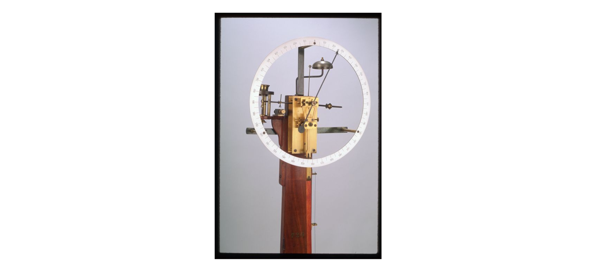
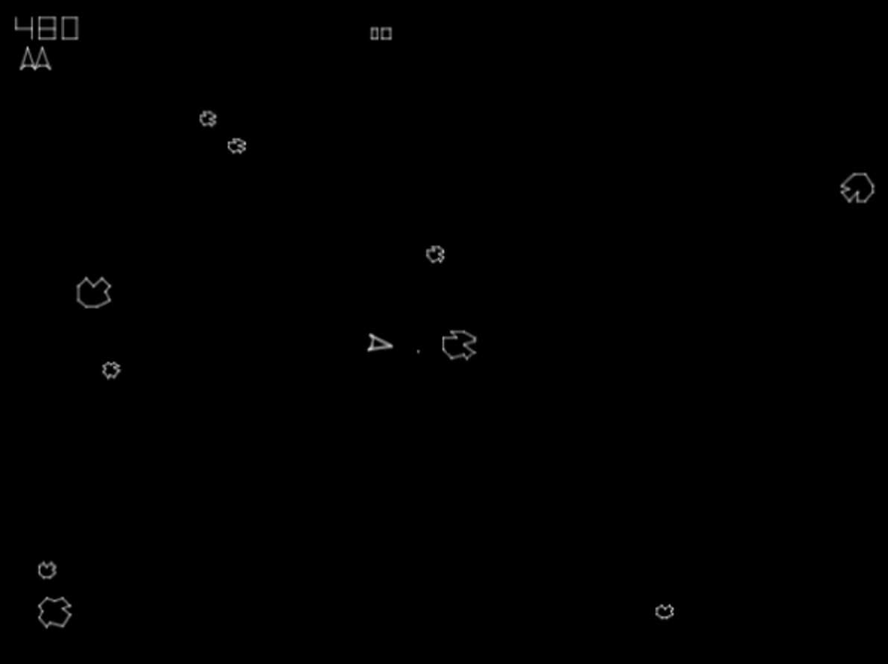
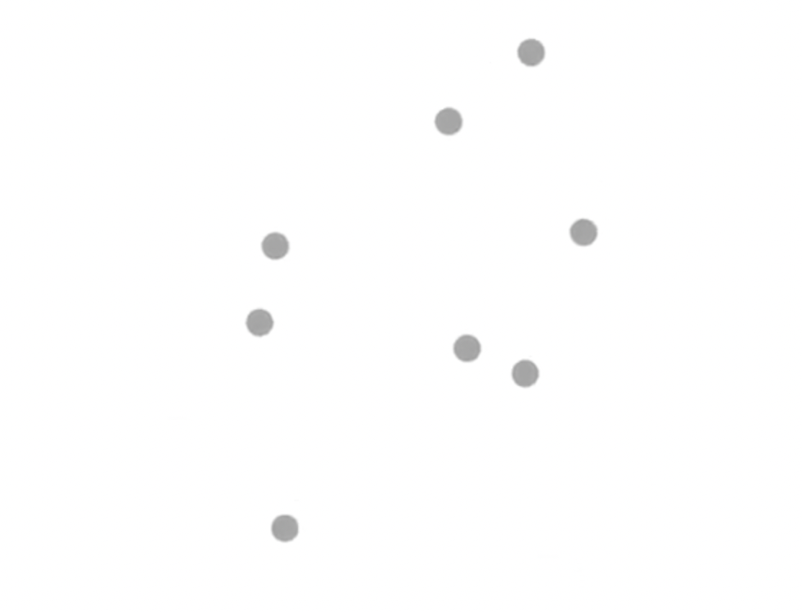
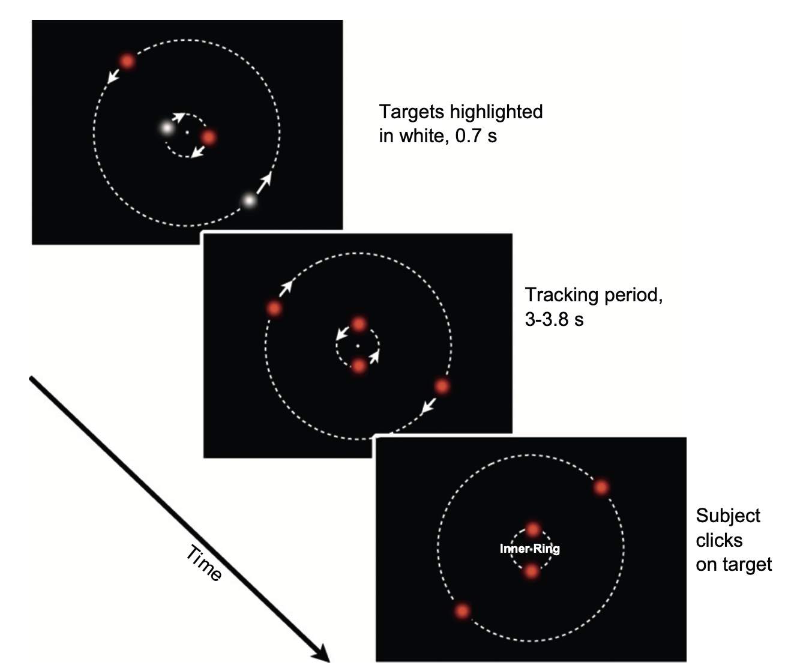
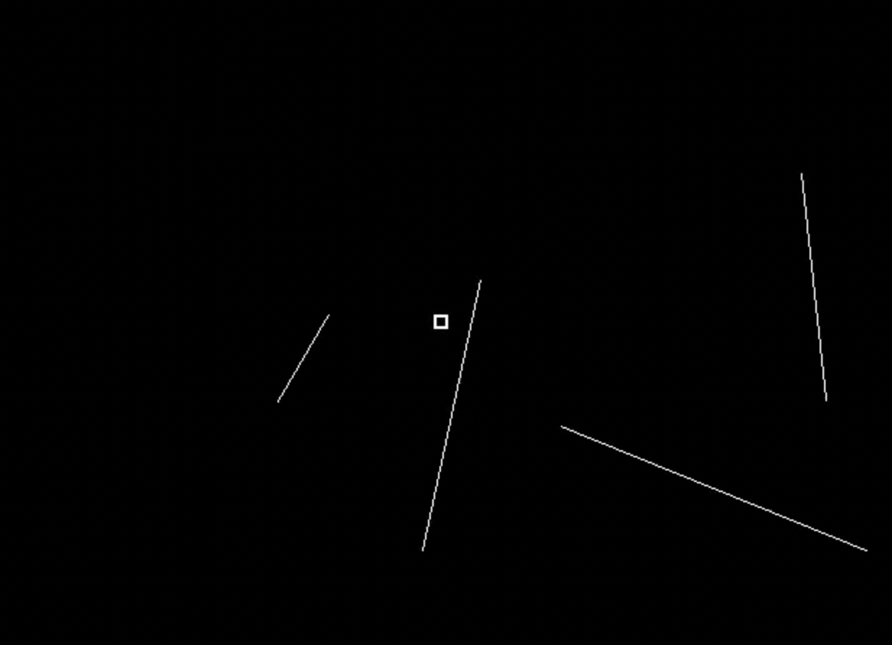
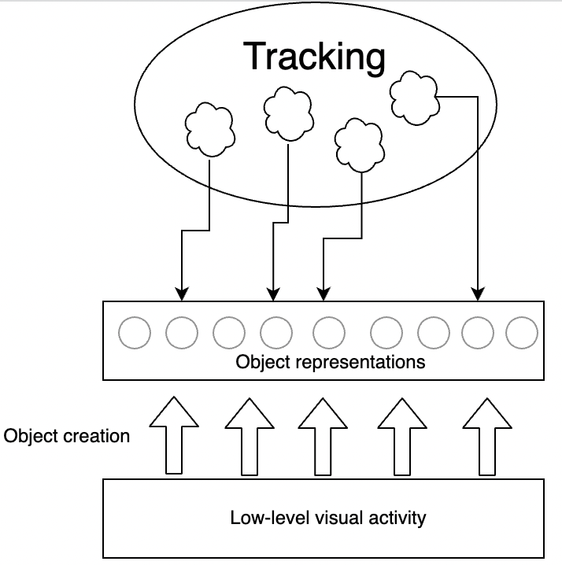
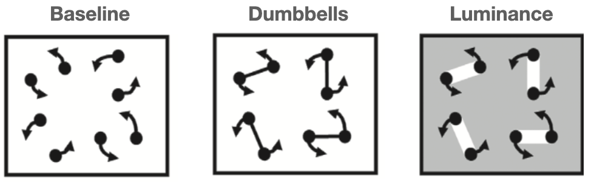
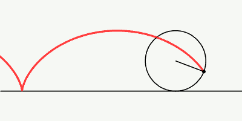
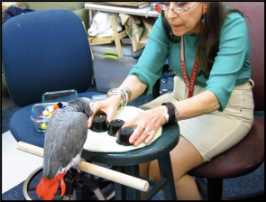

--- 
title: "Attending to moving objects"
author: "Alex O. Holcombe"
date: "`r paste0('Updated on ',Sys.Date())`"
site: bookdown::bookdown_site
# The weird thing is that including only the gitbook command below is enough to create the PDF and ePub as well as the html 
output: 
  #gitbook renders html
  bookdown::gitbook:
      lib_dir: assets
  #pdfbook includes images but not DiagrammeR output, like for peripheral vision demos
  bookdown::pdf_book:
    includes:
      in_header: preamble.tex
    latex_engine: xelatex
    citation_package: natbib
    number_sections: TRUE #If FALSE, which numbers all figures from 1 to X instead of 1.1, 1.2, etc., it breaks the chapter cross-references
    keep_tex: yes
    toc_depth: 1
    lof: yes
  bookdown::epub_book: default
  #bookdown::word_document2
documentclass: book
always_allow_html: true
bibliography: [bibliography/CambridgeElementNewestAdditions.bib,  bibliography/packages.bib]  
#bibliography/CambridgeElement.bib, 
biblio-style: "apalike"
#csl: apa7-single-spaced.csl
link-citations: yes
url: 'https\://tracking.whatanimalssee.com/'
github-repo: alexholcombe/tracking-review
twitter-handle: ceptional
#For the order of chapters, see _bookdown.yml, where they are manually specified
description: "This book reviews some of the literature on multiple object tracking by humans."
#cover-image: "imagesForRmd/threeWiseMonkeys/Three_Wise_Monkeys_640px.jpeg"
---
<!--other titles: Tracking moving objects, How humans track objects, Attending to a moving world -->

# Preface {-}

Cite this as:

Holcombe, A.O. (to appear). Attending to moving objects. Cambridge University Press.

A revised version of this is expected to be published by Cambridge University Press in their [Cambridge Element series](https://www.cambridge.org/core/what-we-publish/elements/elements-in-perception). This book will also remain as an HTML document at [tracking.whatanimalssee.com](tracking.whatanimalssee.com).
<!--https://mc.manuscriptcentral.com/hsselements1?URL_MASK=8f1bd56d44104a8b82eafbb42c3bdb84-->

<!--You can read this [here on the web](https://tracking.whatanimalssee.com/index.html), as a [PDF file](bookdown-demo.pdf), or as an [e-book](bookdown-demo.epub), which you can import into your Kindle or other e-book reader.--> 

```{r AlexPhoto, echo=FALSE, out.width="20%"}
knitr::include_graphics("imagesForRmd/corellaOnShoulder2020croppedBlurredByAdobeOnline.jpg")
```

Contact me with comments via [twitter](https://twitter.com/ceptional) or email (alex.holcombe@sydney.edu.au).

I thank Hrag Pailian, Brian Scholl, Lorella Battelli, Christian Merkel, and the three anonymous reviewers for helpful comments. I also thank Hrag Pailian and Brian Scholl for providing images and movies of their work.

© Alex O. Holcombe 2022

## Abstract {-}

Our minds are severely limited in how much information they can extensively process, in spite of being massively parallel at the visual end. When people attempt to track moving objects, only a limited number can be tracked, which varies with display parameters. Associated experiments indicate that spatial selection and updating has higher capacity than selection and updating of features such as color and shape, and is mediated by processes specific to each cerebral hemisphere, such that each hemifield has its own spatial tracking limit. These spatial selection processes act as a bottleneck that gate subsequent processing. To improve our understanding of this bottleneck, future work should strive to avoid contamination of tracking tasks by high-level cognition. While we are far from fully understanding how attention keeps up with multiple moving objects, what we already know illuminates the architecture of visual processing and offers promising directions for new discoveries.

<!--Reviewers: Hyona/Pailian/Saiki for identity chapter; Piers Howe / John Palmer/Daniel Little for serial/parallel; Srimant Tripathy for sensory memory ; Scott Brown at Newcastle for drift diffusion models
-->

<!-- To launch CANVAS VIDEOS, I tried looking at the private hyperlink within the Canvas page and used
https://www.url-encode-decode.com to unescape the characters, but that yields failed launch:

[canvas video](https://sydney.instructuremedia.com/lti/launch?custom_arc_display_download=true&custom_arc_launch_type=embed&custom_arc_media_id=83d5fa8f-2601-4cde-8500-16b22da451f4-79254)

This doesn't work either:
[Canvas video](https://sydney.instructuremedia.com/embed/83d5fa8f-2601-4cde-8500-16b22da451f4-79254)
-->
<!-- CANVAS quizzes - I can't see any way to make external links work, even for a Canvas Commons quiz, it takes you to a bizarro Canvas login https://lor.instructure.com/resources/76da8b14c91a40d885c6fe0452bf33f4?shared -->

<!--Wordcount
From R environment, execute the following after eliminating the references
wordcountaddin::word_count('tracking-review.Rmd')
Approximately 27,500 words without references
-->
<!--Exporting to Word: Looked less fucked-up if I first imported the PDF into Google Docs and then clicked Open in->Microsoft Word.app-->

<!-- Speed limits and temporal limits graph fails in PDF version. Is that because of “Warning: LaTeX Warning: Float too large for page by 59.24739pt on input line 584.”?  I think I fixed it by making it smaller.

In PDF, plot of results fails to render the special plot symbols.--> 

<!--
```{theorem, name="Pythagorean"}
For a right triangle, if $c$ denotes the length of the hypotenuse
```
-->

<!--chapter:end:index.Rmd-->

# Objects that move {#intro}

<!--
shell game
Is it just another paradigm for studying attention? No - hemisphere independence, where but not what.
How do we do this and what does that tell us about how the mind works?-->

Attention is "the taking possession by the mind, in clear and vivid form, of one out of what seem several simultaneously possible objects or trains of thought." At least, that is how William James described it [@jamesPrinciplesPsychologyVol1890]. James' description seems to imply that attention has a limited capacity of just one object or train of thought. James was joined at Harvard in 1892 by Hugo Münsterberg, who used moving stimuli to study attention. Münsterberg published a book in 1916, **The Photoplay: A Psychological Study**, which described his theory of the "moving pictures" (the cinema) and included a chapter on attention. 

```{r complication, echo=FALSE, out.width="100%", fig.cap="This 'complication apparatus' from the Harvard laboratory of Hugo Münsterberg was used to measure the effect of attention to one stimulus on responses to another.  A subject who focused on one of the numbers on the large dial was found to have a delayed reaction to the sound of the bell, and vice versa."}

```

Münsterberg's book is good reading, with insights such as that movement attracts attention, but he did not address how attention operates in the presence of multiple moving stimuli. Much later, after World War II, the study of attention grew rapidly, and tachistoscopes became the standard laboratory presentation apparatus. These devices were limited in that they could not present motion - they were designed to present static stimuli very briefly. The dominance of stationary stimuli in the study of attention continued through the 1980s, even as the study motion grew in a separate community of perception researchers.

The first popular home game system, the Atari, introduced the game Space Invaders in 1980 to millions of homes, including those of some of my childhood friends. Asteroids was ported to the Atari soon after, and it became one of my favorites. <!-- (https://youtube.com/embed/YJZ0hB0Vnyk) -->

```{r Asteroids, echo=FALSE, out.width="100%", fig.cap="Asteroids was released by Atari in 1979."}
#Work-around to make GIFs (but not .mov) work by avoiding including them in non-html outputs!
#https://stackoverflow.com/questions/64038037/can-i-conditionally-exclude-some-elements-code-blocks-from-rendering-to-the-pd
if(knitr::is_html_output()) knitr::include_url("movies/asteroids/asteroids_MichaelLibby_short.mp4") else 
#, height = "250px"
```

When one plays Space Invaders or Asteroids, multiple objects frequently move in the direction of one's avatar. Avoiding a collision seems to require monitoring more than one of these objects at a time. The ability of humans to do this was formally studied first by the Canadian psychologist and engineer Zenon Pylyshyn.

In the 1970s, Zenon Pylyshyn had been pondering the possibility of a primitive visual mechanism capable of "indexing and tracking features or feature-clusters" (he mentions this in @pylyshynTrackingMultipleIndependent1988; I haven't been able to get copies of the 1970s reports that he refers to) as they moved. By 1988, Zenon Pylyshyn and Ron Storm formulated a way to empirically study his hypothesized primitive visual mechanism, and they did a series of experiments on humans' ability to keep track of moving objects [@pylyshynTrackingMultipleIndependent1988]. On their Apple II+ computer, they created a display with ten identical objects moving on random trajectories, connected to a telegraph key with a timer to record response times. Pylyshyn & Storm also pioneered the use of an eyetracker to enforce fixation — in their experiments, movement of the eyes away from fixation terminated a trial. Thus they were able to investigate the ability to covertly (without eye movements) keep track of moving objects. 

In a task that Pylyshyn & Storm dubbed multiple object tracking or MOT, up to five of ten displayed moving objects were designated as targets by flashing at the beginning of the trial. The targets then became identical to the remaining moving objects, the distractors, and moved about randomly. While viewing the display, people report having the experience of being aware, seemingly continually, of which objects are the targets and how they are moving about. In [the movie](https://www.youtube.com/embed/lAQM4QJRYV8) embedded below, one is first asked to track a single target to become familiar with the task, and then subsequently four targets are indicated.

```{r MOTdemo, echo=FALSE, out.width="100%", fig.cap="A demonstration of the multiple object tracking (MOT) task, created by Jiri Lukavsky."}
#Work-around to make GIFs (but not .mov) work by avoiding including them in non-html outputs!
#mp4s don't work in R's html viewer that pops up when you build the book, but does work in a real web browser.
#https://stackoverflow.com/questions/64038037/can-i-conditionally-exclude-some-elements-code-blocks-from-rendering-to-the-pd
if(knitr::is_html_output()) knitr::include_url("movies/MOTmovies/MOTdemoLukavsky.mp4") else 
#, height = "250px"
# Jiri uploaded it to https://www.youtube.com/embed/lAQM4QJRYV8
```

In addition to their demonstration that people could do the basic task, which in itself is quite important,  @pylyshynTrackingMultipleIndependent1988 also showed that people are limited in *how many* targets they can faithfully track. In their experiments, @pylyshynTrackingMultipleIndependent1988 periodically flashed one of the moving objects, and if that object was a target, the participant was to press the telegraph key. On trials with more targets, errors were much more common — while only 2% of target flashes were missed when only one of the ten objects was a target, 14% of target flashes missed when five of the objects were targets. 

The notion of keeping track of moving objects is familiar from certain situations in everyday life. If you've ever been responsible for more than one child while at a beach or a park, you know the feeling of continuously monitoring the locations of multiple moving objects. If you've ever played a team sport, you may recall the feeling of monitoring the positions of multiple opponents at the same time, perhaps the player with the ball and also a player they might pass the ball to. If you've ever wanted to speak to someone at a conference, you may know the feeling of monitoring the position and posture of that person relative to others they are chatting with, in order to best time your approach.

<!-- On the road, drivers monitor the movements of others’ vehicles.  At the beach, parents keep watch as their children move in and out of the water.--> 
<!-- In basketball, the player needs to track the individual players of her/his own team, for example to know where the team’s excellent 3-point scorer is currently located. Similarly, a car driver approaching a busy intersection needs to track the whereabouts and movement trajectories of other vehicles and pedestrians in order to decide his/her own move  and in evolutionary history (e.g., keeping track of the weakest members in a herd of prey)-->.

<!--Cups and balls painting either here or in identity section, also with Saiki-->

## What's to come {#summary}

Despite advances in technology, the study of visual cognition continues to be dominated by experiments with stimuli that don't move. As we'll see in Section \@ref(identity), putting objects in motion reveals that updating of their representations is not as effective as one might expect from studies with static stimuli. This suggests that with static objects, one can bring to bear additional processes, perhaps cognitive processes (Section \@ref(Cequals1)), that motion helps to dissociate from lower-level tracking processes. It is these sorts of unique insights from multiple object tracking experiments that I have chosen to emphasize in this Element, together with the findings that I believe most constrain theories of how mental tracking processes work. I will argue that the five most important findings in the multiple object tracking literature are:

<!--I wrote this book to dispel misconceptions about the nature of tracking processes, lay out the concepts needed to understand the implications of empirical findings, and to highlight the findings with the most profound implications.--> 
 <!--Reviewing the evidence of this vast literature has highlighted four robust findings which I believe to be the most informative about the nature of the underlying processing.-->

1. The number of moving objects humans can track is limited, but not to a particular number such as four or five. (Section \@ref(biggestMyth))<!--[Section 3](#biggestMyth)-->
1. The number of targets has little effect on spatial interference, whereas it greatly increases temporal interference (Section \@ref(spatialInterference)).
1. Predictability of movement paths benefits tracking only for one or two targets, not for more (Section \@ref(Cequals1)).
1. Tracking capacity is hemifield specific: capacity nearly doubles when targets are presented in different hemifields (Section \@ref(twoBrains)).
1. When tracking multiple targets, people often don't know which target is which, and updating of non-location features is poor (Section \@ref(identity)).

The organization of this Element was influenced by my desire to dispel common misconceptions about results in the literature, and to lay out the concepts needed to understand the implications of the empirical findings. In the final section (\@ref(recommendations)) I describe some broad lessons, including how best to study tracking in the future. <!--In that section I also list some of the topics that had to be left out and where to learn more.--> We will start with the concept of limited capacity and bottlenecks in the brain.
<!--

Getting to these findings requires explaining various things

To get to these findings in context, I have organized this book into the following chapters:

* Understanding bottlenecks, resources, and capacity 
* The biggest myth of object tracking 
* Data limitations and resource limitations
* Spatial interference
  * say that I think it's largely temporal interference, which is explained in a forthcoming paper
* A complication with understanding the capacity limit - unitary cognition
* Two brains or one
* Grouping / objects
* Knowing where but not what
* Abilities and individual diffs
* Progress and recommendations
-->

<!--Most cognitive psychology researchers have, however, heard a few things about object tracking. But much of what they probably heard is wrong. In this book, we'll bust a few myths about tracking and see that studying it has yielded some unique insights about our limited capacities.-->
<!--
Keeping track of something that is moving implies that our mind is continually, or at least frequently, updating a representation of its position. Most researchers seem to conceive of this as keeping spatial attention on an object, a sort of spotlight or hill of neural activation that glides across retinotopic cortex. There is evidence for this from neuroimaging. In this article, for simplicity we will refer to the spatial index that changes along with a moving object as a spotlight of attention. This spotlight account is consistent with evidence that probes are more easily detected on targets than elsewhere [@pylyshynPuzzlingFindingsMultiple2006; @searsMultipleObjectTracking2000]. Keep in mind, however, that we do not mean that a hill of activation in spatiotopic or retinotopic cortex exhausts all the processes involved in tracking - there are certainly more.
-->

<!--Along the way we will bust myths such as the common notion that people can track four or five objects, 

Is object tracking just sustained attentional selection, when the objects happen to be moving? Well, a first question fundamentally is how do you keep your attention on the object? The literature on visual search is enormous but is almost exclusively about finding 

Without continuous attentional selection, you not only lose your children

And today, children frequently try to track rapidly moving objects in their own home - like many other things, tracking has come to screens. 
-->


<!--
**speed, and time.** The physical parameters that can limit tracking performance are space, speed, and time. Each plays a role in different circumstances, but the temporal limits are the most misunderstood, as I have discovered in reviewing journal manuscripts over the years, even though they may be the most fundamental. This section will explain spatial limits, speed limits, and temporal frequency limits on tracking (based in part on three papers from my lab), and how they illuminate other issues such as the relationship of tracking to basic motion and position perception.
-->

<!--chapter:end:intro.Rmd-->

# Bottlenecks, resources, and capacity {#bottlenecks}

Quickly, what is fourteen times thirteen? Calculating that in your head takes a while, at least a few seconds. And if I set you two such problems rather than just one, I'm confident that you would do those problems one at a time. Our minds seem to be completely incapable of doing two such problems simultaneously [@oberauerAccessInformationWorking2002; @zylberbergBrainRouterCortical2010a]. This limitation is remarkable given that each of our brains contains more than 80 billion neurons. The problem is not a lack of neurons, really, but how they are arranged - our mental architecture.

Multiplying and dividing two-digit numbers may not be something you attempt to do every day. You might think, then, that if you were doing lots of such problems each day, you could eventually do more than one at a time. This is probably wrong - consider that a task we do have daily practice with is reading. Despite years of reading dozens if not hundreds of words a day, the evidence suggests that humans can read at most only a few words at a time, and some research further indicates that we can really only read *one* word at a time [@whiteEvidenceSerialProcessing2018; @reichleEncodingMultipleWords2009]. At least some of the bottlenecks of human information processing, then, appear to be a fixed property of our processing architecture.

To flesh out what I mean by 'bottleneck' here, consider a standard soft drink bottle. If you invert a full bottle, most of the liquid volume will be pressing down on the neck. The narrowness of the neck restricts the rate at which the liquid can exit the bottle. Similarly, a large volume of signals from sensory cortex ascending the cortical hierarchy press up against higher areas that are more limited in capacity.<!-- The large volume of visual signals is partly a result of the retinotopic organization of the retina and sensory cortex - each has multiple neurons dedicated to each bit of the visual field, all working in parallel.--> 

The parallel processing happening in visual cortices, such as the multiple neurons dedicated to each patch of the visual field, gets a number of tasks done, so that higher stages don't have to do those tasks. These tasks appear to include the encoding of motion direction, color, and orientation throughout the visual field. Local and regional differencing operations happen for those features, resulting in salience, whereby odd features become conspicuous in our visual awareness. In the below display, for example, you should be able to find the blue objects very quickly.

```{r findBlue, echo=FALSE, fig.cap = "Thanks to featural attention (to color in this case), you should be able to find the blue circles very quickly.", fig.height = 2.0, fig.width=2.5}
#bookdown-demo_files/figure-html/unnamed-chunk-9-1.png ?
library(ggplot2)
library(tibble)
pts<- expand.grid(x = seq(2,16,2), y = seq(2,16,2), type = c("distractor"))
jittr<-.4
pts$x <- pts$x + runif(length(pts$x))*jittr-jittr/2
pts$y <- pts$y + runif(length(pts$y))*jittr-jittr/2
pts$type <- as.character(pts$type)
pts$type[c(1,4,6,8,11,12,13,16,20,25,26,30,33,37,41,44,47,48,52,55,59,60)] <- "distractor2"
pts$type[c(13,26,46)] <- "target"

ymin<-600; ymax<-2000
ggplot(pts,aes(x=x,y=y, color=type)) + geom_point(size=6)  +  theme_void() + theme(legend.position = "none")
#+ ylim(ymin,ymax)
```

<!--Orienting mechanisms direct attention to colors or orientations that differ from their surroundings. This is only possible because massively-parallel retinotopic brain areas have orientation- and color-tuned neurons.--> For other judgments, higher, post-bottleneck brain areas that are very limited in capacity are critical. The visual word form area in the occipitotemporal sulcus of the left hemisphere, that seems to be needed to recognize words, is one example [@whiteParallelSpatialChannels2019]. Being limited in processing capacity to just one stimulus, the word recognition will not happen in a crowded scene until something selectively directs the visual signals from a word to the visual word form area. We often use the term *selective attention* to refer to this "something" that directs particular visual signals to the bottlenecks of limited-capacity processes. <!--Different visual abilities seem to have different capacities, and it is not at all clear that a common selective attention process is responsible for gating all of their inputs.--> If there were no bottlenecks, there would be no need for selection for cognition (selection would be required when an action needed to be chosen).

So far the picture I have painted has been one of a torrent of visual signals impinging on a narrow bottleneck of signals that continue onward. But cortical processing is rarely a one-way street, and the way visual attention works is no exception. Visual attention seems to work partly by biasing processing within visual cortices, rather than leaving that unchanged and blocking all but a few signals at a later bottleneck stage. Thus, processing capacity may be restricted by limitations on control signals from high-level (possibly parietal) cortex that restrict processing capacity, as well as the more familiar idea of a structural bottleneck where ascending visual signals reach a lower-capacity neural mechanism.

To the extent control signals are a limitation, a resource metaphor can be apt. The control of selection may reflect a finite pool of neural resources in parietal cortex that bias which visual signals are cognitively processed. Thus I will sometimes use the term "limited resource" when referring to how we are restricted in how many visual representations are processed.<!-- Restricted neural populations for controlling visual processing may be a limiting factor, but so may be neural convergence, amounting to a bottleneck-like aspect of neural architecture.-->

The word "resource" carries the appropriate connotation that people can choose how to apply their finite processing capacity; ordinarily a resource is something that can be used in different ways. For example, the term suggests that one might use three-quarters of one's processing capacity for one target while using the other quarter for a second target. And indeed, there is evidence that people can favor one target over another when tracking both [@chenResourceDemandsObject2013; @croweGoaldirectedUnequalAttention2019].

While word recognition seems to be able to process only one stimulus at a time, other visual judgments may be limited in capacity relative to massively parallel sensory processing, but have a capacity greater than one. Object tracking seems to be one such ability. People appear able to track more than one target at the same time, although researchers haven't fully ruled out the possibility that tracking multiple objects happens via a one-by-one process that rapidly switches among the tracked objects.

The existence of processes with a capacity of just one object (I will introduce the term "System B" for this in Section \@ref(Cequals1))
is a good reason to have a process that can keep track of the location of important objects in a scene. We are then always ready to rapidly shunt a subset of them to higher-level processing, rather than having to search for it. 
 <!-- seems to be necessary to, for example, make fine shape discriminations or recognize a word.-->

<!--A major misconception about object tracking has become widespread, and it relates to the nature of tracking's capacity-->  <!--See the next section.-->

<!--CROSS-CHECK WITH PSYC2016 TEXT
@duncanSelectiveAttentionOrganization1984 was interested in how many objects we can process at a time. He found that accuracy for making a simple visual judgment about an object was much worse when one needed to simultaneously make a judgment about another. For example, participants were asked to judge whether a briefly-presented rectangle was small or large and also judge whether a simultaneously presented line was dotted or dashed. Performance was worse FOR the two-object condition even in comparison to a single-object condition where two judgments also needed to be made. The participants had to make either two judgments about a single object or one judgment about one object and the second judgment about a different object. To Duncan, his finding that performance was substantially worse in the two-object condition indicated the existence of a bottleneck at a stage that processes objects. He wrote that 

> Findings support a view in which parallel, preattentive processes serve to segment the field into separate objects, followed by a process of focal attention that deals with only one object at a time.

This conclusion was an over-reach. Performance was better than one would expect if only one object were processed, unlike what has been found for word processing. Duncan could explain that by saying that the presentation time was adequate for focal attention to, on *some* trials, process more than one object. Alternatively, however, it may be that the relevant processes *can* handle two objects at a time, but they do so more poorly than for one object. Work that credibly claims that a visual ability is truly limited to one object at a time is hard to find; the reading of words may be an exception.-->


<!--chapter:end:bottlenecks.Rmd-->

# The biggest myth of object tracking {#biggestMyth}

What I consider to be the biggest myth about object tracking involves three misconceptions:

1. There is a fixed capacity limit of about four or five objects that can be tracked, after which performance falls rapidly.
1. A softer version of the above claim: that performance falls to a particular level once the number of targets is increased to four or five objects. 
1. Different tasks show the same limit.

These three claims are widespread in the scholarly literature. <!--The issue of how many objects we can track is an important one for understanding tracking's role in natural behavior as well as the performance of laboratory tasks.--> A set of researchers writing about the "object tracking system" in 2010, for example, stated: "One of the defining properties of this system is that it is limited in capacity to three to four individuals at a time" [@piazzaNeurocognitiveStartupTools2010]. Similarly, @fougnieDistinctCapacityLimits2006 wrote that "People’s ability to attentively track a number of randomly moving objects among like distractors is limited to four or five items" <!--cites Pylyshyn Storm 1989-->  <!-- which cites Scholl's objects paper which makes the claim of 4 FINSTs but backs it up only with STM etc. type studies -->. This idea is sometimes perpetuated with more ambiguous statements such as "participants can track about four objects simultaneously" [@vanderburgChangesNotDifferences2019]<!-- (see Cavanagh & Alvarez, 2005, for a review; Pylyshyn & Storm, 1988)-->.

Misconception #1 in my list above, including the idea of a sharp fall in performance after a limit, is one aspect of the statements of the previous paragraph. This is fully explcit in one set of researchers' 2010 take on the literature, when they wrote that "the main finding" of the object tracking literature is that "observers can accurately track approximately four objects and that once this limit is exceeded, accuracy declines precipitously." [@doranRoleVisualAttention2010]. Vaguer statements in other papers, such as "researchers have consistently found that approximately 4 objects can be tracked"  [@alvarezHowManyObjects2007] and "people typically can track four or five items" @chesneyEvidenceSharedMechanism2011 <!--cites Pylyshyn 1989--> also bolster misconception #1 in the minds of readers.

To examine the evidence behind the claims of each of the quotations of the two preceding paragraphs, I have checked the evidence provided, and the papers cited, as well as the papers those cited papers cite. Each paper contains no evidence supporting the claim that performance decreases very rapidly once the number of targets is increased above some value. Instead, a gradual decrease in performance is seen as number of targets is increased, with no discontinuity, not even a conspicuous inflection point. For example, @oksamaMultipleObjectTracking2004, which is sometimes cited in this context, assessed performance with up to six targets<!--among twelve identical objects in total-->. After a five-second phase of random motion of the multiple moving objects, one object was flashed repeatedly and participants hit a key to indicate whether they thought it was one of the targets. The number of trials that participants got wrong increased steadily with target size, from 3% incorrect with two targets to 16% incorrect with six targets.<!--Note that even with six targets, participants were performing substantially better than would be expected if they could only track one or two and had to guess on the others.-->

Although @pylyshynTrackingMultipleIndependent1988 is the paper most frequently cited when a limit of four objects is claimed, even they found a quite gradual decrease in performance (their Figure 1) as the number of targets was increased, from one to five (five targets was the most that they tested). And nowhere in their paper did @pylyshynTrackingMultipleIndependent1988 state that there is a value beyond which performance rapidly declines. Six years later, however, @pylyshynMultipleParallelAccess1994 did write that it is "possible to track about four randomly moving objects" [@pylyshynMultipleParallelAccess1994] <!--that people can track "at least four" objects, but later in the paper they did make a statement that could be interpreted as claiming there is a limit of four objects, writing that--> By 2007 when he published his book, **Things and Places: How the Mind Connects with the World**, Pylyshyn wrote sentences like "And as long as there are not more than 4 or 5 of these individuals the visual system can treat them as though it had a concept of 'individual object'" [@pylyshynThingsPlacesHow2007]. I suspect that this sort of slide toward seeming to back a hard limit is caused in part by the desire for a simple story. It may also stem from an unconscious oversimplification of one's own data, and/or Pylyshyn's commitment to his theory that tracking is limited by a set of discrete mental pointers.

I have so far addressed only one aspect of the claim (misconception #1) that there is a limit after which performance decreases rapidly. Another aspect of misconception #1 is that the limit is consistently found to be four or five. This isn't viable if there is no limit after which performance decreases rapidly, but a researcher could retreat to misconception #2, the idea that tracking performance falls to some particular level at about four targets, even if this does not mark a hard limit (or even an inflection point). The particular performance level might be 75% correct, or another criterion like the halfway point between ceiling and chance [@holcombeSplittingAttentionReduces2013], or the "effective number of items tracked", calculated by applying a formula to percent correct with the number of targets and distractors [@schollWhatVisualObject2001]. In a charitable reading, this may be what researchers like @alvarezHowManyObjects2007 mean when they wrote phrases such as: "researchers have consistently found that approximately 4 objects can be tracked (Intriligator & Cavanagh, 2001; Pylyshyn & Storm, 1988; Yantis, 1992)". The early studies  cited may indeed be consistent with this statement, albeit not strongly supportive. <!-- Alvarez & Franconeri (2007)  "researchers have consistently found that approximately 4 objects can be tracked (Intriligator & Cavanagh, 2001; Pylyshyn & Storm, 1988; Yantis, 1992). The similarity of these estimates, combined with the frequency with which 4-item limits arise in other attention tasks, suggests the possibility that there is a “magical number 4” in visual attention (Cowan, 2001; Pylyshyn, 1989)."  neither said any such thing, it seems from my reading of those papers, e.g.  Pylyshyn & Storm 1988 only went up to 5 out of 10 and there was gradual decrease in performance all the way through. --> <!-- Papers I have checked for the 4-object claim: Cowan, 2001 claimed it for MOT, citing Pylyshyn et al. 1994, which does say "experiments showing that observers can simultaneously track some three to five identical target items" but then when he describes the studies he doesn't say they show that, even though in the discussion he says "One is that it is possible to track about four randomly moving objects" -->
<!-- In some cases the problem stems from Scholl Pylyshyn Feldman paper that devised the effective tracking capacity measure assuming 100% accuracy for one object and delivering a single number, often 4, for effective number tracked--> However, work published over the last fifteen years has revealed this apparent agreement on a soft limit across studies to be an artifact of researchers using similar display and task characteristics. That is, findings that approximately four objects can be tracked based on some performance criterion are just an accident of researchers using similar display parameters.

One of the most important display parameters is object speed. The influence of object speed was demonstrated in dramatic fashion by @alvarezHowManyObjects2007, who tested participants with a display of sixteen wandering discs. When the speed of the discs was very high, participants could, at the end of a trial, correctly pick out the targets only if there were just a few targets. But for very slow speeds, participants could track up to eight targets accurately. This indicated that the accuracy of the statement that participants can track four objects is highly contingent on the speed of those objects. Additional evidence for this was found by others [@holcombeExhaustingAttentionalTracking2012; @feriaSpeedHasEffect2013] and other display parameters that strongly affect the number of objects that can be tracked were also discovered, in particular object spacing [@franconeriEvidenceSpeedLimit2008; @holcombeObjectTrackingAbsence2014]. <!--As we will be discussed extensively in section \@ref(twoBrains), one aspect of spacing is that tracking performance can depend greatly on whether the targets are distributed between the left and right hemifields or instead are confined to one hemifield.--> 

In summary, it is incorrect to say that people can track about four moving objects, or even that once some (varying with circumstances) number of targets is reached, performance declines very rapidly with additional targets. The number that can be tracked is quite specific to the display arrangement, object spacing, and object speeds. If a researcher is tempted to write that "people can track about four objects", to reduce confusion, I think that they should stipulate that this refers to a particular combination of display characteristics and performance measures<!--something that I have almost never seen in the literature.-->

This issue of how to characterize a human cognitive limit has also bedeviled the study of short-term memory, a literature in which one of the most famous papers is titled "The magical number seven, plus or minus two: Some limits on our capacity for processing information" [@millerMagicalNumberSeven1956]. Two dozen working memory researchers convened in 2013 to highlight empirical "benchmarks" for models of working memory. One issue they considered was how to talk about how many items people can remember. In the paper that they published in 2018, the researchers pointed out that "observed item limits vary substantially between materials and testing procedures" [@oberauerBenchmarksModelsShortterm2018]. They suggested, however, that much of this variability could be explained by humans' ability to store groups of items as "chunks", and thus the group endorsed a statement that there is a limit of "three to four chunks" [@cowanMagicalNumberShortterm2001a]. In the case of short-term memory, then, the observed variability in experiments' results can potentially be explained by a common underlying limit of three to four chunks that manifests as different observed item limits depending on circumstances (in particular, the opportunity for chunking). Evidently there is no simple task parameter unrelated to chunking opportunity, analogous to object speed in the case of MOT, that smoothly varies through a wide range how many items people can remember. However, whether there is an inflection in performance after four objects, or at any point, remains debated [e.g. @robinsonThereCapacityAssessing2020].

Another strong candidate for a real capacity limit is the human ability to "subitize" or judge nearly exactly the numerosity of a collection of objects. For this task of reporting how many items are in a briefly-presented display, there really does seem to be an inflection point in accuracy when the number of objects shown goes from less than four to more than four [@revkinDoesSubitizingReflect2008]. Four objects and fewer is frequently referred to as the "subitizing range", with performance approximately as good for rapidly counting four objects as it is for two or one. Note that this is very different than in tracking, for which speed thresholds decline markedly from one to two targets, as well as subsequently to three and four. 

In the case of MOT, it remains possible that researchers will be able to identify a set of circumstances that consistently yield a mean tracking limit, in the modal human, of three or four targets, if "limit" is defined as performance falling to a particular level on some performance metric. Probably these circumstances will simply be certain spacings, speeds, object trajectories, and number of objects in a display. It would be nice if some underlying construct, the counterpart of memory's "chunks", would be identified to explain how performance changes when other circumstances are used. That would constitute real progress in theory development. However, I don't see much prospect of that based on the current literature.
<!-- At this point,  to defend the claim that people can track "about four objects" is to suggest that the studies that have found four targets to be the number that can be tracked . Is there something special about  these speeds. Nobodh justified them with ecological analysis-->

## Claim #3: Different tasks, same limit?

Even after discarding the idea that there is a particular number of objects that one can track, misconception #3 might still be viable. This claim is frequently tangled up in the myth reviewed above, and sometimes stated as "there is a magical number four". IF we discard the idea of a specific number that does not vary with circumstances, there remains the notion that different tasks have the same number-of-objects limit when tested in comparable circumstances. For example, @bettencourtSharedFilteringProcesses2011 stated that visual short-term memory and MOT show "an equivalent four-object limit", and @piazzaNeurocognitiveStartupTools2010 similarly claimed that visuo-spatial short-term memory, ultra-rapid counting (subitizing), and multiple object tracking all share a common limit of "three or four items". So far, however, there is no good evidence that object tracking has the same limit as visual working memory and subitizing.

<!--I don't know of any work that has used a display of multiple objects moving at a particular speed and found a similar capacity limit for multiple tasks including MOT.-->  Ideally evidence for a common limit could be found by measuring the limits for all three tasks using the same stimuli, but it is unclear how to equate the information available across tasks. Especially difficult is comparing performance with the briefly-presented static stimuli used in subitizing and working memory tasks to the extended exposures of moving stimuli needed to assess object tracking. A stronger understanding of the processes mediating tracking would be required to model performance of the two tasks using a common framework via which they could be compared at an underlying psychological construct level. There is another approach, too: measure the tasks of interest in large numbers of individuals and see whether the different task limits strongly co-vary between individuals. The relationships found so far are not strong enough to conclude that, however, and they are reviewed in Section \@ref(abilities).

<!-- https://psyc2016.whatanimalssee.com/bottlenecks.html#a-bottleneck-for-object-judgments -->

<!--Working off the dominant framing, that each person does have a specific number of targets they can track which determines percent correct for each level of number of targets, some MOT researchers report what @schollWhatVisualObject2001 called the "effective number of items tracked". The associated formula, refined by @hullemanMathematicsMultipleObject2005a allows researchers to calculate the effective number of items tracked based on accuracy in an individual condition, given the number of targets and distractors in that condition. This does provide a useful summary of the data, but researchers should take more care to avoid taking it literally.--> <!--Still, it does seem that the number four pops up more than would be expected if these abilities were unrelated. -->

In summary, the idea of a limit of four or five targets is a myth. What's most disappointing is that at no point did it have good evidence behind it, which makes me worry that the way we do science, or the way we do this kind of science, does not result in the community of researchers knowing the basics of what the evidence supports. The general issues around that are beyond the scope of this Element. Let's stick with the facts of tracking and consider the following: given that tracking performance does depend greatly on circumstances and falls gradually rather than displaying a discontinuity at a particular target number, what are the implications for how tracking works?

<!--In this Section, we discussed three common misconceptions about what has been shown about object tracking. The one that we have just discussed is that different tasks show the same limit. -->

<!--This may actually be true, but I know of no research that have used the same display and task settings to adequately back this up.--> 


<!--chapter:end:theBiggestMyth.Rmd-->

# Which aspect(s) of tracking determine performance? {#whichAspects}

While Pylyshyn theorized that tracking is accomplished by a fixed and discrete set of pointers, the dependence on display characteristics of the number of objects one can track hints that the underlying process may be continuous and flexible rather than determined by a fixed, discrete set. Based on the flexible resource metaphor, a person might be able to apply more resource to particular targets to reduce the deleterious influence of object speed or another factor. There is good evidence for this [e.g. @chenResourceDemandsObject2013], which will be discussed later, but here I would like to explain the resource concept more, and make an important distinction.

To understand why we can track several objects in some circumstances, but only a few in others, we must distinguish between display factors that impose *data* limitations on tracking, and display factors that impose *resource* limitations. <!--We've already covered C=1 processing, grouping, and the nature of the objects themselves, in Chapters \@ref(objects) and \@ref(grouping).-->

The "data" in data limitation refers to sensory data [@normanDatalimitedResourcelimitedProcesses1975]. If a target moving on an unpredictable trajectory moves outside the edge of our visual field, it is the absence of data that prevents it from being tracked. No amount of mental resources can overcome having no data, at least for an unpredictable stimulus. Data limitations may also occur when sensory signals are impoverished, even if not entirely absent. For example, it is a data limitation that prevents tracking when an object travels at such a fast rate that our neurons hardly register it. So, by data here we are referring not to the raw activation pattern of our photoreceptors, but rather the visual signals available after additional preattentive sensory processing.

People with poor visual acuity may perform less well on a task than people with high visual acuity, due to differences in the sensory data that they have to work with. Thus, some individual differences are almost certainly due to data limitations rather than variation in tracking processes between people. When performance is data-limited, bringing more mental resources to bear provides little to no benefit. The most popular way of investigating this is by varying the number of stimuli one needs to process, as in visual search studies. If the number of stimuli one must evaluate does not affect how well a person can perform a task, this suggests that the task is data-limited rather than resource-limited, because performance is evidently the same regardless of the proportion of the putative resource can be devoted to it. <!-- More reflections on the relation of the resource concept to underlying mechanisms is in Chapter \@ref(spatialInterference). --> 

Resource-limited processing is typically more interesting for those interested in visual attention and the capacity limits on mental processing. If response time or error rate increases with the number of distractors presented in a visual search task, that is classically interpreted as meaning that a resource-limited process is required for success at the task. However, science is hard - an elevation in e.g. error rate can also occur even if there is no resource limitation, if each additional distractor has a non-zero probability of being mistaken for a distractor, yielding more errors with more distractors even if the probability of successfully evaluating each individual stimulus remains unchanged [@palmerAttentionVisualSearch1995]. 

The particular number of objects that can be tracked with reasonable accuracy is thus highly dependent on stimulus conditions, and some of these conditions may reflect data limitations rather than a resource limitation. Still, even in ideal conditions it seems clear that the number of objects that can be tracked is much less than the number of objects that are simultaneously processed by early visual areas. In other words, there is some sort of resource limitation.

We'd like to know what factors consume the resource. I'll also be using the term "resource-intensive" - if a deleterious stimulus factor is resource-intensive, that means that increasing the amount of resource devoted to the stimulus can compensate for that stimulus factor. One example is speed of the moving targets. An increase in targets' speed can hinder performance, but reducing the number of targets, which provides more resource to the remaining targets, can make up for that. Moreover, if one object moves faster than another, it consumes more resource. The evidence for that is that the addition of a fast-moving target hurts tracking performance for a first target more than does the addition of a slow-moving target 

Speed, then, appears to be resource-intensive. Speed also can result in a data-limitation, at very high speeds, but long before such speeds are reached, speed is resource-intensive.

One should not assume, however, that when one manipulates something about a display, that something is the only thing that changes. Increasing the speed of the objects in a display can also result in more close encounters between targets and distractors, unless one shortens the duration of the trial to equate the total distance the objects travel. Thus, it could be that dealing with spatial interference is what consumes resource, rather than speed.  This brings us to the next chapter, which is all about spatial interference.

<!--chapter:end:whichAspects.Rmd-->

# Spatial interference {#spatialInterference}

Details of the world that are much smaller than ourselves, like the fibers that make up paper, or the individual ink blotches laid down by a printer, are inaccessible to the naked eye. This is a familiar limit on our visual abilities, one that is measured when we go to the optometrist. Line segments or objects that are too close together are experienced as a single unit.

Even when two objects are spaced far apart enough that we perceive them as two objects rather than one, they are not processed entirely separately by the brain. Receptive fields grow larger and larger as visual signals ascend the visual hierarchy, and this can result in a degraded representation for objects that are near each other. Such spatial interference is evident in the following display (\@ref(fig:crowdingDemo)).

```{r crowdingDemo, echo=FALSE, fig.cap = "When one gazes at the central dot, the central letter to the left is not crowded, but the central letter to the right is."}
DiagrammeR::grViz("digraph {

graph [layout = dot, rankdir = LR]

# define the global styles of the nodes. We can override these in box if we wish
node [shape = rectangle, style = filled, color=White, fillcolor = White, fontsize = 40]

a [label = 'O']
fixation [label =  '', shape=circle, fillcolor=Black, width=.2, height=.2]
b [label = ' ']
c [label = ' ']
d [label = 'J']
e [label = ' ']
e2 [label = ' ']
e3 [label = 'S']

f [label = 'O']
g [label = 'R']
h [label = 'L']
i [label = 'H']
j [label = 'Y']
k [label = 'M']
l [label = 'S']

# edge definitions with the node IDs
edge [label='', penwidth=0, arrowsize=0]
a  -> b;
edge [label='', penwidth=0, arrowsize=0]
b -> c
edge [label='', penwidth=0, arrowsize=0]
c -> d
edge [label='', penwidth=0, arrowsize=0]
d -> e
edge [label='', penwidth=0, arrowsize=0]
e -> e2
edge [label='', penwidth=0, arrowsize=0]
e2 -> e3
edge [label='', penwidth=0, arrowsize=0]
e3 -> fixation

edge [label='', penwidth=0, arrowsize=0]
fixation -> f
edge [label='', penwidth=0, arrowsize=0]
f -> g
edge [label='', penwidth=0, arrowsize=0]
g -> h
edge [label='', penwidth=0, arrowsize=0]
h -> i
edge [label='', penwidth=0, arrowsize=0]
i -> j
edge [label='', penwidth=0, arrowsize=0]
j -> k
edge [label='', penwidth=0, arrowsize=0]
k -> l
}")
```

When gazing at the central dot in \@ref(fig:crowdingDemo), you likely are able to perceive the middle letter to the left fairly easily as a 'J'. However, if while still keeping your eyes fixed on the central dot, you instead try to perceive the central letter to the right, the task is much more difficult. This spatial interference phenomenon is called "crowding" in the perception literature, and it has been the subject of hundreds of experiments [e.g., @wolfordPerturbationModelLetter1975; @korteUberGestaltauffassungIm1923; @strasburgerDancingLettersTicks2014].

Most crowding studies ask participants to identify a letter or other stationary target when flanking stimuli are placed at various separations from the target. Many studies have assessed how separated the flankers must be to avoid impairment of target identification. The result varies somewhat with the display spatial arrangement, but on average is about half the eccentricity of the target, there is little to no impairment for greater separations [@boumaInteractionEffectsParafoveal1970; @gurnseyCrowdingSizeEccentricity2011]. <!--In the display above, for example, the letters on the same side as the 'J' are separated from it by more than half the 'J's distance from the fixation point, so they have little to no effect on its identification.--> Setting the targets and distractors in motion has little effect [@bexShapeSizeCrowding2003], which is consistent with other evidence that these results generalize to tracking - close flankers not only prevent identification of the target, they can also prevent the target from being individually selected by attention, including for multiple object tracking [@intriligatorSpatialResolutionVisual2001]. 

In summary, spatial interference is a robust phenomenon, and when a target and distractor are too close to be distinguished by tracking processes, tracking is impaired. Tracking may fail, or may end up tracking a distractor rather than the target [@baeCloseEncountersDistracting2012].

Crowding happens frequently in typical MOT displays — in most published experiments, objects are not prevented from entering the targets' crowding zones (which as mentioned above, extend to about half the stimulus' eccentricity). It is not surprising, then, that in typical MOT displays, greater proximity of targets and distractors is associated with poor performance [@shimSpatialSeparationTargets2008; @tombuAttentionalCostsMultipleobject2008].

## Spatial interference does not explain why tracking many targets is more difficult than tracking only a few

<!-- MOVE TO PREFACE TO SPATIAL AND TEMPORAL INTERFERENCE The errors in MOT occur largely when a target and a distractor come close to each other, in space or in time. During a close encounter between a target and a distractor, one may end up tracking the distractor rather than the target.
 @baeCloseEncountersDistracting2012 @drewSwappingDroppingElectrophysiological2012 -->

In 2008, Steven Franconeri and colleagues made the provocative suggestion that spatial interference is the *only* reason why performance is worse when more targets are to be tracked [@franconeriEvidenceSpeedLimit2008]. In the previous chapter, we introduced the idea of a mental resource that, divided among more targets, results in worse tracking performance. Franconeri suggested that this does not exist, or at least, for tracking the only thing that becomes depleted with more targets is the area of the visual field not undergoing inhibition; inhibition stemming from a inhibitory surround around each tracked target [@franconeriEvidenceSpeedLimit2008; @franconeriFlexibleCognitiveResources2013; @franconeriTrackingMultipleObjects2010]. In other words, the inhibitory surrounds of nearby targets interfering with each other is the only reason for worse performance with more targets. Thus, "there is no limit on the number of trackers, and no limit per se on tracking capacity"; "barring object-spacing constraints, people could reliably track an unlimited number of objects as fast as they could track a single object". Joining Franconeri in making this claim was Zenon Pylyshyn himself as well as other senior visual cognition researchers including James Enns, George Alvarez, and Patrick Cavanagh, my PhD advisor (@franconeriTrackingMultipleObjects2010, p.920).

@franconeriTrackingMultipleObjects2010 conducted a test of this theory. They kept object trajectories nearly constant in their experiments but varied the total distance traveled by the objects (by varying both speed and trial length), on the basis that if close encounters were the only cause of errors, they should be proportional to the total distance traveled. As their theory predicted, performance did decrease with distance traveled, with little to no effect of the different object speeds and trial durations that they used. This was taken as strong support for the theory that only spatial proximity mattered. However, note that they did not investigate whether widely spacing objects would allow participants to track more targets. Instead, they varied the potential for spatial interaction more indirectly, by varying the total distance traveled by the objects.

To test more directly their "simple and falsifiable hypothesis" (@franconeriTrackingMultipleObjects2010, p. 924), in 2012 my student Wei-Ying Chen and I used displays in which we could keep the objects widely separated. In one experiment, we used an ordinary computer screen but created a wide-field display by having participants bring their noses quite close to it. This allowed us to keep targets and distractors dozens of degrees of visual angle from each other [@holcombeExhaustingAttentionalTracking2012]. The basic display configuration is shown in Figure \@ref(fig:HC2012BasicTrial).

```{r HC2012BasicTrial, echo=FALSE, out.width="100%", fig.cap="In experiments by Holcombe and Chen (2012), after the targets were highlighted in white, all the discs became red and revolved about the fixation point. During this interval, each pair of discs occasionally reversed their direction. After 3–3.8 s, the discs stop, one ring is indicated, and the participant clicks on one disc of that ring."}

```

We found that even when all the objects in the display were extremely widely-spaced, speed thresholds declined dramatically with the number of targets. To us, this appeared to falsify the theory of @franconeriTrackingMultipleObjects2010, that spatial interference was the only factor that prevented people from tracking many targets. In a 2011 poster presentation, which we entitled "The resource theory of tracking is right! - at high speeds one may only be able to track a single target (even if no crowding occurs)", we suggested that each target, regardless of its distance from other objects, uses up some of a limited processing capacity - a resource that was attentional in that it could be applied anywhere in the visual field, or at least anywhere within a hemifield (\@ref(twoBrains)). The amount of this resource that is applied to a target determines the fastest speed at which a target can be tracked.

Franconeri et al. were unconvinced by the findings of Wei-Ying Chen and I (they did not say why); indeed, they took their idea of spatial interference much further, suggesting that the same basic idea could explain the apparent capacity limits on not just tracking, but also on object recognition, visual working memory, and motor control, writing that in each case capacity limits arise only because "items interact destructively when they are close enough for their activity profiles to overlap" (p.2) [@franconeriFlexibleCognitiveResources2013].

To explain the @holcombeExhaustingAttentionalTracking2012 results, the spatial interference posited by Franconeri would have to extend over a very long distance, farther than anything that had been reported in behavioral studies. If there were such long-range spatial gradients of interference present, it seemed to me that they should have shown up in the results of @holcombeExhaustingAttentionalTracking2012 as worse performance for the intermediate spatial separations tested than for the largest separations we tested. I pointed out these issues to them in @holcombeCommentCapacityLimits2019, and in reply, @franconeriResourceTheoryNot2013 pointed to neurophysiological recordings in the lateral intraparietal area (LIP) of rhesus macaque monkeys, specifically a study by @falknerSurroundSuppressionSharpens2010 that cued monkeys to execute a saccade to a stimulus. In some trials a second stimulus was flashed 50 ms prior to the saccade execution cue (the offset of the fixation point). That second stimulus was positioned in the receptive field of an LIP cell the researchers were recording from, allowing researchers to show that the LIP cell's response was suppressed relative to trials that did not include a saccade target. This suppression occurred even when the saccade target was very distant - a statistically significant impairment was found for separations as large as 40 deg for some cells. The data were consistent with the spatial gradient of this interference being quite shallow, allowing @franconeriResourceTheoryNot2013 to write that "levels of surround suppression are strong at both distances, and thus no difference in performance is expected" for the separations tested by Holcombe and Chen (2012). <!--@franconeriResourceTheoryNot2013 was published as an "online comment" at _Trends in Cognitive Sciences_, as a reply to my letter that the editor had also suggested I post as an online coment. Unfortunately, some time later both comments were lost by the publisher, Elsevier, when they migrated their system. In the case of my comment, I found an old draft on my computer, updated it slightly, and posted it at @holcombeCommentCapacityLimits2019.-->

One property of the neural suppression documented by @falknerSurroundSuppressionSharpens2010 strongly suggests, pace @franconeriResourceTheoryNot2013, that it is not one of the processes that limit our ability to track multiple objects. Specifically, @falknerSurroundSuppressionSharpens2010 found that nearly as often as not, the location in the visual field that yielded the most suppression was *not* in the same hemifield as the receptive field center. But as we will see in \@ref(twoBrains), the cost of additional targets in attentional tracking is largely independent in the two hemifields. Evidently, then, the suppression observed in LIP is not what causes worse performance when there are more targets. Instead, as @falknerSurroundSuppressionSharpens2010 themselves concluded, these LIP cells may mediate a global (not hemifield-specific) salience computation for prioritizing saccade or attentional targets, wherever they are in the visual field.

<!--In light of all the above, it seemed the evidence ruled against the idea that spatial interference was the sole reason that people perform worse with more targets. Moreover, to accommodate the results we reported in  @holcombeExhaustingAttentionalTracking2012, the spatial interference account advocated by @franconeriResourceTheoryNot2013 seemed to have been watered down until it was practically indistinguishable from a conventional resource theory – if spatial interference extended over an entire visual field (or hemifield) with no detectable diminution at large separations relative to small separations, then it no longer seemed appropriate to refer to it as "spatial" interference. Instead, finite processing capacity might be both a more parsimonious and straightforward description.-->

Having failed to find evidence for long-range spatial interference, I decided to focus on the form of spatial interference that I was confident actually existed: short-range interference. Previous studies of tracking did not provide much evidence about exactly how far that interference extended - either they did not control for eccentricity (e.g., @feriaSpeedHasEffect2013) or they only tested a few separations (e.g., @tombuTrackingPlanetsMoons2011).

In experiments that we published in 2014, we assessed tracking performance for two targets using spatial separations that ranged from within the crowding distance documented in other studies through to very large separations. The experiments both measured short-range interference and validated that interference was indeed confined to a short range [@holcombeObjectTrackingAbsence2014]. Specifically, performance improved with separation, but only up to a distance of about half the target's eccentricity, similar to what had been found in the literature on crowding  [@strasburgerDancingLettersTicks2014]. In a few of our experiments there was a trend for better performance as separation increased further, beyond the crowding zone, but this effect was small and not statistically significant. These findings were consistent with our supposition from our previous studies: spatial interference is largely confined to the crowding range and the performance deficit when there are more targets to track is caused by a limited processing resource.

The experiments we reported in @holcombeObjectTrackingAbsence2014 did, however, yield one finding that surprised us, a finding that was specific to the one-target conditions. When there was only one target, outside the crowding range we found that performance *decreased* with separation from the other pair of (untracked) objects. This unexpected *cost* of separation was only statistically significant in one experiment, but the trend was present in all four experiments that varied separation outside the crowding range. This might potentially be explained by the configural or group-based processing documented by @billHierarchicalStructureEmployed2020 and others, as grouping of distant elements is usually weaker than for nearby elements [e.g., @kubovyLawfulnessGroupingProximity1998].

## The mechanisms that cause spatial interference

As explained in the beginning of this chapter, one cause of short-range spatial interference is simply lack of spatial resolution by the processes that mediate tracking. If a process cannot distinguish between two locations, either because of a noisy representation of those locations or because the two locations are treated as one, then a target may often be lost when it comes too close to a distractor. This would be true of any imperfect mechanism, biological or man-made. The particular way that the human visual system is put together, however, results in forms of spatial interference that do not occur in, for example, many computer algorithms engineered for object tracking.

As I mentioned in \@ref(bottlenecks), our visual processing architecture has a pyramid-like structure, with processing at the retina being local and massively parallel, and then gradually converging such that neurons at higher stages have receptive fields responsive to large regions. At these higher stages, processes critical to tasks like tracking or face recognition occur. Face-selective neurons, for example, are situated in temporal cortex and have very large receptive fields. For tracking, the parietal cortex is thought to be more important than the temporal cortex, but the neurons in these parietal areas again have large receptive fields.

A large receptive field is a problem when the task is to recognize an object in clutter or to track a moving target in the presence of nearby moving distractors. In the case of object recognition, without a mechanism to prevent processing of the other objects that share the receptive field, object recognition would have access to only a mishmash of the objects' features. Indeed, this indiscriminate combining of features is thought to be one reason for the phenomenon of illusory perceptual conjunctions of features from different objects [@treismanIllusoryConjunctionsPerception1982]. For object tracking as well, isolating the target is necessary to keep it distinguished from the distractors.

In principle, our visual systems might include attentional processes that when selecting a target can completely exclude distractors' visual signals from reaching the larger receptive fields. Actually implementing such a system using realistic biological mechanisms with our pyramid architecture, however, is difficult [@tsotsosModelingVisualAttention1995]. Indeed, neural recordings reveal that while the signals from stimuli irrelevant to the current task are suppressed to some extent, they still have an effect on neural responses. The particular mechanism used by our visual system appears to include active suppression of a region around a target. The computer scientist John Tsotsos has long championed surround suppression as a practical way for high-level areas of the brain to isolate a stimulus in their large receptive fields. Such suppression likely involves descending connections from high-level areas and possibly recurrent processing [@tsotsosDifferentStagesVisual2008]. However, the evidence I have reviewed suggests that these effects are not large or spatially extensive enough to explain why we can only track a limited number of objects. 

<!--Note that on Tsotsos' account, it is only targets, not distractors, that have a region of suppression surrounding them. While the attempt of @franconeriTrackingMultipleObjects2010 to attribute all of the cost of tracking additional targets to surround suppression among targets appears to have been misguided, in @holcombeObjectTrackingAbsence2014 we did find some tentative evidence supporting a greater range of interference in the two-target condition compared to the one-target condition. Again, the effect was small relative to the total additional-target performance cost. It appears that overlapping surround suppression associated with targets may impair tracking, but the spatial range of this does not extend much beyond the classic crowding range.-->

<!-- p.11:"the effect of separation was not significantly greater in the two- target condition than the one-target condition, but the difference did approach significance. Experiment 2: F(1, 7) 1⁄4 3.52, p=0.103. Experiment 3: F(1, 9) 1⁄4 3.89, p=0.054. Such an interaction would be consistent with the proposal that attending to an object results in an inhibitory surround, as attention to the two targets could then inhibit each other. This interaction is small, however, relative to the size of the additional-target cost (see Figure 7), suggesting that crowding is not responsible for much of the additional-target cost."
--> 

<!--While the @franconeriTrackingMultipleObjects2010 spatial interference theory is still frequently cited uncritically, the evidence against it seems to be strong.-->

Crowding, which is the impairment of object identification by nearby objects, has been studied more extensively than the spatial interference associated with object tracking. However, the possibility of a suppression zone specific to targets remains understudied, as very few studies of crowding have varied the number of targets. I have found one study of the identification of briefly-presented stimuli which found that attending to additional gratings within the crowding range of a first grating resulted in greater impairment for identifying a letter [@mareschalAttentionalModulationCrowding2010]. This is consistent with the existence of surround suppression around each target. Unfortunately, however, the study did not investigate how much further, if at all, spatial interference extended when there are more targets.

<!--As reviewed by @holcombeObjectTrackingAbsence2014, while dozens of MOT papers have manipulated spatial proximity, few have both required fixation and scaled separation with eccentricity such that the relationship of target load and the range of spatial interference could be directly assessed.-->

<!--@maki-marttunenDistinctNeuralMechanisms2019:"In both cohorts, increased load and close encounters (i.e., close spatial proximity) led to reduced accuracy in an additive manner. Load was associated with pupil dilations, whereas close encounters were not. Activity in dorsal attentional areas and frequency of saccades were proportionally larger both with higher levels of load and close encounters. Close encounters recruited additionally ventral attentional areas that may reflect orienting mechanisms. The activity in two brainstem nuclei, ventral tegmental area/substantia nigra and locus coeruleus, showed clearly dissociated patterns. Our results constitute convergent evidence indicating that different mechanisms underlie processing challenges due to load and object spacing."-->

<!--Distractors that pass closer to targets can experience more inhibition (as measured by probes on objects; @doranRoleVisualAttention2010)-->

<!--MENTION THAT HOLCOMBECHEN FOUND NO EVIDENCE FOR SPATIAL INTERFERENCE WITH 12 OBJECTS SHARING A CIRCULAR TRAJECTORY-->

Although spatial interference in MOT does not extend very far, many MOT experiments involve targets and distractors coming very close to each other, so spatial interference likely contributes to many of the errors in a typical MOT experiment. As we have seen in this chapter, that may be largely a data limitation - something that occurs regardless of the number of targets, as a result of the inherent ambiguity regarding which is a target and which is a distractor during close encounters for any system with limited spatial resolution; when objects are kept widely separated, it appears that spatial interference plays little to no role in tracking. <!--This may be mediated partly by surround suppression around targets, as well as the inherent ambiguity regarding which is a target and which is a distractor during close encounters for any system that has limited spatial resolution.--> 

Rather than spatial interference, then, some other factor or factors is needed to explain the dramatic decline in tracking performance that can be found with more targets even in widely-spaced displays [@holcombeObjectTrackingAbsence2014; @holcombeExhaustingAttentionalTracking2012; @holcombeSplittingAttentionReduces2013]. The processes underlying this capacity limitation can be described as an attentional resource, but that doesn't tell us anything about how they work. To gain insight into the tracking processes, we would like to know what specific aspect(s) of  tracking become impaired with higher target load. A major clue was provided by @holcombeSplittingAttentionReduces2013, whose experiments revealed that temporal interference by distractors becomes much worse when there are more targets.

Temporal interference appears to occur when a target's location is not sufficiently separated in time from a distractor visiting that location. That is, if distractors visit a location too soon before and after a target has visited that location, people are unable to track. The temporal separation needed increases steeply with the number of targets tracked, approximately linearly based on the evidence so far [@holcombeSplittingAttentionReduces2013; @roudaiaDifferentEffectsAging2017]. This is easiest to explain by serial switching models (see @holcombeObjectSeparationTime2022 for a more in-depth review). In summary, spatial resolution is not affected much, if at all, by target load, but temporal resolution is. This is our fourth main conclusion about tracking, as was previewed in section \@ref(summary).

<!--
## Spatial selection of multiple locations

While multiple object tracking seems to require maintaining selection of moving objects, one can also ask about the capacity to maintain selection of stationary objects. If one cannot select the objects when they are stationary, perhaps one has no chance of tracking them when they are moving. Actually, the differing motion direction of moving objects may facilitate distinguishing among them, which will be discussed in section \@ref(beyondLocation), but nevertheless the processes that allow selection of multiple stationary objects are very likely part and parcel of those that support tracking.

Is selection of static objects resource-limited? @franconeriHowManyLocations2007 investigated this with two concentric circular arrays of stationary dots that were centered on fixation. Between one and eight of the dots were briefly highlighted, and then each dot was replaced by either a small horizontal or a small vertical bar. The participants' task was to search for a vertical bar, which was guaranteed to appear in the previously-cued locations. The participants were to press one key if a vertical bar was present among the cued locations, and another key if none of those locations contained a vertical bar.

In a sparse display with twelve locations, @franconeriHowManyLocations2007 found that average performance dropped from 98% when two locations were cued to 91% when six locations were cued. This decrease is fairly small, suggesting that if the result were to generalize to typical MOT displays, spatial selection processes would contribute only a small portion of the performance decrease with greater set sizes. However, MOT studies frequently allow objects to come much closer to each other than the spacing that @franconeriHowManyLocations2007 used in their sparse condition. In the denser conditions tested by @franconeriHowManyLocations2007, performance again started at a very high level for two cued locations, but dropped much more, to 74% correct or less for six cued locations.

It is difficult to know how these results can be translated into MOT tasks. The selection demands in a typical MOT task may be less taxing than in the @franconeriHowManyLocations2007 experiments, because participants need only maintain their attention on the objects, not search through them. However, it remains unclear how much less demanding that is, so we still do not know how much of the target-load effect in typical MOT displays can be attributed to failures of selection that would occur even were the objects to remain stationary.

In practice, people make many more errors in a tracking task if the targets move than if they do not move (CITATION NEEDED). This observation is not enough, however, to conclude that the limits on spatial selection are not the cause of most errors in moving-object tracking. One reason is that visual working memory can greatly benefit performance with static locations, but memory for locations likely does not update very well in the presence of motion, as will be discussed in section \@ref(identity).
-->

<!-- In some experiments, the targets are initially stationary, but nevertheless typically are easily selected as they flicker or are shown in a different color to make them highly salient [@drewNeuralMeasuresIndividual2008; @franconeriHowManyLocations2007].  -->


<!--chapter:end:spatialInterference.Rmd-->

# Unitary cognition (System B) {#Cequals1}

Successful performance of a multiple object tracking task may be assisted by two resources. This worries me. One resource is the one that researchers typically believe they are studying. This resource can process multiple targets simultaneously, even if it processes them more poorly than it processes a lone target. This is the resource that most researchers, including myself, use tracking to study. However, the mind also has another resource that likely contributes to tracking performance.

The processes that support our ability to explicitly reason, often referred to as System 2 in cognitive psychology, can assist performance in many tasks. But this system is very limited in capacity - some cognitive researchers think it can only operate on one thing at a time [@oberauerAccessInformationWorking2002]. This may be what prevents us from doing, for example, more than one 2-digit mental multiplication problem at a time. But this also means one can apply System 2 to tracking a single target, for example to use what you've learned about object trajectories to predict future positions. The "System 2" concept was developed within cognitive psychology to distinguish between two types of cognitive processing. As opposed to the lower-level processing thought to allow people to simultaneously track multiple targets, here I want a term that refers to aspects of cognition that have a capacity of approximately one object. Because I know of no existing term, I will refer to it with the phrase "System B". 

## An inconvenient possibility

That tracking performance might reflect a combination of two systems, System B and a more low-level and possibly higher-capacity tracking process, complicates the interpretation of many experiments. Indeed, it makes the results trumpeted by some tracking papers fairly uninteresting, because the results could be caused entirely by our cognitive abilities (System B) operating on a single target, rather than reflecting the tracking resource that we seem to be able to distribute to multiple targets. MOT researchers have sometimes contented themselves with showing that a factor makes some nonzero difference to performance, as if the only criterion for newsworthiness is that the associated p-value is less than 0.05. But in a task involving tracking several targets, a factor that has only a small effect could be explained by System B operating on just one target. As an example of evidence that such a capacity=1 process may contribute to visual cognition, @xuCapacityVisualFeatures2015 found that participants could mentally rotate only a single part of a multi-colored shape.

Imagine that a study finds that people track multiple objects more accurately if they move on predictable trajectories than on unpredictable trajectories. This has in fact repeatedly been found, first by @fencsikRoleLocationMotion2007. Could the result be be due to our System B thought processes operating on just one target, rather than it revealing anything about the multiple-object tracking processes?  Ruling this out requires sophisticated methods, such as showing that the predictable-trajectory advantage applies independently in each hemifield, as we will see in Chapter \@ref(twoBrains), or that the effect shows some other idiosyncrasy of tracking, such as inability to work with individual locations within a moving object, as described in Chapter \@ref(objects). Researchers have typically not done this, unfortunately, but what has been done is to assess the capacity limit of the underlying process. Work on the predictability effect suggests that the use of motion information during tracking may be subject to a more severe capacity limit than the use of position. In conditions where participants can use position information to accurately track four or five targets, they can only use motion information for one or two of the targets [@howeMotionInformationSometimes2012; @luuExtrapolationOccursMultiple2015; @wangRoleKinematicProperties2021]. Perhaps the predictability of trajectories can be taken advantage of only by the extended cognitive processing of an object that System B is capable of. 

My essential point is that even when participants are asked to track several targets, one can expect that System B is contributing to overall performance, even if they are only involved in the processing of one of the targets. By using our capacity for reasoning and symbol manipulation, we can perform a wide array of arbitrary tasks, so we should not be surprised by the ability to track a *single* target. We have a visual system that makes the position and direction of motion of objects on our retina available to cognition, and by using our ability to think about where an object is going and deliberately moving our attention to a future anticipated location, we might muddle through to success at tracking a single object. Thus, when researchers contrast tracking performance with different numbers of targets, one reason for the decline in performance may be that System B type processes are, in each condition, processing only a single target, so performance declines rapidly with target load.

<!-- Unfortunately, researchers frequently neglect the fact that two sorts of mental abilities likely contribute to MOT performance: one or some limited in capacity to just a single target, and others with a greater processing capacity.  -->


<!--chapter:end:Cequals1.Rmd-->

# Objects and attentional spread {#objects}

In my living room, sunlight from the window illuminates dozens of objects, including Hugo, our dog, who is lying on his bed in the corner. At some point, Hugo ambles toward the kitchen, and his movement attracts my attention to him. I find that I end up tracking him with my attention, out of the corner of my eye. During this interval, it seems that something in my brain grouped together a changing set of neurons as a single object as his image traveled across my retinas.

This processing may start in the retina, but more is likely needed to segment an object from the background presented by my cluttered living room. Further processing occurs in the thalamus and visual cortex. Some of this occurs regardless of where one is attending — in other words, it is pre-attentive. Exactly how extensive this pre-attentive processing is, and what sorts of representations it results in, is  not fully understood [@neisserDecisionTimeReactionTimeExperiments1963; @treismanVerbalCuesLanguage1964; @kimchiFiguregroundSegmentationCan2008]. These preattentive representations are not the same as what we cognitively think of as objects, so one can instead refer to them as proto-objects or use Pylyshyn's term "FING", a play on "thing" and FINST [@pylyshynVisualIndexesPreconceptual2001].

It is frequently assumed that pre-attentive processing creates FINGs and attentive tracking simply selects them. This is difficult to study directly. What can be studied fairly easily is which sorts of stimuli can be tracked and which cannot.<!-- A complication is that the initial deployment of attention likely occurs more via a spatial or featural index than through some sort of index of the objects in the scene. We cannot think "car" or "tree" to ourselves and expect our attention to immediately deploy to any cars or trees in the scene. In contrast, our ability to deploy attention to a cued, static *location* is well-established, which very rapidly facilitates perceptual performance for that location and neural activation in the associated parts of retinotopic cortices. We can also deploy attention directly to certain other features, such as color or motion direction  [@saenzGlobalFeaturebasedAttention2003; @whiteFeaturebasedAttentionInvoluntarily2011].-->

<!--As a result of our featural selection capability, if a moving target differs from distractors in certain ways, then featural selection can be relied on to keep attention on the moving target. For example, if the targets are the only yellow objects in the scene, and all the distractors are blue or green, then one can think "yellow" and that will keep attention on the targets and off the distractors (see also Chapter \@ref(identity)). It is only when the targets are identical to the distractors, or not distinguishable from the distractors by one of the features that feature selection acts on, that a different process is needed to keep attention on a moving target.-->


<!--"Object-based attention" has been invoked as an explanation of why attention seems to automatically move along with a selected object, the idea being that the units of attentional selection are objects rather than locations [@pylyshynSeeingVisualizingIt2006; @clarkLocationLocationLocation2009].-->  

## Stationary object selection

To access an object, attention may be deployed first to a location or locations, via spatial or featural cuing -  while researchers often speak about "object-based attention", no one seems to think that objects can be directly selected in the way one can select certain features, like colors. That is, one cannot think "chair" and expect all the locations of chairs in the scene to rapidly become attended. Selection of chairs and other objects seems to require a search first, using simpler features.<!-- And even color selection may work via location, with thinking of a color resulting in availability of its locations, and attention then being deployed to those locations [@shihThereFeaturebasedAttentional1996].-->

<!--In many cases selection may begin with a location, one specified by an external cue, or by a memory.--> Locations in and of themselves are not very useful, not for what the mind wants visual information for. Zenon Pylyshyn emphasized in his book, Things and Places: How the Mind Connects with the World [@pylyshynThingsPlacesHow2007], that typically we are more interested in an object, an object part, or a surface. So while selection may begin with a location, the presence of something in that location may result in spatial attention spreading throughout it. That likely helps sets the stage for tracking that object. Indeed, if spatial selection were the only process operating, when an object moved, attention would be left behind. But to me it feels unnatural to un-latch attention from a target and fix it to the target's current location while the target moves on. Moving attention with an object seems, in my experience, to take no more effort than attending to a static object. Indeed, attention seems to be positively pulled along - when the targets in an MOT trial begin to move, I have never had the experience of my attention staying behind, remaining at one of the original target locations. 

The selection of visual objects has been studied primarily with the paradigm of @eglyShiftingVisualAttention1994, in which two static objects (rectangles) are presented, and then a cue is added to one end of an object. @eglyShiftingVisualAttention1994 found that the cue resulted in a performance enhancement not only for probes at the location of the cue, but also at the cued object's other end. The control or baseline condition was performance for locations equidistant from the cue but not on the cued object. Most of the many follow-up papers similarly found that participants are fastest and most accurate when the stimulus is presented in the same location as the cue, or on the same object but on a different part of that object. Some papers did not find this [@davisReversalObjectBased2005; @shomsteinObjectbasedAttentionStrength2008; @shomsteinObjectbasedAttentionSensory2002; @louIndividualDifferencesTemporal2020], however, and a major concern is that there may be many more such null findings, unpublished and in the file drawer. The effect sizes in the literature are often quite small and the studies not highly powered, which can be a red flag that publication bias may have created the illusion of a real effect [@buttonPowerFailureWhy2013].

Based on the pattern of sample sizes, effect sizes, and p-values in three dozen published object-based attention studies, @francisExcessSuccessArticles2022 argued that publication bias and/or p-hacking in the literature is rife. Substantial proportions of researchers in psychology and other fields admit to such practices [@johnMeasuringPrevalenceQuestionable2012; @rabeloQuestionableResearchPractices2020; @chinQuestionableResearchPractices2021], and @francisExcessSuccessArticles2022 pointed out that the only previously-published study with a large sample (120 participants) found a non-significant effect, of only a 6.5 ms response time advantage [@pilzHowPrevalentObjectBased2012], and in Francis et al.'s own study with 264 participants, the effect was also quite small, at 14 ms. For an effect of this size, Francis et al. calculated that the sample sizes typically used in the published literature were unlikely to yield statistical significance without some help from p-hacking or another questionable research practice. As a result, many papers in the literature make conclusions about objects and attention that unfortunately cannot be trusted.

Publication bias and p-hacking are less of a problem when the effects being studied are large, because in those cases studies are more likely to be adequately powered, resulting in fewer false positives and fewer false negatives. Some effects related to tracking are so large that just seconds of looking at a display is enough to convince oneself that an effect is real. Fortunately, those large effects include some that relate to how variation in objects affects tracking, as we will see in the next section.

## The end of the line

Many objects have salient parts. For example, the letter 'T' is ordinarily considered a single object, but it is made up of a horizontal segment and a vertical segment, which we can easily see. In conscious awareness, then, we have access to both the whole object level and to an individual parts level. You are able to focus attention on individual bits of the vertical segment, even though there are no visual characteristics that differentiate it. But what kind of representation(s) does our object tracking processes operate on?

In early visual cortex, different populations of neurons respond to the the horizontal and to the vertical stroke of a 'T', as well as the different ends of each stroke. But having neurons that respond to a thing is not sufficient for tracking that thing, as tracking operates on only some sorts of representations. @schollWhatVisualObject2001 asked participants to track the ends of lines. This may seem like a weird task, but it is not entirely artificial. When someone is holding a rifle or a sabre at close range, for example, it may be important to continuously monitor the location of its front end. @schollWhatVisualObject2001 presented four moving lines in their study, with one end of each line designated as a target. At the end of the trial, the lines stopped moving and participants were to click with a mouse on the line ends that were targets. During each trial, the lines grew, shrank, and rotated as each of its ends wandered about the screen randomly.

```{r SchollEtAl2001schematic, echo=FALSE, out.width="40%", fig.cap="A schematic of the lines display of Scholl et al. 2001"}
knitr::include_graphics("imagesForRmd/linesSchollPylyshynFeldman_madeByHolcombe.png")
```

Performance on the task was very poor by all measures, including relative to a control condition in which the two ends of the line were not connected. Simply by viewing an example trial, one can very quickly get a sense of how difficult the task is.

```{r lines, echo=FALSE, out.width="100%", fig.cap="Using this display, Scholl et al. (2001) asked participants to track the end of each of several lines."}
#Work-around to make GIFs (but not .mov) work by avoiding including them in non-html outputs!
#https://stackoverflow.com/questions/64038037/can-i-conditionally-exclude-some-elements-code-blocks-from-rendering-to-the-pd
if(knitr::is_html_output()) knitr::include_url("movies/MOTmovies/connectedTargets/MOTtrackingEndOfLinesVeryDifficultScholl.mp4") else 
#, height = "250px"
```

The lines frequently crossed over each other in the @schollWhatVisualObject2001 experiment, which may have complicated the task, together with the fact that their lengths changed over time. But @howeCanAttentionBe2012 showed that these complications were not the main reason for the poor performance in tracking the lines' ends. By ruling out these factors, they confirmed that one cannot confine one's tracking processes to one bit of an undifferentiated object. This inability to track line ends fits in with one possibility already mentioned, that preattentive processes define objects, or at least proto-objects (they may not always correspond to what we consciously think of as objects), and this is what tracking operates on.

Maintaining attention on a part of the visual scene in the absence of anything in the image to delineate that part certainly feels like it requires concentration, as if we must continually think about what we are supposed to be attending to. If cognitive "System B" is indeed needed to maintain the "object" representation when it is not provided by preattentive processes, then for such objects we may only be able to track one (this idea that processes with a capacity of 1 are involved or required for some forms of tracking was introduced in Section \@ref(Cequals1)). 

## Object creation and object tracking: Distinct processes?

Researchers typically make a strong distinction between the processing that determines *how many* objects one can track and those that determine *what kinds* of objects can be tracked. Such an assumption of separate processing stages is popular in the study of visual cognition quite generally. Visual search, for example, is usually conceptualized this way [@wolfePreattentiveObjectFiles1997; @nakayamaVisualSurfaceRepresentation1995], and a two-stage theory appears to be implicitly assumed in two previous reviews of objects and tracking  [@schollObjectsAttentionState2001; @pylyshynSeeingVisualizingIt2006]. <!-- No interaction between number of objects to track and what kinds of objects can be tracked.--> It would be quite convenient if the assumption that object creation and object tracking occur at distinct processing stages were true, as that is more straightforward to study than an interactive system [@simonSciencesArtificialReissue1969; @sternbergDiscoveryProcessingStages1969].

```{r simpleArchitecture, echo=FALSE, out.width="55%", fig.cap="A schematic of the idea that objects are created prior to the action of tracking processes, which then point to the already-formed object representations but do not change them."}

```

It is unclear, however, whether processing is neatly divided, with preattentive representations simply selected. Instead, attention may modify or even create the representation that is tracked (see Figure \@ref(fig:simpleArchitecture)). It is possible that the feature binding role of attention does not affect tracking, but attention may contribute more directly to figure-ground segregation, which is fundamental to objecthood [@petersonLowlevelHighlevelContributions2014]. <!--As another intriguing possibility for the effect of attention, to explain the twinkle-goes illusion @nakayamaDynamicNoiseBackground2021 suggested that attentional tracking could cause the representation of a moving object to persist after the object has disappeared.-->

<!-- This selection process than allows for continuous monitoring of that entity's changing position as well as other sorts of events, such as detection of probes flashed on the associated stimulus. -->

@maechlerAttentionalTrackingTakes2021 found evidence that tracking operates on perceived (illusory) object positions, which seems to suggest that tracking operates on high-level representations. Nevertheless, attention and object creation may be interactive. For example, the way stimulus elements are organized by attention can determine what illusory contours are created and perceived, as well as the lightness and depth perceived [@harrisonVoluntaryControlIllusory2019; @harrisonAttentionalSelectionIllusory2019; @peterVoluntaryAttentionModulates2005].  Our ability to perceive the complex motion of a human body from very sparse points of light highlights that object perception can involve an interaction between Gestalt grouping and top-down knowledge of the overall shape of objects and the relative motion pattern of their parts [@johanssonVisualPerceptionBiological1973; @wangSearchingLifeMotion2010] (see the grouping Section (\@ref(grouping))). Further evidence for a role for neural feedback in object segmentation comes from @ongchocoHowCreateObjects2019, who asked participants to practice "imagining" a shape in a uniform grid of lines until they felt they could actually see the shape. Participants were able to do this fairly readily, and the detection of flashed probes was high for probes presented on the same imagined object, compared with equidistant ones presented on different objects. <!--In summary, a variety of , with some role for attention, but the extent of its importance remains unclear [@papaleInfluenceObjecthoodRepresentation2021; @wyatteEarlyRecurrentFeedback2014;-->
 
The same attentional resources that mediate tracking may also contribute to the creation of object representations. One consequence would be a trade-off between the involvement of attention in constructing object representations and the number of objects that can be tracked. Informal experience with tracking the line ends in the @schollObjectsAttentionState2001 display seems to support this. If when you watch the movie of \@ref(fig:lines), you concern yourself with keeping track of the end of only *one* object, you are likely to succeed. But recall that it is difficult or impossible to accurately track *four* object ends - indeed, @schollObjectsAttentionState2001 found that participants' performance was approximately that predicted if they could track one line end, but not more. It is unclear whether the ability to track one line end is due to the use of multiple-object tracking resources to create objects, or rather reflects System B processing that has a capacity of only one object.

The possible involvement of System B could mean that covert tracking of multiple objects is qualitatively different from covert tracking of a single object. Because the participants in the @ongchocoHowCreateObjects2019 study imagined only a single object, it is possible that their results reflect a capacity-one process rather than the processes we use to track multiple objects.
 
## What tracking sticks to

Even when all our attentional resources, System B included, are brought to bear on a single entity, some still can't be tracked. @anstisEyesPursueMoving2010 asked participants to track the intersection of two lines, one horizontal and one vertical. The horizontal and vertical line slid over each other, with each line following a clockwise circular trajectory. Viewers perceive the intersection of the two lines to also be moving clockwise (see a demo [here](http://anstislab.ucsd.edu/illusions/chopsticks-illusion/)), but in fact the intersection moves counterclockwise only. @anstisImperceptibleIntersectionsChopstick1990 called this phenomenon "the chopsticks illusion." The illusion likely involves a failure of object tracking, because if participants had been able to attentionally track the intersection, presumably they would have been able to judge its trajectory. @anstisImperceptibleIntersectionsChopstick1990 found that participants could not accurately pursue the intersection with their eyes.

The true counterclockwise trajectory of the chopsticks' intersection is obvious perceptually if one views the display through a window so that the ends of the lines are occluded rather than visible. In that condition, participants were able to follow the intersection accurately with their eyes. Together, these results suggest that the illusion-evoking configuration is interpreted in a way we cannot overcome, and that interpretation occurs prior to the operation of tracking, even though what is to be tracked is a rather simply-defined point - an intersection. @anstisImperceptibleIntersectionsChopstick1990 suggested that the reason that the intersection is perceived to move in the wrong direction is because the clockwise motion of the ends of the lines is mistakenly assigned to the intersection, similar to how visibility of the ends of lines can veto the barber-pole illusion [@wuergerVisuallyPerceivedDirection1996]. This is consistent with Figure \@ref(fig:simpleArchitecture), which portrays a lot of motion and form processing occurring prior to the operation of tracking. <!--As we will see, however, there is also reason to believe that attention can mold some object representations.-->

```{r, echo=FALSE, out.width="100%", fig.cap="Some stimuli used by Howe et al. (2012). CC-BY"}

```

As we saw in the "The end of the line" section above, maintaining and using a representation of an undifferentiated part of an object is not something that our multiple object tracking processes are capable of. So, what differentiation of object parts is needed in order to track? This is not yet clear. @schollWhatVisualObject2001 and @howeCanAttentionBe2012 found seemingly-contradictory evidence for how distinct the ends of a dumbbell figure had to be from its center to allow tracking of the dubmbbell end. That may just reflect the noisiness of the data of the two studies. @howeCanAttentionBe2012 also tested a "luminance" condition, pictured above, and found that performance (80% correct) was substantially lower than their baseline condition (96% correct), although not as low as for undifferentiated bar ends (72% correct). It is somewhat surprising that the clear difference in luminance between the targets and the connector in the luminance condition was not enough to keep tracking from being so adversely affected by the connectors. Such results reinforce the notion that multiple object tracking uses a different segmentation of objects than what is available to us when we focus our attention on a single object.

In visual search, too, there is evidence that a different representation of objects is used than that we seem to consciously experience. @wolfePreattentiveObjectFiles1997 asked participants to search for conjunctions of features, such as red and vertical. When the vertical red part of an object was physically connected to a horizontal and green part, then participants were much slower to find the red vertical target segment in the display, among the green vertical and red horizontal distractors. In other words, it seemed that physically connecting one feature to another lumped it together as an undifferentiated collection of features from the perspective of search processes, what @wolfePreattentiveObjectFiles1997 termed a "preattentive object file". Unfortunately, no researcher seems to have tested displays of this nature for both tracking and search <!--FUTURE-->, so for now a parsimonious account is that multiple object tracking and search operate on the same object representations.

## Growth, shrinkage, and tracking

Some objects and substances change their shape as they move. A bathroom faucet, for example, will shoot a jet of water down into the sink, whereupon the water flattens on the sink's bottom as it expands into a puddle. And when beer is poured into a glass, a froth forms, which gradually thickens as the top of the liquid rises. The froth and beer as they fill the glass, as well as the water emanating from the faucet, is an example of non-rigid, shape-shifting motion.

To find out what happens when people try to track non-rigid substances, @vanmarleAttentiveTrackingObjects2003 concocted something that moved a bit like an inchworm. In what I will refer to as the "slinky" condition, each of the target and distractor objects began as a square. Such an object (a slinky) moved by extending its leading edge until it had the shape of a long and thin rectangle. Subsequently, the trailing edge of the slinky, which was still at its original location, would move forward until the slinky was a square again, now entirely at a new location. Performance was very poor in this task.
 <!--the substances condition difficulty seems to be accounted for by this problem-->

What causes the difficulty of tracking slinkys? Knowing that should tell us something about how tracking works. @howeVisuallyTrackingLocalizing2013 tested a number of conditions that help rule out various possibilities, such as the faster speed of the slinky's edges relative to the non-slinky objects. @schollWhatHaveWe2008 purport to provide one explanation, writing that "there was no unambiguous location for attention to select on this shrinking and growing extended object" because "each object’s location could no longer be characterized by a single point" (p.63). There may be something to this, but it is not entirely clear what @schollWhatHaveWe2008 mean by an object's location not being characterizable by a single point. The objects typically used for MOT, uniform discs, also have no unambiguous internal locations — their insides are a completely undifferentiated mass. As a single point to represent their location, the objects' centroid could be used, but this seems just as true for an object changing in size and shape like the slinky. A further problem for such an account is that in the chopsticks illusion discussed in the "The end of the line" section, the target was defined by a single point (the intersection of two lines), yet it could not be tracked.

One clue to this mystery is that both tracking and simple localization are disrupted by object expansion and contraction, which is one characteristic of slinky motion. After @howeVisuallyTrackingLocalizing2013 replicated the tracking findings of @schollWhatHaveWe2008, they went on and probed the effect of size changes on localization. Participants were presented with a rectangle for 200 ms at a random location on the screen, and were asked to click on the location of the center of the rectangle. In a baseline condition, the rectangle did not change in size, shape, or location during its 200 ms presentation. In the size-change condition, the length of the object increased due to expansion for half of the interval and shrank due to contraction during the other half. Participants' localization errors were about 14% larger in this changing-size condition. This appeared to be driven by errors along the axis of the object's expansion and contraction, as errors in the orthogonal direction were not significantly different from the baseline condition. <!--FUTURE: Do a continuous mouse-tracking study of this to assess the lag and sources of noise with richer data. -->

The substantial localization impairment documented by @howeVisuallyTrackingLocalizing2013 may be the cause of the poor performance during MOT. However, that is still not clear. An important next step is to measure localization errors when the task is to monitor multiple objects changing in size rather than just one. If the localization deficit caused by change in size worsens with object load, this would help implicate the processes underlying tracking <!--FUTURE. Could do a continuous mouse-tracking version-->. This would not by itself answer, however, why exactly object localization is impaired by size changes.

## Could tracking work by attentional spreading?

I don't recall seeing anyone suggest that the manner in which attention selects object representations might also facilitate tracking an object as it moves. However, this seems quite possible.<!--INSIGHT--> Consider that object selection may begin with selection of a particular location on that object, with attention subsequently spreading up to the edges of the object. Neurophysiological evidence for this has been observed in some tasks [e.g., @wannigAutomaticSpreadAttentional2011]. This spreading of attention may contribute to the ability to track moving objects. When an object moves, its leading edge will occupy new territory while its trailing edge continues to occupy an old location. If spreading of attention up to object boundaries continues to occur as an object moves, then attention should spread to the new locations near the leading edge. In such a fashion, attention could, by continually expanding to the new location of a leading edge and contracting with a trailing edge, stay on a moving object. Spreading of activation has been documented neurophysiologically in V1 of rhesus macaques who were given the task of evaluating whether two points are on the same curved line segment [@roelfsemaObjectbasedAttentionPrimary1998]. One should also not overlook the possible contribution of the fact that visual transients attract attention - a moving object is essentially a rapid sequence of transients that appear along a path.

The spreading account described in the previous paragraph seems to predict that tracking resources would be most concentrated near the trailing end of an object. In a task involving tracking multiple lines, however, @alvarezHowDoesAttention2005 found that probes presented at the center of objects were detected much more accurately than end probes, suggesting that attentional resources were concentrated near the centers of the lines. It appears, however, that @alvarezHowDoesAttention2005 did not analyze the data to check whether of the two object ends, accuracy was higher for probes at the trailing end. Clearly, more work <!--FUTURE apparent motion might also be a problem for this account, assuming you can track more than one object in apparent motion. Point objects, stepping objects (works for 1 target and probably for multiple ones if they are stepping a short distance, but I know of NO studies of MOT with apparent motion FUTURE), and the finding that attention tends to be ahead of an object? I don't recall whether that's been done --> is needed to reveal the nature of attentional spread while an object moves and any role that may have in facilitating tracking.
<!-- Reminescent of how rapid eye movements (saccades) tend to go to the centroids of objects.-->

<!--Out the kitchen window, in the dense foliage of a tree, two birds squabble on the wing. As they plummet from one branch to another, you see only parts of each at any one time. An outstretched wing partially obscured by leaves and a branch, which folds in on itself as the bird alights on a branch and parts of its body comes into view. In addition to occlusion, camouflage can also cause the visible portions of animals to change in shape as they move from one background to another.-->

 <!-- Also use Zenon Pylyshyn's examples of objects not represented well as objects, so PylyshynAttention_Lecture_class -->

<!--Many questions remain regarding what sorts of objects attention gloms onto.


<!--chapter:end:objects.Rmd-->

# Grouping {#grouping}

Carving the scene into objects is not the only segmentation challenge our visual systems solve. Our visual brains also provide us with an experience of groups of objects. Can tracking operate over groups, allowing us to track multiple groups of objects? @alzahabiEnsemblePerceptionMultipleobject2021 attempted to investigate this using clusters of discs as targets and as distractors. These clusters maintained a constant spatial arrangement as they wandered about the display. Participants seemed to do well at tracking these clusters. However, the associated experiments did not rule out the possibility that participants were tracking just one disc of each cluster. I am not aware of any work providing good evidence that a tracking focus can track an entire group.

@yantisMultielementVisualTracking1992 hypothesized that during MOT experiments, participants track an imaginary shape formed by the targets, specifically a polygon whose vertices are the target positions. This became a popular idea, but progress has been slow in understanding whether all participants do this or just a minority do, and in what circumstances. @merkelSpatiotemporalPatternsBrain2014 found a result that they took as evidence that some participants track a shape defined by the targets. In their task, at the end of the trial when the targets and distractors stopped moving, four of the objects were highlighted. The task was to press one button if all four were targets (match), and to press a different button otherwise (non-match). Error rates were lowest when none of the objects highlighted were targets, and errors were progressively more common as the number of highlighted objects that were targets increased. This was unsurprising. For trials where all four of the highlighted objects were targets (match), however, error rates were much lower than when only three were targets (a non-match). @merkelSpatiotemporalPatternsBrain2014 suggested that this reflected a "perceptual strategy of monitoring the global shape configuration of the tracked target items." They went on to split the participants based on whether they had a relatively low error rate in the match condition, investigated the neural correlates of that, and drew conclusions about the neural processing that underlies virtual shape tracking.

The inferences of @merkelSpatiotemporalPatternsBrain2014 are based on the split of participants based on low error rate in the match condition compared to the condition where none of the highlighted objects match. The idea seems to be that if participants weren't using a shape tracking strategy, error rates would steadily increase from the trials where none of the highlighted objects were targets to the trials where all of the objects highlighted were targets. It does seem likely that participants use the shape at the end of the trial to rapidly classify the trial as match or non-match. People can certainly see shapes defined by their vertices by dots, as when the ancients looked at the sky and saw animals and human figures in the stars. Subitizing, a related ability that involves processing several objects as a group, allows one to enumerate a collection much faster than by considering individual dot positions. So using shape is indeed a natural way to check for a match at the end. However, that doesn’t necessarily mean that the participants are using shape during the trial to track, when the shape is constantly deforming.

The low error rate in the full-match condition might also occur for other reasons besides grouping. Imagine that a participant tracked only one target and checked that target at the end of each trial for whether it was highlighted. If that one target is not highlighted, the participant presses the non-match button, otherwise they press the match button. For such a participant, the chance of getting the answer wrong when none of the probed objects are targets is zero. It is higher when one of the probed objects is a target (25% if the participant tracks one target perfectly on every trial and makes no finger errors), and still higher when two or three probed objects is a target. When three probed objects are targets, in three out of four cases, one of them is the target the participant tracked, so the participant frequently gets it wrong. But when all four of the probed objects are targets, the participant will always respond correctly. Thus, a low error rate in this all-targets-probed condition that is very close to the error rate in the no-targets-probed condition can be a sign of a participant who only monitors one target. But @merkelSpatiotemporalPatternsBrain2014 interpreted this result as instead meaning that the participant was tracking a virtual shape formed by all four of the targets. Another sort of evidence for whether people track virtual shapes is needed.

Multiple object tracking is unlikely to use only retinotopic, non-configural processing, because position processing more generally does not. A few studies speak to the grouping issue by manipulating the stability of different coordinate frames, and find evidence for non-retinotopic processing, which I refer the reader to in the "Omissions" part of Section \@ref(recommendations).

<!--This doesn't address their correlation argument. Correlation predictions. Simplest version of my account is that only lapse rate differs between participants. High lapse rate contributes most to M0 and M4 variance, so if lapse rate is driving individual differences, correlation between M4 and M0 should be higher than M4 with other conditions, which it is. But for M1 and M2 I'm not sure why correlations so high.

Does Pearson correlations not affected by base rate for an error rate variable? I think not, so if there is a floor effect for M4, it should have a smaller correlation with everything else. But actually M0- has the lowest error rate and it has higher correlations.

What if you track three targets? Decision rule: if all three match, say yes, otherwise no. Then in M4 you will get 0% error rate again. With M3, 25%? error rate, then smaller for M2, M1, M0.  

Why would you ever say 'no' in M4? It would have to be because you ended up tracking the wrong target(s). But if you know you sometimes end up tracking a wrong target(s), if 3 of your 4 targets match 3 of those highlighted, then maybe your decision rule is to say 'yes'. So then sometimes you get M4 wrong. And in M3, you could get even more wrong, because you are happy with just 3 being the same. In M2, you might get less wrong.

Participants could differ in A) lapse rate; B) number tracked; C) decision rule.
They claim that half of participants have a big difference . But these might be the non-holistic participants. If I track holistically, with some noise in my virtual polygon representation I get M4 most correct? I get M3 most wrong, M2 less wrong, M1 even less, and M0 all correct.

-->


<!--Imagine you just check one target on every trial for whether it is highlighted. Chance of getting it wrong is zero at M0 ,progressively higher for M1, M2, and M3. But then at M4, should go back to zero. So this effect is unsurprising. And if you select people with low error rates for M4, you might be grabbing people who only tracked one target. But Merkel probably think they're grabbing people who tracked holistically.

They correlated M4 with everything else, and those correlations were lower than M1 with M2, M2 with M3, etc. Whereas all participants responded rapidly and with a low error rate on the match-0 trials, about half of the participants also responded rapidly and with a low error rate on the full-match trials. These latter participants also tended to make more errors on match-3 trials than did the other half of the participants.
-->

## Hierarchical relations 

In the real world, the movement of object images on our retinas is rarely as independent as the movement of the objects in an MOT experiment. In everyday scenes, often there is a strong motion element throughout the visual field created by the movement of the observer, and recovering true object movement involves detecting deviations from that overall motion [@warrenPerceptionObjectTrajectory2007]. Even when the observer and their eyes do not move, hierarchical motion relationships are common. When one views a tree on a windy day, the largest branches sway slowly, while the smaller limbs attached to the larger branches move with the larger branches but also, being more flexible and lighter, have their own, more rapid motion.

These aspects of the structure of the visual world may be one reason that our visual systems are tuned to relative motion [@tadinWhatConstitutesEfficient2002; @maruyaRapidEncodingRelationships2013]. When we see a wheel roll by, we experience individual features on the wheel as moving forward, reflecting the global frame of the entire wheel, but also as moving in a circle, reflecting the motion relative to the center of the wheel.

This decomposition of a wheel rim's movement is so strong that people systematically mis-report the trajectory of the points on the wheel [@proffittUnderstandingWheelDynamics1990]. The red curve in the animation below reveals that a point on a rolling wheel traces out a curve that involves up, down, and forward motion, but no backward motion. When asked what they see, however, people report that they see circular motion, including an interval when the point moves backwards. This highlights that what we perceive reflects a sophisticated parsing and grouping of retinal motion signals.

```{r cycloid, echo=FALSE, out.width="30%", fig.cap="The red curve is that traced out by a point on a rolling wheel, by Zorgit https://commons.wikimedia.org/wiki/User:Zorgit"} 
#Somehow including the file part of the credit in the quotations above (https://commons.wikimedia.org/wiki/File:Cycloid_f.gif) breaks the PDF output, so I had to delete that and just link to the user.
if (knitr::is_html_output())    else 
```

@billHierarchicalStructureEmployed2020 varied the structured motion pattern of the moving discs of an MOT task to show that hierarchical relations in the stimulus can facilitate tracking. Unfortunately, they did not investigate whether those relations affected how the discs' motion was perceived, like in a rolling wheel or a flock of birds. The attentional demands, if any, of such hierarchical motion decomposition has not been explored much<!--FUTURE-->. Thus it remains unclear to what extent the hierarchical relations are calculated by the application of tracking or other attentional resources, versus tracking operating on a representation of hierarchical relations that was determined pre-attentively.

<!-- Mention the bendy-pencil illusion https://jov.arvojournals.org/article.aspx?articleid=2193187 maybe.  "the illusory bending motion may be due to an inability of observers to accurately track the motions of features whose image displacements undergo rapid simultaneous changes in both space and time" -->

## Eyes to the center

The human visual system does not represents scenes as just an atomized collection of objects. It also performs a rapid global analysis of visual scenes, providing summary information sometimes referred to as "ensemble statistics" [@alvarezSpatialEnsembleStatistics2009]. One such ensemble statistic is the location of the center or centroid of a set of objects. This is useful for eye movement planning, among other things — to monitor a group of objects, it is helpful to look at the center of the group, as that can minimize how far into peripheral vision the objects are situated. 

@zelinskyEyeMovementAnalysis2008 and @fehdEyeMovementsMultiple2008 both reported that during multiple object tracking, the eyes of many participants frequently are directed at blank locations near the center of the array of targets. This finding has been replicated by subsequent work [@hyonaEyeBehaviorMultiple2019]. The nature of the central point that participants tend to look at (in addition to the individual targets, which they also look at) is not entirely clear. Researchers have suggested that the point may be the average of the targets' locations, or the average location of all the moving objects (both targets and distractors). Another possibility that has been investigated is that participants tend to look at the centroid of the *shape* formed by the targets, which recalls the @yantisMultielementVisualTracking1992 hypothesis that what is tracked is the shape defined by the targets. @lukavskyEyeMovementsRepeated2013 introduced the idea of an "anti-crowding point", which minimizes the ratio between each target's distance from the gaze point and distance from every distractor. The idea was that participants move their gaze closer to a target when it is near a distractor to avoid confusing targets with distractors. Note, however, that the Lukavsky metric does not take into account the limited range of the empirical crowding zone, which is about half the eccentricity of an object.

In a comparison of several metrics against the eyetracking data, @lukavskyEyeMovementsRepeated2013 found that the anti-crowding point best predicted participants' gaze in his experiment, followed by the average of the target locations. These points both matched the data better than the centroid of the targets. This undermines the @yantisMultielementVisualTracking1992 hypothesis that a virtual polygon is tracked, and the finding of best performance for the anti-crowding point is consistent with other results that participants tend to look closer at targets that are near other objects 
[@vaterDisentanglingVisionAttention2017; @zelinskyRoleRescueSaccades2010].

More work must be done to understand the possible role of the anti-crowding eye movement strategy suggested by @lukavskyEyeMovementsRepeated2013. Spatial interference does not seem to extend further than half an object's eccentricity, in both static identification tasks [@pelliUncrowdedWindowObject2008' @gurnseyCrowdingSizeEccentricity2011] and multiple object tracking [@holcombeObjectTrackingAbsence2014], but the anti-crowding point devised by @lukavskyEyeMovementsRepeated2013 does not incorporate such findings. Its performance could be compared to a measure that is similar but excludes from the calculation distractors further than about half an object's eccentricity.


<!--chapter:end:grouping.Rmd-->

# Two brains or one? {#twoBrains}

A human brain has two halves, a left and a right, that are anatomically connected, but there are fewer cross-hemisphere connections than there are within-hemisphere connections. 
<!--While an industry of education consultants and "brain training" companies exploits  common left brain, right brain misconceptions,  
We all have a "left brain" and a "right brain", which have different learning styles, and they should be trained both separately and in a way that gets them communicating with each other. Or so many would have you believe. The anatomical division of the hemispheres has been hyped into a supposed plethora of implications for behavior and learning. A veritable industry of education consultants and "brain training" providers have peddled these ideas, selling programs they refer to as, for example, "left brain versus right brain" training [@kroezeBrainGymPseudoscientific2016].--> Much of sensory and perceptual processing runs rather independently in the two halves of the cortex, but more cognitive functions such as declarative memory benefit from a very tight integration. This integration is extensive enough that the comparison of our two hemispheres to our two hands or our two legs is misleading.

Our conscious experience, too, is quite unified. We experience no discontinuity when the movement of our eyes, or of an object, cause an object to shift from one hemifield, where it is processed predominantly by one hemisphere, to the other hemifield. Communication between the two hemispheres happens rapidly and continuously. Despite the claims of salespeople who prey on well-meaning schools and parents, there is no good evidence that exercises designed to insure both hemispheres process stimuli have any benefit for learning. 

In "split-brain" patients, many of the connections between the hemispheres have been lost. Yet such patients can still perform tasks such as visual search in both hemifields, suggesting that both hemispheres have the mechanisms needed to do such tasks. When split-brain patients are asked to search for a target among many distractor objects, spreading the load by distributing the distractors across the two hemifields can yield a large benefit, suggesting that the two hemispheres in these patients carry out their searches independently [@luckIndependentAttentionalScanning1994]. For intact individuals, no such advantage is seen, suggesting that in a normal brain, the processes that evaluate each stimulus for whether it is the target are integrated across the hemispheres into a single attentional focus [@luckIndependentHemisphericAttentional1989].

Although the two hemispheres work as one during many tasks, each hemisphere does specialize in certain functions. The left hemisphere has greater competence in language functions such as reading, while the right hemisphere is better at recognizing faces. One behavioral consequence is that response times for a face recognition task are slightly faster when the stimulus is presented wholly in the left hemifield (to the right hemisphere) than when it is presented wholly in the right hemifield, whereas the opposite is found for word reading [@rizzolattiOppositeSuperioritiesRight1971]. With extended time to process a stimulus, however, such behavioral asymmetries can disappear, because eventually the information from one hemisphere gets communicated to the other.

From the performance of most perceptual and attentional tasks, then, in typically-developing humans there is little overt sign that the brain is divided into two halves. Multiple object tracking, however, is a major exception to this. The pattern of performance found indicates that the limited resource that determines how many objects one can keep track of resides largely with a process that operates independently in the two hemispheres.

## The extraordinary hemifield independence of object tracking

```{r, include=F}

#Correct for guessing. Based on 1, the chance rate for getting the task of identifying the targets correct.
# And 2, the observed percent correct.
# Use a high-threshold equation that assumes you either know it or you don't.

#What is the true rate, t, at which people know the answer not from guessing, where guessing rate = c
# accuracy = t + (1-t)c
# t = accuracy - (1-t)c
# t = accuracy - c + tc
# t - tc = accuracy - c
# (1-c)t = accuracy - c
# t = (accuracy - c)/(1-c)

#Try deriving it again to make sure I'm right:
# a = t*1 + (1-t)*c
# a = t + c -tc
# t - tc = a - c
# t(1-c) = a - c
# t = (a - c)/(1 - c)

correctForChance <- function(x,chance) {
  #(x-chance)/chance
  (x-chance)/(1-chance)
}
#correctForChance(.89,chance)


# Alvarez and Cavanagh arrayed 2 pinwheels either unilaterally or bilaterally, and in each case designated either one or both as targets
# Unilateral 1 target, Unilateral 2 target, Bilateral 1 target, Bilateral 2 target
# 
#alvarezCavanagh2005E1 <- c(.89,.63,.93,.90)
#chance<- 0.5

library(dplyr)
#1:10 %>% purrr::map(rnorm, n=10)

#accCorrected <- alvarezCavanagh2005E1 %>% purrr::map(correctForChance,chance) %>% 
#  purrr::map_dbl(mean) #have to call map_dbl to simplify output from nested list to simple vector
#accCorrected

calculateIndependenceAlvarezCavanagh <- function(accuracies,chance) {
  corrected <- accuracies %>% purrr::map(correctForChance,chance) %>%
        purrr::map_dbl(mean) #have to call map_dbl to simplify output from nested list to simple vector

  costOfSecondTargetUnilateral <- corrected[1] - corrected[2]
  # 1 - cost of second target bilateral / costOfSecondTargetUnilateral
  hemifieldIndependence <- 1 - (corrected[3]-corrected[4]) / costOfSecondTargetUnilateral
  return (hemifieldIndependence)
}

# The HudsonHoweLittle2012 design compares accuracy with 3 targets to with 6 targets
# Instead of having two different baseline (3-targets in their case) conditions like Alvarez & Cavanagh, they have just one, where
# the three targets are confined to a single quadrant and for the 6-target conditions, the 3 additional targets are added to either the other hemifield (bilateral)
# or the same hemifield but other quadrant (unilateral)

calculateIndependenceOnlyOneBaselineConfiguration <- function(accuracies,chance) {
  corrected <- accuracies %>% purrr::map(correctForChance,chance) %>%
        purrr::map_dbl(mean) #have to call map_dbl to simplify output from nested list to simple vector

  costOfAdditionalTargetsUnilateral <- corrected[1] - corrected[2]
  costOfAdditionalTargetsBilateral <- corrected[1] - corrected[3]
  # 1 - cost of second target bilateral / costOfSecondTargetUnilateral
  hemifieldIndependence <- 1 - costOfAdditionalTargetsBilateral / costOfAdditionalTargetsUnilateral
  return (hemifieldIndependence)
}

```

In 2005, George Alvarez & Patrick Cavanagh reported a stunning finding. In an MOT task, they used objects that resembled spinning pinwheels, and as targets they designated individual bars of the different pinwheels. Performance in a two-target condition was contrasted with that for a one-target condition [@alvarezIndependentResourcesAttentional2005]. When the second target was positioned in the same hemifield as the first target, accuracy in the two-target condition was much worse than in the one-target condition (89% vs. 63%). Remarkably, however, when the second target belonged to a pinwheel located in the *opposite* hemifield, there was very little performance decrement - accuracy was 93% in the one-target condition, and 90% correct in the two-target condition. This suggests that the processes that limit successful tracking in this task are specific to each hemifield. 

It was already known that sensory processing and quite a lot of perceptual processing occurs independently in each hemisphere. What is interesting here is that a higher-level, limited-capacity process would be hemisphere-independent. Such capacities were traditionally thought to be among the processes that are tightly integrated across the two hemispheres, forming a single resource "pool", not two independent limits. We will get back to this point, first we'll examine more extensively the evidence for hemispheric independence of object tracking.

## Quantitative estimates of independence

```{r, include=F}
#E1: Unilateral 89% 1 target -> 63% 2 target.  Bilateral: 93% 1 target -> 90% 2 target. (26-3)/26= 88%. E3: Unilateral 2targets:93%, 4targets:67%. Bilateral 2targets:90%, 4targets:87%. (26-3)/26=88%
# Unilateral 1 target, Unilateral 2 target, Bilateral 1 target, Bilateral 2 target
alvarezCavanagh2005E1 <- c(.89,.63,.93,.90)
alvarezCavanagh2005E3 <- c(.93,.67,.90,.88)
chance<- 0.5

alvarezCavanaghE1Independence <- calculateIndependenceAlvarezCavanagh(alvarezCavanagh2005E1,0.5)
alvarezCavanaghE1Independence

alvarezCavanaghE3Independence <- calculateIndependenceAlvarezCavanagh(alvarezCavanagh2005E3,0.5)
```

```{r HudsonHoweLittle, include=F}
# Baseline unilateral 3 targets, Unilateral 6 targets, Bilateral 6 targets
HudHoweLittleE1 <- c(.77,.54,.61)
#Two yes/no questions were asked per trial "Was this color target at this position?" and both had to be answered correctly
chance<- 0.25

HudHoweLittleE1b <- c(.72,.51,.57) #Replication of E1 with eyetracker
#In E1 and E1b the colors were continuously visible.
#E2 the colors were only briefly shown at the beginning of the trial
HudHoweLittleE2 <- c(.75,.52,.58)

#Used same num targets and distractors as Alvarez & Cavanagh: 2 targets and 2 distractors
HudHoweLittleE3 <- c(.77,.47,.58)

#In E4 they used an MOT task
HudHoweLittleMOT <- c(.72,.36,.595)
HudHoweLittleMOTindependence<- calculateIndependenceOnlyOneBaselineConfiguration(HudHoweLittleMOT, chance)

HudHoweLittleE1Independence <- calculateIndependenceOnlyOneBaselineConfiguration(HudHoweLittleE1, chance)
HudHoweLittleE1bIndependence <- calculateIndependenceOnlyOneBaselineConfiguration(HudHoweLittleE1b, chance)
HudHoweLittleE2Independence <- calculateIndependenceOnlyOneBaselineConfiguration(HudHoweLittleE2, chance)
HudHoweLittleE3Independence <- calculateIndependenceOnlyOneBaselineConfiguration(HudHoweLittleE3, chance)
HudHoweLittleMITindependence<- c(HudHoweLittleE1Independence,HudHoweLittleE1bIndependence,HudHoweLittleE2Independence,HudHoweLittleE3Independence)
```

The hemispheric independence of a task, such as MOT, can be quantified. Imagine that adding a second stimulus to a hemifield reduces performance by 20 percentage points, but adding that stimulus to the other hemifield reduces performance by only 5 percentage points. One can quantify the hemispheric independence, then, as (20-5) / 20 = 75% hemifield independence. Ideally, however, one would not use raw accuracy but instead would correct for the accuracy one can achieve by guessing. When [applying such a calculation](https://github.com/alexholcombe/tracking-review/blob/main/twoBrainsOrOne.Rmd) to the @alvarezIndependentResourcesAttentional2005 results, the estimated level of independence is very high: `r round(100*alvarezCavanaghE1Independence)`% independence in one of their experiments, and `r round(100*alvarezCavanaghE3Independence)`% in the other. 

@alvarezIndependentResourcesAttentional2005 themselves, like others who have studies this issue, did not do these calculations. @alvarezIndependentResourcesAttentional2005 calculated expected performance if the hemifields are in fact completely independent, and reported that performance was not statistically significantly worse than that figure, and suggested on that basis that there is complete hemifield independence. That, however, is the fallacy of concluding a null hypothesis is true when the evidence does not reject it at a p<.05 level [@aczelQuantifyingSupportNull2018]. This not uncommon in the scientific literature - setting the null hypothesis to the desired conclusion (complete independence), and then affirming this conclusion on the basis of not finding much evidence against it. Nevertheless, the data of @alvarezIndependentResourcesAttentional2005 do suggest (with unknown confidence, because the uncertainty was not quantified) a hemispheric independence level of approximately 90%. In a study with similar methods, @hudsonHemifieldEffectsMultiple2012 found `r round(100*HudHoweLittleMOTindependence)`% independence (they did not calculate a number, so this is [my calculation](https://github.com/alexholcombe/tracking-review/blob/main/twoBrainsOrOne.Rmd)).

Some of the follow-up studies in this area have not included enough conditions to quantify the degree of independence, or confounded distribution of the targets to two hemifields with greater distance among them, such that any benefit might have been due to less spatial crowding interference, a phenomenon discussed in Chapter \@ref(spatialInterference). @holcombeExhaustingAttentionalTracking2012 and @chenResourceDemandsObject2013, however, also found evidence for a high degree of independence, using a slightly different approach based on speed thresholds. The findings were compatible with approximately 100% hemifield independence or a bit less. @shimNumberAttentionalFoci2010<!--Figure 1--> and @stormerWithinhemifieldCompetitionEarly2014 also found evidence for a substantial bilateral advantage compared to having two targets in the same hemifield. 

The findings of hemispheric independence have not replicated in all circumstances [e.g., @shimSpatialSeparationTargets2008] <!--performance in all the conditions involved in their comparison were greater than 85% correct, including many low speeds where performance was near ceiling -->  <!--For most of these tasks, but not @shimNumberAttentionalFoci2010, more targets was confounded with having to make more responses and remember said responses at the end of the trial, so some of the residual cost could be due to that being unitary rather than hemifield-specific.-->, but the balance of published evidence strongly suggests that at least in some circumstances, tracking does occur mostly independently in the two hemispheres. I say "mostly independently" rather than suggesting complete independence because each individual study has too much statistical uncertainty to rule out a figure such as 75% independence, even for the point estimates I've reported above that suggest a higher degree of independence.

@shimSpatialSeparationTargets2008 suggested that the reason they did not find evidence for hemifield independence is that they used only two targets; according to them, the original @alvarezIndependentResourcesAttentional2005 report of hemifield independence used four targets. This is unlikely to be the reason for the discrepancy, however, because in their E1 and E2 @alvarezIndependentResourcesAttentional2005 did find evidence for hemifield independence using just two targets, as did @holcombeExhaustingAttentionalTracking2012 and @stormerWithinhemifieldCompetitionEarly2014. And the @shimSpatialSeparationTargets2008 data may have been afflicted by a ceiling effect, as accuracy was over 85% correct in all conditions in their experiment.

<!-- Shim, Alvarez, & Jiang (2008) found no advantage for targets in different hemifields. Why? Not sure, but the objects weren’t spaced far enough part to not crowd each other across the hemifield boundaries. In contrast, Shim et al. and Bello et al. suggest it was because hemifield limit doesn’t apply when just two targets. Holcombe & Chen found it did, but Bello suggests the reason is that we used circular trajectories that are somehow different, they say you can extrapolate more with them, whereas it may be that you can extrapolate less.   The target-target distance effect in Shim et al. is huge! How do I explain that? One possible explanation is Carlson’s quadrantic deficit.-->

A limitation of deriving hemispheric independence from accuracy is that it depends on the assumption that if a person can only track one target, in a condition where the person is also trying to track a second target, the person will succeed just as often in tracking one of the two. My introspective experience, however, indicates that in some circumstances, trying to track both targets causes one  to fail at both, and thus one is better off only trying to track one. The reason for this may be that a particular threshold amount of resource is needed to track a target, and so if neither target is allocated that much resource, tracking will fail for both. Evidence for this was provided by @chenResourceDemandsObject2013, and in the terminology  of the @normanDatalimitedResourcelimitedProcesses1975 framework introduced in Chapter \@ref(whichAspects), this would be described by saying that the resource function that relates attentional resource proportion to accuracy falls below a straight line. One implication is that quantitative estimates of hemispheric independence will be overestimates, particularly in circumstances where the participants do not realize they may be better off focusing their efforts on tracking fewer targets than the number they have been told to track <!--FUTURE-->.

@carlsonQuadranticDeficitReveals2007 found evidence not only for hemifield independence but also quadrant-level independence, which they attributed to the partial anatomical separation of the retinotopic quadrant representations in areas V2 and V3. Using different stimuli, @shimSpatialSeparationTargets2008 and @holcombeObjectTrackingAbsence2014 did not, however, find evidence for quadrantic independence. Specifically, they did not find evidence for a deficit when two targets were positioned in the same quadrant compared to different quadrants but in the same hemifield. More work on this topic is needed.

## Some tracking resources are NOT hemifield-specific

One attentional process that is *not* hemifield-specific is feature attention, for example attention to color. When a participant is told to look for a red target, they are able to use feature attention to enhance all red objects, no matter where they are in the visual field [@whiteFeaturebasedAttentionInvoluntarily2011]. The decision to look for red originates with cognitive processes and remains hemifield-unified rather than hemifield-specific at the level of visual cortex [@saenzGlobalEffectsFeaturebased2002]. Indeed, people seem to be unable to confine the enhancement of red objects to one hemifield [@loHowWeSelect2014]. In real-world tracking where objects are at least somewhat heterogeneous and thus targets often have a different average color and other features than distractors, feature attention will facilitate tracking, and this facilitation is not hemifield-specific.

A previous Chapter (\@ref(Cequals1)) introduced the idea of C=1 cognitive processes that can support tracking of a single target but perhaps not multiple targets. Such processing likely is not hemisphere-specific, being aligned with "central executive" processes that integrate processing in both hemispheres. <!--We easily attend to objects in any part of the visual field, left or right.-->

@chenResourceDemandsObject2013 found evidence for both hemifield-specific tracking processes and also processes not specific to a hemifield, operating in the same MOT task. Two targets were used, and on some trials they moved at different speeds. When a slow-moving target was paired (presented in the same trial) with a speedier target, accuracy was lower for the slow-moving target than if it was paired with a target that was slower. This suggests that participants allocate more tracking resources to the faster of two targets, presumably because slower targets do not require much resource to track well. This trade-off was most pronounced when the two targets were in the same hemifield, but seemed to occur to some degree even when the two targets were in different hemifields, implicating a cross-hemifield resource that plays a small role. This cross-hemifield resource may be a C=1 process. Furthermore, as discussed in the next section, perturbing one parietal lobe can affect performance in both hemifields, which suggests that each hemisphere can in some circumstances mediate tracking in either hemifield.

## The underlying mechanisms

The evidence reviewed above for hemifield independence suggests that hemisphere-specific processes determine how many targets one can track. This raises the question of what sort of processes those are, and how they interact with the cognitive processes that are more integrated across the hemispheres.

Steve Franconeri and colleagues have championed the idea that the hemisphere independence stems from spatial interference processes; they suggested that spatial interference occurs largely within a hemisphere [@franconeriNatureStatusVisual2013]. The idea is that when when an object is tracked, the neurons representing that target in retinotopic cortical areas activate inhibitory connections to nearby neurons, suppressing the responses to neighboring objects. To explain the findings of hemifield specificity, an important detail of the account is that the inhibitory neural connections do not extend from one hemisphere's retinotopic map to another [@franconeriFlexibleCognitiveResources2013]. This is plausible because in classic crowding tasks, spatial interference does show a discontinuity across the left- and right-visual field boundary [@liuReductionCrowdingEffect2009]. However, @holcombeObjectTrackingAbsence2014 found evidence against spatial interference extending any further than the classic crowding range of half the eccentricity of an object (for which an object placed six degrees of visual angle from where the point the eyes are looking at would be interfered with only by other objects closer to it than three degrees of visual angle [@boumaInteractionEffectsParafoveal1970]). Because in most studies of hemifield independence, the stimuli are not close to the vertical midline, any modulation of the crowding range by the vertical midline would not yield apparent evidence of hemifield independence, contrary to the hypothesis of @franconeriFlexibleCognitiveResources2013. The more viable theory of hemifield independence, then, is that of two neural resources that span each hemifield.

Consistent with a putative pool of attentional resources, a number of studies have found that the activity of some parietal and frontal areas of cortex increase steadily with the number of targets in MOT [@culhamAttentionResponseFunctions2001; @howeUsingFMRIDistinguish2009; @jovicichBrainAreasSpecific2001; @alnaesPupilSizeSignals2014; @nummenmaaCorticalCircuitBinding2017]. Unfortunately, these studies provided little information about whether these activations are specific to target load within a hemifield, so we cannot be sure whether the brain activation measured reflects the hemifield-specific resource or a more global resource. The only imaging study I am aware of that investigated the issue is @shimNumberAttentionalFoci2010, who did find an activation difference when the objects designated as targets were in opposite hemifields compared to when they were in the same hemifield. The activation difference was found for the superior parietal lobule and transverse parieto-occipital area, suggesting that they may be part of the hemifield-specific resource. The difference was not found for the anterior intraparietal sulcus, which could mean its activation reflects a global resource <!--FUTURE-->. 
<!--"In behavioral performance, participants tracked with higher accuracy when the 2 target pinwheels fell in opposite hemifields than in the same hemifield. A corresponding difference in brain activity was observed in the SPL (P < 0.05) and TrPO (P < 0.005), where activity was higher for track-2 unilateral than track-2 bilateral. The visual field arrangement did not affect activity in aIPS, however (P > 0.10), revealing a possible further dissociation in the PPC between the anterior and posterior" -->

@stormerWithinhemifieldCompetitionEarly2014 used electroencephalography (EEG) to investigate the hemifield-specific resource. They found that SSVEP activation for targets was higher than that for distractors, especially when the two targets were positioned in different (left and right) hemifields. In contrast, an event-related potential (ERP) component known as the P3 thought to reflect more cognitive identification and decision processes was similar in the two conditions. This is consistent with the theory that tracking depends on hemisphere-specific attentive processing followed by some involvement of higher-order processes that are not hemisphere-specific.

@battelliRoleParietalLobe2009 found they could disrupt MOT performance in a hemifield by stimulating the contralateral intraparietal sulcus (IPS) using repetitive transcranial magnetic stimulation. Importantly, this only occurred when the moving targets were present in both hemifields. When the targets were all in the left or all in the right hemifield, TMS to the left or to the right IPS had no effect on tracking accuracy, a result that replicated in a second experiment. This phenomenon is reminiscent of the inter-hemifield competition evident in "extinction", a symptom seen in parietal neglect patients.

In the extinction phenomenon, responding to stimuli in the hemifield contralateral to parietal injury is only impaired if there are also stimuli presented to the ipsilateral hemifield. This, together with the analogous finding from tracking and TMS inspired Battelli to propose two things The first is that the IPS in each hemisphere can mediate the tracking of targets in *either* visual hemifield. The second is that under normal conditions, inter-hemisphere inhibition reduces the ipsilateral processing of each IPS, causing tracking capacity to be effectively hemifield-specific.

Evidence from patients and MOT also suggests a complicated relationship between the hemispheres. @battelliUnilateralRightParietal2001 found that in patients with damage to their right parietal lobe, MOT performance in the left visual field only was impaired, as expected — the right parietal lobe does not normally mediate tracking in the right visual field, so losing it did not hurt right visual field tracking performance. For an apparent motion task, however, the right parietal patients had impairments in *both* hemifields. The suggested involvement of the right parietal lobe, but not the left parietal lobe, in judging apparent motion and the temporal order of stimuli in *both* hemifields was further supported both an additional study with patients and in a TMS study [@agostaPivotalRoleRight2017]. <!--FUTURE-->

In summary, while there is evidence that parietal cortex is involved in field-wide processing for some tasks, it also likely mediates the hemifield independence evident in some circumstances. Both aspects may be in operation when a target travels from one hemifield to another. Using ERP, @drewSoftHandoffAttention2014 found evidence that when a target crosses the vertical midline, say from the left to the right hemifield, the left hemisphere becomes involved shortly before the target reaches the right hemifield, and the right hemisphere remains involved for a short time after the crossing. Because this was modulated by predictability of the motion, it did not appear to be entirely mediated by the well-known overlap of the two hemispheres' receptive fields at the midline. This phenomenon may reflect the normally-inhibited ipsilateral representation of the visual field by parietal cortices highlighted by @battelliRoleParietalLobe2009, although this remains uncertain as the origin of the ERP signals was not clear.

Consistent with tracking being mediated largely by the contralateral hemisphere, both @strongHemifieldspecificControlSpatial2020 and @minamiHemifieldCrossingsMultiple2019 found evidence for a tracking performance cost when a target in MOT crossed the vertical midline. In a memory paradigm, too, @saikiRobustColorshapeBinding2019 found evidence that when two objects moved between hemifields, memory for their features was more disrupted than when they moved from one to another quadrant within the same hemifield. Similarly, @strongHemifieldspecificControlSpatial2020 found no cost when targets moved between quadrants while remaining within a hemifield, an important finding given that other work raised the prospect of quadrant-specific resources [@carlsonQuadranticDeficitReveals2007]. 

In summary, areas of parietal cortex likely subserve the hemifield-specific tracking resource that determines MOT capacity, but also may provide a resource that is not hemifield-specific. As we will see in the next Section (\@ref(identity)), the hemifield-wide process may be responsible for feature updating and binding. <!--More work must be done, however, to determine the role of frontal lobe regions. Such regions could potentially play a role in the hemifield-specific resource, the hemifield-independent resource, or both.-->

## What else are hemifield-specific resources used for?

Multiple object tracking may involve the same spatial selection process as that used to select stimuli in popular attentional tasks, which use static stimuli almost exclusively. Is spatial selection even with static stimuli, then, hemifield-specific? Decades ago, performance for static stimuli tasks had been compared when two stimuli are presented in the same hemifield to when the stimuli are presented in different hemifields. For example, @dimondUseTwoCerebral1971 found that reporting two briefly-presented digits is associated with higher accuracy when the digits are presented in different hemifields than in the same hemifield. However, that study and others of that era did not include a single-stimulus condition, so for the higher performance in the split condition, we don't know how close it is to the one-target level of performance, and therefore we can't calculate the magnitude of the different-hemifield advantage. Moreover, many studies used response time as a measure, which can be difficult to interpret quantitatively [@awhEvidenceSplitAttentional2000; @serenoDiscriminationHemifieldsNew1991; @dimondUseTwoCerebral1971]. 

<!-- A' is no good https://sites.google.com/a/mtu.edu/whynotaprime/ -->
For a proper assessment of hemifield specificity in a visual working memory task, @delvenneCapacityVisualShortterm2005 used both dual-target and single-target conditions, and calculated 40% hemifield independence. Unfortunately, however, he used the discredited A' measure of performance [@zhangNoteROCAnalysis2005] and did not space the stimuli widely enough to reduce the possibility of spatial interference (crowding). Nevertheless, the advantage was large and did not occur for non-spatial color working memory [@delvenneVisualShorttermMemory2012]. This latter finding is one example of a broader result that has emerged, that only tasks with spatial demands seem to show a substantial different-hemifield advantage [@holtBilateralAdvantageMaintaining2015; @umemotoBilateralAdvantageStorage2010].

@alvarezAnatomicalConstraintsAttention2012a studied visual search, with the stimuli to search arrayed bilaterally or unilaterally. In a standard search task, they found only a small advantage of the bilateral display. In a subset search task where participants knew the target would be located in one of several locations designated by a pre-trial cue, however, they found a large bilateral advantage. When the relevant locations were visually salient (due to a color difference) rather than requiring top-down selection, the bilateral advantage largely disappeared. These results, and those reviewed above, suggest that hemifield advantages are strongest when spatial selection is critical.

Finally, @strongHemifieldspecificControlSpatial2020 investigated spatial working memory for stimuli that moved either within a hemifield or between hemifields. For between-hemifield movement, they found a substantial decrease in accuracy for remembering which positions of a 2x2 grid contained dots at the beginning of the trial, before the (empty) grid moved - 79% correct for between-hemifield movement, and 85% correct for within-hemifield movement. This between-hemifield cost for spatial memory was similar to the cost they found for MOT itself. No such cost was found for color or identity memory tasks.

The association found between spatial tasks and a different-hemifield advantage may reflect a large-scale difference in how the brain processes spatial versus identity information. Famously, the dorsal stream is more concerned with spatial information than is the ventral stream, which is more involved in object recognition [@goodaleSeparateVisualPathways1992]. Neural responses in the dorsal pathway to parietal cortex are largely contralateral [@serenoMappingContralateralSpace2001], although as we have seen above, this may depend on having stimuli in both hemifields. Contralateral dominance is also found for other brain areas thought to contribute to a "saliency map" [@fecteauSalienceRelevanceFiring2006], such as the frontal eye fields [@haglerjrSpatialMapsFrontal2006], the superior colliculus [@schneiderVisualResponsesHuman2005], and the pulvinar [@cottonContralateralVisualHemifield2007a]. In contrast, identity-related processing seems to involve more bilateral neural responses and connectivity between hemispheres [@cohenUsingNeuronalPopulations2011; @hemondPreferenceContralateralStimuli2007].

The multiple identity tracking (MIT) task, which is discussed further in Section \@ref(identity), combines the location-updating demand of multiple object tracking with an additional requirement to maintain knowledge of what features belong to each of the objects. Across four MIT experiments, @hudsonHemifieldEffectsMultiple2012 consistently found partial hemifield independence for this task, ranging from 26 to 37% (my calculations are [here](https://github.com/alexholcombe/tracking-review/blob/main/twoBrainsOrOne.Rmd)) with a paradigm that yielded `r round(100*HudHoweLittleMOTindependence)`% independence for MOT. This is consistent with the suggestion of the findings listed above that spatial selection and/or location updating processes are much more hemisphere-specific than processes that require maintenance of non-spatial features.

Putting it all together, spatial selection appears to occur at a hemifield-specific stage, with other features subsequently updated and linked in at a field-wide stage.

<!--
@delvenneBilateralFieldAdvantage2011 showed a bilateral advantage for subitizing.  Subitizng and enumeration. Bilateral advantage shown for enumeration. None for subitizing, although that's hard to interpret because ceiling effect 

@delvenneVisualShorttermMemory2012 review article: "Those data reveal that a BFA can be found in spatial short-term memory, namely when the task requires holding spatial information. However, no BFA has been found in object short-term memory (i.e., when the task is to hold detailed visual properties of the objects), unless attentional selective processes are dominantly engaged in the task, s"

@umemotoBilateralAdvantageStorage2010 found bilateral advantage even with sequential so must be storage, althoguh used orientation, so could be spatial still
used mixture model, but  might have assessed capacity quantitatively Mixture model suggests only a modest increase, from perhaps capacity of 2 . 0.5*4, Figure 11 . to capacity of 2.3 .575*4, Figure11

Kingstone, 2004; Corballis & Gratton, 2003; Hughes & Zimba, 1987

RT study, always used 2 targets.  Davis, R., & Schmit, V. (1971). Timing the transfer of information between hemispheres in man. Acta Psychologica, 35(5), 335–346. https://doi.org/10.1016/0001-6918(71)90008-4
-->

## Hemispheric differences

Given that MOT and spatial selection are limited by independent processing that happens concurrently in the two hemispheres, are the two hemispheres doing exactly the same thing?

Any functional differences between the left and right cerebral hemispheres would likely be attenuated at the behavioral level by the cross-hemisphere integration that can occur prior to the stage of a task that determines behavioral performance. But tracking processes, or at least the processes that underlie tracking capacity, work independently in the two hemispheres, and thus there is a higher potential to show hemifield differences than for other tasks. As it turns out, however, while some differences have been observed, they do not seem to be large.

In each of four experiments conducted for a 2014 paper, my colleagues and I found either a trend for or a statistically significant advantage for targets in the right hemifield (Figure A2) [@holcombeObjectTrackingAbsence2014]. This was also found by @strongHemifieldspecificControlSpatial2020. Interestingly, there was some non-significant evidence that this was greater in their one-target condition than in their two-target condition. Figure 4 of @battelliUnilateralRightParietal2001, like Holcombe et al. (2014), shows better tracking performance in the RVF than the left only when tracking one target, although this finding was also not statistically significant.

The right hemifield advantage, assuming it replicates, could be explained by the idea that stimuli presented to the right hemifield are processed by both hemispheres to a greater degree than are stimuli presented to the left hemifield. This is a leading explanation of why left neglect is more common than right neglect — the right hemisphere is thought to mediate attention to *both* hemifields [@mesulamSpatialAttentionNeglect1999], such that the right hemifield is doubly processed. However, while @strongHemifieldspecificControlSpatial2020 did find a right hemifield advantage in their MOT experiments, they found a *left* visual field advantage for spatial working memory experiments, even though spatial working memory is also thought to be mediated by parietal cortex. Most strikingly, @matthewsLeftVisualField2015 found a large advantage for temporal order judgments and simultaneity judgments for stimuli presented to the left hemifield. Neuropsychological evidence suggests that the left hemifield advantage for timing tasks reflects a specialization for timing in the right parietal cortex [@battelliBilateralDeficitsTransient2003]. But the right hemisphere is not superior for all forms of timing — language is thought to be based on timing and sequencing abilities but is mediated more by the left hemisphere.

The situation becomes even more complex when one considers that subtle interactions between the two hemispheres seem to affect attention in each hemifield, as highlighted above in the "the underlying mechanisms" section. One illustration of this is a recent finding by @edwardsBehavioralGainFollowing2021. They trained participants on MOT in either hemifield for a 30 min session, and afterwards found little to no change in the trained hmifield, but a significant performance improvement in the *untrained* hemifield. The reason for this is not clear, but could reflect "fatigue" by the hemisphere contralateral to the trained hemifield and an associated reduction of its inhibition of the other hemisphere. Alternatively, the mechanism could be potentiation (an increase in gain) of the untrained hemisphere as a result of the deprivation, which may be the reason why depriving an eye results in increased cortical activity when that eye is stimulated later [@lunghiBriefPeriodsMonocular2011].


<!--chapter:end:twoBrainsOrOne.Rmd-->

# Knowing where but not what {#identity}

Imagine running into a friend at a museum, and they mention that they are trying to keep track of their family members. What do they mean by that? They might mean that they are continuously aware of where each of their children are, and their spouse. They probably also mean that they are keeping track of which of them is where. The laboratory MOT task, however, does not assess participants' awareness of which target is where — participants report where the targets are, but do not indicate which is which.

There's two important questions about the role of object identities in tracking. The first is how the position updating aspect of tracking works - does it use differences between the distractors' and targets' features to help keep track of the targets? The second question is the extent to which the features of targets are available to conscious awareness - do we know what we are tracking?

## The first question: Does position updating benefit from differences in object identities?

### Motion correspondence 

In industry, computer algorithms track objects for purposes such as detection of intrusions and threats to safety. They are also used in sports to analyze how the players on an opposing team move relative to each other, and they are used in animal labs to monitor the movements of study subjects. When developing their algorithms, engineers do not confine themselves to using only the locations and motions of objects - they also use the appearance of those objects, for example their shapes and colors. This facilitates matching objects across video frames (known as the correspondence problem, or in engineering as the "data association problem") [@yilmazObjectTrackingSurvey2006a]. <!--This allows successful tracking in situations where location and motion alone would result in losing a target.-->

The fact that object features would be useful for tracking does not necessarily mean, of course, that the brain actually uses them. Indeed, the division of cortical visual processing into two streams, dorsal and ventral, hints that it might not. The dorsal stream, sometimes called the "where" pathway, specializes in motion and position processing, leaving much of object recognition to the ventral stream [@goodaleSeparateVisualPathways1992]. This division raises the possibility that position updating might not involve much processing of objects' other features. <!--"Perhaps most famously, these sorts of processes seem to be localized in anatomically distinct corti- cal streams (e.g., Livingstone and Hubel 1988), with the ventral pathway corresponding to identification, and the dorsal pathway corresponding to individuation. In addition, a variety of behavioral evidence supports this distinction." The surface features of objects (e.g., their colors and shapes), while obviously critical for many visual processes including object recogni- tion, seem to be largely discounted by many other processes (for a review, see Flombaum, Scholl, and Santos, in press). For example, surface features play little or no role in determining apparent motion correspondence (Burt and Sperling 1981), identity over time in the tunnel effect (Flombaum et al., 2004; Flombaum and Scholl 2006; Michotte, Thinès, and Crabbé 1964/1991), or object-specific priming (Mitroff and Alvarez 2007)." [@schollWhatHaveWe2008]-->

Over a century ago, the Gestalt psychologist Max Wertheimer found that apparent motion was equally strong whether the objects in successive frames had different features or identical features [@wertheimerExperimentelleStudienUber1912]. Later studies found that featural similarity has some effect, but that this effect is small [@kolersFiguralChangeApparent1971; @burtTimeDistanceFeature1981], so the dominant view today is that the visual system does not use feature similarity much when computing motion correspondence to update a moving object's position. Some caution is appropriate, however, because when the successive presented frames of an object touch or overlap with each other rather than being presented in non-contiguous locations, the results can be different. The study of such displays, with a different object appearance (usually, shape) in two successive frames, is known as line motion or transformational apparent motion. There, feature similarity, especially contour continuity, but also color, can decide which tokens are linked together perceptually [@faubertInfluenceTwoSpatially1995; @tseRoleParsingHighlevel1998]. Thus, feature similarity can be involved in motion processing, even though in many situations motion correspondence is instead almost completely determined by spatiotemporal luminance patterns. An important characteristic of this process that does does not seem to have been studied, however, is whether the more complex cues documented by @tseRoleParsingHighlevel1998 and others are processed in parallel. Short-range spatiotemporal luminance relationships ("motion energy", roughly) are processed in parallel, by local detectors, yielding parallel visual search for a target moving in an odd direction defined by small-displacement apparent motion [@horowitzAttentionApparentMotion1994]. I am not aware of any studies that have investigated this for transformational apparent motion, in a situation where the perceived motion direction is determined by feature similarity <!--FUTURE-->. Thus, the possibility remains that feature similarity effects are driven by a capacity-one process, what I have called System B (\@ref(Cequals1)).

<!--Unfortunately, it is difficult to test participants on whether they know during tracking the characteristics of an object when, as soon as the question is asked, they can focus their attention on the probed object and encode its features for report. But some insight into this issue can be gained by considering the studies conducted by @makovskiFeatureBindingAttentive2009.-->

### Feature differences, but not feature conjunction differences, benefit tracking

While motion correspondence is typically driven only by spatiotemporal luminance information, another way that object featural information can benefit position tracking is via the action of feature attention. This certainly happens if the targets differ simply in color from the distractors. Attention can select stimulus representations by their color, so that one can, for example, enhance the selection of all red objects in the visual field. @makovskiFeatureBindingAttentive2009 confirmed that this process can benefit MOT. They used eight moving objects, four of which were targets. MOT performance was better than when the eight objects were different in color than when they were identical. This was also true when the objects were all different in shape.

Apart from the usefulness of attending to an individual feature when the targets differ in that feature from the distractors, do feature differences benefit tracking? A large body of evidence has supported Treisman's theory that feature pairing information, in contrast to individual features, cannot efficiently guide attention to targets [ @treismanFeatureIntegrationTheory1980; @wolfeGuidedSearchUpdated2021]. It seems that the splitting of attention among multiple locations that occurs in MOT is similar to how attention is diffused over multiple stimuli in visual search and other paradigms, because @makovskiFeatureBindingAttentive2009 found that targets having unique feature pairings do not benefit tracking performance. In their "feature conjunction" condition, each object had a unique pair of features, while it shared the individual features with at least one other object. <!--create illustration maybe from diagrammeR--> Performance was no better in this condition than if the objects were all identical. It is this pairing situation that prevents featural attention from contributing, and the results suggest that the tracking process itself does not use featural differents.

<!--Treisman, as well as many subsequent researchers, went further than this and theorized that feature pairing information only becomes available if attention focuses on -->

## The second question: Are we aware of the identities and features of objects we are tracking?

### Feature updating

A common view among lay people may be that we are simultaneously aware of the identities of all the objects in the central portion of our visual field, so unless an object actually disappears, hides behind something or someone, or moves to the edge of our visual field, we should always know where everything in the scene is, and we should readily detect any changes to these objects.

Change blindness demonstrations expose how impoverished our ability to detect changes is. They typically use stationary, albeit changing, objects, and associated experiments indicate that although people cannot simultaneously monitor a large number of objects for change, they are able to monitor several, perhaps four or five [@rensinkVisualSearchChange2000]. People seem to do this by loading selected objects into working memory and then, in the second frame of a change blindness display, checking whether any are different than what is held in memory.<!--People certainly can store several objects and rapidly compare these stored representations to the visual scene-->. This ability to load into memory the features of objects for storage and subsequently compare them to a new display with the objects in the same location may have different demands, however, than continuously updating awareness of the changing features of objects.

It appears that hundreds of milliseconds are needed to encode several objects into memory [@vogelTimeCourseConsolidation2006; @ngiamVisualWorkingMemory2019].<!-- In addition, it appears that when objects are in motion, updating of their features is particularly poor, as we will see--> Without a visual transient to call attention to the site of a change, then, the brain is easily overwhelmed by the task of updating the features of the objects in a typical scene. This is even more true of scenes with moving objects, because motion means continuous transients, masking the transient caused by a featural change.

An example of the failure to detect changes to even a limited number of moving objects was provided by @saikiMultipleobjectPermanenceTracking2002, who had participants view a circular array of colored discs that rotated about the center of the screen. Occasionally discs swapped color when they briefly went behind occluders, and the participants' task was to detect these color switches. Performance decreased rapidly with disc speed and number of discs, even though the motion was completely predictable, and @saikiMultipleobjectPermanenceTracking2002 concluded that "even completely predictable motion severely reduces our capacity of object representations, from four to only one or two." Because we now understand that simple MOT does not work well across occluders, however, that interpretation of the study is limited by the absence of an MOT-type control. However, the finding was taken further by @saikiBlindnessSimultaneousChange2012 without occluders, using a field of 200 moving dots. In one condition, half were green and half were red and the task was to detect a sudden change in color of all the dots. Even when all 200 dots simultaneously switched color between red and green, performance in detecting the switch was very poor. Why had such a dramatic change blindness phenomenon never been noticed before? The phenomenon only occurred when the relative proportion of the two colors was approximately the same before and after the switch, indicating that what is sometimes called "summary statistics" for the overall display are updated readily, but individual pairings of dots with colors are not. This phenomenon was made into an even more dramatic demonstration by @suchowMotionSilencesAwareness2011. A full explanation of the phenomenon continues to be debated, but I think it makes it clear that non-position feature updating is less likely to occur with a moving object than with stationary objects. For a stationary object, a feature change will typically stimulate motion / transient detectors, drawing attention to the change and triggering an update. Not so with moving objects, as the motion detectors are continually stimulated, so a feature change does not yield an attention-drawing transient.

Even when objects are stationary, featural updating can be slow. @howardTrackingChangingFeatures2008 investigated feature updating by having Gabor targets continually change in their orientation or spatial frequency. After a random interval of this continuous change, all the objects disappeared and the location of one was cued - the task was to report its last feature value. Participants tended to report an earlier feature value for the object than its value on the last frame, as one would expect due to either a feature integration time or intermittent updating. What was more interesting was that this lag increased with the number of objects monitored. In the spatial frequency condition, the average lag was 140 ms when monitoring one Gabor, 210 ms for tracking two Gabors, and 250 ms for tracking four Gabors. The lags increased also for monitoring orientation and for monitoring location, although not nearly as much: 1 orientation = no measurable lag, 2 orientations = 10 ms, and four orientations = 40 ms, and for position 40 ms, 50 ms, and 90 ms. It's possible that a position cue, which may be updated more in parallel, contributed to the orientation reporting. If the objects were put in motion, it is possible that performance and the effect of target load would be even worse, but to my knowledge this has never been investigated<!--FUTURE-->. The results of some other behavioral paradigms also point to feature updating being sluggish
[@holcombeTemporalBindingFavours2009; @callahan-flintoftDelaySamplingInformation2020].

Overall, these results suggest a very limited-capacity system is required for updating some features, whereas position updating seems less capacity-constrained. One might hope that even with a very limited-capacity system of feature updating, however, that simple *maintenance* of the features of objects as they move could easily be done. Instead, maintenance of tracked targets' identities can be very poor, as we will see in the next section.

### Maintenance of target features and identities

<!--FUTURE With the motion silencing illusion, it goes not occur for an object that one is tracking. I don't think any papers exist that make this point, or tell us whether the reason is because you're parsing away the motion from the change signal, or whether you actually have to compare feature values. Related phenomena are temporal camouflage and Saiki's original moving change blindness with occlusion findings . It also probably explains why infants don't process object features, because there is no cue to get them to update the object features.  Also the Wikipedia entry needs lots of work and should cite Saiki & Holcombe -->

<!-- A powerful demonstration that does not fully show lack of awareness of identities, but certainly shows how motion can obscure change in identities, is the motion silencing illusion [@suchowMotionSilencesAwareness2011]. If you have not seen it, I high recommend you [have a look](https://michaelbach.de/ot/mot-silencing/). The lack of awareness of the color changes succeeds partly because the color changes do not change the overall proportion of each color at a global level - this phenomenon was documented by @saikiBlindnessSimultaneousChange2012 in work prior to the discovery of the illusion. Another ingredient is the density of the display, which discourages ACTUALLY YOU CAN NOTICE THE CHANGES IF YOU TRACK, SO HOW IS THIS RELEVANT? -->

According to Zenon Pylyshyn's FINST (Fingers of Instantiation) theory of tracking, a small set of discrete pointers are allocated to tracked targets. Pylyshyn's idea was that a pointer allows other mental processes to individuate and link up with an object representation, and the pointer's continued assignment to a target facilitates representing the corresponding object as the same persisting individual [@pylyshynRoleLocationIndexes1989]. This implies that when tracking multiple targets, people should know which target is which. However, when Pylyshyn tested this, the results turned out differently than he expected. The first of two papers he wrote on the topic was entitled "Some puzzling findings in multiple object tracking: I. Tracking without keeping track of object identities". Targets were assigned identities either by giving them names or by giving them distinct and recognizable starting positions: the four corners of the screen [@pylyshynPuzzlingFindingsMultiple2004]. At the end of a trial, participants were given the standard task of indicating which objects were targets, but also were asked about the identity of the target - which one it was. Accuracy at identifying the targets was very low, even when accuracy reporting their positions was high. This result was robust to a number of task variations. <!-- target-target confusions were found to mostly explain this --> <!--oksamaPositionTrackingIdentity2016 found for set size=5 much more errors in MIT, not so much for set sizes 2,3,4 but could be a floor effect--> However, the task was always to report all the locations first and report the identities second, raising the possibility that the need to remember the identities for longer could have contributed to the poorer associated performance.

More evidence for a disconnect between knowledge of what one is tracking and success at the basic MOT task was found by @horowitzTrackingUniqueObjects2007, who had participants track targets with unique appearances - the stimuli were cartoon animals in one set of experiments. At the end of each trial, the targets moved behind occluders so that their identities were no longer visible. Participants were asked where a particular target (say, the cartoon rabbit) had gone - that is, which occluder it was hiding behind. This type of task had been dubbed "multiple identity tracking" by @oksamaMultipleObjectTracking2004. Performance was better than chance, but was worse than the standard MOT task of reporting target locations irrespective of which target a location belonged to. This basic finding was replicated in four additional experiments. The effective number of objects tracked, as reflected in a standard MOT question, was around three or four, but for responses about the final location of a particular animal, capacity was estimated as closer to two objects. <!--REVIEWER: Regarding the testing of tracking capacity in MIT, one possibility is to use the change blindness paradigm. To my knowledge, there are at least two studies that have applied it to estimate the capacity in MIT (Oksama & Hyönä, 2008; Wu & Wolfe, 2016). Interestingly, they both point to a capacity of about two items.--> So, the evidence seems robust that knowledge of which target is which can easily fall away, in contrast to Pylyshyn's original view that this information was part and parcel of the tracking mechanism. These results of MIT experiments suggest that our ability to update the location of one of multiple objects of interest is much better than our ability to maintain knowledge of what that object is.

One counterpoint is that a recent study by @wuComparingEyeMovements2018 found only a fairly small performance deficit for identity reporting relative to position reporting. Using MOT and MIT tasks carefully designed to be comparable, they had participants track 3, 4, or 5 targets, and found 96%, 89%, and 86% accuracy for the MOT task, against 93%, 85%, and 79% accuracy for the MIT task. While the high performance for the 3-target condition could be a ceiling effect, that is probably not the case for the 4- and 5-target conditions. One difference with previous work is that at the beginning of a trial, all the stimuli (cartoon animals) were stationary and participants had unlimited time to memorize the targets’ locations. When a participant was ready, they would press a key and the animals transformed into identical gray circles and began moving. At the end of the trial, one of the circles was probed and the participant either had to indicate whether it was a target, or indicate
whether it had originally been a particular animal. One possible explanation of the discrepancy with previous findings is that while identities are not native to tracking's pointers in the way Pylyshyn thought, with adequate time for memorization the associations can be made and maintained.

<!-- This harkens back to Pylyshyn's idea that tracking is mediated by pointers that in and of themselves, only point to locations and don't contain other featural information. Pylyshyn thought that these pointers, being unique and distinct, do provide us with knowledge of which target location at the end of a trial corresponded to a particular target at the beginning of a trial. However, his own experiments ruled against that - the tracking process seems to deploy something to the moving targets that carries absolutely no information about those targets other than their positions.-->

### Beaten by a bird brain

<!--For instance, @schollRelationshipPropertyencodingObjectbased2001 found that when items stopped moving, observers were able to accurately report the previous direction and speed of targets but not of nontargets. However, when the shape or color of the items was masked, observers were unable to accurately report the premask features of either targets or nontargets.-->

@pailianAgeSpeciesComparisons2020 investigated identity maintenance during tracking in a slightly different way. Identical objects were assigned unique identities, in a format like a hustler's shell game. The engaging nature of the shell game format made it suitable for testing children and an African grey parrot as well as human adults. This led to a few surprises.

As stimuli, @pailianAgeSpeciesComparisons2020 used colored wool; real balls of wool, actually, not mere pictures on a screen. Between one and four of the balls were shown to a participant by the experimenter. The experimenter then covered the balls with inverted opaque plastic cups, and began to move them, swapping the positions of first one pair, then another. After a variable number of pairs were swapped, the experimenter produced a probe ball of one of the target colors, and the participant's task was to point to (or peck on, in the case of the parrot), the cup containing the probed color.

```{r Pepperberg, echo=FALSE, out.width="40%", fig.cap="An African grey parrot participates in the shell game used by Pailian et al. (2020). CC-BY Hrag Pailian."}

```

At any one time, only two objects were in motion. The participants were responsible, however, for knowing the final location of all the colors - in other words, there were no distractors. Before seeing the results, I would have predicted that people would be able to perform this task with high accuracy, especially given that not only were only two objects in motion at any one time, the experimenter paused for a full second between swaps, which ought to give people sufficient time to update their memory of the locations of those two colors. When only two balls were used, accuracy was in fact high: over 95%, even for four swaps, which was the highest number tested. This was true for the human adults, the parrot, and the (6- to 8-year-old) children alike. 

In the three-ball condition, the adults did fine when there were only a few swaps, but their performance fell substantially as the number of swaps increased, to about 80% correct for four swaps. For some reason, participants did not reliably update the colors for four swaps. The effect of number of swaps was more dramatic for the children. They performed near ceiling for the zero-swap (no movement) condition, but accuracy fell to close to 80% in the one-swap condition, and to around 70% for two and three swaps. 

Remarkably, the parrot actually outperformed not only the children, but also the human adults. It seems that this was not due to more practice - 
 the parrot had not been trained extensively on the task; the authors state that the parrot learned it primarily by simply viewing the experimenter and a confederate perform three example trials (the parrot was experienced with a simpler version of the task involving only one object presented under one of the three cups). To me, the fact that an African gray parrot had the ability to remember and update small sets of moving hidden objects to a level of accuracy similar to humans, despite having a brain less than one-fiftieth the size of ours, helps to highlight that the task is quite simple. <!--Of course, this was an above-average parrot (selection bias surely was part of the reason it has been studied extensively), but still. Large parts of the parrot brain evolved after they split from our lineage [@iwaniukInterspecificAllometryBrain2005], so the fact that it can do this task, like us (or even better than us), appears to be an example of convergent evolution.-->

What needs to be explained is why the adult humans (in this case, Harvard undergraduates, who almost surely had above-average intelligence and motivation) displayed levels of accuracy that were not very high for the conditions that involved more than a few swaps. Remember that in these experiments, only two balls were moved at a time, and there was a one-second pause between swaps. Prior to the publication of this study, I had assumed that the reason for poor performance in multiple identity tracking was the difficulty of updating the identity of three or four targets simultaneously while they moved. I would have predicted that changing positions exclusively by swapping the positions of two objects, and providing a one-second pause between swaps, would keep performance very high. These results of @pailianAgeSpeciesComparisons2020 suggest that updating the memory of object locations is quite demanding. Thus, not only does identity updating not happen automatically as a result of object tracking, but also it may rely on a very sluggish memory updating system.

Another reason to be surprised is the venerable standing of the "object files" phenomenon in the literature. The theory is that all the features of an object are associated with a representation in memory, the object file, that is maintained even as an object moves [@kahnemanReviewingObjectFiles1992]. In associated experiments pioneered by @kahnemanReviewingObjectFiles1992, a trial begins with a preview display with two rectangles. Each rectangle contains a feature - in most experiments, a letter. The featural information then disappears, and the rectangles move to a new location. The observer's representation of the display is then probed by presenting a letter once again in one of the rectangles, or elsewhere, and asking participants to identify it. If the letter is the same as the one presented in that rectangle at the beginning of the display, observers are faster to respond than if it had appeared in another rectangle in the beginning of the display, indicating that that aspect of the rectangle's initial properties was maintained, with its location updated. One difficulty with interpreting this response time priming phenomenon is that, because responses must be averaged over many trials to reveal it, we do not know on what proportion of trials it is effective. Thus it is hard to know whether it is consistent with the behavioral findings mentioned above that show successful updating on only a minority of trials.

I think many researchers may have made the same mistake as I of assuming that object files were updated and effective on every trial. There is also the question of the capacity of the object-file system: whether several object files could easily be maintained and updated. @kahnemanReviewingObjectFiles1992 found that the amount of priming was greatly diminished when four letters were initially presented in different rectangles, suggesting that fewer objects than that had letter information maintained and updated. They concluded that there may be a severe capacity limit on object files or object file updating. <!--FUTURE: Use Noles & Scholl paradigm, much biger effect-->  Nevertheless, the evidence from the studies in this chapter overall suggests that identity updating is very poor in a range of circumstances.

### Some dissociations between identity and location processing reflect poor visibility in the periphery

To explain why participants don't update the identities of the moving objects that they are tracking nearly as well as they update their positions, the Finnish researchers Lauri Oksama and Jukka Hyönä suggested that identities are updated by a serial one-by-one process, while positions are updated in parallel. Oksama & Hyönä were motivated by a line of evidence that I have mentioned yet, from eye tracking. @oksamaPositionTrackingIdentity2016 contrasted eye movements during MOT with eye movements during MIT, using line drawings of objects as the stimuli. During MIT, participants frequently looked directly at targets, for more than 50% of the trial duration, and frequently moved their eyes from one target to another. In contrast, during MOT, the participants moved their eyes infrequently, and their gaze wasn't usually at any of the moving objects, rather they were more often looking somewhere close to the center of the screen. @oksamaPositionTrackingIdentity2016 took these results to mean that the targets' identity-location bindings that must be updated during MIT are updated by a serial one-by-one process, whereas target positions during MOT are updated by a parallel process; for a review, see @hyonaEyeBehaviorMultiple2019.

A problem for interpreting the @oksamaPositionTrackingIdentity2016 results is that participants may have had to update target identity information one-by-one purely due to limitations on human peripheral vision. That is, the targets (line drawings of different objects) likely were difficult to identify when in the periphery. Thus, participants may have had to move their eyes to each object to refresh their representation of which was which. Indeed, in a subsequent study, @liModelMultipleIdentity2019 tested discriminability of the objects in the periphery and found that accuracy was poor. <!-- The conclusion by @oksamaPositionTrackingIdentity2016 that identities are updated by a serial one-by-one process that determines the movement of the eyes may well be correct.--> When colored discs were used as stimuli instead of line drawings, accuracy was higher in the periphery and participants did not move their eyes as often to individual targets, although they still did so. This reduction in saccades to individual targets suggests at least some degree of parallel processing, leaving the amount of serial processing for simple colors, if any, in doubt.

<!--@oksamaPositionTrackingIdentity2016 did not assess how far in the periphery the target objects were identifiable - the only study I know of that did this is a later paper by the Finnish team, specifically @liModelMultipleIdentity2019. They tested discriminability of line drawings from the same database as those used by @oksamaPositionTrackingIdentity2016, while also testing the discriminability of faces and colored discs. More specifically, they first presented a sample stimulus at fixation (either a face, a line drawing, or a colored disc, depending upon the block of trials) and subsequently in the periphery they presented either the same stimulus or another stimulus from the same category. The task of participants was to judge whether this peripherally-presented stimulus was the same or different. For the faces and the line drawings, percent correct decreased a substantial amount with distance from the fovea. However, for the color task, percent correct was the same at all three eccentricities tested (2.5, 5, and 7.5 deg).    Forget a bit about what it looks like. don't have to classify among all the options-->

Many findings of differences between MIT and MOT performance may be explained by poor recognition of the targets in the periphery. Because most studies of MIT do not include an assessment of how recognizable their stimuli are in the periphery (@liModelMultipleIdentity2019 is the only study I know of that did this), it is hard to say how much of the difference between MIT and MOT can be attributed to this. I am not sure how one should equate object localization with object identifiability. One could blur the objects to impair localization but it is not clear what degree of spatial uncertainty is comparable to a particular level of object identifiability; this is the old apples-and-oranges problem.

One dissociation between identity and location tracking performance seems to remain valid regardless of the difficulty of perceiving object identities in the periphery. This is the original finding by @pylyshynRoleLocationIndexes1989, replicated by @cohenWhatwhereTradeoffMultipleidentity2011, that if targets are actually identical but are assigned different nominal identities, participants are very poor at knowing which is which at the end of the trial. Because in this paradigm, there is no visible identity information and participants knew this, poor vision in the periphery is not an issue.

### Evidence from two techniques suggests parallel updating of identities

<!-- To some extent, however, we're comparing apples and oranges. This study should be replicated with another sample of participants, however, and using a method that directly compares MIT (knowledge of target identities) to MOT (knowledge of targets' locations) by including distractors, not just targets. Without that, there is some concern that the presence of the experimenter was distracting or that some other idiosyncrasy of the paradigm led to poor identity performance.--> 

<!--These claims of a process that is serial and one-by-one are not based on rigorous tests of serial processing like those progressively elaborated by Jim Townsend and colleagues since the 1980s [@algomFeaturesResponseTimes2015; @townsendSerialVsParallel1990]. Rather, it is based on more indirect evidence such as the visual search results that originally led Anne Treisman to propose a serial feature binding process.-->

@howeIdentityLocationBindingProblem2015a used two techniques to investigate the possibility that serial processes are involved in multiple identity tracking. First, Howe et al. applied a simultaneous-sequential presentation technique that when applied to MOT had previously yielded evidence for no serial processing [@howeDistinguishingParallelSerial2010]. In the technique, which was originally developed by @shiffrinVisualProcessingCapacity1972 to investigate briefly-presented stationary stimuli, the stimuli are presented either all at once (simultaneously) or in succession (sequentially). In the successive condition, half the stimuli presented in the first interval of a trial, and the other half in the second interval. If a serial process is required to process each stimulus, the prediction is that performance should be better in the sequential condition, as the presentation duration of each stimulus is equated for the simultaneous and successive conditions, but in the simultaneous condition a one-by-one process wouldn't have enough time to get through all the stimuli. The technique has been applied extensively to the detection of a particular alphanumeric character among other alphanumeric characters, and researchers have found that processing in the simultaneous condition is equal to or better than the sequential condition, suggesting that at least four alphanumeric characters can be recognized in parallel [@shiffrinVisualProcessingCapacity1972; @hungSimultaneousBetterSequential1995].

For the MIT simultaneous-sequential paradigm devised by @howeIdentityLocationBindingProblem2015a, four targets of different colors moved among four distractors. Each of the four distractors was the same color as one of the targets, so that the targets overall could not be distinguished from the distractors by color (which is important, as explained above in [Feature differences, but not feature conjunction differences, benefit tracking]). In the simultaneous condition, all the objects moved for 500 ms and then paused for 500 ms, a cycle that repeated throughout the trial. In the sequential condition, half the targets moved for 500 ms while the other half were stationary, and subsequently the other half of targets moved for 500 ms while the others remained stationary, throughout the length of the trial. Performance was similar in the simultaneous and sequential conditions, supporting the conclusion that there was no serial process required for the task [@howeIdentityLocationBindingProblem2015a]. This conclusion is limited, however, by an assumption that any serial process could respond efficiently to the movement cessation of half the targets by shifting its resources to the moving targets, while not causing any forgetting of the locations and identities of the temporarily-stationary targets. To support this assumption, @howeIdentityLocationBindingProblem2015a pointed out that @hogendoornTimeCourseAttentive2007 had shown that attention could move at much faster rates than 500 ms per shift. However, the @hogendoornTimeCourseAttentive2007 studies did not assess the attention shifting time between unrelated targets, rather their shifts were for attention stepping along with a single target disc as it moved about a circular array. Thus, it is unclear how much the results of @howeIdentityLocationBindingProblem2015a undermine the serial, one-by-one identity updating idea embedded in the theories of Oksama & Hyönä and @lovettSelectionEnablesEnhancement2019.

@howeIdentityLocationBindingProblem2015a further investigated serial versus parallel processing in MIT by using another technique: the systems factorial technology of Jim Townsend and colleagues [@townsendSerialVsParallel1990]. Two targets were designated for tracking and presented in the same hemifield, to avoid independence by virtue of the hemispheres' independence [@alvarezIndependentResourcesAttentional2005]. The participants were told to monitor both targets as they moved and that if either of the targets darkened, to press the response button as quickly as possible, after which all the disks stopped moving and the participant was asked to identify the location of a particular target, for example the green one (the objects were identical during the movement phase of the trial but initially each was shown in a particular color). To ensure that participants performed the identity tracking task as well, only trials in which the participant reported the target identity correctly were included in the subsequent analysis. Detection of the darkening events was very accurate (95% correct). On different trials, either both targets darkened, one of them darkened, or neither of them darkened, and each could darken either by a small amount or by a large amount. <!--Because it's a response time analysis, it's measuring parallel or serial processing, which may be different somehow from possibly serial processing for individuating a target or solving the correspondence problem for it. In that case, the actual processing time is time-limited by the stimulus, whereas you can let a slow parallel accumulator eventually do its thing when the stimulus information isn't time-curtailed. In other words, attention might focus on one because it absolutely has to get done, but that would mean switching its strategy adaptively based on difficulty--> The pattern of the distributions of response time for the various conditions ruled out serial processing (if one accepts certain assumptions)  and implicated limited-capacity parallel processing. This suggests that participants can process luminance changes of two moving targets in parallel while also maintaining knowledge of the identity of the moving targets. One reservation, however, is that it is unclear how often the participants needed to update the target locations and refresh their identities, because the rate at which they needed to be sampled to solve the correspondence problem is unclear for the particular trajectories used (this issue is explained in @holcombeObjectSeparationTime2022). <!--The fact that identity tracking accuracy was over 95% suggests that the task was easy, but still--> It also would be good to see these techniques applied to targets defined only by distinct feature conjunctions, with no differences in features between the targets and the distractors. This would prevent any contribution of feature attention, and with processing of feature pairs likely to be more limited-capacity than that of identifying individual features, the results might provide less evidence for parallel processing.

<!--PARTIALLY IN RESPONSE TO THIS, MOMIT 2.0 UPDATED -->

## Eye movements can add a serial component to tracking

Partially in response to the evidence of @howeIdentityLocationBindingProblem2015a against serial processing in tracking, Oksama and Hyona, and a colleague Jie Li, revised their Model of Multiple Identity Tracking (MOMIT) to add more parallel processing. MOMIT 2.0 claims that the "outputs of parallel processing are not non-indexed locations but proto-objects that contain both location and basic featural information, which can be sufficient for tracking in case no detailed information is required" [@liModelMultipleIdentity2019]. This is a reasonable response to the evidence, even if it unfortunately means the theory doesn't make as strong predictions, as the role of serial processing is now more vague. In this model, serial processing is tied to eye movements and is used to acquire detailed visual information for refreshing working memory representations. @liModelMultipleIdentity2019 wrote that this "prevents the resolution of the active representations from declining. This is vital for tracking targets that require high-resolution information to be identified and kept distinguishable from other targets." The theory seems to be mute on whether serial processing would be involved if both fixation were enforced and the stimuli were easily identifiable in the periphery.

Here I'd like to step back and consider the role of eye movements in more everyday behavior. People move their eyes on average three times a second, in part because our retina has a specialized part (the fovea) that it is usually adaptive to direct at whatever object we are most interested in. In natural tasks, rarely is it the case that all  visual signals of interest are clustered together enough that they can be processed adequately without moving the fovea among them. Moreover, animals like ourselves have strong drives for exploration and vigilance regarding visual scenes, because we evolved in changing environments.

Eye movements usually contribute a serial, one-by-one component to processing, because as @liModelMultipleIdentity2019 highlighted, high-resolution information comes from only a single region on the screen - the region falling on the fovea. Near-continual scanning of the visual scene is an ingrained habit, and is also necessary for many artificial tasks, like reading. Not only are saccades frequent during reading, one influential theory of reading proposed that an internal rhythm drives saccades from one word to the next rather than them being triggered by the completion of a process such as word recognition [@engbertDynamicalModelSaccade2002]. Perhaps, then, one should expect frequent eye movements to occur and contribute a serial component of processing to a range of tasks even when eye movements are not necessary. People are cognitively "lazy" in that they seem to structure eye movements and other actions in tasks so as to minimize short term memory requirements [@hayhoeTaskConstraintsVisual1998]. Thus, even if saccading to different targets were inefficient because people could keep information in memory, and update information in the periphery, people may move their eyes anyway.

To advance the serial/parallel processing debate, we should recognize that the frequent eye movements associated with natural behavior should be expected in tracking, as for any task involving multiple relevant stimuli, and this can contribute a serial processing component, even if people can perform the same task in a much more parallel fashion when eye movements are constrained. The most interesting evidence for serial processing, then, may be that found when eye movements are prohibited. The steep increase with load in apparent sampling frequency discovered by @holcombeSplittingAttentionReduces2013 constitutes some evidence for that.

<!--The Finnish team of Lauri Oksama and Jukka Hyönä may have done the most studies of the task they dubbed multiple identity tracking (MIT) in 2004 [@oksamaMultipleObjectTracking2004], introduced above in the version used by @horowitzTrackingUniqueObjects2007. Based on results includning those I have reviewed here, since 2008 Oksama and Hyönä have been advocating a model that tracks the locations of moving objects with a parallel process, but updates other featural information with a serial, one-by-one process [@liModelMultipleIdentity2019]. -->

<!--They say Holcombe & Chen 2013 found big evidence for serial because "when objects move along the same trajectories (e.g., Holcombe & Chen, 2013) and/or are close to each other, high resolution information is required for discriminating the objects. Thus, tracking becomes more serial" but they don't seem to say anything about how different trajectories benefits performance-->


<!--Preventing the use of feature attention
The effectiveness of featural attention raises an important issue for the interpretation of MIT studies. All the MIT studies I reviewed above did not have targets and distractors distinguished only by their feature conjunctions; rather, they typically used unique shapes such as cartoon animals or line drawings. This raises the possibility that the targets sometimes shared some feature or features with each other more than with the distractors. In other words, feature attention could help separate the targets from the distractors. This could be avoided by using pairings of features, as in the feature conjunction condition used by @makovskiFeatureBindingAttentive2009 for MOT. Another approach was used by Piers Howe and colleagues who paired each target, which had a distinct appearance, with a distractor that had an identical appearance.-->

To summarise this Section, there is plenty of evidence that both use of object identities in tracking and the updating of target identities for awareness is quite poor. This fits with the broader set of findings over the last thirty years that the mind maintains fewer explicit visual representations than we intuitively believe. The first findings of difficulties detecting changes during eye movements led Kevin O'Regan to co-discover change blindness [@rensinkSeeNotSee1997] and also to suggest that "the world is an outside memory" [@oreganSolvingRealMysteries1992]. This is the idea that one has only a very limited knowledge of the multitude of objects in a busy scene, but that this is quickly remedied by attentional selection when one becomes interested in a particular location or object. It appears that O'Regan's idea goes further than he anticipated. While O'Regan suggested that only when objects were attended would they be fully processed, he did not suggest that one might be able to track the changing locations of multiple targets without becoming aware of what they are. Such lack of awareness has been documented not only in the context of tracking multiple objects as reviewed above, but even in a change blindness task that involved eyetracking of just a single target as part of an ongoing, more complex task [@trieschWhatYouSee2003].


<!--@hudsonHemifieldEffectsMultiple2012 multiple identity tracking , found a hemifield advantage: " Contrary to expectations, a bilateral advantage was still observed, though it was not as strong as when observers were not required to remember the identities of the targets. This finding is inconsistent with the only model of multiple identity tracking (Oksama & Hyönä, 2008, Cognitive Psychology, 56, 237-283), so we present an alternative account."-->
<!-- E4 standard MOT design. Calculate hemifield independence = 
A weird thing is that there were no distractors in the same quadrant ,but E3 used the standard design and found the same result.
E1: colors of the targets continuously visible. Found substantial bilateral advantage.
E2: colors of targets only presented at beginning. Substantial bilateral advantage again.
-->

<!--Tracking is important for representing objects still in view @tsubomiNeuralLimitsRepresenting2013-->


<!--
A second factor is that even when objects remain close enough to central vision to resolve their identities, a limited resource is required to bind their features together, including binding individual features with their location... 

A third factor is, of course, the limitations that result in imperfect performance even on tracking identical objects, reviewed in the previous sections..

You can track four objects without being able to identify stuff on the four objects. This could either be explained by attention needing to switch between locations, or alternatively that you just need less resource to track than to identify.

Because binding seems to require sustained attention, it’s unlikely it’s bound when serial attention isn’t there. But you might have a memory index of what is there - I need help on this from VWM people!-->


<!-- ## Configurations and 

Most models of tracking have assumed that people track only the targets, and track them without reference to the positions of any other objects. We know from other areas of research, however, that people rapidly extract that spatial layout or configuration of the objects in a scene. Some research has indicated that configural information is also used for tracking.


Because binding seems to require sustained attention, it’s unlikely it’s bound when serial attention isn’t there. But you might have a memory index of what is there - I need help on this from VWM people!

Linares et al. ()


Let's return to the classic shell game. In a shell game, an item is placed beneath one of three identical shells, making that shell the target. The viewer tries to keep track of which shell has the item underneath it. -->
 <!-- insert Conversation article text-->


<!-- @nummenmaaCorticalCircuitBinding2017 found temporal lobe activation -->


<!--
In sport, however, sometimes we are suprised to discover an opponent in the right place at the right time. "Where did he come from?" is a common complaint. This phenomenon can be partially understood in terms of the limit on the number of objects that can be tracked in MOT. It turns out, however, that this is only part of the story. The limitations on tracking are more profound than those we have reviewed so far.

The tracking research we have discussed so far has used targets and distractors that are all identical to each other (after the initial phase where the targets are indicated). In the real world, however, this is uncommon.

Visual short-term memory tasks typically find that people can perform reasonably well at storing at least four objects, allowing participants to detect whether an object changes during a short interval. This, together with the misconception discussed in section \@ref(bottlenecks) that tracking has a limit of four targets has led many researchers to suggest that a common limitation underlies both visual short-term memory and object tracking. This may be true in some sense, but certain possibilities have been ruled out by a dramatic finding.
-->

<!--Putting objects in motion can dissociate tracking and short-term memory capacities. @saikiMultipleobjectPermanenceTracking2002 asked participants to track four colored discs that periodically moved behind occluders and then re-appeared on the other side. There were no distractors. The task of participants was to detect whether any discs changed color. Contrary to what would be expected from object files theory [@kahnemanReviewingObjectFiles1992], for all but very slow speeds, performance was very low. However, because distractors were not included, there was no direct comparison to performance tracking solely the objects' locations (without knowing their colors). -->


<!--chapter:end:identity.Rmd-->

# Abilities and individual differences {#abilities}

For studying tracking, so far we have discussed only the classic experimental approach of manipulating different factors within participants. This has led to our present understanding of the roles of spatial interference, temporal interference, and some of the relationships to the processes underlying other tasks. However, a different approach, the study of individual differences, is also valuable and is the topic of an increasing number of papers. In the individual-differences approach, the pattern in scores on different tests is examined to see which abilities tend to go together in the natural variation between humans. Those abilities that co-vary the most are more likely to share many processes in common than those that don't.

## Do people vary much in how many objects they can track?

Generally in psychology, documenting a difference among people requires more than ten times as many participants as a within-participants experimental design investigating a large effect [@schonbrodtWhatSampleSize2013], but some studies have failed to use large samples. In addition to this shortcoming of the literature, there are also two other common pitfalls of MOT and MIT individual-difference studies. 

One pitfall is not considering that differences in motivation can explain certain individual-difference findings. @meyerhoffIndividualDifferencesVisual2020 tested fifty participants and for each one calculated the effective number of items tracked, for a display with four targets and four distractors. The modal effective number of items tracked was around two, but a substantial proportion of participants came in at three targets or one target tracked, and a few scored close to zero items tracked. @meyerhoffIndividualDifferencesVisual2020 concluded that some participants could only track one or zero targets, while others can track more. Unfortunately, however, there is no way to know how much of the variation between individuals is due to motivation rather than ability. Measuring motivation reliably is very difficult, but researchers can include attention checks or catch trials to facilitate exclusion of participants who show clear evidence of not reading the instructions carefully, or frequently not paying attention.<!--also, they can design their study to look at the pattern of correlations-->  

@oksamaMultipleObjectTracking2004 were also interested in how many objects people can track. They managed to test over two hundred participants, and like @meyerhoffIndividualDifferencesVisual2020 they found what appeared to be a substantial variation in capacity, with some people able to track six objects, while many could track only two or even just one. Their participants, who were provided by an air pilot recruitment program, were made up entirely of those who scored in the top 11% on intelligence test scores from a larger group. This provides some confidence that the participants were motivated<!--, although it is not clear whether the intelligence tests were administered in the same session, so one cannot know whether the participants were motivated during this particular session. --> The study, however, suffers from what I think of as the second pitfall - the failure to assess task reliability. On any test, a participant will tend to get somewhat different scores when tested on two different occasions, even if they did not learn anything from their first experience with the test. The extent to which participants' scores are similar when taking a test twice is known as test-retest reliability. Ideally, this is measured with two tests administered at very different times, but a more limited assessment is provided by dividing a single session's trials into two groups and calculating the correlation between those two groups, which is known as split-half reliability. Knowing the reliability can allow us to calculate how much of the variation in scores between participants is expected based on the noisiness of the test. Without knowing the reliability, there remains the possibility that the extreme variation in scores, with some participants' data indicating that they could only track one target, could be due to limited reliability - extensive testing of these participants might reveal that their low score was merely a fluke.<!--However, no analyses were reported regarding the reliability of the MOT test.-->

Subsequent studies have assessed reliability. Happily, the reliabilities they have found for MOT are very high - 0.96 [@huangMeasuringInterrelationsMultiple2012], 0.85 [@wilbiksIndividualDifferencesMultiple2020], 0.92 [@trevinoHowWeMeasure2021], and 0.87 [@eayrsEstablishingIndividualDifferences2018], near the highest of all the tests administered in the studies (although only the split-half measure was calculated rather than testing on separate days). This looks especially good when one considers that many basic cognitive and attentional tasks have notoriously low reliabilities [@hedgeReliabilityParadoxWhy2018]. Tasks with low reliabilities are not well suited for individual-differences studies - as mentioned above, individual-difference studies are largely based on measuring the pattern of correlations between tasks to reveal the relationship among abilities. The lower the reliability of a task, the harder it is to reliably measure the correlation with another task.  

What do these high reliabilities mean for tracking? It suggests that the large individual differences observed by @oksamaMultipleObjectTracking2004 and others are actually real. Possibly, some young, healthy, high-intelligence people can truly only track one target. Second, the high task reliability of MOT means that individual-difference studies are a viable avenue for gaining new insights about tracking and its relation to other mental abilities.

In the general population, ageing is likely a major source of individual differences in MOT — older participants perform much worse than younger participants [@trickAgerelatedDifferencesMultipleobject2005; @sekulerAgerelatedChangesAttentional2008; @roudaiaDifferentEffectsAging2017]. Using a task requiring participants to detect which of multiple objects changed its trajectory, @kennedyEarlyAgerelatedDecline2009 found a steep performance decline between 30 and 60 years — the effective numbers of trajectories tracked in a multiple trajectory tracking task dropped by about 20% with each decade of aging, and the researchers found that this could not be explained by a drop in visual acuity. This is interesting in itself, and is something that theories of aging and attention ought to explain. This result must also color our interpretation of individual-difference studies using samples with a wide age range — some of the correlations with other tasks will likely be due to those abilities declining together rather than them being linked in people of the same age. That's still useful for drawing inferences, but the inferences should perhaps be different than from individual-difference studies of undergraduates.

The MOT individual difference literature has mostly taken a fairly wide-angle approach. Participants have been tested with a variety of tests, to see which mental abilities are linked. However, the first large-scale study concentrated on tasks typicaly thought of as attentional [@huangMeasuringInterrelationsMultiple2012]. Liqiang Huang and his colleagues used tests of conjunction search, configuration search, counting, feature access, spatial pattern, response selection, visual short-term memory, change blindness, Raven's test of intelligence, visual marking, attentional capture, consonance-driven orienting, inhibition of return, task switching, mental rotation, and Stroop. In their sample, of Chinese university students<!-- (age not reported, but presumably  young adults)-->, many of these tasks showed high reliabilities of over 0.9, meaning that there was a potential for high inter-task correlations (inter-task correlations are limited by the reliabilities of the two tasks involved). However, the highest correlation of a task with MOT was 0.4. That task was counting, which required judging whether the number of dots in a brief (400 ms) display were odd or even (3, 4, 13, and 14 dots were used, so the task included the subitizing range). Change blindness, feature access, visual working memory, and visual marking were runner ups with correlations with MOT of around 0.3. 
<!-- @huangMeasuringInterrelationsMultiple2012 "For each variable, reliability was estimated by calculating the split-half (odd-even) correlations and the Spearman-Brown formula was used for adjustment. All of the 17 paradigms met the minimum reliability of 0.7."  So I guess these are not raw correlations he reports from then on -->

That no task had a higher correlation than 0.4 is very interesting, but also disappointing. It's interesting because it suggests that MOT involves distinct abilities from several other tasks that have previously been lumped together with MOT as being "attentional". It's disappointing because it suggests that our theoretical understanding of these tasks is sorely lacking, and also because the low correlations mean that it's hard to discern the pattern of correlations — when the highest correlations is 0.4, one needs very narrow confidence intervals to be confident of the ordering of the tasks.
<!--, although another possibility is that the way people are different from each other has little to do with the--> 

@trevinoHowWeMeasure2021 reported data from a web-based test of an opportunity sample of more than 400 participants aged 18 to 89. The test included cognitive, attentional, and common neuropsychological tasks: arithmetic word problems, the trail-making task, digit span, digit symbol coding, letter cancellation, spatial span, approximate number sense, flanker interference, gradual onset continuous performance, spatial configuration visual search, and visual working memory as well as MOT. MOT had among the highest reliabilities, at 0.92. MOT performance had little correlation with performance on the task designed to measure sustained attention over an extended period — about five minutes, using the gradual-onset continual performance task [@fortenbaughSustainedAttentionLife2015]. This supports the tentative conclusion that the ability to sustain attention without lapses is not an important determinant of tracking performance.

In the @trevinoHowWeMeasure2021 inventory, the task that most resembled the counting task found by @huangMeasuringInterrelationsMultiple2012 to have a high correlation with MOT was an approximate number sense task, which had a moderate correlation of 0.3. The approximate number sense task differed from the counting task of @huangMeasuringInterrelationsMultiple2012 by not testing the subitizing (less than 5 items) range, which might help explain the apparent discrepancy. Indeed, @eayrsEstablishingIndividualDifferences2018 found, using hierarchical regression, that subitizing made a contribution to predicting MOT performance that was somewhat separate to that of an estimation task using larger set sizes. <!-- change blindness, load-induced blindness and multiple object tracking, MOT split-half reliability of .87 -->

The tasks with the highest correlations with MOT in the data of @trevinoHowWeMeasure2021 were visual working memory, spatial span, letter cancellation, and digit symbol coding, all at around 0.5. As the authors pointed out, the letter cancellation and digit symbol coding tasks are complex tasks believed to reflect a number of abilities. This makes it hard to interpret their correlation with MOT. Spatial span and visual working memory are quite different from MOT, but similar to each other in that they both involve short-term memory for multiple visual stimuli.

Overall, there is a reasonable level of agreement across these individual-differences studies, as well as others not reviewed here, such as @trickSpatialVisuospatialWorking2012. They agree that visual working memory has a robust correlation with MOT performance, which is interesting because superficially, MOT imposes little to no memory demand. Many researchers conceive of tracking as simply the simultaneous allocation of multifocal attention to multiple objects, with a process autonomous to memory causing the foci of attention to move along with the moving targets.

From the consistently strong correlation of MOT performance with visual working memory, it is tempting to conclude that mechanistically the two tasks are tightly linked. However, it must be remembered that working memory tasks are among the best predictors of a wide range of tasks, including intelligence as well as the Stroop task, spatial cuing, and task switching [e.g. @redickWorkingMemoryCapacity2006].

## Going deeper

Variation in multiple object tracking is unlikely to be caused by variation in just one ability. We now understand that tracking performance can be limited by spatial interference and temporal interference, as well as less task-specific factors such as lapses of attention.

Unfortunately, no individual difference study to date seems to have used task variations to partial out components of MOT and determine whether they show different patterns of correlations with other tasks. With other tasks, using static stimuli, studies have revealed substantial individual differences in spatial interference [@petrovAsymmetriesIdiosyncraticHot2011], such as larger crowding zones in some types of dyslexia [@jooOptimizingTextIndividual2018]. It's possible that these differences are responsible for a large part of the inter-individual differences in MOT. There is also evidence that training with action video games can reduce spatial interference and improve reading ability [@bertoniExcessiveVisualCrowding2019], which makes it especially important that spatial interference be investigated further.

With the growth of online testing, the sample sizes required for individual difference studies have become easier to obtain, and so individual differences are a promising future direction. However, researchers should be aware of the issues that are important for individual-differences studies, such as the pitfalls described in the beginning of this section.

<!--@wilmerMultipleObjectTracking2016 Multiple object tracking predicts math potential-->


<!--In Huang et al.’s study, the correlation between MOT and VWM was .30, the correlation between (configuration) search and MOT was .30, and the correlation between search and VWM was .23. In our data, however, MOT and VWM were much more closely correlated with each other (.51)-->


<!--chapter:end:abilities.Rmd-->

# Towards the real world

Object tracking findings from the laboratory should help us understand how humans perform in real-world situations. The change detection literature is an inspiring example of how lessons from a task can inform real-world practice. Without knowledge of change detection results, some practitioners, such as coaches of team sports, likely subscribed to the naive view of visual perception and attention that we are simultaneously aware of the identities of all the objects in a scene, such that unless a player actually disappears or hides behind something or someone, players should know where everyone in front of us on the basketball court, or the soccer field, is at all times [@schollChangeBlindnessBlindness2004]. Similarly, during driving many people seem to assume that they are aware of all hazards in their visual field. The fact that this is not accurate has been incorporated into driver education [@fisherCanNoviceDrivers2006] and, I imagine, sports education.

While change blindness demonstrations have dispelled naive beliefs about visual awareness of change, still people assume that if they are actively attending to a moving object, they will be aware of its features. As we have seen (Section \@ref(identity)), this is not true, although tracking something does make it more likely that a change will be detected. In a real-world task, albeit a simulated one (a driving simulation), this was evident in the results of @lochnerMultipleobjectTrackingDriving2014, who showed that changes were found more accurately and rapidly when a change was made to a target vehicle rather than a distractor vehicle.

Very few empirical studies have established strong links between real-world situations and laboratory MOT tasks or its underlying abilities. @bowersCanWeImprove2013 found that laboratory MOT performance did not predict driving test performance as well as either the Montreal Cognitive Assessment task, a trail-making task, or a subtest of a useful field-of-view task. The aforementioned driving simulator study by @lochnerMultipleobjectTrackingDriving2014 found that drivers were more accurate at localizing which of multiple lead vehicles braked if it was a tracking target, but there was no advantage in terms of braking response time. 

@mackenzieMultipleObjectAvoidance2021 used a multiple object avoidance task where the user used a mouse to control one of the balls, and the objective was to prevent it from colliding with the other balls. The task was reminiscent of Asteroids (Section \@ref(intro)). @mackenzieMultipleObjectAvoidance2021 found strong correlations with performance on a driving simulator and with years of driving experience. In an earlier paper, some of the same authors found that the MOA correlated better with driving performance than conventional MOT [@mackenzieLinkAttentionalFunction2017]. This may be because MOA includes active motor control, which is necessary for driving, but is not required for MOT.

In sports, some teams of researchers have repeatedly found evidence that MOT performance predicts in-game performance in soccer and other sports, and have also reported evidence that training on MOT tasks can enhance skill in sports. Unfortunately, the evidence for all this is not strong [@vaterCriticalSystematicReview2021]. Given the poor record of computer-based training tasks (sometimes called "brain training") in improving skills in other real-world domains, many will be skeptical that MOT training has benefits until more rigorous evidence is provided [@simonsBraintrainingProgramsWork2016].

<!--ADD @jarvisNeuroTrackerMultipleObject2022 NeuroTracker Multiple Object Tracking Ability Predicts Novice Performance on a Simulated Air Traffic Control Task-->

<!--chapter:end:realWorld.Rmd-->

# Progress and recommendations {#recommendations}

Near the beginning of this Element, I flagged five important findings about multiple object tracking. Now that we've explained them and reviewed the associated evidence, it's time to sum up. Those five findings again are:

1. The number of moving objects humans can track is limited, but not to a particular number such as four or five. (Section \@ref(biggestMyth))
1. The number of targets has little effect on spatial interference, whereas it greatly increases temporal interference (Section \@ref(spatialInterference)).
1. Predictability of movement paths benefits tracking only for one or two targets, not for more (Section \@ref(Cequals1)).
1. Tracking capacity is hemifield specific: capacity nearly doubles when targets are presented in different hemifields (Section \@ref(twoBrains)).
1. When tracking multiple targets, people often don't know which target is which, and updating of non-location features is poor (Section \@ref(identity)).

## How far have we come?

Pylyshyn's theory of multiple object tracking made its debut in the same paper in which he established that people can actually do the task. Although hundreds of MOT experiments have been published since then, as of mid-2022, the FINST theory is the only theory mentioned on the Wikipedia page for multiple object tracking [@wikipediaeditorsMultipleObjectTracking2021]. Based on what they write in their papers, even active MOT researchers do not seem to appreciate how much the main points of FINST theory have been rebutted. Core to the theory was the idea that tracking is mediated by a small set of discrete and pre-attentive indices. As we have seen, however, as object speed increases, the number of targets that can be tracked steadily decreases, to just one target, which doesn't sit well with a fixed set of indices [@alvarezHowManyObjects2007; @holcombeExhaustingAttentionalTracking2012; see also @schollWhatHaveWe2008]. Instead, it suggests a more continuous resource that can be allocated entirely to one or two objects, or spread thinly among several objects (it could also be explained by a process that has to serially switch among the targets).

Another prediction of FINST theory was that participants would be aware of which target is which among the targets they are tracking. Pylyshyn himself reported evidence against this, to his credit, and the evidence that updating of target identities is poor has increased since then (important finding #5 above). Explaining the dissociation between position updating and non-position maintenance and updating of features is an integral part of two recent theories, those of @liModelMultipleIdentity2019 and of @lovettSelectionEnablesEnhancement2019. Both agree with FINST theory that position updating happens in parallel, but they suggest that other features of targets are maintained and updated by something that switches among the targets one-by-one.

The poor awareness of which monitored object is which has consequences for the quest to explain higher cognitive abilities. We can represent structure in a content-independent fashion, such as with language, where a structure of distinct roles is part of syntax, e.g. use of the word "giving" can involve a giver, a recipient, and item. A recent paper suggested that this could be implemented by Pylyshyn's FINSTs [@oreillyStructureSystematicityBrain2022]. As we have seen, however, during multiple object tracking the distinct identities of the objects tracked often are not represented, so this approach to explaining cognition may not work.

In positing a serial process for updating of features other than position, @lovettSelectionEnablesEnhancement2019 further proposed that that serial process can compute the motion history of a target. This can explain important finding #3, that predictability of motion trajectories yields a measurable advantage only when there are only a few targets [@howeMotionInformationSometimes2012; @luuExtrapolationOccursMultiple2015], because with more targets, the predicted benefit may be too small to be detectable.

In summary, spatial selection appears to occur in parallel, at a hemifield-specific processing stage, with other features subsequently updated and linked in at a visual field-wide, possibly serial process. Some evidence about position updating, however, suggests that it may be more limited-capacity than it appears, which I grapple with in another manuscript [@holcombeObjectSeparationTime2022].

## Recommendations for future work

The MOT paradigm is important not only because of the insights that its findings provide, but also because it has the potential to reveal many more insights about human abilities. MOT's high test-retest reliability, on the order of .8 or .9, may be the highest of attentional tasks. High reliability means that MOT's results are often highly credible (because with a non-noisy task, less data is needed to have high statistical power) and that it has high potential for revealing individual differences (Section \@ref(abilities)).

One of the greatest advances in tracking research was the discovery that tracking's capacity limit reflects two resources, one in each hemisphere, but it's disappointing how little that discovery has been exploited or built on. Consider, for example, the issue of whether tracking draws on the same mental resources as other tasks. FINST theory proposed that the tracking process is preattentive, but dual-task studies show substantial interference from other tasks [@oksamaPositionTrackingIdentity2016; @alnaesPupilSizeSignals2014]. Sadly, however, such studies do not seem to have ruled out the possibility that these findings were caused entirely by a process with a capacity of only one object (what I have called System 2) rather than the hemifield-specific tracking processes. Testing for the hemifield specificity of the interference can help us to find out<!--FUTURE-->. 

“Carving nature at its joints”, or dissociating the components of something, is important for scientific progress but can be difficult in psychology [@fodorModularityMind1983] — general cognition (System B) can do many different things and thereby contaminate the study of any processing specific to object tracking. I'd like to see fewer missed opportunities to study what makes tracking distinctive, hence my top recommendations for future research emphasize this point. Those recommendations are:

* To dilute the influence of capacity-one System B processing (\@ref(#Cequals1)), use several targets, not just two or three. But remember that even with several targets, a small effect could be explained by a capacity-one process. Test for hemifield specificity as that can help rule out a capacity-one process.

* Always test for hemifield specificity! In addition to it helping to rule out a factor having its effect only on a capacity-one process, we know very little about what limited-capacity brain processes are hemisphere-specific, so any results here are likely to be interesting.

* As we have seen, MOT is a complex task, so it's difficult to interpret individual differences and predict whether they will translate to other tasks. Individual-difference studies should use task variations that help isolate the component processes that contribute to overall success or failure, such as spatial interference, temporal interference, and cognitive processing.

* For computational modelling as well, don't restrict yourself to standard MOT tasks with unconstrained trajectories, as that sort of data may not constrain models very much. Show that a model succeeds at task variations that isolate component processes. <!--Another strategy is to model datasets at an individual trial level; previous efforts seem to have modelled data from only one or a few different MOT experiments.-->

## Omissions

Several topics that I originally planned to cover could not be included here, due to limited space. Some of the most important are whether tracking operates in a retinotopic, spatiotopic, or configural representation (see [@yantisMultielementVisualTracking1992; @billHierarchicalStructureEmployed2020; @howeCoordinateSystemsUsed2010; @meyerhoffDistractorLocationsInfluence2015b; @liuMultipleObjectTrackingBased2005; @maechlerAttentionalTrackingTakes2021]), the possible role of distractor suppression, the role of surface features [@papenmeierTrackingLocationFeatures2014], and the literature on dual-task paradigms. <!--The use of velocity signals -->I hope those readers whose favorite topic was left out can take some consolation in the fact that my own favorite, the temporal limits on tracking [@holcombeSplittingAttentionReduces2013; @roudaiaDifferentEffectsAging2017; @howardPositionRepresentationsLag2011], also was not covered. Because that topic has major implications for what the tracking resource actually does during tracking, and whether processing is serial or parallel, I have a separate manuscript about it [@holcombeObjectSeparationTime2022]. <!--early work had concluded that MOT could not reflect serial position sampling [@pylyshynTrackingMultipleIndependent1988; @yantisMultielementVisualTracking1992], this recently has been questioned, and now is a favored account of tracking in some circumstances, as reviewed in Chapter \@ref(serialOrParallel).-->

<!--
## Dual-task OUT OF SCOPE

Another experiment indicates that trying to remember object identities can actually interfere with the ability to track [@fougnieDistinctCapacityLimits2006]. This is consistent with the possibility that position tracking and object feature updating rely on distinct mental capacities. MOT interfered with VWM a lot although not as much as VWM interfered with VWM

" though both search and MOT can be highly attentionally demanding, they may do so via demands on partially independent attentional subsystems. In particular, visual search may interfere dramatically with scene encoding because both processes rely heavily on the same underlying ventral identification-based form of attention. In contrast, MOT fails to interfere with scene encoding more than central executive tasks because MOT relies primarily on a different underlying type of visual attention, one that is dorsal and individuation based. This distinction may also help to explain why MOT and search interfere with each other so little (Alvarez et al. 2005): They may both be highly attention-demanding, yet they may draw on fundamentally different forms of attention. Similarly, this may help to explain why observers are relatively poor at encoding surface features of objects in MOT—including those of tracked targets (see, e.g., Bahrami 2003; Ko and Seiffert 2006; Scholl, Pylyshyn, and Franconeri 1999). "

Dual-task 

Alvarez, G.A., et al., Are mutielement visual tracking and visual search mutually exclusive? Journal of Experimental Psychology: Human Perception and Performance, 2005. 31(4): p. 643-667.

There seems to be an especially close link between MOT and subitizing
@trickAgeDifferencesEnumerating2003 observed that even very slow motion reduced
enumeration speed for stimuli containing 6–9 items, while
the enumeration of 1–4 items was not affected when items
were in motion. Similarly, @alstonSubitizationAttentionalEngagement2004
presented static and moving items, finding that faster and
more accurate enumeration occurred in the subitizing range
given the presence of moving items.

psilocybin seems to impair MOT but not visual working memory [@carterUsingPsilocybinInvestigate2005] 

Subitizing no bilateral advantage on accuracy, but that could be due to very high accuracy - when looking at response time, an advantage is found, although not clear it's as large as that for MOT @railoBilateralTwoitemAdvantage2014

"The results indicated that the number of items participants could subitize decreased by one for each item they tracked." @chesneyEvidenceSharedMechanism2011

 "concurrent performance of a MOT task and a VWM task still instilled substantial and load-dependent dual-task costs. " @fougnieDistinctCapacityLimits2006

@allenMultipletargetTrackingRole2006

object tracking in people with Williams Syndrome remains at the level of 4‐year‐olds, whereas the ability to remember multiple locations of static objects develops further. @ohearnDevelopmentalProfilesMultiple2010 

@howardVisualSpatialAttention2020 "for a purely spatial task, perceptual attention (TRACKING?) and working memory appear to recruit separate core capacity-limited processes."

@souzaContributionsVisualCentral2017 argued that VWM and MOT use different attentional resources." "Distracting visual attention, but not central attention, impaired MOT performance"
-->


<!--chapter:end:misconceptionsAndQuestions.Rmd-->

`r if (knitr:::is_html_output()) '
# References {-}
'`

<!--chapter:end:references.Rmd-->

